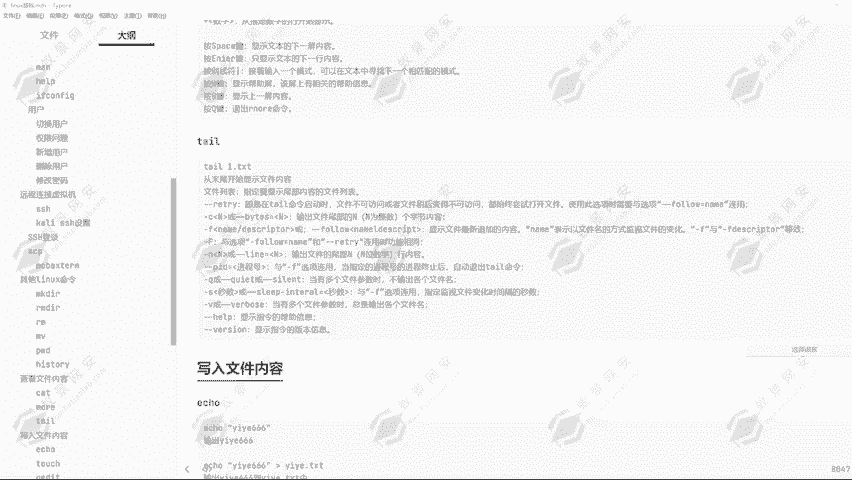
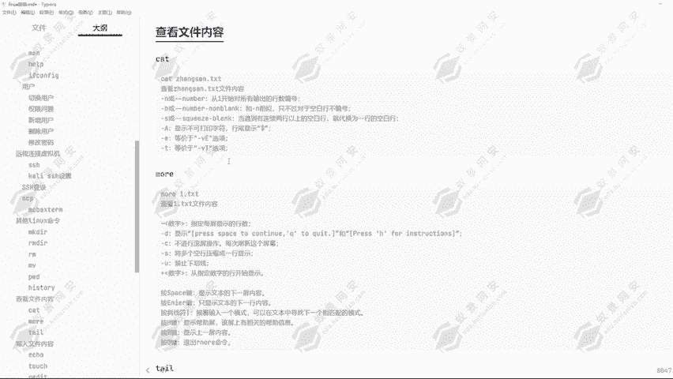
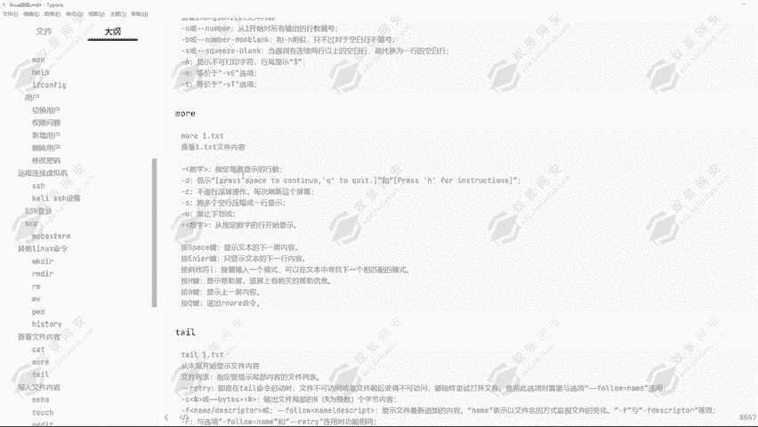
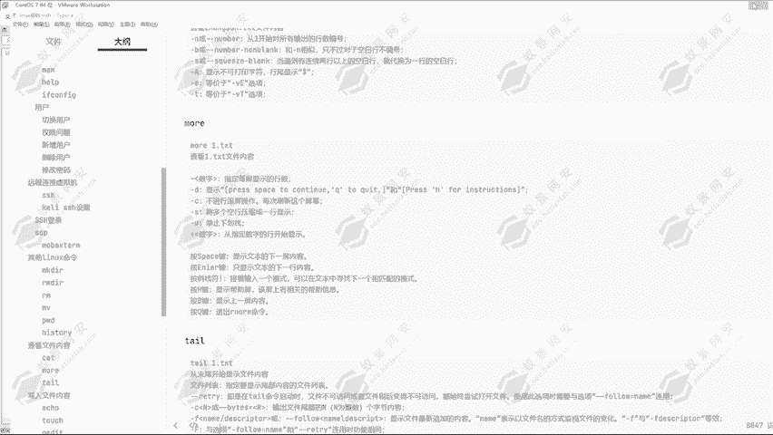
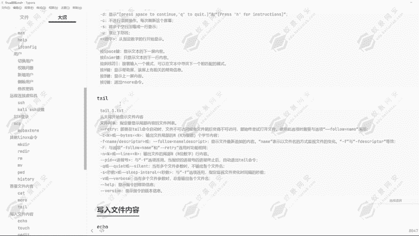
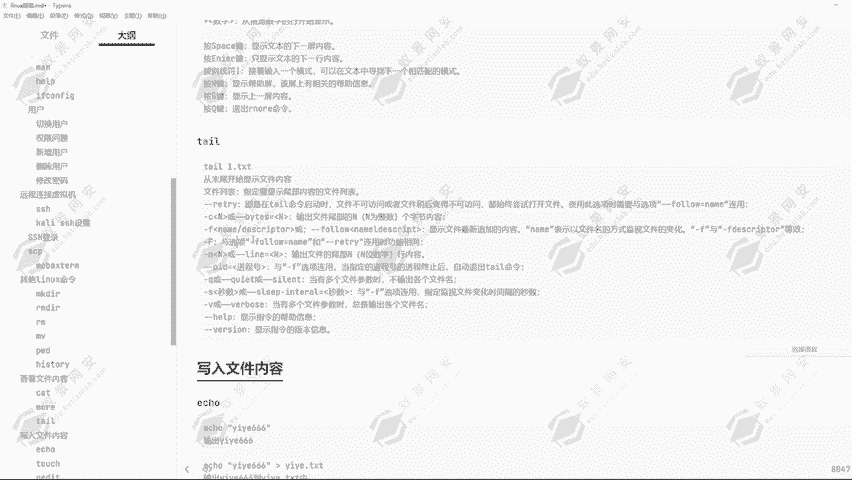
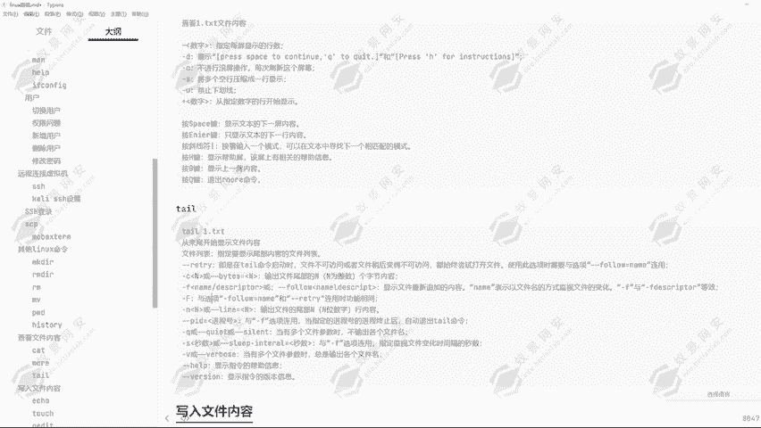

# Kali Linux渗透测试：P16：10.查看文件内容命令 📄



## 概述
在本节课中，我们将学习在Kali Linux系统中查看文件内容的几个核心命令。掌握这些命令是进行日志分析、代码审计和配置文件检查的基础。

---

## cat命令：查看完整文件内容
`cat`命令用于显示指定文件的全部内容。它适用于查看内容较少的文件。

### 基本语法与使用
以下是`cat`命令的基本语法：
```bash
cat [选项] 文件名
```
例如，查看`/opt/test.txt`文件的内容：
```bash
cat /opt/test.txt
```
`cat`命令支持使用绝对路径和相对路径来指定文件。

### 使用行号参数 -n
当文件内容较多时，可以使用`-n`参数为每一行添加行号，方便定位。
```bash
cat -n /opt/test.txt
```
执行上述命令后，文件内容会连同行号一起显示出来。



---

## more命令：分页查看文件内容
上一节我们介绍了`cat`命令，它适合查看小文件。但当文件内容很长时，屏幕输出会快速滚动，不利于阅读。本节中我们来看看`more`命令，它可以分页显示文件内容。

`more`命令允许用户逐屏或逐行浏览文件内容。

### 基本使用方法
以下是使用`more`命令查看系统日志文件的示例：
```bash
more /var/log/syslog
```
执行命令后，文件内容会以一屏为单位显示。屏幕底部会显示当前已阅读的百分比。

### 交互式操作
在`more`的浏览界面中，可以使用以下按键进行操作：
*   **回车键**：向下滚动一行。
*   **空格键**：向下滚动一屏。
*   **`q`键**：退出`more`。

### 指定每屏行数
你可以使用`-数字`参数来指定每屏显示的行数。例如，指定每屏只显示8行：
```bash
more -8 /var/log/syslog
```



---



## tail命令：查看文件尾部内容
之前学习的`cat`和`more`都是从文件开头开始显示。但在实际工作中，例如排查系统错误时，我们更关心日志文件**最新**的几条记录。本节中我们将学习`tail`命令，它专门用于查看文件末尾的内容。



`tail`命令默认显示文件末尾的10行内容。

### 基本使用方法
查看文件`/var/log/syslog`的最后10行：
```bash
tail /var/log/syslog
```

### 常用选项
以下是`tail`命令的几个常用选项：

*   **`-n` 行数**：指定要显示的行数。例如，显示最后30行：
    ```bash
    tail -n 30 /var/log/syslog
    ```
*   **`-c` 字节数**：指定要显示的字节数。例如，显示文件末尾的30个字符：
    ```bash
    tail -c 30 /var/log/syslog
    ```
*   **`-f`**：实时追踪文件更新。这个参数在监控持续写入的日志文件时非常有用，命令会持续运行并显示新追加的内容。
    ```bash
    tail -f /var/log/auth.log
    ```

---

## 总结
本节课我们一起学习了三个查看文件内容的Linux命令：
1.  **`cat`**：适合快速查看整个小文件，可使用`-n`参数显示行号。
2.  **`more`**：适合分页浏览大文件，支持逐行或逐屏查看。
3.  **`tail`**：专门用于查看文件尾部内容，常用`-n`指定行数，`-f`实时监控日志。





熟练掌握这些命令，能帮助你在渗透测试和系统排查中高效地分析各种文本文件。