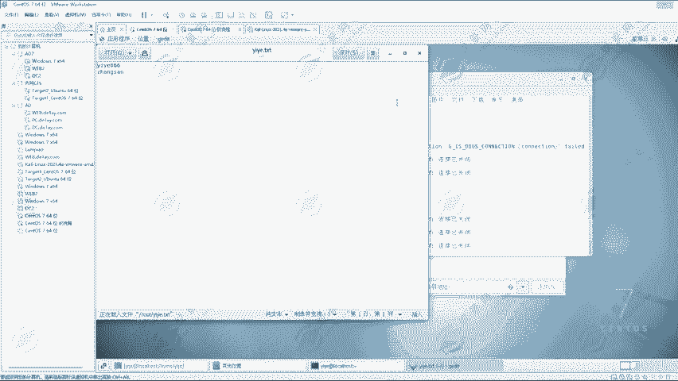
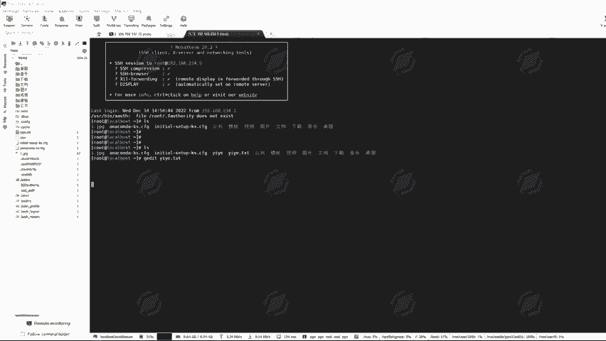
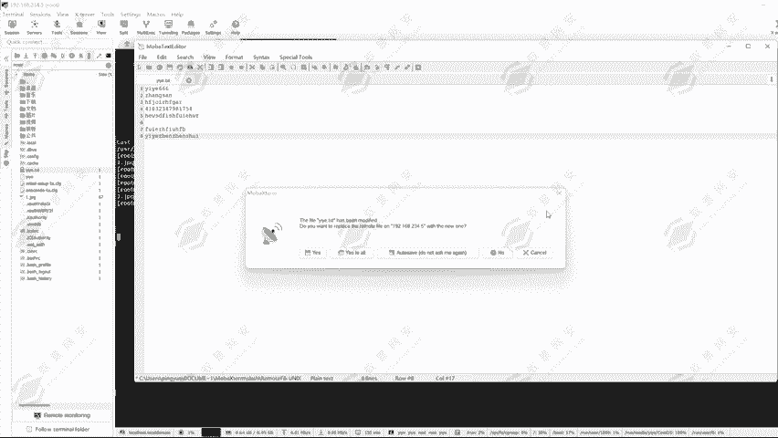
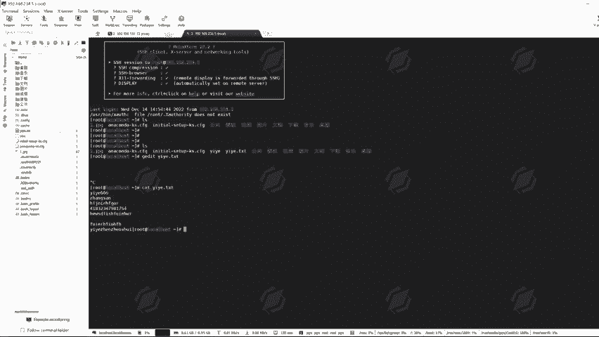
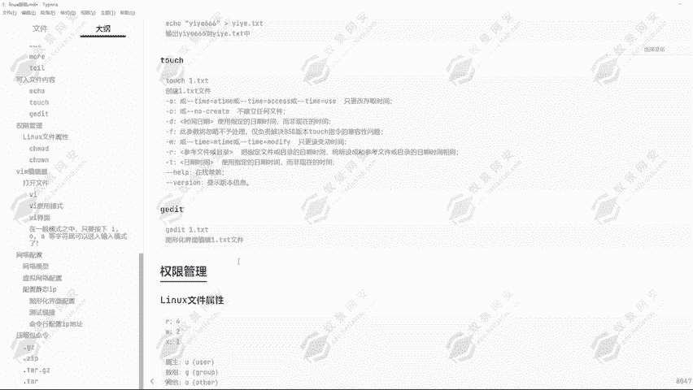

# Kali Linux渗透测试：P17：写入文件内容 📝

在本节课中，我们将学习如何在Linux系统中向文件写入内容。这是文件操作的基础，对于脚本编写、配置修改和日志记录都至关重要。我们将重点介绍 `echo` 和 `touch` 命令，以及如何使用重定向符来控制内容的写入方式。

## 使用 `echo` 命令写入内容

`echo` 命令的主要功能是将指定的字符串打印到屏幕上。同时，它也可以将内容写入到指定的文件中。如果目标文件不存在，`echo` 命令会创建该文件。

以下是 `echo` 命令的基本用法演示。首先，我们使用 `echo` 在屏幕上显示一个字符串：

```bash
echo 一夜666
```
执行此命令后，字符串“一夜666”会显示在终端中。

接下来，我们看看如何将内容写入文件。

## 重定向符的作用

要将 `echo` 的输出保存到文件，我们需要使用重定向符 `>`。这个符号的作用是将命令的输出结果覆盖写入到指定文件中。

例如，将字符串“一夜666”写入到名为 `一夜.TST` 的文件中：

```bash
echo 一夜666 > 一夜.TST
```
执行后，当前目录下会生成 `一夜.TST` 文件。使用 `cat` 命令可以查看其内容：

```bash
cat 一夜.TST
```
此时，文件内容显示为“一夜666”。

如果对已存在的文件再次使用单个重定向符 `>`，新内容会完全覆盖旧内容。例如：

```bash
echo 张三 > 一夜.TST
cat 一夜.TST
```
现在，文件内容变成了“张三”，之前的“一夜666”被覆盖了。

## 追加内容到文件

如果我们希望新内容添加在旧内容之后，而不是覆盖它，就需要使用两个重定向符 `>>`。这表示“追加”操作。

例如，在现有的 `一夜.TST` 文件（内容为“一夜666”）后追加“张三”：

```bash
echo 张三 >> 一夜.TST
cat 一夜.TST
```
现在，文件内容将同时包含“一夜666”和“张三”两行。

总结一下重定向符的区别：
*   **`>`**：覆盖写入。将新内容完全替换文件原有内容。
*   **`>>`**：追加写入。将新内容添加到文件原有内容的末尾。

## 使用 `touch` 命令创建文件

除了用 `echo` 创建文件，`touch` 命令是专门用于创建空文件或更新文件时间戳的工具。其基本语法非常简单。



例如，创建一个名为 `一夜` 的空文件：

```bash
touch 一夜
```
执行后，当前目录下会生成一个名为 `一夜` 的空文件。我们可以随后使用 `echo` 命令向其中写入内容：

```bash
echo 一夜666 >> 一夜
cat 一夜
```
`touch` 命令还有一些高级参数，例如 `-a` 只更改访问时间，`-c` 不创建文件等，但在日常基础使用中，直接使用 `touch 文件名` 即可。

## 图形化与命令行编辑文件

在具有图形界面的系统中，我们可以使用 `gedit` 命令来打开一个图形化文本编辑器，以便更直观地编辑文件。



例如，在图形界面终端中编辑 `一夜.TST` 文件：



```bash
gedit 一夜.TST
```
这会打开一个文本编辑器窗口，允许你修改和保存文件内容。

然而，在通过SSH等远程连接的非图形化环境中，`gedit` 命令可能无法正常工作。在这种情况下，我们通常使用命令行文本编辑器（如 `vim` 或 `nano`）来编辑文件，或者像之前一样，使用 `echo` 和重定向符来修改内容。



---



本节课中我们一起学习了Linux下写入文件内容的基本操作。我们掌握了使用 **`echo`** 命令结合 **`>`（覆盖）** 和 **`>>`（追加）** 重定向符来向文件写入文本，也了解了使用 **`touch`** 命令创建空文件。这些是文件管理和自动化脚本中不可或缺的基础技能。下一节课，我们将探讨Linux系统中的权限管理问题。