# Linux文件权限操作：P18：12.Linux文件权限操作

## 概述
在本节课中，我们将要学习Linux系统中文件权限的核心概念与操作方法。理解文件权限是管理Linux系统安全的基础，它决定了谁可以读取、写入或执行系统中的文件。


## Linux文件权限基础
Linux系统中的每个文件或目录都关联着一组权限属性。这些权限主要分为三种基本类型：读（Read）、写（Write）和执行（Execute）。

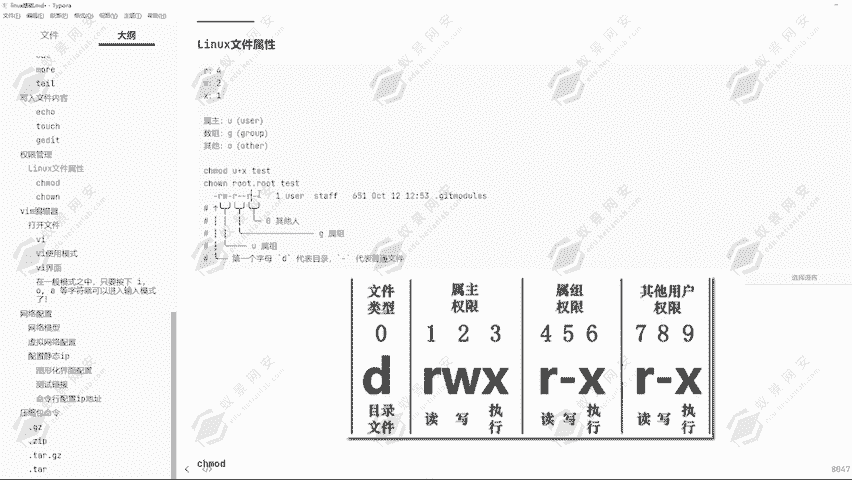

*   **读（R）**：允许查看文件内容或列出目录中的文件列表。
*   **写（W）**：允许修改文件内容或在目录中创建、删除文件。
*   **执行（X）**：允许将文件作为程序或脚本运行，或允许进入目录。

每种权限都对应一个数字代号，方便用数字形式表示：
*   读（R） = **4**
*   写（W） = **2**
*   执行（X） = **1**

权限的分配对象分为三类：
*   **属主（u）**：文件的所有者，即创建该文件的用户。
*   **属组（g）**：文件所属的用户组，通常是文件所有者所在的默认组。
*   **其他人（o）**：既不是文件所有者，也不在文件所属组内的所有其他用户。

使用 `ls -l` 命令查看文件时，权限信息显示在行首，例如 `-rw-r--r--`。这串字符可以分解为四部分：
1.  第一个字符（`-`）表示文件类型（`-` 为普通文件，`d` 为目录）。
2.  第2-4个字符（`rw-`）表示**属主（u）**的权限。
3.  第5-7个字符（`r--`）表示**属组（g）**的权限。
4.  第8-10个字符（`r--`）表示**其他人（o）**的权限。

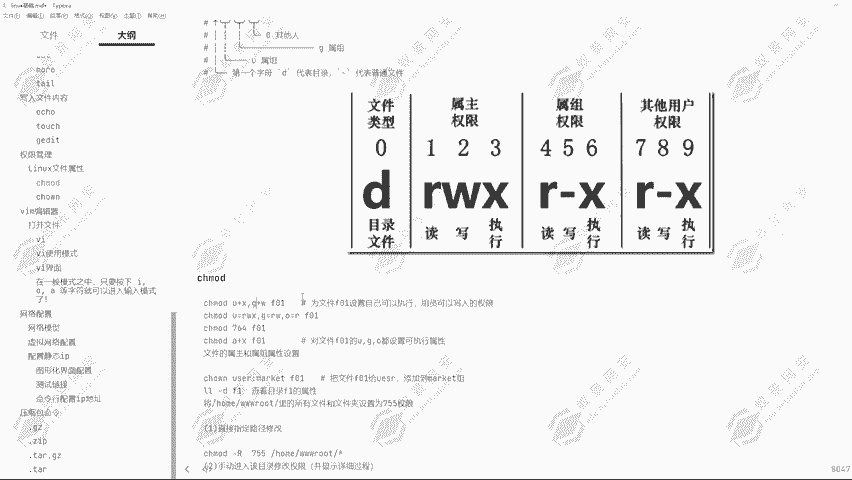

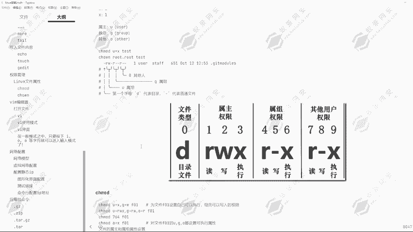

因此，`-rw-r--r--` 表示：这是一个普通文件，其所有者拥有读写权限，所属组和其他人只拥有读权限。

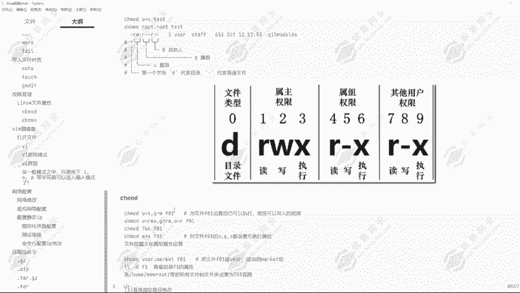

## 权限查看与验证
上一节我们介绍了权限的基本概念，本节中我们来看看如何查看并验证这些权限的实际效果。

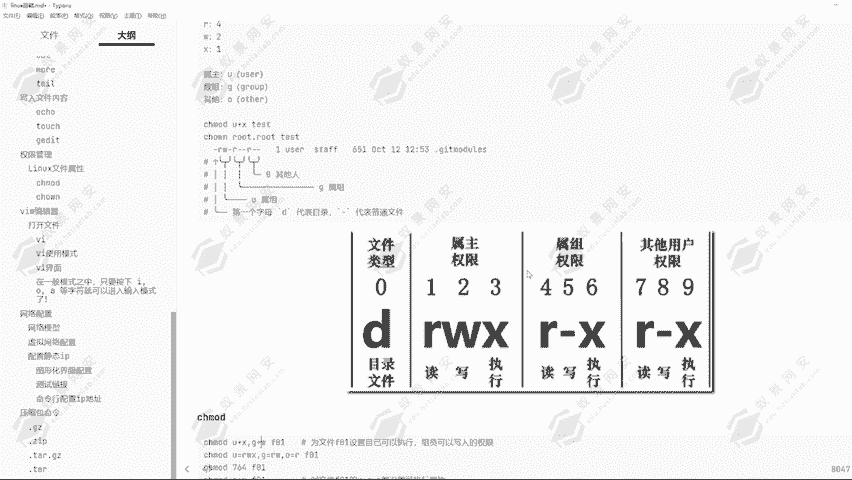

我们可以通过 `ls -l` 命令查看文件的详细权限信息。

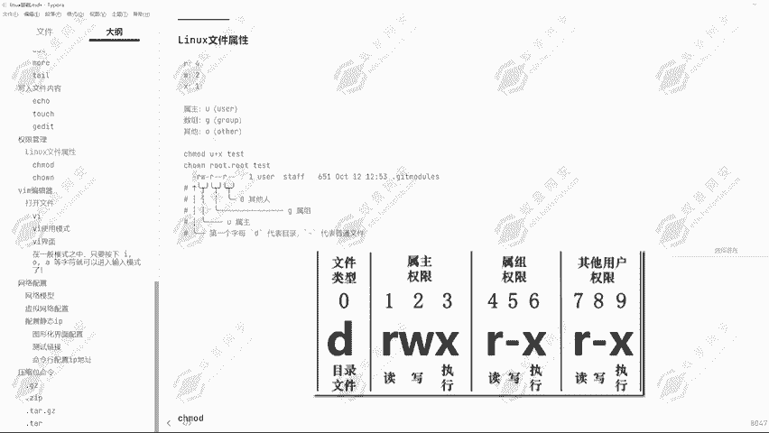

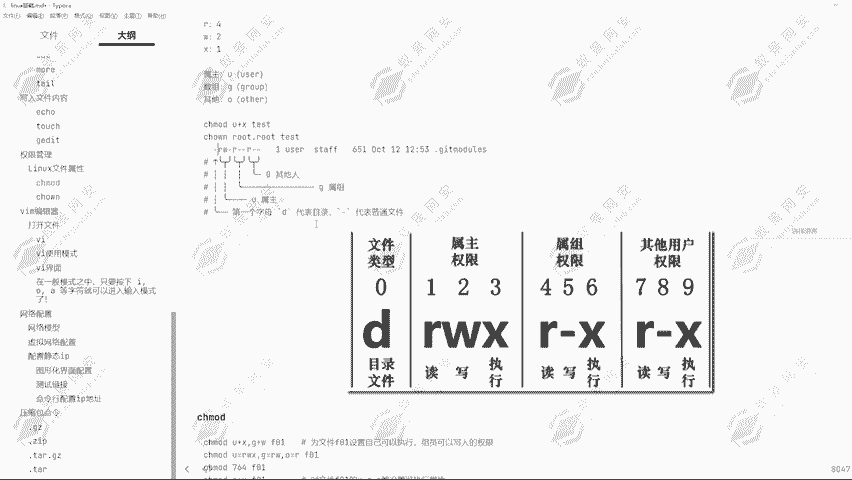

```
ls -l example.txt
```

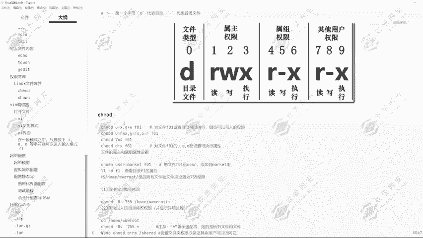

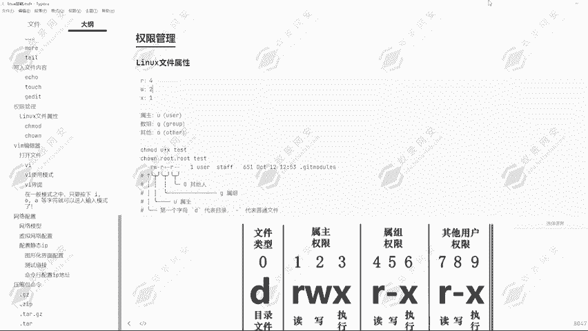

输出可能类似：`-rw-r--r-- 1 root root 0 Dec 1 10:00 example.txt`。这表示文件 `example.txt` 的所有者是 `root`，所属组也是 `root`，权限为所有者可读可写，组和其他人仅可读。

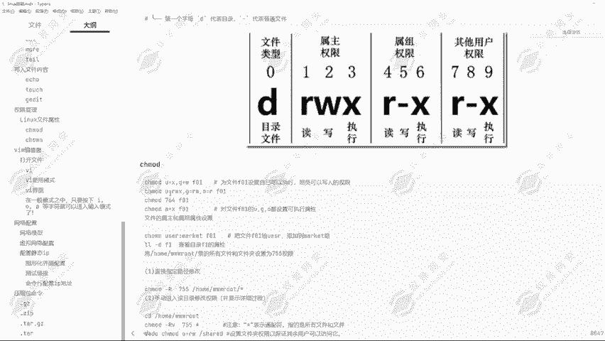

为了验证权限，我们可以切换用户进行测试。例如，使用 `root` 用户创建一个文件，然后切换到普通用户（如 `testuser`）尝试读取和写入该文件，以体验不同权限设置下的系统行为。

## 使用chmod命令修改权限
理解了如何查看权限后，接下来我们学习如何使用 `chmod` 命令修改文件或目录的权限。`chmod` 命令有两种主要的权限设置方法：符号法和数字法。

### 符号法修改权限
符号法使用 `u`（属主）、`g`（属组）、`o`（其他人）、`a`（所有人）与 `+`（增加）、`-`（移除）、`=`（设定）运算符结合 `r`、`w`、`x` 来修改权限。

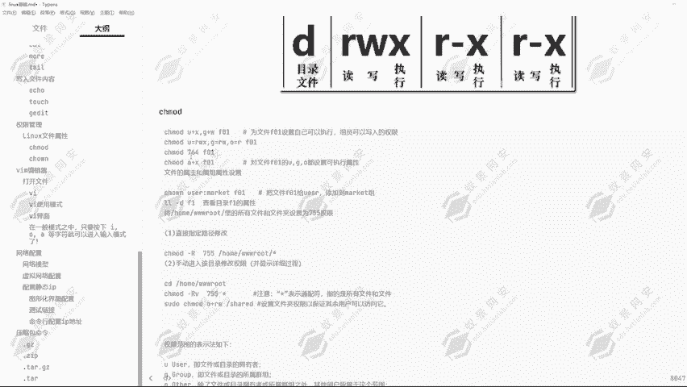

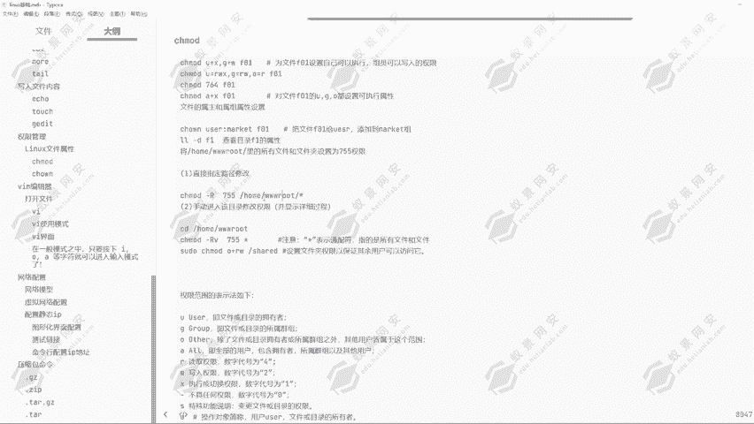

以下是使用符号法修改权限的常见操作：
*   为其他人（o）增加写权限：`chmod o+w example.txt`
*   为属组（g）移除写权限：`chmod g-w example.txt`
*   设定属主（u）拥有读写执行权限：`chmod u=rwx example.txt`
*   为所有人（a）增加执行权限：`chmod a+x example.txt`

### 数字法修改权限
数字法更为简洁，它直接使用三位八进制数来代表属主、属组和其他人的权限。每位数字是 `r`(4)、`w`(2)、`x`(1) 权限值的和。

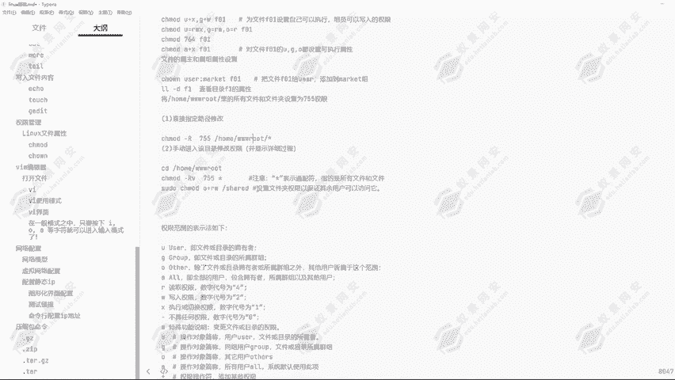

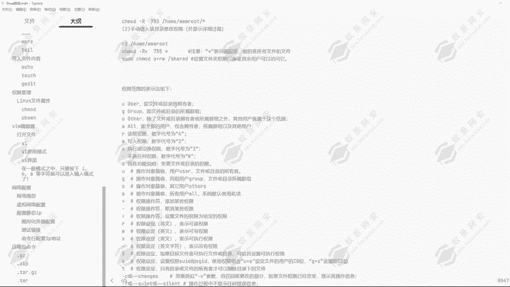

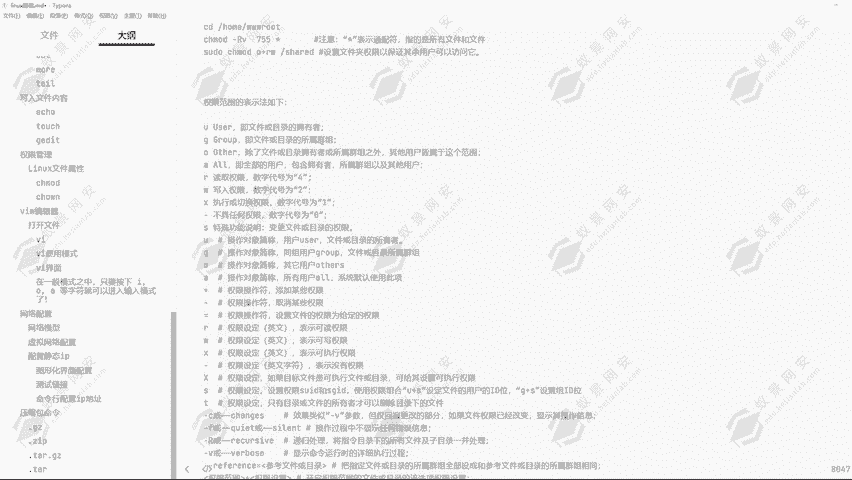

以下是使用数字法设置权限的示例：
*   设置权限为 `rwxr-xr--`：计算得 `7`(4+2+1), `5`(4+0+1), `4`(4+0+0)，命令为 `chmod 754 example.txt`
*   设置权限为仅所有者可读写（`rw-------`）：命令为 `chmod 600 example.txt`
*   设置目录及其内部所有文件权限为 `755`：命令为 `chmod -R 755 mydirectory/`

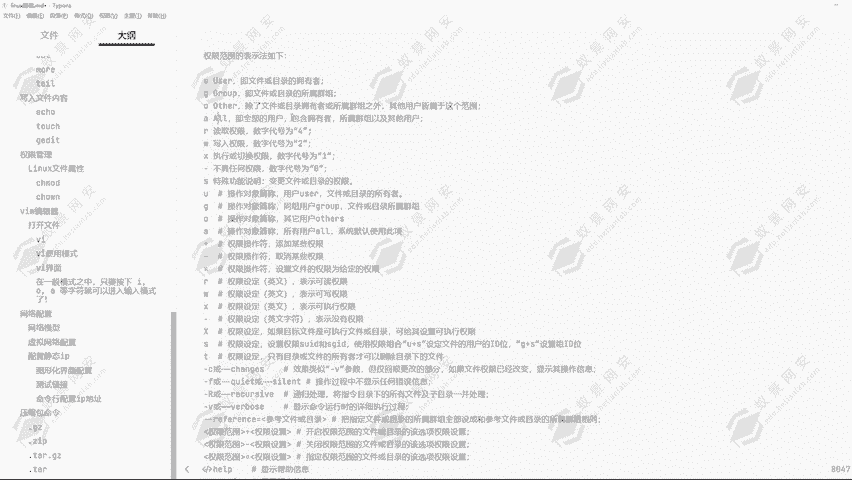

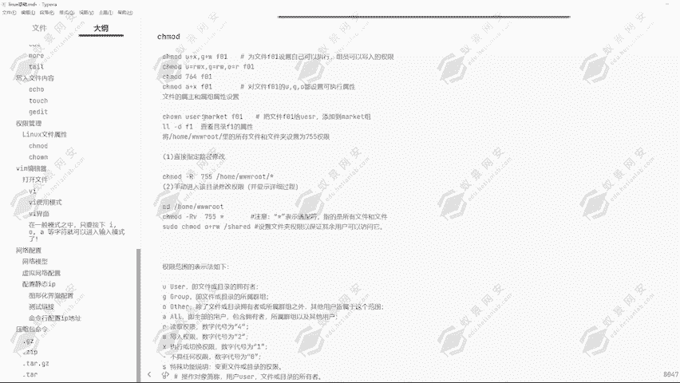


## 修改文件所有者和所属组
除了修改权限，我们有时还需要更改文件的所有者或所属用户组。这需要使用 `chown` 和 `chgrp` 命令。

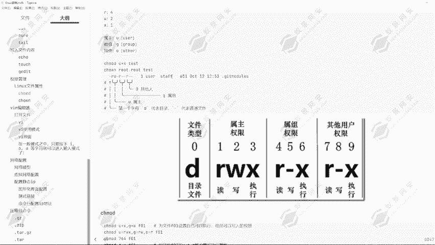

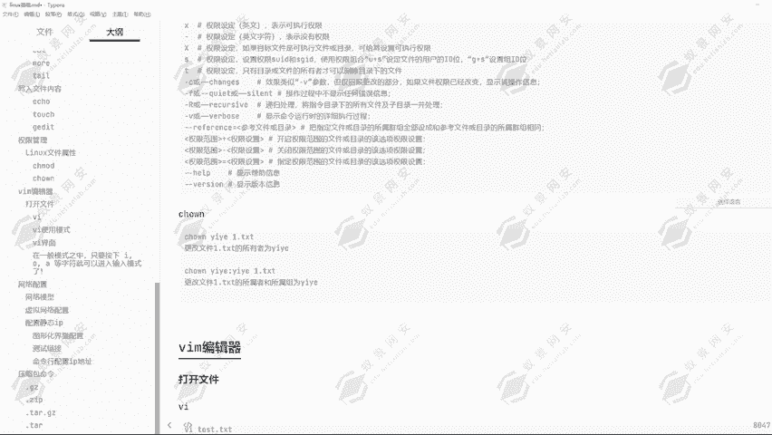

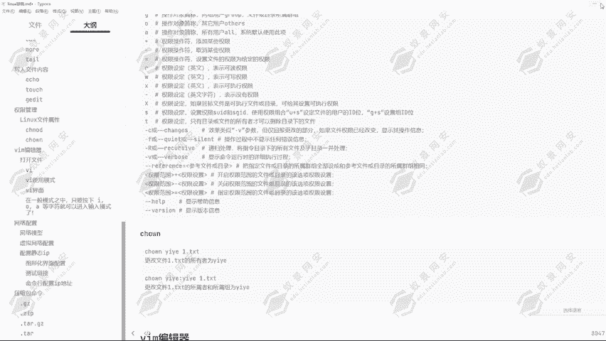

*   **`chown`**：修改文件所有者。
    *   将文件 `example.txt` 的所有者改为用户 `newowner`：`chown newowner example.txt`
    *   同时更改所有者和所属组：`chown newowner:newgroup example.txt`
*   **`chgrp`**：修改文件所属组。
    *   将文件 `example.txt` 的所属组改为 `newgroup`：`chgrp newgroup example.txt`

使用 `-R` 参数可以递归地更改目录及其内部所有文件的所有者或所属组。

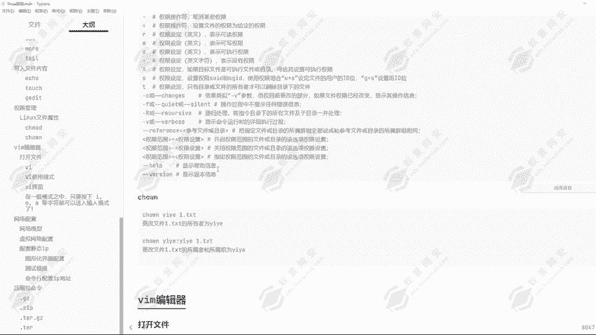

## 总结
本节课中我们一起学习了Linux文件权限的核心知识。我们首先了解了读（R）、写（W）、执行（X）三种基本权限及其数字表示（4,2,1），以及权限的分配对象：属主（u）、属组（g）和其他人（o）。接着，我们掌握了使用 `ls -l` 命令查看权限信息，并通过 `chmod` 命令的符号法（如 `o+w`）和数字法（如 `755`）来修改权限。最后，我们还学习了使用 `chown` 和 `chgrp` 命令来更改文件的所有者和所属组。熟练掌握这些操作是进行系统管理和安全配置的重要基础。