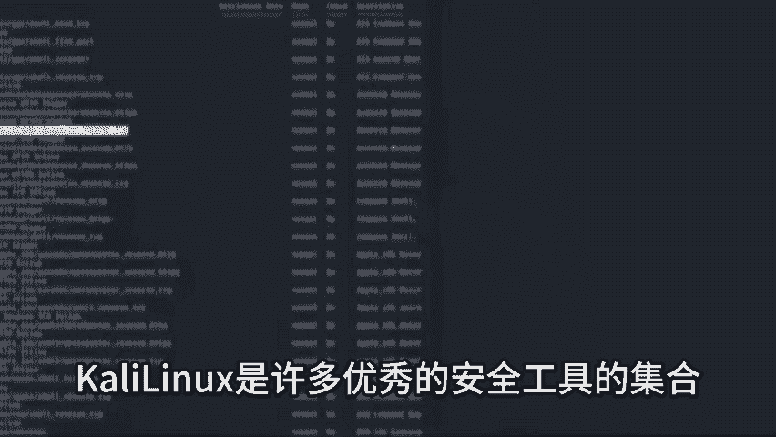

# Kali Linux 渗透测试教程：P1：Kali Linux 概述与简介 🛡️

在本节课中，我们将要学习 Kali Linux 的基本概念、它的起源、核心功能以及为什么它在网络安全领域如此重要。我们将确保内容简单直白，让初学者能够轻松理解。

---

Kali Linux 是一个基于 Debian 的 Linux 发行版，最初设计用于数字取证。它集成了超过 600 种渗透测试和安全审计工具。这些工具涵盖了漏洞分析、密码攻击、无线网络攻击、逆向工程和欺骗等多个领域。所有工具都已预装在系统中，用户无需自行开发即可直接使用。

上一节我们介绍了 Kali Linux 的定义和工具集，本节中我们来看看它的能力与潜在风险。

Kali Linux 并非一个玩具系统。它是一个功能强大的平台，能够执行可能造成真实损害的危险操作。它也是许多优秀安全工具的基础框架。对于专业的安全研究人员和渗透测试员而言，它提供了难以置信的便利和强大的能力。

然而，强大的能力也伴随着巨大的责任。如果使用不当，Kali Linux 也可能制造许多麻烦。因此，使用者必须小心谨慎，充分利用其优势，并遵守法律法规。否则，可能会面临严重的后果。

---

以下是 Kali Linux 的一些核心特点：

*   **工具集成**：系统内置超过 600 个安全工具，无需额外安装。
*   **多功能性**：支持**漏洞分析**、**密码攻击**、**无线攻击**、**逆向工程**等多种安全测试场景。
*   **专业基础**：它是许多专业安全工具和工作的基础环境。

---

本节课中我们一起学习了 Kali Linux 的基本概况。我们了解到它是一个专为安全测试设计的强大 Linux 发行版，内置了大量工具，既能帮助专业人士进行合法安全评估，也可能被恶意使用。关键在于使用者如何负责任地利用其功能。在接下来的课程中，我们将逐步探索它的具体应用。