# Kali Linux渗透测试：P20：Linux网络配置 🌐

在本节课中，我们将学习Kali Linux及VMware虚拟机的网络配置。理解不同的网络模式及其应用场景，是搭建渗透测试环境、进行网络隔离实验的基础。我们将详细介绍三种网络模式，并演示如何配置静态和动态IP地址。

## 网络模式详解

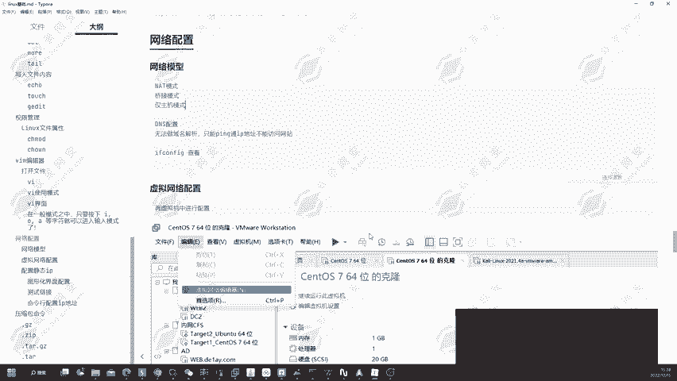

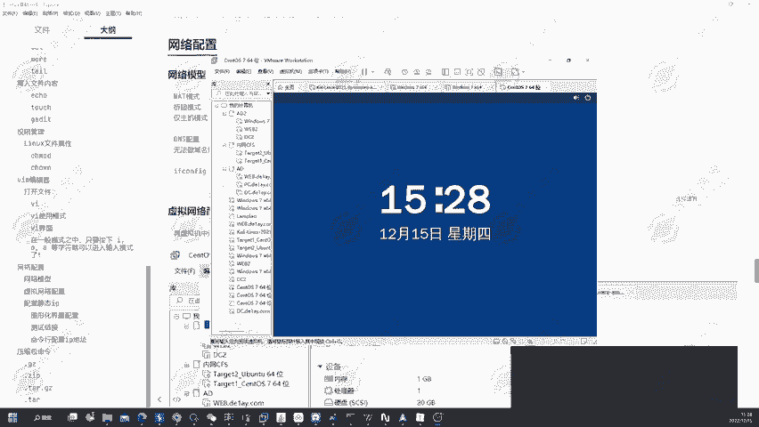

VMware虚拟机主要提供三种网络连接模式：NAT模式、桥接模式和仅主机模式。每种模式对应不同的网络环境和用途。

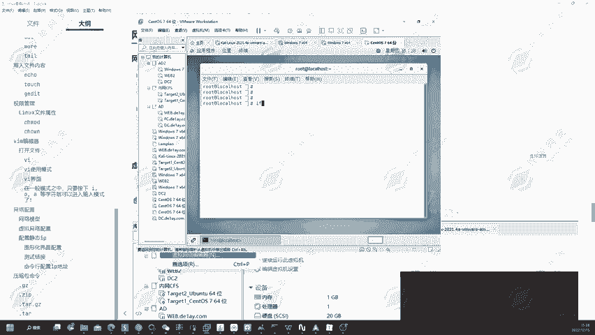

以下是三种网络模式的核心区别：

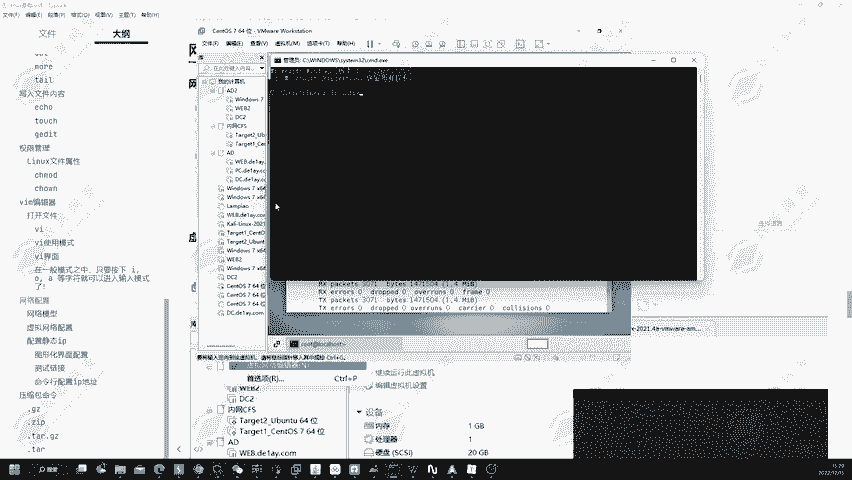

*   **NAT模式**：虚拟机通过主机的IP地址访问外部网络。虚拟机位于一个独立的虚拟子网（如 `192.168.234.0/24`）中，通过主机的NAT（网络地址转换）功能实现出网。这相当于在主机内部创建了一个私有网络。
    *   **公式**：`虚拟机IP (私有网段) -> NAT转换 -> 主机IP (公网/局域网) -> 互联网`
*   **桥接模式**：虚拟机会被当作一台独立的真实主机，直接连接到主机所在的物理局域网。它会从局域网的DHCP服务器获取一个与主机同网段的IP地址。
    *   **类比**：虚拟机就像一台新接入你家庭或公司路由器的新电脑。
*   **仅主机模式**：虚拟机与主机之间建立一个完全封闭的私有网络。虚拟机只能与主机及其他设置为“仅主机模式”的虚拟机通信，无法访问外部互联网。
    *   **用途**：常用于构建隔离的、不出网的测试环境。

## 模式演示与场景选择

上一节我们介绍了三种网络模式的概念，本节中我们来看看它们在实际中的表现以及如何根据场景进行选择。

我们首先在VMware中将虚拟机的网络适配器设置为NAT模式并启动。使用 `ifconfig` 或 `ip addr` 命令查看IP地址，会发现其地址类似于 `192.168.234.5`，这与主机本身的局域网地址（如 `192.168.83.150`）不同。虚拟机正是通过VMware虚拟的VMnet8网卡（地址通常为 `192.168.234.1`）进行NAT转换，从而访问互联网。

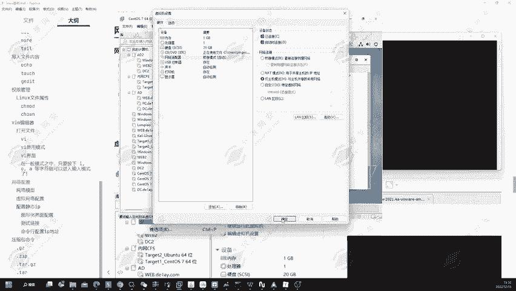

接下来，我们将模式切换为桥接模式。重启网络服务后，再次查看IP地址，会发现虚拟机获取到了一个与主机物理网卡同网段的地址（如 `192.168.83.138`）。这验证了桥接模式让虚拟机成为了局域网中的一员。

最后，我们切换到仅主机模式。此时虚拟机获取到的地址来自VMnet1网卡（如 `192.168.80.128`），并且无法ping通外网（如 `www.baidu.com`），这证明了其网络隔离性。

那么，在什么场景下该使用哪种模式呢？

以下是不同场景下的模式选择建议：

*   **家庭/小型办公局域网**：如果局域网内可用IP地址充足（通常C类地址有254个），推荐使用**桥接模式**。这样虚拟机可以像一台独立设备一样接入网络。
*   **需要认证的网络（如校园网）**：强烈推荐使用**NAT模式**。因为桥接模式需要虚拟机单独进行网络认证（输入学号密码），而大多数校园网账号只允许单设备登录。NAT模式让虚拟机共享主机的网络连接和认证状态，避免了此问题。
*   **构建隔离测试环境**：当需要模拟一个无法连接互联网的内部网络进行安全测试时，应使用**仅主机模式**。

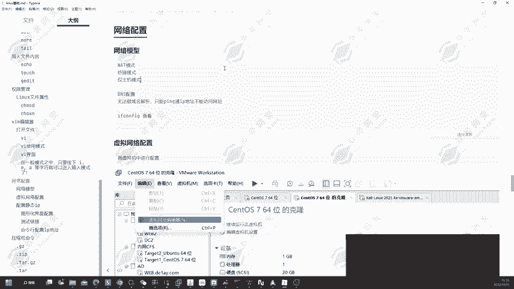

## 虚拟网络编辑器配置

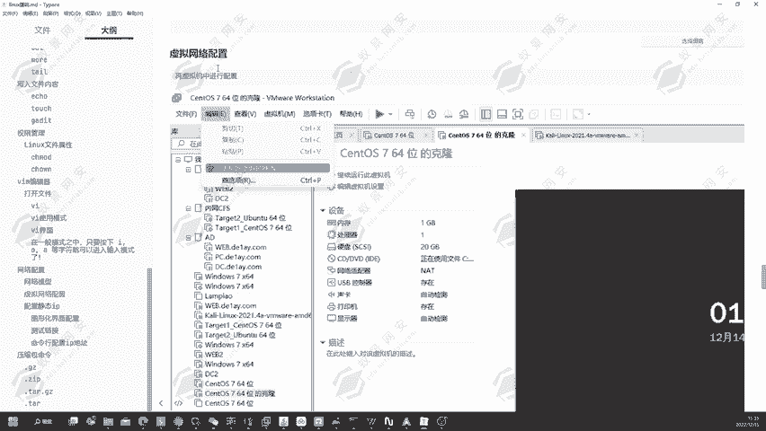

了解了模式的选择后，我们来看看如何在VMware中精细地控制这些虚拟网络。

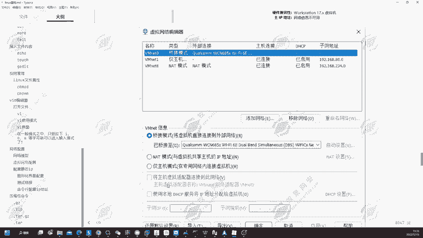

打开VMware的“编辑” -> “虚拟网络编辑器”，可以管理所有虚拟网络。对于桥接模式，你可以指定虚拟机桥接到主机的哪一块物理网卡（例如：有线网卡或无线网卡），这在主机有多块网卡时非常有用。

对于NAT模式和仅主机模式，你可以配置其子网地址。更重要的是，可以点击“DHCP设置”来定义虚拟机自动获取IP地址的范围。

例如，在仅主机模式（VMnet1）下，将DHCP的起始地址设置为 `192.168.80.233`，结束地址设置为 `192.168.80.234`。应用设置后，重启虚拟机的网络，它就会获取到这个指定范围内的IP地址（如 `192.168.80.233`）。这为环境搭建提供了确定性。

## 虚拟机内IP地址配置

除了在VMware外部进行设置，我们更常在虚拟机操作系统内部配置网络。配置方式分为动态获取（DHCP）和静态指定。

### 图形化界面配置

在Kali Linux的桌面环境中，点击右上角网络图标 -> “有线设置” -> 点击齿轮图标，即可进入网络配置界面。在“IPv4”标签页中，将方法从“自动(DHCP)”改为“手动”，然后填写地址、子网掩码、网关和DNS服务器。

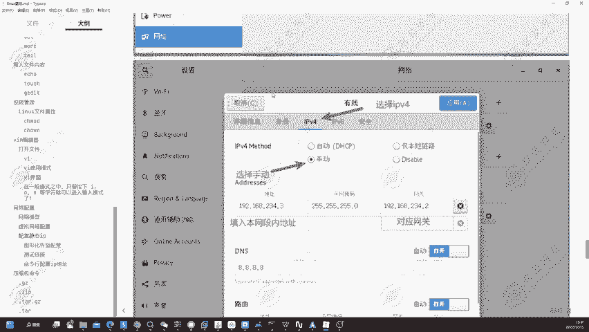

**注意**：DNS服务器必须配置，否则无法解析域名。常用的公共DNS有 `8.8.8.8` (Google) 和 `114.114.114.114`。

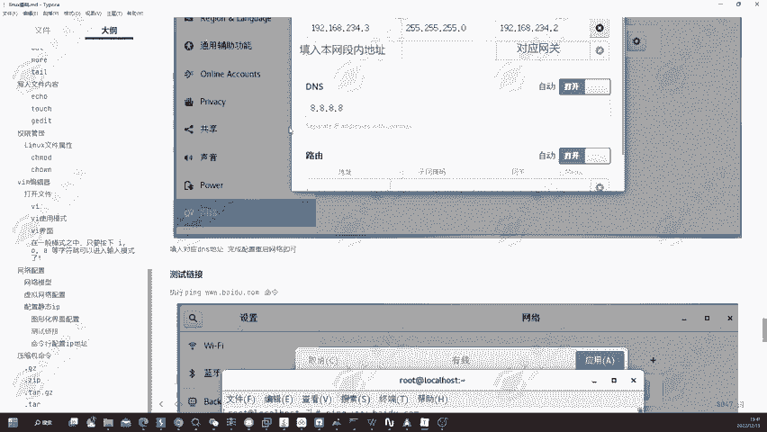

配置完成后，需要断开并重新连接网络以使设置生效。使用 `ifconfig` 命令可以验证配置是否成功。

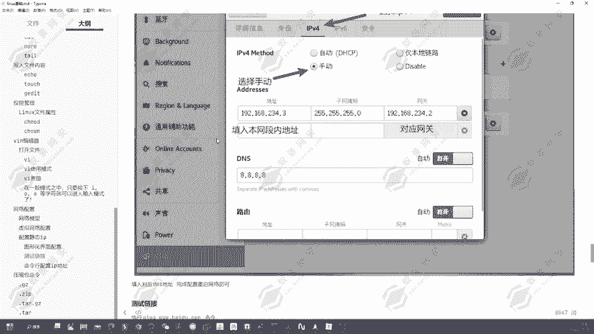

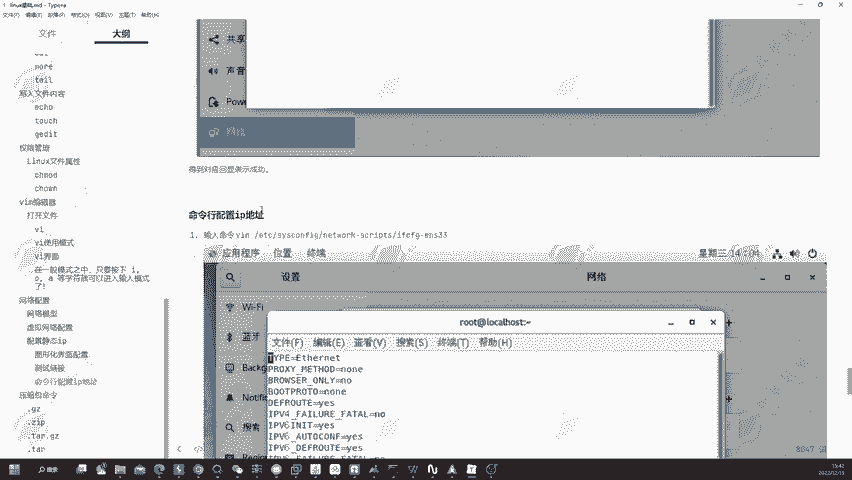

### 命令行配置（配置文件）

对于服务器环境或无图形界面的系统，需要通过修改配置文件来设置静态IP。

网络配置文件通常位于 `/etc/network/interfaces` 或 `/etc/sysconfig/network-scripts/`（取决于发行版）。在Kali中，我们主要使用 `netplan` 或直接编辑 `interfaces` 文件。

以下是编辑 `/etc/network/interfaces` 文件的示例：

```bash
# 使用文本编辑器（如nano或vim）打开配置文件
sudo nano /etc/network/interfaces

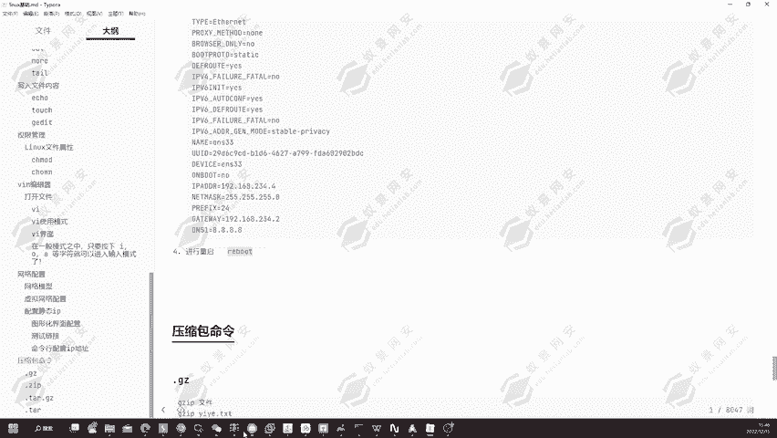

# 找到你的网卡（通常是eth0或ens33），进行如下修改
# 将 dhcp 改为 static
auto ens33
iface ens33 inet static
    address 192.168.234.4    # 静态IP地址
    netmask 255.255.255.0    # 子网掩码
    gateway 192.168.234.2    # 网关地址
    dns-nameservers 8.8.8.8  # DNS服务器
```

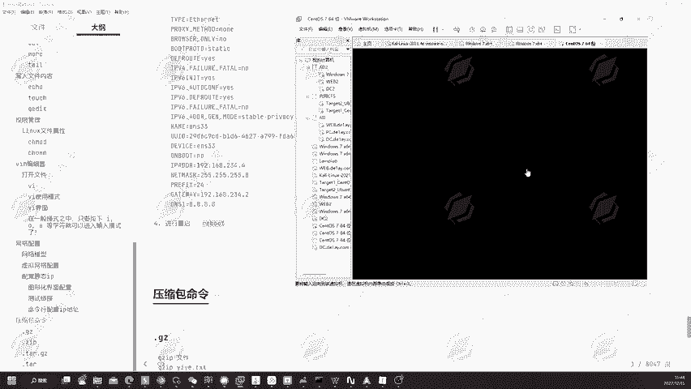

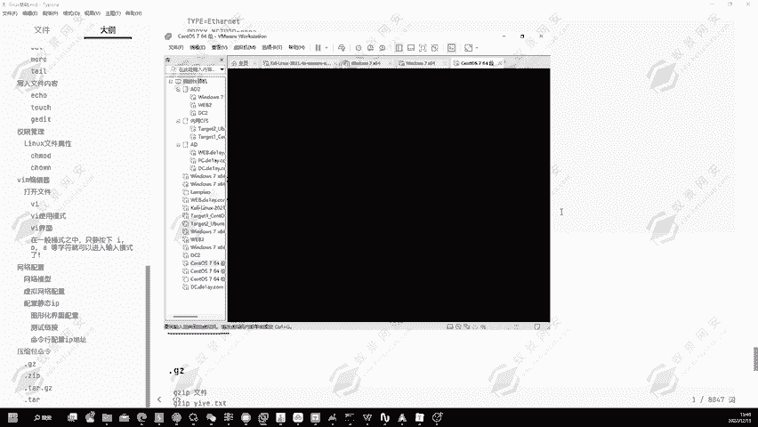

保存并退出编辑器后，需要重启网络服务来应用更改：

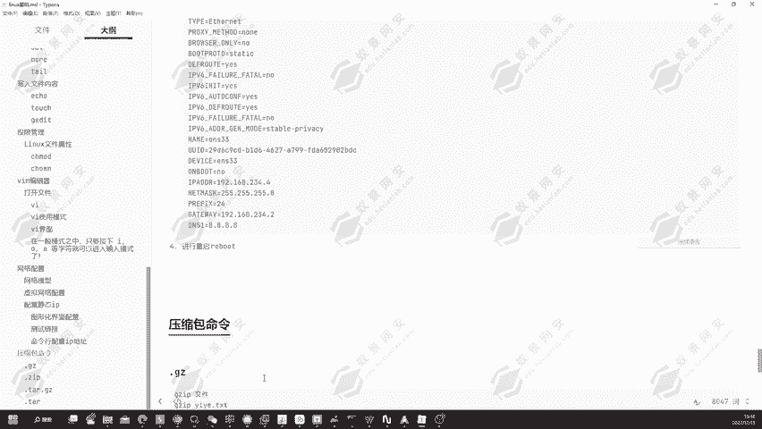

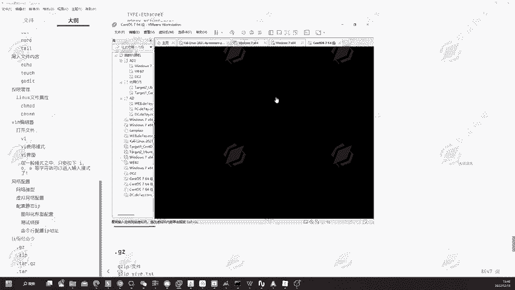

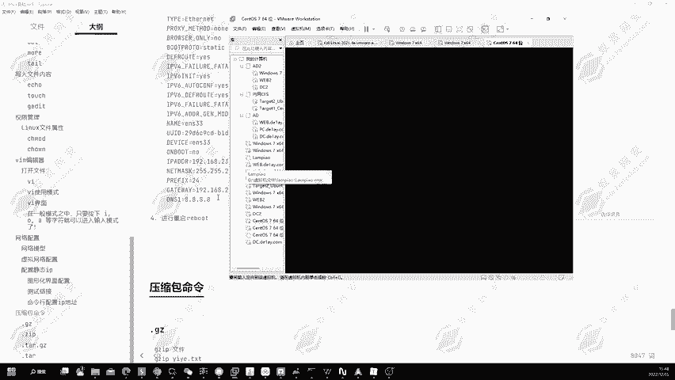

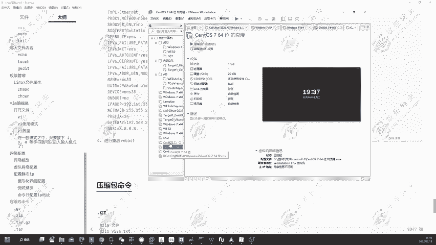

```bash
sudo systemctl restart networking
# 或者使用传统命令
sudo /etc/init.d/networking restart
```

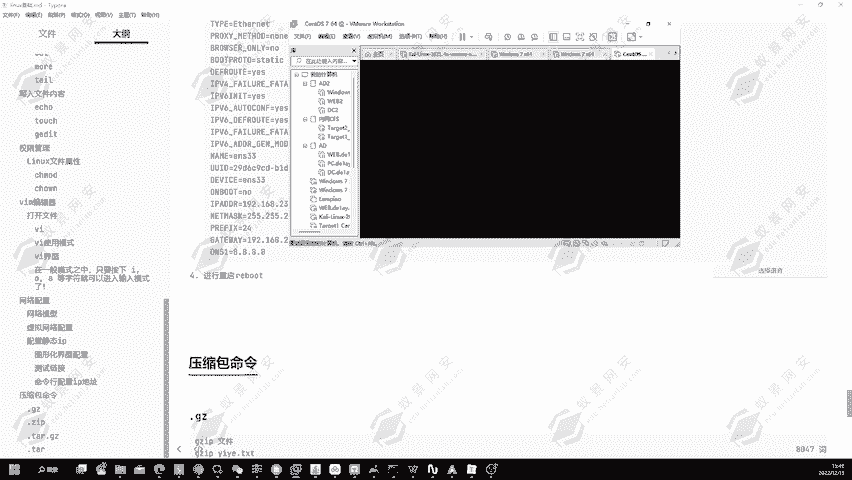

有时，重启网络服务可能无法立即生效，此时重启虚拟机是最彻底的方法。

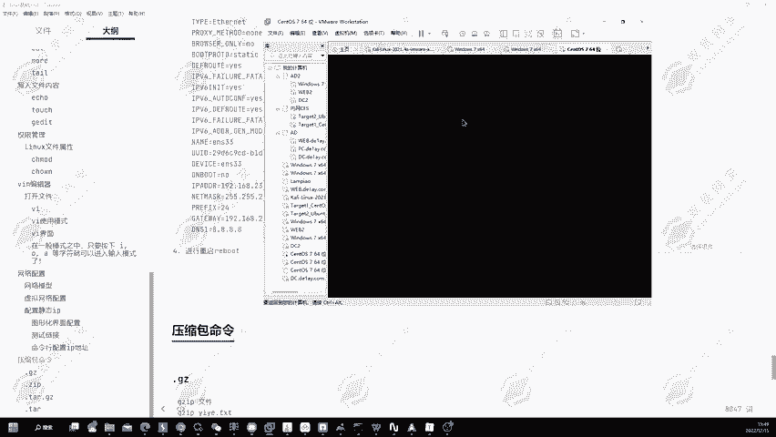

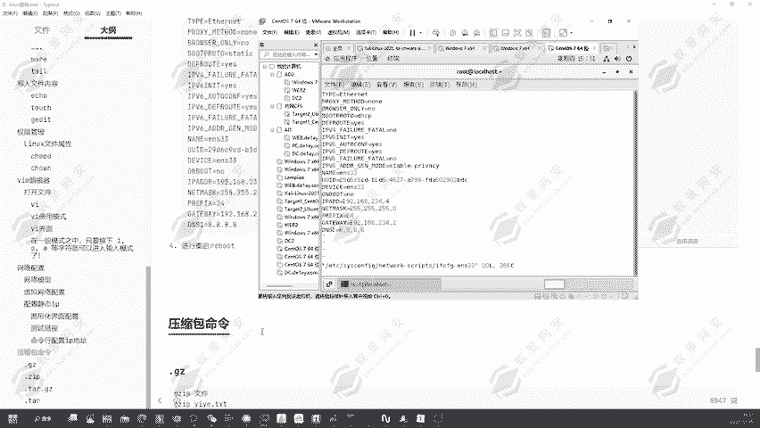

## 总结

本节课中我们一起学习了VMware虚拟机的三种核心网络模式：**NAT**、**桥接**和**仅主机**，理解了它们的工作原理和适用场景。我们还掌握了在VMware虚拟网络编辑器中进行基础网络规划，以及在Kali Linux虚拟机内部通过图形界面和命令行两种方式配置静态IP地址的方法。这些技能是灵活搭建渗透测试环境、进行网络隔离实验的基石。下一节课，我们将讲解Linux中常用的压缩包命令。