**Kali Linux渗透测试与网络安全：P21：15. Linux压缩文件操作** 📦

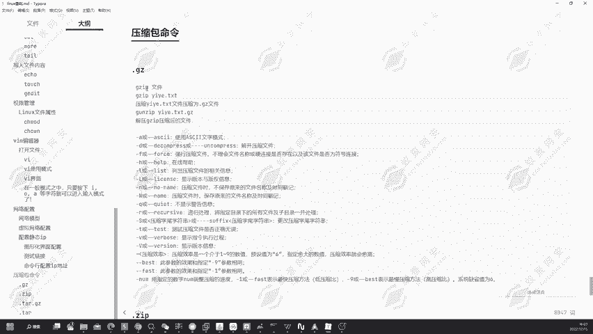

在本节课中，我们将学习Linux系统中常见的压缩文件操作。掌握这些命令对于管理和传输文件至关重要。

Linux系统支持多种压缩格式，例如`.gz`和`.zip`，并且有对应的打包命令如`tar`。本节将介绍如何处理这些压缩文件。

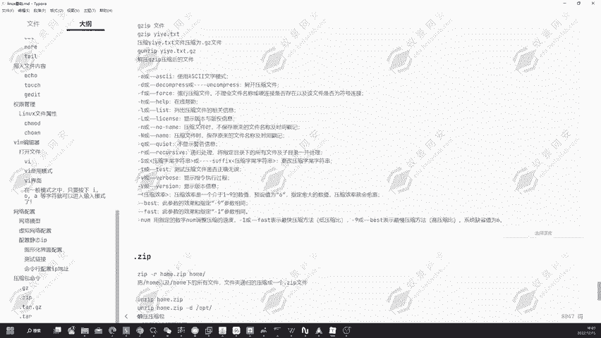

---

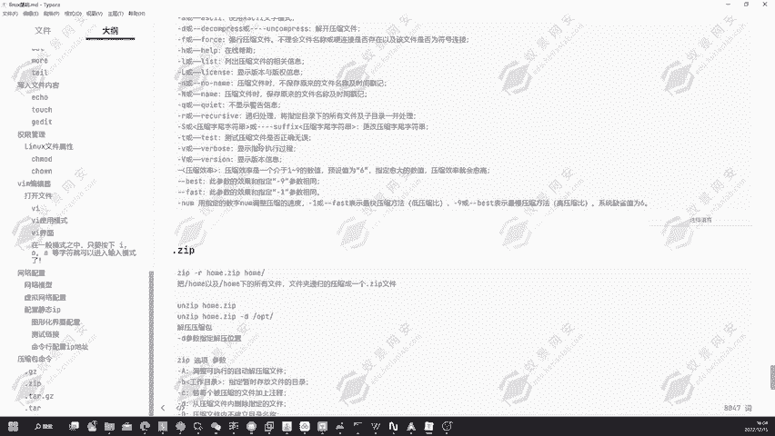

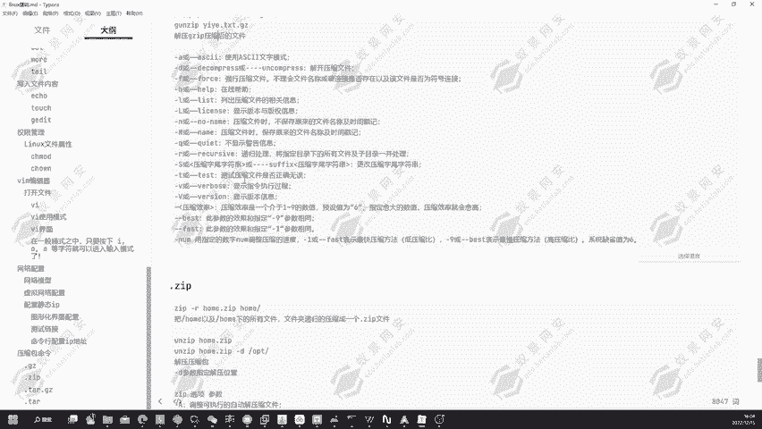

### **GZIP压缩与解压**

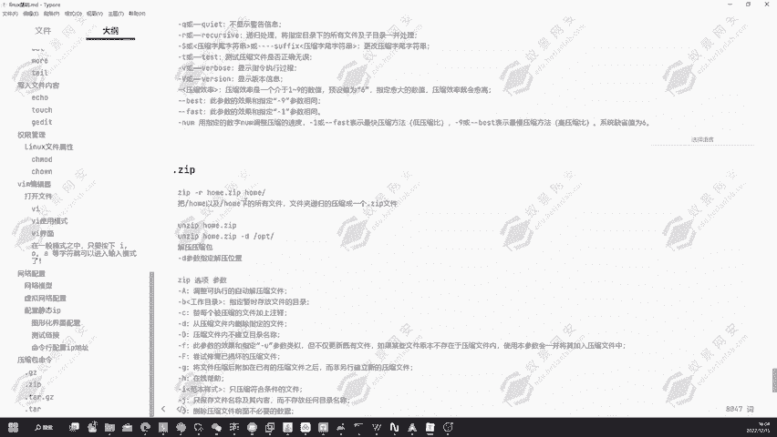

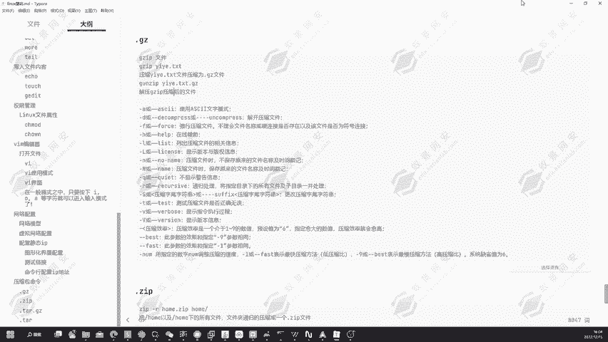

首先，我们来看`.gz`格式文件的处理。假设当前目录下有一个名为`1.txt`的文件。

**压缩文件**：使用`gzip`命令后接文件名进行压缩。
```bash
gzip 1.txt
```
执行后，会生成一个名为`1.txt.gz`的压缩包。

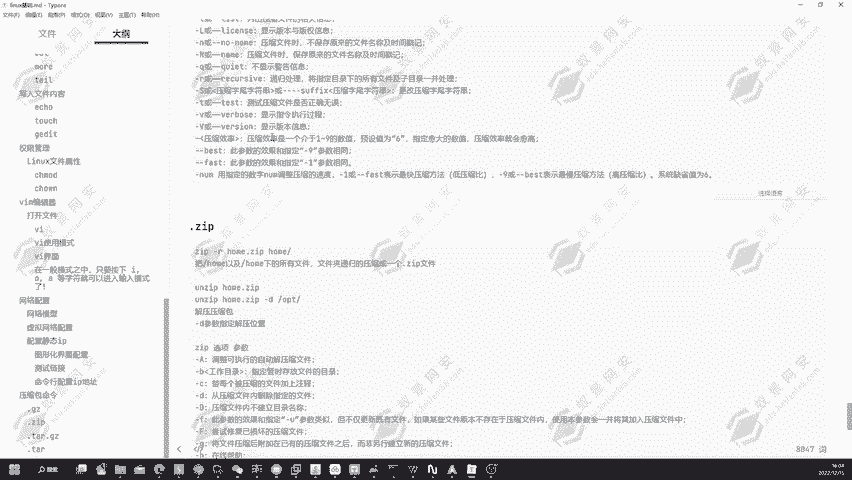

**解压文件**：使用`gunzip`命令解压`.gz`文件。
```bash
gunzip 1.txt.gz
```
解压后，原始的`1.txt`文件会恢复。

`gzip`命令包含多个参数，以下是部分常用参数：
*   `-a`：使用ASCII文本模式。
*   `-d`：解开压缩文件。
*   `-f`：强制压缩文件，忽略警告。
*   `-l`：列出压缩文件的详细信息。

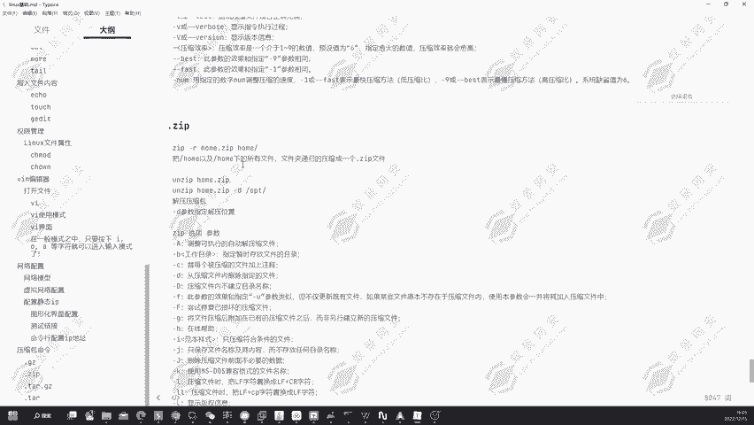

---

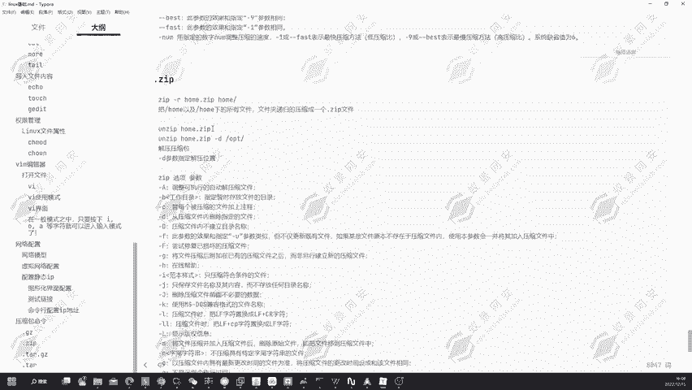

### **ZIP压缩与解压**

上一节我们介绍了`.gz`格式，本节中我们来看看`.zip`格式的处理。

**压缩文件**：使用`zip`命令进行压缩。若要压缩一个名为`ho`的文件夹，命令如下：
```bash
zip ho.zip ho
```
这会将`ho`文件夹打包成`ho.zip`。但此命令默认不包含子目录下的文件。

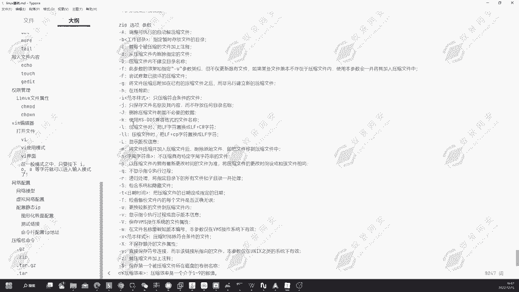

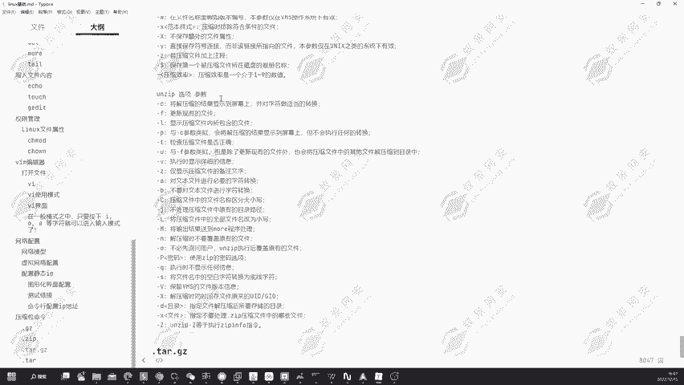

若要递归压缩文件夹内的所有文件和子目录，需使用`-r`参数：
```bash
zip -r ho.zip ho
```

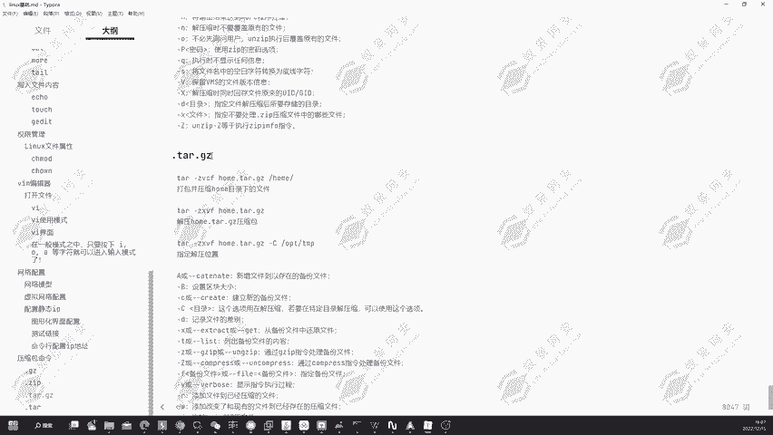

**解压文件**：使用`unzip`命令进行解压。
```bash
unzip ho.zip
```
解压后，会在当前目录生成`ho`文件夹。

若要指定解压目录，可以使用`-d`参数：
```bash
unzip ho.zip -d /opt
```
执行后，文件将被解压到`/opt`目录下。

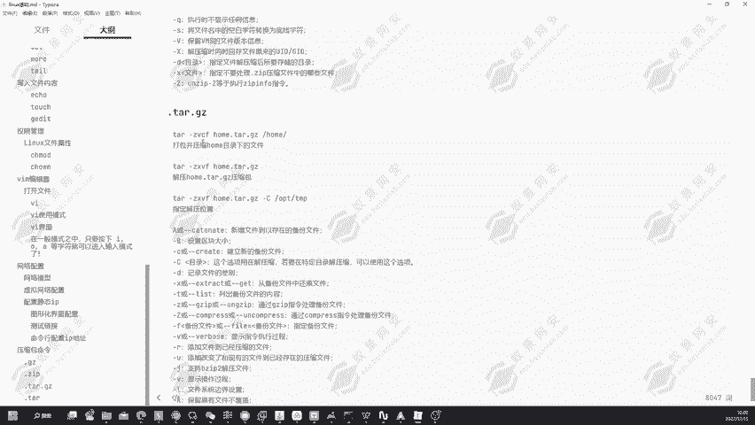

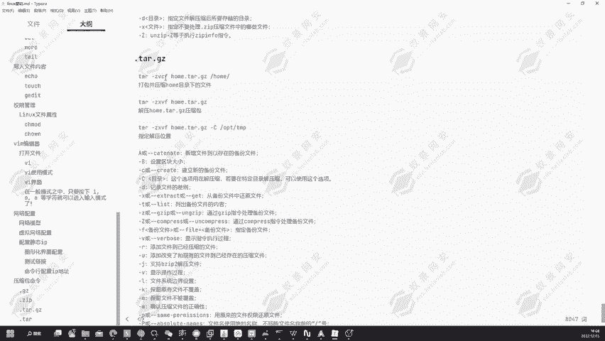

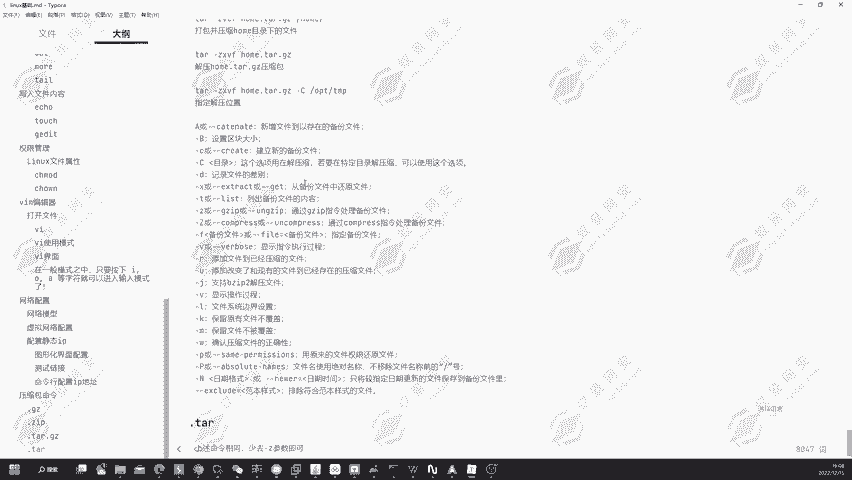

`unzip`命令同样支持多种参数，用于不同的解压需求。

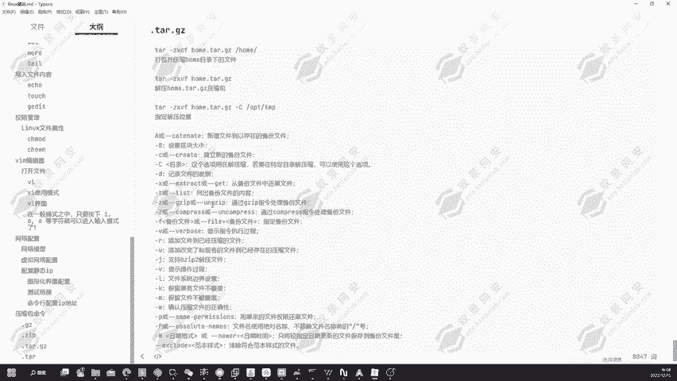

---

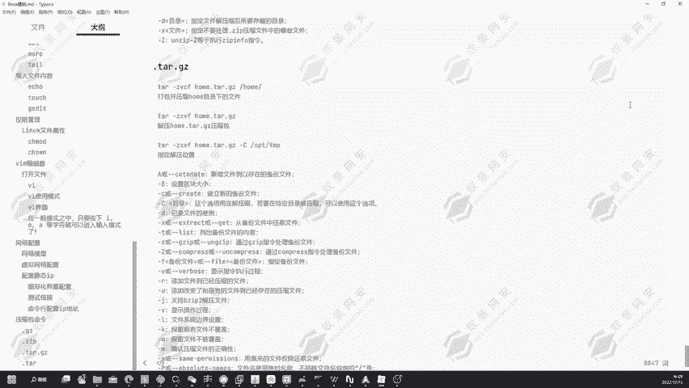

### **TAR打包与压缩**

除了单独的压缩命令，Linux还常用`tar`命令进行打包，并可结合压缩算法。

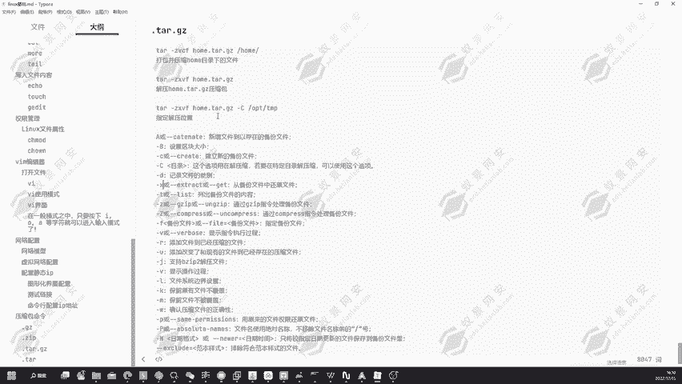

**打包并压缩**：使用`tar`命令配合参数进行打包和压缩（通常使用gzip算法）。以下命令将`ho`目录打包并压缩为`ho.tar.gz`：
```bash
tar -zcvf ho.tar.gz ho
```
*   `-z`: 使用gzip压缩。
*   `-c`: 创建新的归档文件（打包）。
*   `-v`: 显示详细过程。
*   `-f`: 指定文件名。

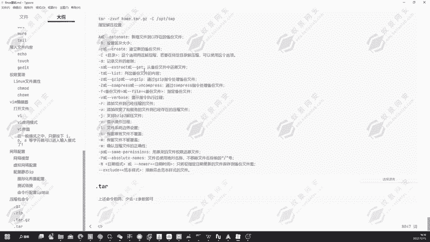

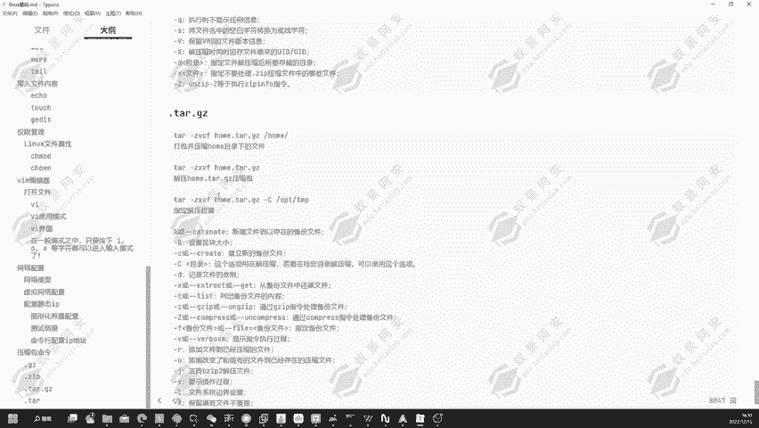

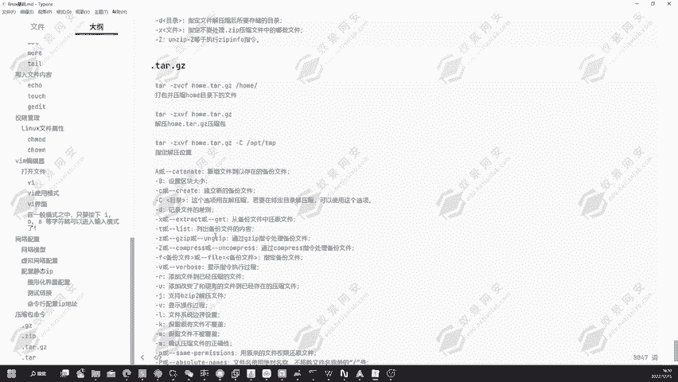

**解压文件**：解压`.tar.gz`文件时，将参数`-c`替换为`-x`（提取文件）。
```bash
tar -zxvf ho.tar.gz
```
若要指定解压路径，可以使用`-C`参数：
```bash
tar -zxvf ho.tar.gz -C /tmp
```

对于仅打包不压缩的`.tar`文件，只需去掉`-z`参数即可：
```bash
# 打包
tar -cvf 1.tar 1.txt
# 解包
tar -xvf 1.tar
```

---

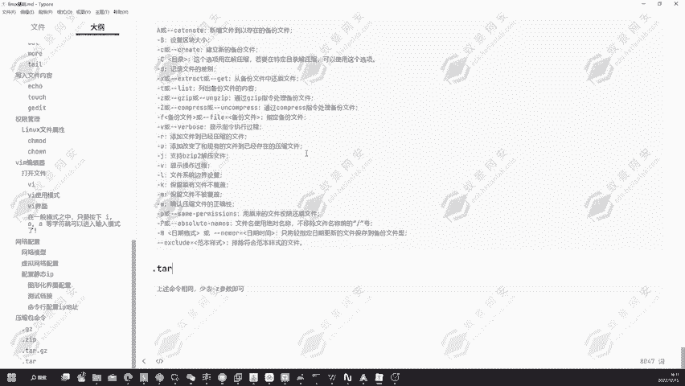

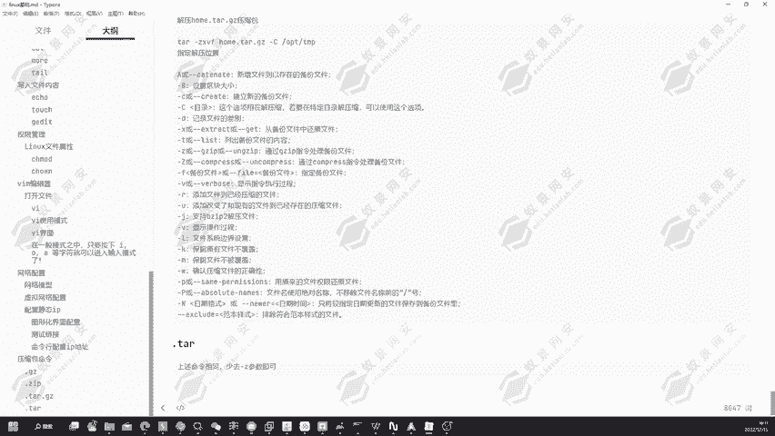

本节课中我们一起学习了Linux下三种主要的压缩文件操作方法：使用`gzip/gunzip`处理`.gz`文件，使用`zip/unzip`处理`.zip`文件，以及使用`tar`命令进行打包和结合压缩。这些是文件管理的基础技能，在后续的渗透测试和环境搭建中会经常用到。