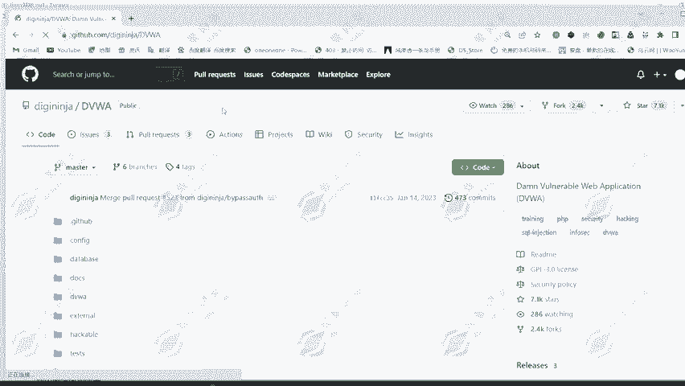
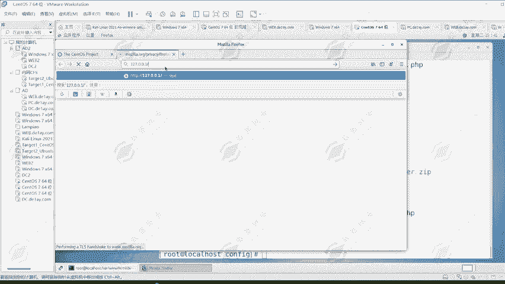
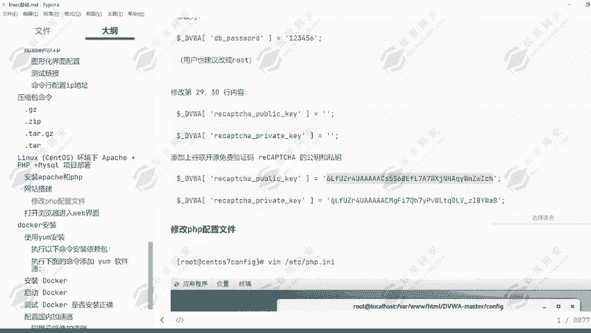
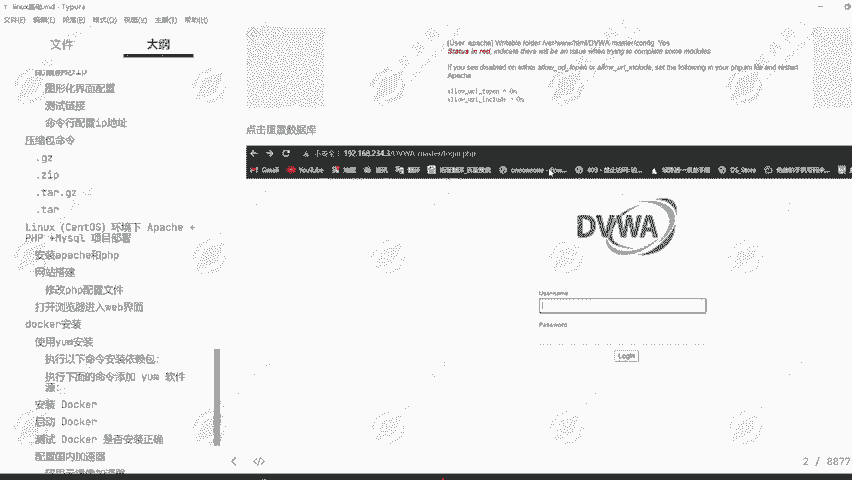
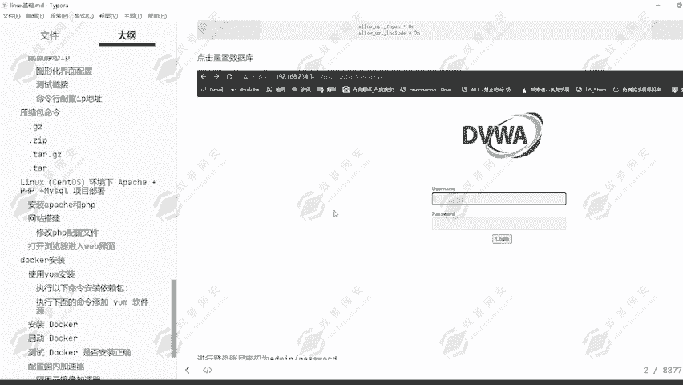

# Kali渗透教程：P22：16. CentOS搭建Web网站 🖥️

在本节课中，我们将学习如何在CentOS系统上搭建一个PHP网站环境，并部署DVWA靶场。这对于后续的网络安全学习和渗透测试实践非常有帮助。

## 概述

我们将安装并配置Apache服务器、PHP编程语言以及MariaDB数据库（作为MySQL的替代），最终完成DVWA靶场的部署。

---

## 安装必要的软件包

首先，我们需要安装Apache、PHP及其扩展，以及数据库服务。

以下是需要安装的软件包列表：
*   **Apache HTTP Server**：网页服务器软件。
*   **PHP**：一种后端编程语言。
*   **php-mysql**：PHP连接MySQL数据库的扩展。
*   **php-gd**：PHP的图形处理扩展。
*   **mariadb-server**：MariaDB数据库服务（与MySQL兼容）。

使用以下命令进行安装：
```bash
yum -y install httpd php php-mysql php-gd mariadb-server
```



执行命令后，请等待安装完成。安装速度取决于网络状况。

---

## 配置并启动服务

上一节我们安装了必要的软件，本节中我们来看看如何启动和配置这些服务，确保它们能随系统启动并正常运行。

安装完成后，服务并未自动启动。我们需要启动Apache和MariaDB服务，并设置为开机自启。

1.  启动Apache服务并设置开机自启：
    ```bash
    systemctl start httpd
    systemctl enable httpd
    ```

2.  启动MariaDB服务并设置开机自启：
    ```bash
    systemctl start mariadb
    systemctl enable mariadb
    ```

3.  关闭系统防火墙，以确保网站可以被访问：
    ```bash
    systemctl stop firewalld
    systemctl disable firewalld
    ```

4.  为MariaDB的root用户设置密码（例如：`123456`）：
    ```bash
    mysqladmin -u root password "123456"
    ```
    可以使用以下命令验证数据库连接：
    ```bash
    mysql -u root -p123456
    ```



---

## 部署DVWA靶场

服务配置好后，接下来我们部署具体的网站应用。我们将下载并配置DVWA靶场文件。

1.  下载DVWA靶场的压缩包文件。
2.  将下载的文件上传到CentOS系统，并移动到Web服务器的根目录：
    ```bash
    cp DVWA-master.zip /var/www/html/
    cd /var/www/html
    ```
3.  解压文件：
    ```bash
    unzip DVWA-master.zip
    ```
4.  为了方便，将目录重命名为小写的`dvwa`：
    ```bash
    mv DVWA-master dvwa
    ```
5.  进入`dvwa`目录，并将其所有者改为Apache运行用户，以提升安全性：
    ```bash
    cd /var/www/html
    chown -R apache:apache dvwa
    ```

---

## 配置DVWA

文件部署完成后，需要对DVWA进行具体配置，使其能连接数据库并正常运行。



1.  进入配置目录并重命名配置文件：
    ```bash
    cd /var/www/html/dvwa/config
    cp config.inc.php.dist config.inc.php
    ```
2.  编辑`config.inc.php`文件，修改数据库连接信息：
    *   找到 `$_DVWA[ 'db_user' ]` 和 `$_DVWA[ 'db_password' ]` 所在行。
    *   将值分别改为 `'root'` 和 `'123456'`（与之前设置的数据库密码一致）。
3.  修改PHP配置以允许包含URL。编辑 `/etc/php.ini` 文件：
    *   找到 `allow_url_include` 设置项。
    *   将其值从 `Off` 改为 `On`。
4.  （可选）配置reCAPTCHA密钥。编辑 `config.inc.php` 文件：
    *   找到 `$_DVWA[ 'recaptcha_public_key' ]` 和 `$_DVWA[ 'recaptcha_private_key' ]`。
    *   填入从Google reCAPTCHA官网申请的密钥，或使用教程提供的公开测试密钥。
5.  为DVWA所需的目录设置写权限：
    ```bash
    chmod 777 /var/www/html/dvwa/hackable/uploads/
    chmod 777 /var/www/html/dvwa/external/phpids/0.6/lib/IDS/tmp/phpids_log.txt
    chmod 777 /var/www/html/dvwa/config
    ```
6.  为了使所有配置生效，重启Apache服务：
    ```bash
    systemctl restart httpd
    ```

---

## 访问与初始化靶场

所有配置步骤完成后，现在我们可以通过浏览器访问并初始化DVWA靶场了。

1.  打开浏览器，访问：`http://[您的服务器IP]/dvwa/`
2.  页面打开后，向下滚动到“Setup / Reset DB”部分。
3.  点击“Create / Reset Database”按钮。如果配置正确，页面会提示“Database setup successful”。
4.  点击页面上的“Login”链接，使用默认凭证登录：
    *   **用户名**：`admin`
    *   **密码**：`password`
5.  登录后，可以在“DVWA Security”选项卡中将安全级别设置为“Low”，以便进行漏洞测试练习。

---



## 总结



本节课中我们一起学习了在CentOS系统上搭建LAMP（Linux, Apache, MariaDB, PHP）Web环境的核心步骤，并成功部署了DVWA渗透测试靶场。我们完成了从软件安装、服务配置、文件部署到应用调试的全过程。这个环境将成为后续进行Web安全漏洞学习和实践的基础平台。