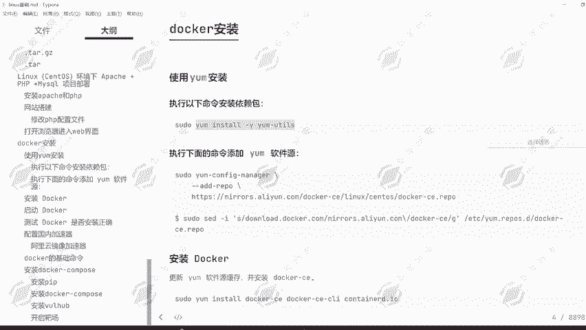
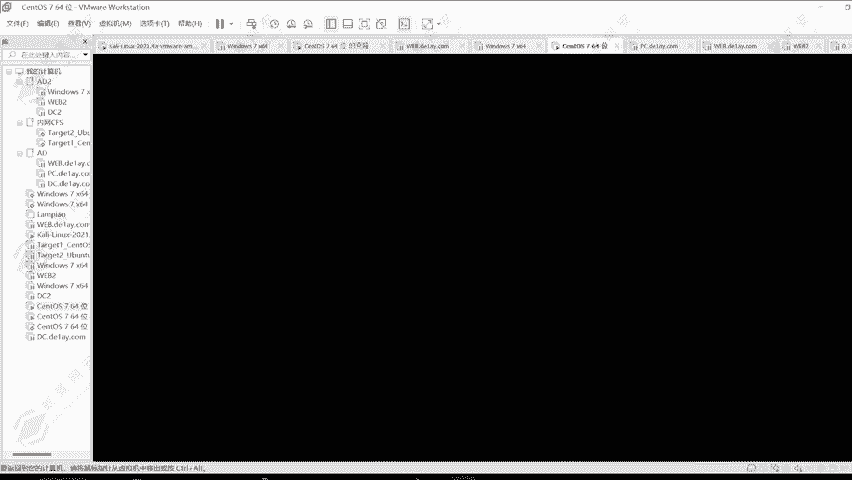
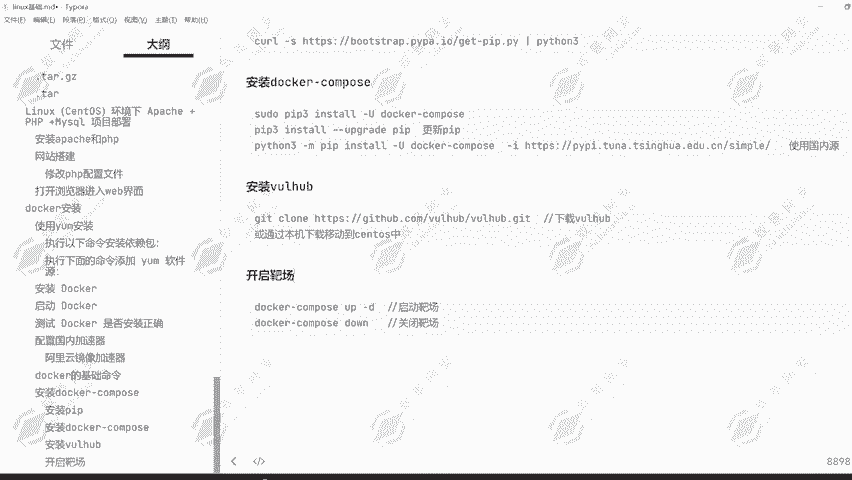

# Kali Linux 渗透测试教程：P23：Docker 使用指南 🐳

## 概述
在本节课中，我们将学习如何在 Kali Linux 系统中安装和使用 Docker。Docker 是一个强大的容器化平台，能够帮助我们快速、一致地搭建渗透测试靶场环境（如 DVWA）和各类网站，极大地简化了环境配置的复杂性。



---



## Docker 的安装

上一节我们介绍了 Linux 的基础操作，本节中我们来看看如何安装 Docker。

首先，我们需要安装 Docker 所依赖的软件包。请在终端中执行以下命令：

```bash
sudo apt-get update
sudo apt-get install apt-transport-https ca-certificates curl software-properties-common
```

执行命令时，如果提示需要 root 权限，请使用 `sudo` 或切换到 root 用户。

接下来，我们需要添加 Docker 的官方软件源和密钥，这样才能从官方仓库安装 Docker。

以下是添加 Docker 官方源的步骤：
1.  添加 Docker 的 GPG 密钥。
2.  添加 Docker 的软件仓库。
3.  更新软件包列表。
4.  安装 Docker CE（社区版）。

安装 Docker 可能需要一些时间，请耐心等待。安装完成后，我们可以启动 Docker 服务并设置其开机自启。

```bash
sudo systemctl start docker
sudo systemctl enable docker
```

为了验证 Docker 是否安装成功，我们可以运行一个测试容器。

```bash
sudo docker run hello-world
```

如果终端显示 “Hello from Docker!”，则证明 Docker 已经安装并可以正常运行。

---

## 配置 Docker 镜像加速器

默认情况下，Docker 从国外仓库拉取镜像，速度可能较慢。为了提高在国内的下载速度，我们需要配置镜像加速器，例如使用阿里云提供的服务。

以下是配置阿里云镜像加速器的步骤：
1.  访问阿里云容器镜像服务控制台并登录。
2.  在控制台中获取为你分配的专属加速器地址。
3.  在 Kali Linux 中创建 Docker 的配置目录。
4.  将加速器地址写入 Docker 的配置文件 `daemon.json`。
5.  重新加载配置并重启 Docker 服务。

配置完成后，再次拉取镜像时速度将会显著提升。

---

## 使用 Docker 搭建靶场环境

Docker 的核心优势在于能快速部署应用。下面，我们以搭建 DVWA（Damn Vulnerable Web Application）靶场为例进行演示。

首先，我们需要从 Docker Hub 拉取 DVWA 的镜像文件。

```bash
sudo docker pull vulnerables/web-dvwa
```

镜像拉取完成后，我们需要运行它来创建一个容器。运行容器时，需要将容器内部的端口映射到宿主机的端口。

```bash
sudo docker run -d -p 80:80 -p 3306:3306 vulnerables/web-dvwa
```
**命令解释**：
*   `-d`：让容器在后台运行。
*   `-p 80:80`：将容器的 80 端口映射到宿主机的 80 端口。
*   `-p 3306:3306`：将容器的 3306 端口映射到宿主机的 3306 端口。

如果宿主机的 80 或 3306 端口已被占用，可以将其映射到其他端口，例如 `-p 8080:80`。

容器启动后，打开浏览器，访问 `http://127.0.0.1`（如果映射到 8080 端口，则访问 `http://127.0.0.1:8080`）。你将看到 DVWA 的登录界面，按照提示重置数据库并使用默认账号密码（admin/password）登录即可。

---

## 使用 Docker Compose 管理多容器应用

对于由多个服务（容器）组成的复杂应用，手动管理每个容器非常繁琐。Docker Compose 是一个工具，可以通过一个 YAML 配置文件来定义和运行多容器应用。

首先，我们需要安装 Docker Compose。推荐使用 Python 的包管理工具 pip 进行安装，并使用国内镜像源以加速下载。

```bash
sudo apt install python3 python3-pip
sudo pip3 install -U docker-compose -i https://pypi.tuna.tsinghua.edu.cn/simple
```

安装完成后，可以通过以下命令验证：
```bash
docker-compose -v
```

假设我们有一个名为 “Vulhub” 的漏洞靶场集合，其每个漏洞环境都通过一个 `docker-compose.yml` 文件定义。

以下是使用 Docker Compose 启动一个靶场环境的通用步骤：
1.  进入包含 `docker-compose.yml` 文件的靶场目录。
2.  执行 `docker-compose up -d` 命令来启动所有定义的服务。
3.  使用 `docker-compose down` 命令来停止并移除所有服务。

例如，要启动一个 ThinkPHP 5.0 的漏洞环境，操作如下：
```bash
cd /path/to/vulhub/thinkphp/5.0.20
sudo docker-compose up -d
```
启动后，即可通过浏览器访问对应的端口进行测试。测试完毕，在相同目录下执行 `sudo docker-compose down` 即可清理环境。

---



## 总结
本节课中我们一起学习了 Docker 在 Kali Linux 中的核心用法。我们首先完成了 Docker 的安装和基础配置，包括设置国内镜像加速器。接着，我们实践了使用 `docker run` 命令快速部署单个容器应用（DVWA 靶场）。最后，我们介绍了更高级的 Docker Compose 工具，它能够通过声明式配置轻松管理多容器组成的复杂靶场环境（如 Vulhub）。掌握 Docker 能极大提升渗透测试中环境搭建的效率与一致性。