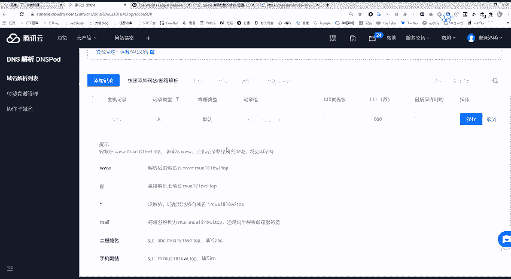
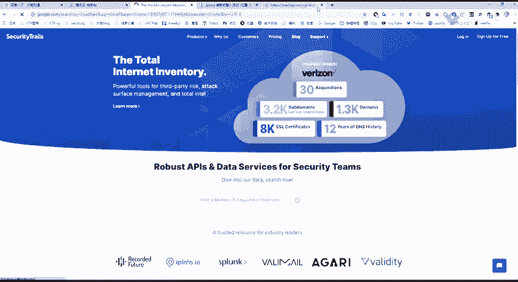
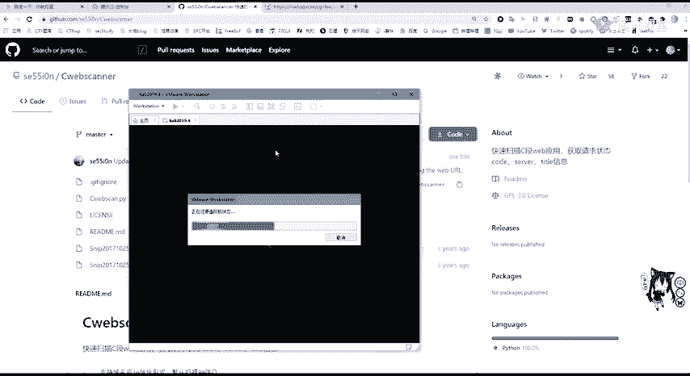
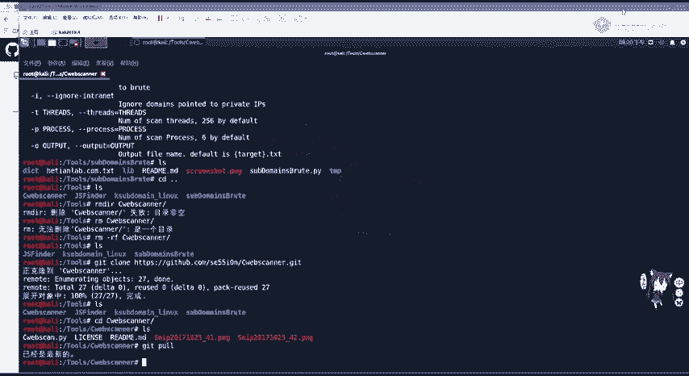
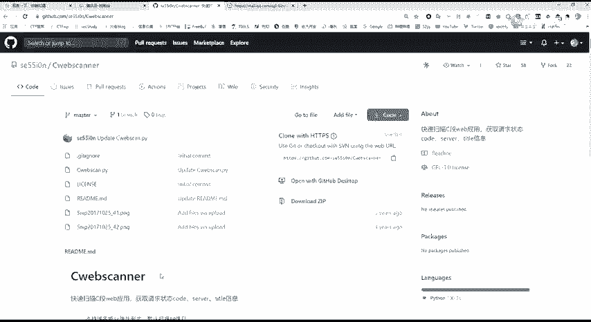
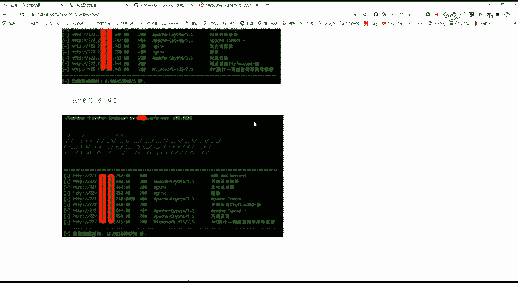
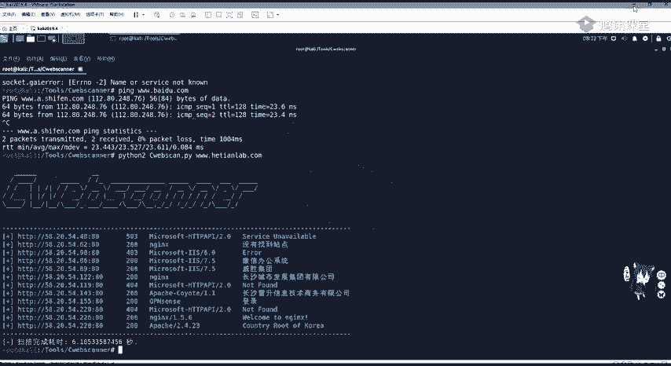
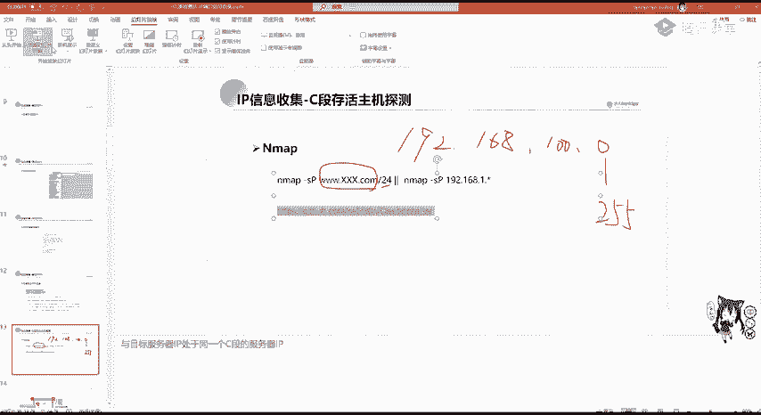

# 网络安全系统教学合集：P25：IP反查域名与CDN绕过技术

## 概述
在本节课中，我们将学习渗透测试信息收集的第二部分：IP地址及其端口的信息收集。IP地址是网络主机的核心标识，掌握其信息收集方法至关重要。我们将重点探讨如何通过IP反查域名，以及当目标使用CDN服务时，如何绕过CDN获取服务器的真实IP地址。

---

## IP反查域名

上一节我们介绍了域名和子域名的信息收集。本节中，我们来看看IP地址信息收集的重要性。

IP地址代表网络中的主机。当甲方给出的目标是IP地址时，我们可以通过IP进行反查域名。如果渗透目标是虚拟主机，那么IP反查域名就很有价值。因为一台物理服务器上可能运行多个虚拟主机，这些虚拟主机有不同的域名，但通常共用一个IP地址。

如果知道有哪些网站共用这台服务器（即拥有同一个IP地址），就可以通过IP反查域名。通过攻击此服务器上其他网站的漏洞，获取服务器控制权，进而迂回获取渗透目标的权限。这就是常说的“旁站攻击”。

例如，使用PHPStudy等工具在WWW目录下建立多个文件夹，每个文件夹代表一个站点。这些站点域名不同，但IP地址相同。在实际服务器上，也可以搭建多个站点，它们只是域名不同，IP相同。有时挖掘SRC漏洞发现SQL注入，其数据库表非常多，这可能不只是目标站点的数据库，还包含了其他旁站的数据库，这表明这些数据库都存放在同一台服务器上。

**通过IP反查域名**，可以使用站长之家（chinaz）的Web接口进行查找。例如，输入IP地址 `58.205.42.226` 进行查询，即可查到对应的域名。

---

## 域名查IP与端口探测

如果我们收到的资产是域名（包括通过子域名收集到的域名），就需要对IP进行服务探测和端口探测，检查是否开启了MySQL、Redis或其他共享服务等。为此，我们需要知道服务器的IP地址。

通过域名查询IP很简单，可以使用 `ping` 命令请求DNS解析，将域名转换为IP地址，或使用站长之家的Web接口进行查询。

例如，查询 `hetianlab.com`，可以看到其IP地址为 `58.205.42.226`，并附有地理位置信息（例如湖南长沙联通）。

---

## CDN服务与绕过方法

现在大部分网站都开启了CDN服务。CDN（内容分发网络）构建在网络之上，依靠部署在各地的边缘服务器，通过中心平台的负载均衡等技术，使用户就近获取所需内容，以降低网络拥塞，提高访问速率和命中率。

例如，用户在湖南访问黑龙江的服务器，物理距离远，延迟高。CDN服务将黑龙江服务器的内容分发到各省的边缘服务器上。当湖南用户访问时，实际访问的是长沙CDN边缘服务器的备份内容，从而大大降低了延迟。

如果目标使用了CDN，我们通常查找到的是CDN的IP地址，而非网站真实服务器地址。此时进行端口扫描或渗透扫描意义不大。因此，我们需要绕过CDN获取真实IP。

以下是判断目标是否使用CDN的方法：
*   使用站长之家等工具进行多地`ping`测试。如果不同地区`ping`同一域名返回的IP地址不同，则很可能开启了CDN。

以下是几种绕过CDN获取真实IP的方法：

**1. 利用国外访问**
CDN服务按流量收费，在中国大陆价格昂贵。因此，国内网站的CDN服务通常不会对国外用户开启。我们可以利用国外的多地`ping`工具进行查询。如果海外多个节点`ping`出的IP地址相同，那么这个IP很可能就是真实IP。

**2. 查询子域名的IP**
由于CDN价格昂贵，一些子域名或旁站可能没有架设CDN。通过查询这些子域名的IP地址，并进一步查询其C段（同一网段）的IP，有可能找到真实服务器的IP地址。

**3. 查看PHPinfo文件**
如果服务器上存在 `phpinfo.php` 文件，访问该文件可以查看 `$_SERVER[‘SERVER_ADDR’]` 的值，它通常会显示服务器的真实IP地址。但管理员通常会删除此文件，且许多网站不使用PHP，因此该方法成功率较低。



**4. 分析邮件服务记录**
在邮件的原始代码中，会显示邮件服务器发送的IP地址。如果邮件服务器和Web服务器搭建在同一台物理机上，就可以找到Web服务器的真实IP。
查看方法（以QQ邮箱为例）：
*   打开邮件，点击“更多”->“查看邮件原文”。
*   在邮件原文顶部查找 `Received: from` 字段，后面的IP地址可能就是邮件服务器的IP。



**5. 查询历史DNS记录**
网站在申请域名后，会先将域名与真实IP进行绑定（域名解析）。之后才可能购买并架设CDN服务。因此，早期的域名解析记录（A记录）中保存着真实IP。
我们可以使用DNS历史记录查询网站（如 `securitytrails.com`, `viewdns.info`）来查找这些历史A记录，从而可能发现真实IP。

---

## C段扫描与主机探测

在找到真实IP之后，我们需要对IP所在的C段进行主机探测。C段指的是同一网段内的IP地址，例如 `192.168.1.0` 到 `192.168.1.255`。在公网中，一个公司申请的IP地址通常是相邻的，属于同一个网段。探测C段可以帮助我们发现该公司的其他资产。



以下是进行C段扫描的工具和方法：





**1. 使用Nmap**
Nmap是一款强大的网络扫描工具。可以使用以下命令进行C段主机存活探测：
```bash
nmap -sn 目标IP/24
```
或指定域名：
```bash
nmap -sn 目标域名/24
```
参数 `-sn` 表示进行Ping扫描（主机发现），`/24` 是子网掩码 `255.255.255.0` 的简写，代表一个C类网络。



**2. 使用第三方工具（如Cwebscan）**
Nmap扫描速度可能较慢，可以使用一些更快的第三方工具。以 `Cwebscan` 为例：
*   从GitHub克隆项目：`git clone [项目地址]`
*   进入目录，根据README说明运行。通常命令格式为：
```bash
python cwebscan.py -u 目标域名 -p 80,443,8080
```
参数 `-u` 指定目标，`-p` 指定要扫描的端口（如Web服务的80、443、8080端口）。工具会自动扫描目标IP所在C段中开放了指定端口的主机。

---





## 总结
本节课我们一起学习了渗透测试中IP信息收集的关键技术。我们了解了IP反查域名在虚拟主机环境下的价值，掌握了通过域名查询IP的方法。重点探讨了CDN服务的原理，并学习了五种绕过CDN获取真实服务器IP的实用技巧：利用国外访问、查询子域名IP、查看PHPinfo文件、分析邮件记录以及查询历史DNS。最后，我们介绍了在获取真实IP后，如何使用Nmap和Cwebscan等工具对目标所在C段进行扫描，以发现更多潜在资产。掌握这些方法，将为后续的漏洞扫描和渗透测试打下坚实的基础。