# 网络安全系统教学合集：P26：端口信息收集介绍 🔍

在本节课中，我们将要学习端口信息收集的基础知识。端口是网络通信的关键，了解目标主机开放了哪些端口以及这些端口对应的服务，是渗透测试中信息收集阶段至关重要的一步。我们将介绍端口的概念、分类、常见高危端口以及如何使用Nmap工具进行高效的端口扫描。

## 端口基础概念

在互联网上，各个主机通过TCP/IP协议发送和接收数据包。每个数据包需要知道主机的IP地址进行网络路由选择，从而将数据包顺利传给目标主机。数据包需要传给哪一个服务，这就是通过端口号来区别的。

端口根据提供服务类型的不同，可以分为TCP端口和UDP端口。TCP和UDP是传输层的两个通信协议。TCP是一种面向连接的可靠通信协议，UDP是一种无连接的、不可靠的传输协议。TCP协议有一个三次握手的过程，UDP则没有。TCP协议的端口和UDP协议的端口是相互独立的。

## 端口类型划分

端口的类型分为三种，是根据端口号的大小来进行划分的。

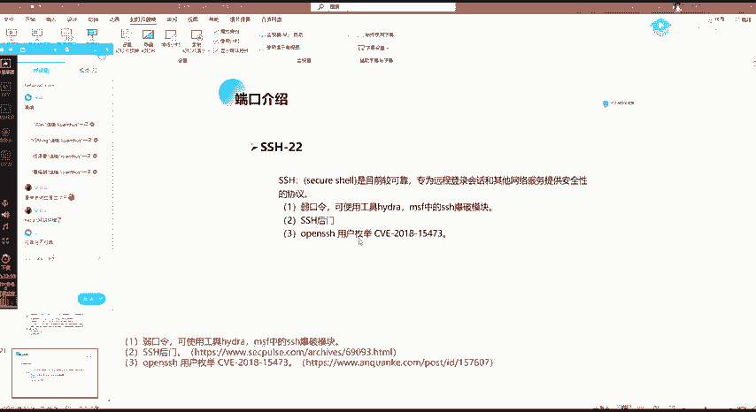

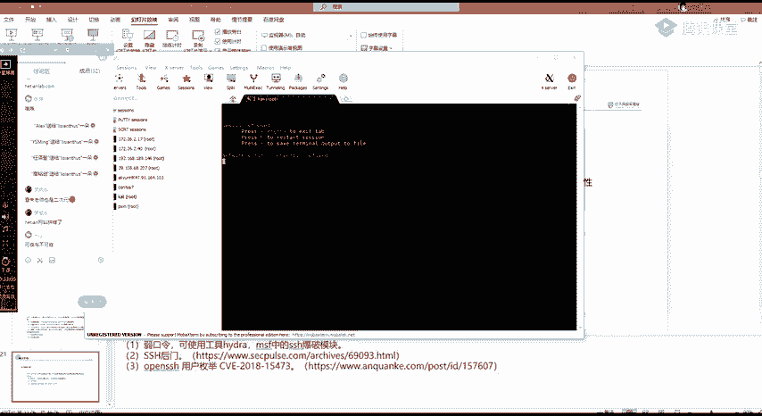

以下是三种主要的端口类型：

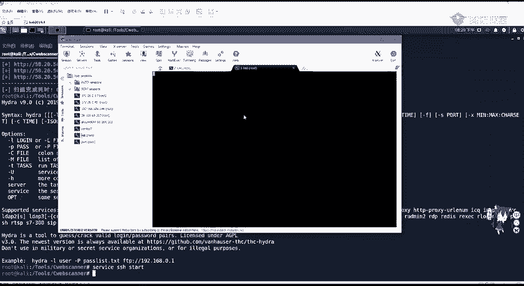

1.  **周知端口**：端口号范围是0到1023。这些端口是系统固定服务的端口号，也就是众所周知的端口。例如，80端口是WWW服务，也就是Web服务的端口。
2.  **注册端口**：端口号范围是1024到49151。这些端口用于分配给用户进程或程序。例如，当客户端访问Web服务器的80端口时，Web服务器会发送响应包返回给客户端，客户端上用于接收响应的端口就属于注册端口范围。
3.  **动态/私有端口**：端口号范围是49152到65535。这些端口一般不固定分配给某种服务，操作系统可以动态分配给客户端程序使用。

## 端口收集的重要性

我们可以把服务器比作一个房子，而端口比作进入这个房子的门。作为渗透测试人员，我们的目标是进入这个房子。在“破门而入”之前，我们必须知道这房子有几扇门，这些门是什么材质（铁门还是木门），以及门后是什么。这个过程俗称“踩点”，踩点越详细，对顺利渗透就越至关重要。

在渗透测试中，我们需要了解哪些周知端口可能存在漏洞，为我们提供“后门而入”的机会。

## 常见高危端口介绍

上一节我们介绍了端口的基本概念和重要性，本节中我们来看看一些在渗透测试中需要重点关注的高危端口及其可能存在的安全风险。

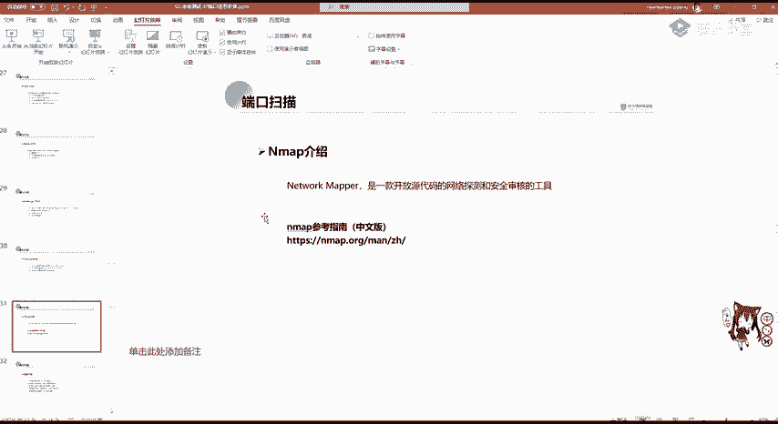


以下是需要重点关注的端口列表：

*   **FTP (文件传输协议)**
    *   **端口**：20（传输数据），21（控制信息）。
    *   **潜在风险**：
        *   **FTP爆破**：使用工具（如Hydra）尝试破解FTP登录凭证。
        *   **FTP匿名访问**：服务器若未开启验证，可使用匿名用户（anonymous）和空密码登录，可能导致敏感信息泄露。
        *   **VSFTPD后门漏洞**：特定版本的VSFTPD服务器存在后门，可导致权限提升。
        *   **嗅探**：FTP默认使用明文传输，网络流量可能被截获。
*   **SSH (安全外壳协议)**
    *   **端口**：22。
    *   **潜在风险**：弱口令爆破、用户枚举漏洞。SSH用于安全地远程登录服务器。
*   **Telnet (远程登录协议)**
    *   **端口**：23。
    *   **潜在风险**：协议本身不加密，传输内容（包括密码）可被网络嗅探工具截获。
*   **SMTP (简单邮件传输协议)**
    *   **端口**：25, 465。
    *   **潜在风险**：常被用于发送钓鱼邮件。
*   **HTTP (超文本传输协议)**
    *   **端口**：80, 443。
    *   **潜在风险**：针对Web应用程序的常见漏洞（如OWASP Top 10）或Web服务器中间件本身的漏洞（如Apache的任意文件读写漏洞）。
*   **SMB (服务器消息块)**
    *   **端口**：139, 445。
    *   **潜在风险**：历史上存在多个高危漏洞，如永恒之蓝（MS17-010）、永恒之黑（CVE-2020-0796）等，可导致远程代码执行。
*   **MySQL (数据库)**
    *   **端口**：3306。
    *   **潜在风险**：弱口令，攻击者登录后可能进行数据窃取或提权操作。
*   **RDP (远程桌面协议)**
    *   **端口**：3389。
    *   **潜在风险**：弱口令爆破、历史漏洞（如“死亡蓝屏”CVE-2019-0708）。一旦控制远程桌面，即获得服务器绝对控制权。
*   **Redis (数据库)**
    *   **端口**：6379。
    *   **潜在风险**：弱口令、未授权访问。常通过SSRF漏洞攻击内网的Redis服务。
*   **WebLogic (中间件)**
    *   **端口**：7001。
    *   **潜在风险**：SSRF及反序列化漏洞，影响重大。
*   **Tomcat (中间件)**
    *   **端口**：8080。
    *   **潜在风险**：管理后台弱口令、任意文件上传漏洞等。

## Nmap端口扫描工具

了解了需要关注的端口后，我们需要一个强大的工具来发现它们。Nmap（Network Mapper）是网络安全领域最经典、功能最强大的端口扫描工具之一。

Nmap是一款开源的网络探测和安全审核工具。它的功能非常全面：

1.  **主机发现**：探测网络中哪些主机是存活的。
2.  **端口扫描**：探测目标主机开放了哪些端口（本节课核心）。
3.  **版本探测**：探测开放端口上运行的服务及其具体版本号。
4.  **操作系统探测**：推测目标主机的操作系统类型、版本等信息。
5.  **漏洞扫描**：通过Nmap脚本引擎（NSE）检测已知的脆弱性漏洞。

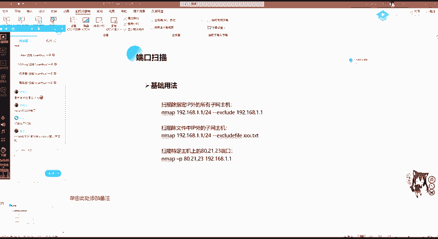

### Nmap扫描结果状态

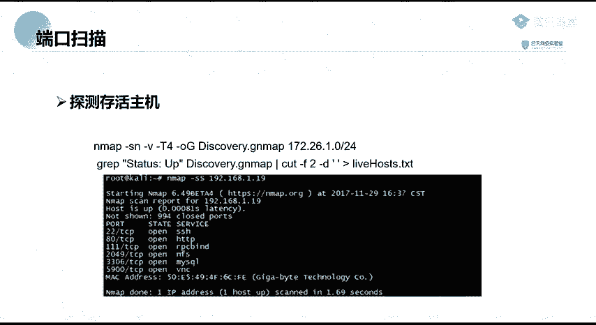

使用Nmap进行端口扫描时，常见的端口状态有三种：

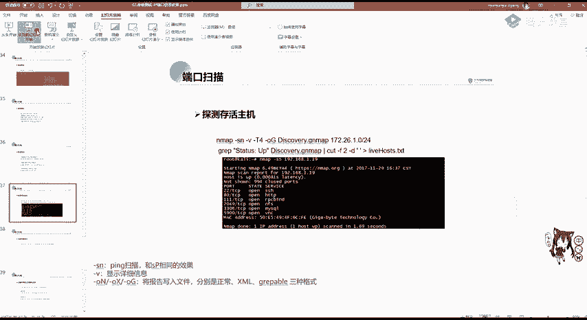

*   **`open`**：端口开启，有程序在该端口监听连接。
*   **`closed`**：端口关闭，没有程序监听，但主机是存活的。
*   **`filtered`**：端口被过滤（如被防火墙、入侵检测系统阻挡），无法确定其状态。

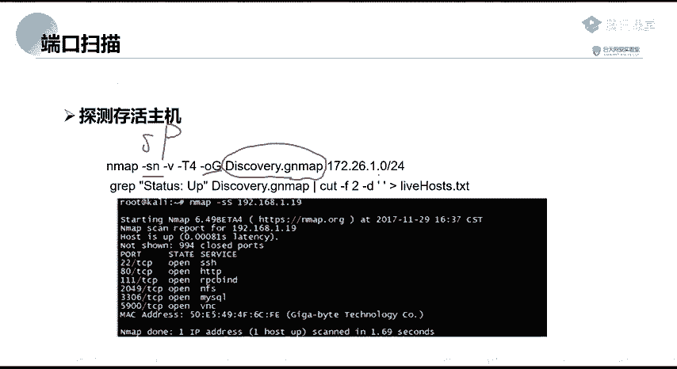

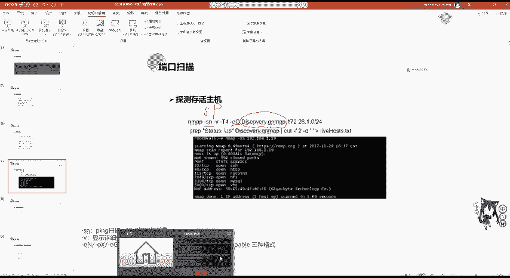

### Nmap基础用法

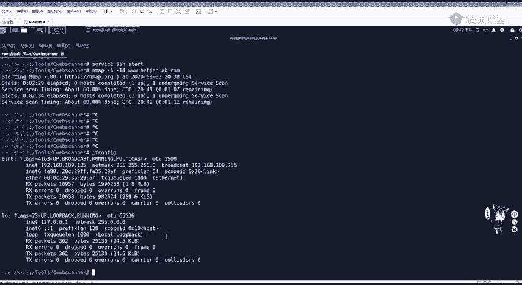


Nmap的命令参数非常多，初学者可以从以下几个基础命令开始：

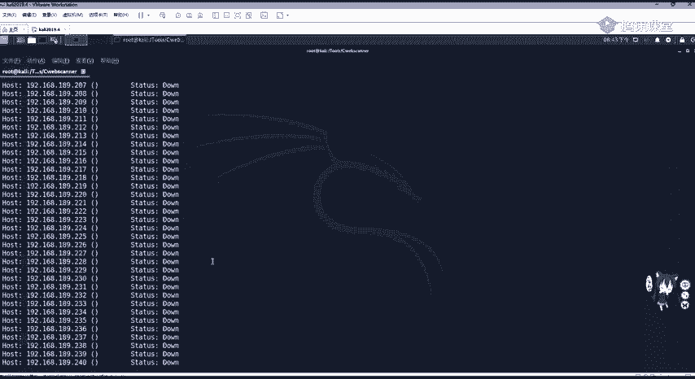

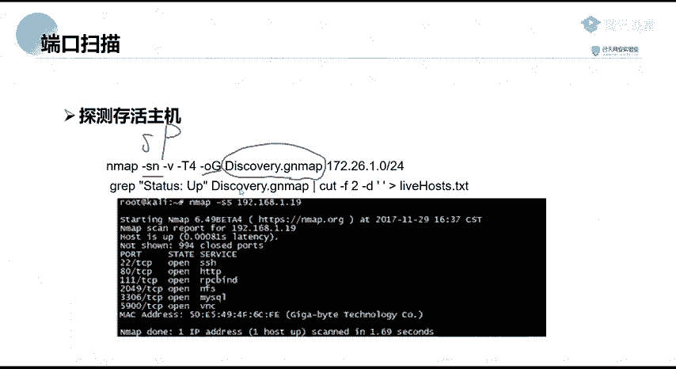

*   **扫描单个主机**：`nmap <目标IP>`
*   **全面扫描**：`nmap -A -T4 <目标IP>` （`-A`启用全面扫描，`-T4`指定扫描速度）
*   **扫描子网**：`nmap <网络地址>/<子网掩码>`，例如 `nmap 192.168.1.0/24`
*   **扫描指定端口**：`nmap -p 80,443,22 <目标IP>`
*   **扫描全端口**：`nmap -p 1-65535 <目标IP>` （速度较慢）
*   **SYN半开扫描**：`nmap -sS -Pn <目标IP>` （隐蔽性较好，不完成TCP三次握手）

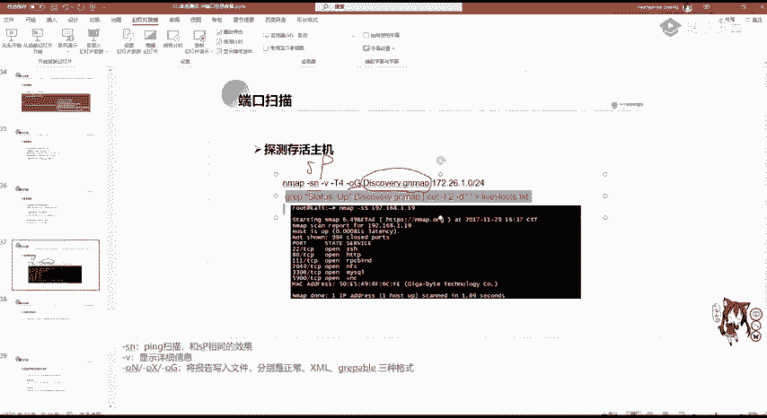

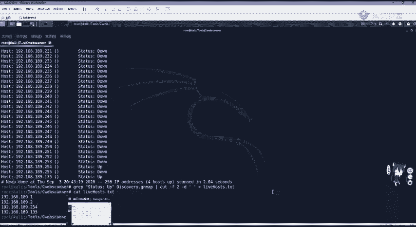

### 使用Nmap进行漏洞扫描

Nmap的强大之处在于其脚本引擎。我们可以使用内置脚本对特定服务进行漏洞检测。

例如，扫描SMB服务的永恒之蓝漏洞：
```bash
nmap -p 445 --script smb-vuln-ms17-010 192.168.1.0/24
```
这条命令会对192.168.1.0网段所有主机的445端口进行扫描，并检测是否存在MS17-010漏洞。

## 总结

本节课中，我们一起学习了端口信息收集的核心知识。我们首先理解了端口在网络通信中的作用和分类（周知端口、注册端口、动态端口）。接着，我们探讨了端口收集在渗透测试中的重要性，并详细列举了FTP、SSH、SMB、RDP等常见高危端口及其关联的安全风险。最后，我们介绍了功能强大的端口扫描工具Nmap，学习了它的基本功能、常见端口状态以及基础扫描命令和漏洞扫描方法。

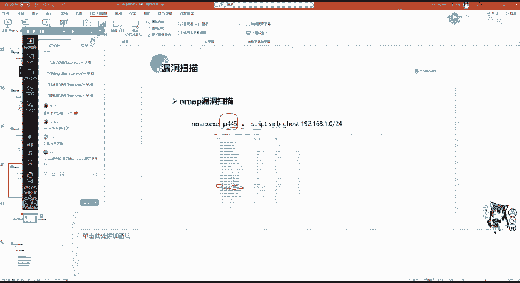

掌握端口信息收集是迈向成功渗透测试的第一步，它能帮助我们精准定位攻击面，为后续的漏洞利用和权限提升打下坚实基础。