# 网络安全系统教学合集：P27：其他信息收集与社会工程学 🕵️

在本节课中，我们将学习信息收集的另外两个重要方面：**历史漏洞信息收集**与**社会工程学**。掌握这些知识，能帮助我们在渗透测试中更全面地了解目标，并理解非技术攻击手段的危害与原理。

上一节我们介绍了基础的端口与服务扫描，本节中我们来看看如何利用已知漏洞信息，并了解社会工程学攻击的基本概念。

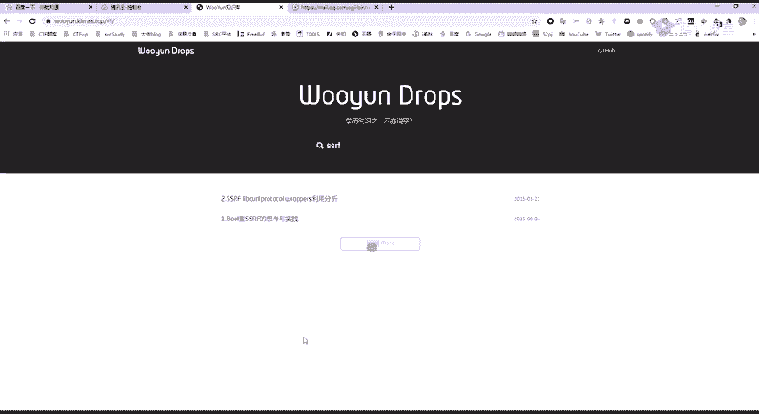

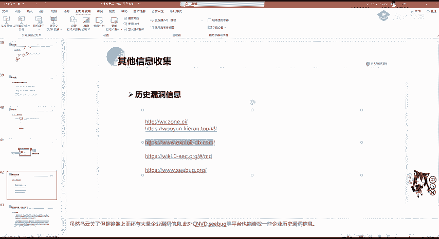

## 历史漏洞信息收集 🔍

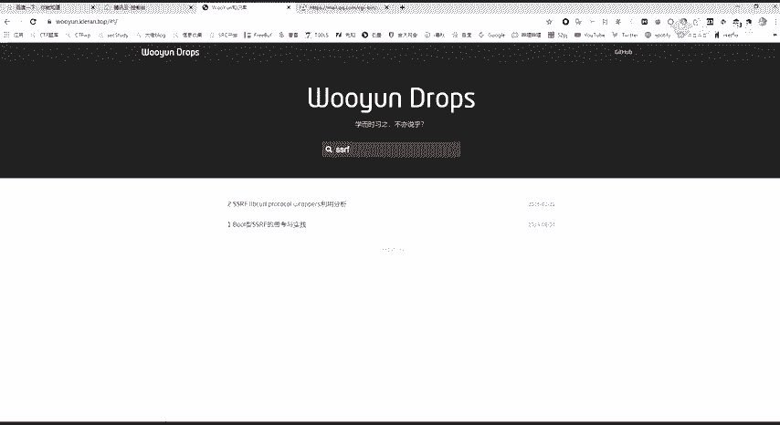

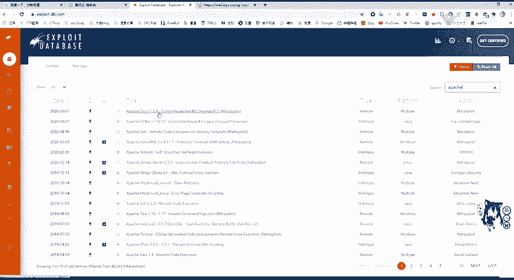

当我们探测到一个网站使用的CMS、中间件（如Apache）或开发框架（如ThinkPHP）后，下一步通常是寻找针对这些组件的已知漏洞进行攻击。我们通常不会自己编写攻击脚本，而是利用公开的历史漏洞信息。

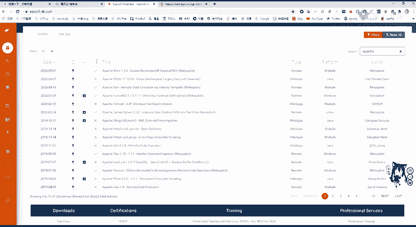

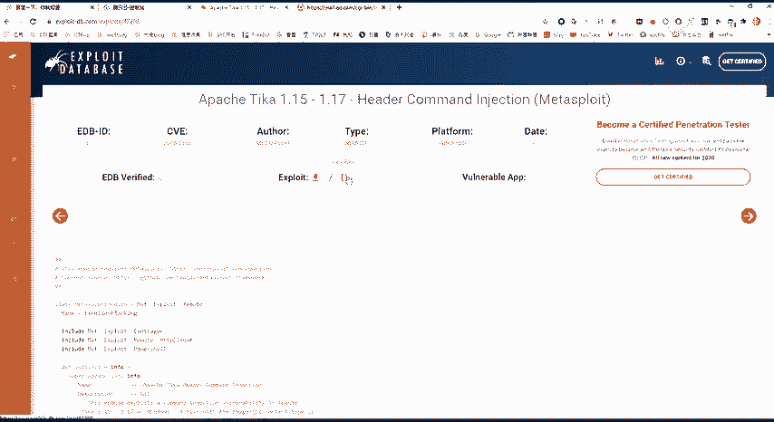

以下是几个常用的漏洞信息查询平台：

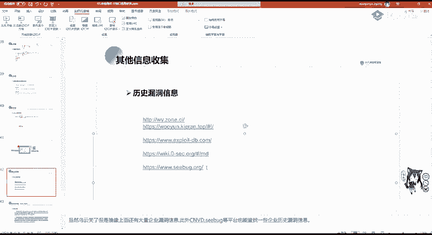

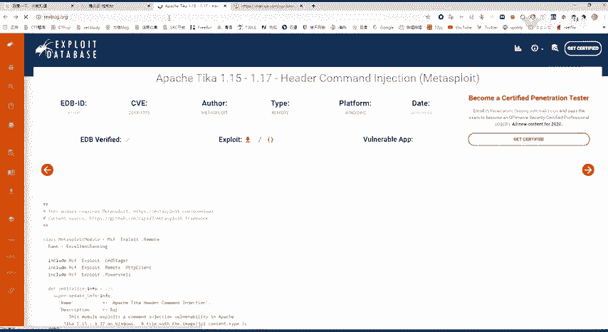

*   **乌云镜像**：虽然乌云主站已关闭，但其镜像站点仍保存了大量漏洞报告和技术文章。可以通过搜索引擎查找或自行搭建。
*   **乌云知识库**：提供了丰富的漏洞技术细节和分析。例如，想学习ROP攻击技术，可以直接搜索“ROP”；想了解SSRF漏洞，则搜索“SSRF”。
*   **Exploit Database**：这是一个国外的知名漏洞平台。例如，想搜索Apache的相关漏洞，可以在搜索框输入“Apache”进行查询。平台会列出相关漏洞，许多条目还提供了可直接下载或查看的漏洞利用代码。
*   **CVE Details**：另一个非常好用的漏洞数据库，可以按厂商、产品、漏洞类型等分类查看漏洞详情。
*   **其他平台**：如知道创宇的漏洞平台等，功能类似。在这些平台上，可以查看到诸如WordPress、深信服EDR、宝塔面板未授权访问等具体漏洞的详情、攻击方式及修复建议。

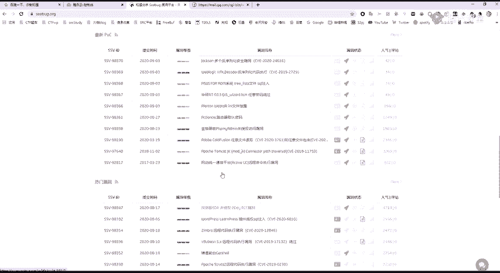

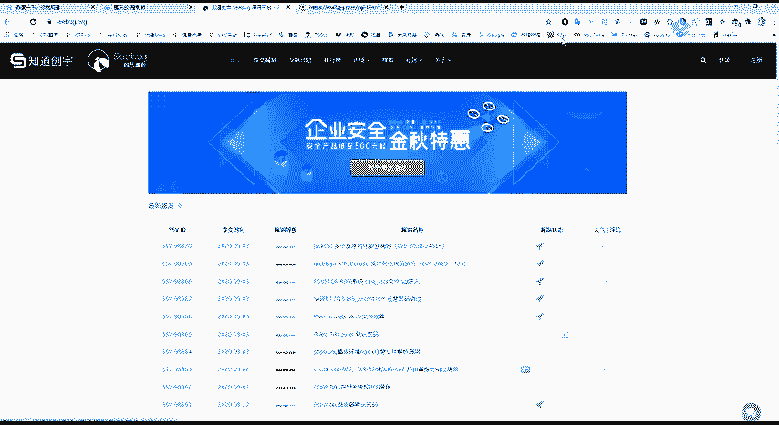

通过收集和分析这些历史漏洞信息，我们可以更高效地定位潜在的攻击入口。

## 社会工程学攻击 🎣

社会工程学是一种利用人性弱点（如信任、好奇、恐惧）而非技术漏洞进行攻击的手段。其危害性极大，例如许多电信诈骗案都利用了通过“社工库”获取的个人信息。

在渗透测试场景中，假设我们需要登录一个网站后台，但未发现SQL注入、逻辑漏洞、密码重置漏洞或弱密码。此时，若在登录页面发现了管理员的邮箱，就可能尝试社会工程学攻击。

**攻击方式举例：**

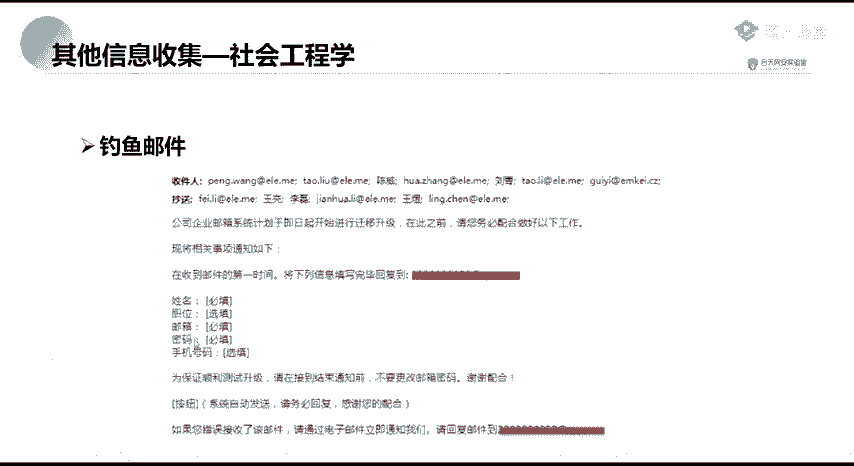

1.  **钓鱼邮件**：攻击者伪装成公司高管、合作伙伴或系统管理员，向目标发送邮件，诱骗其点击链接、下载附件或直接回复敏感信息（如密码）。
2.  **伪造页面**：利用工具（如`SET`、`Cobalt Strike`或Kali Linux自带的工具）生成与真实登录页面极其相似的钓鱼页面。当用户在此页面输入账号密码时，信息就会被窃取。
3.  **信息诱骗**：通过伪造的“同学录”、“问卷调查”、“系统升级通知”或“抽奖活动”等，诱使用户主动填写个人信息、游戏账号密码等。

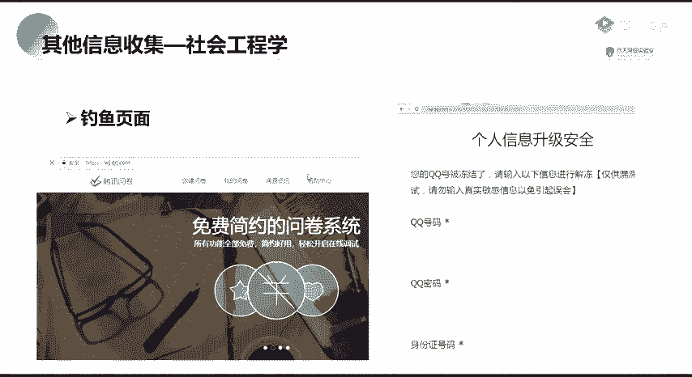

**核心危害**：社会工程学攻击往往能绕过严密的技术防护。例如，著名的“徐玉玉案”中，犯罪分子就是利用非法获取的高考考生信息进行精准诈骗，造成了严重后果。

**重要提示**：在国内，搭建、查询或交易“社工库”是违法行为，且在实际的安全测试（如参与SRC众测）中，通常禁止使用社会工程学手段。了解它主要是为了提升防范意识。

## 课程总结与作业 📚

本节课我们一起学习了信息收集的两个扩展方向：如何利用公开平台查询历史漏洞信息，以及社会工程学攻击的基本概念与危害。理解这些内容有助于构建更立体的安全攻防视角。

以下是本节课的作业，请尝试完成：

**作业一：扫描实践**
使用`nmap`或本节课提到的其他工具，对授权测试站点（例如 `lab.com`）进行C段扫描，并探测其开放端口。

**作业二：漏洞利用初体验**
1.  在虚拟机中搭建一个存在已知漏洞的旧版本操作系统（例如 Windows XP 或 Windows Server 2003）。
2.  使用`nmap`对该虚拟机进行端口扫描。
3.  **尝试**利用公开的漏洞利用代码（Exp），获取该虚拟机的控制权。

**作业提示**：对于零基础的同学，完成作业二可能需要自行搜索一些资料，请善用搜索引擎。如果遇到环境搭建或工具使用的困难，可以向讲师或班主任寻求指导。

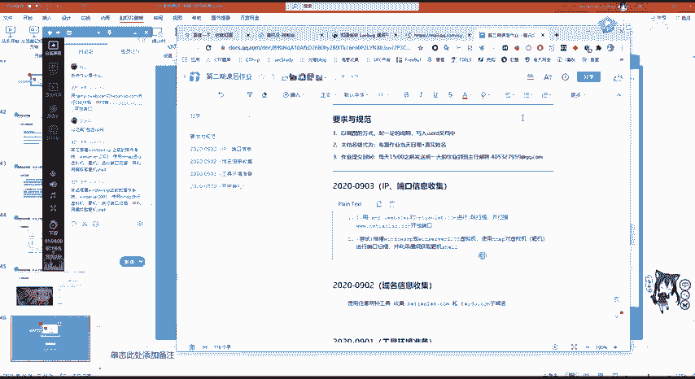

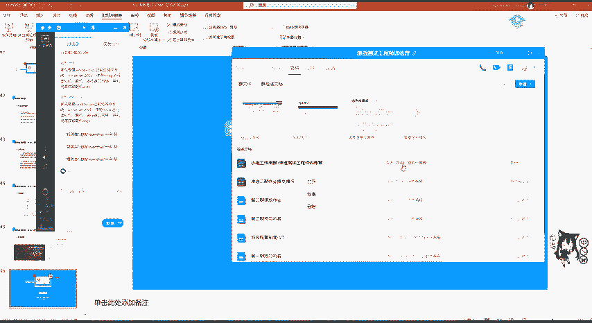

请按时将作业提交给班主任。按时完成作业是巩固知识的重要环节。

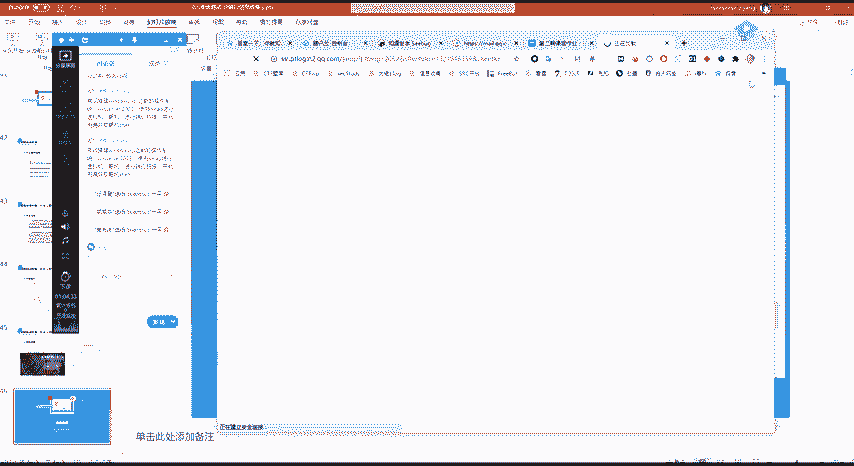

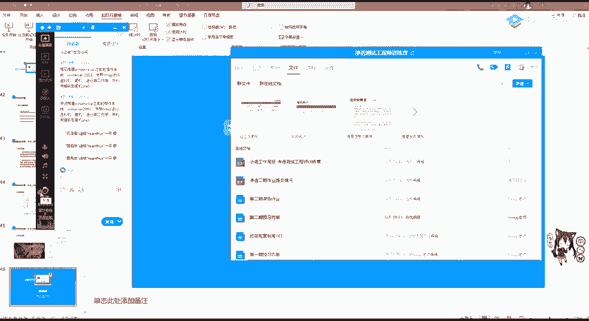

本节课到此结束，谢谢大家。