# 网络安全系统教学合集：P28：网站指纹识别 🔍

在本节课中，我们将要学习网站信息收集中的核心环节——网站指纹识别。了解目标网站的技术栈是后续渗透测试的基础，它能帮助我们更有针对性地寻找和利用漏洞。

网站信息收集主要包含三个方面：**网站指纹识别**、**敏感文件及目录探测**以及**网站WAF（Web应用防火墙）识别**。本节我们将聚焦于网站指纹识别。

## 什么是网站指纹？🖐️

一个网站最基本的组成由四部分构成：**服务器（操作系统）**、**中间件（Web容器）**、**脚本语言**和**数据库**。识别这些组件的具体类型和版本，就是网站指纹识别。

*   **服务器**：通常是 Linux 或 Windows Server。
*   **中间件**：如 Apache、Tomcat、Nginx、IIS 等。
*   **脚本语言**：如 PHP、JSP、ASP、ASP.NET、Python (Django/Flask) 等。
*   **数据库**：如 MySQL、SQL Server、Oracle、Access 等。

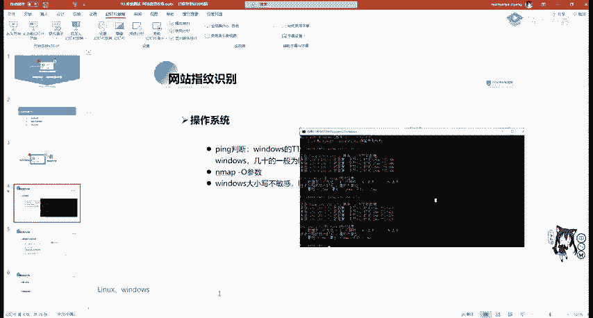

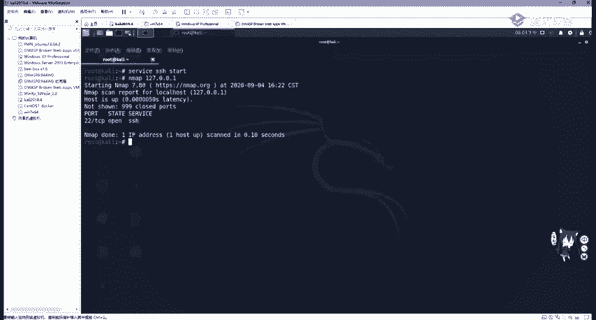

了解网站指纹至关重要。例如，当我们发现一个文件读取漏洞时，如果想读取 `/etc/passwd` 文件，但目标服务器是 Windows 系统，该文件根本不存在，攻击就会无效。因此，我们必须先识别其操作系统。

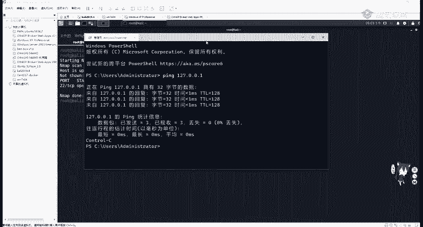

## 如何识别操作系统？💻

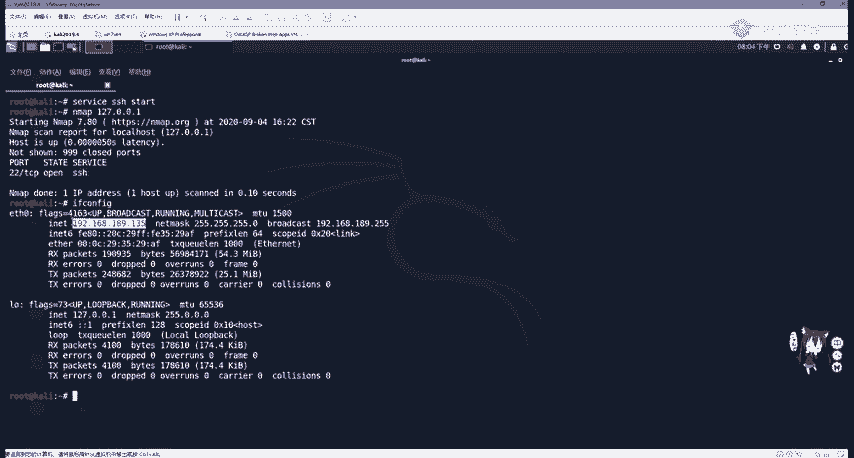

识别操作系统主要有三种方法。

### 方法一：使用 Ping 命令的 TTL 值

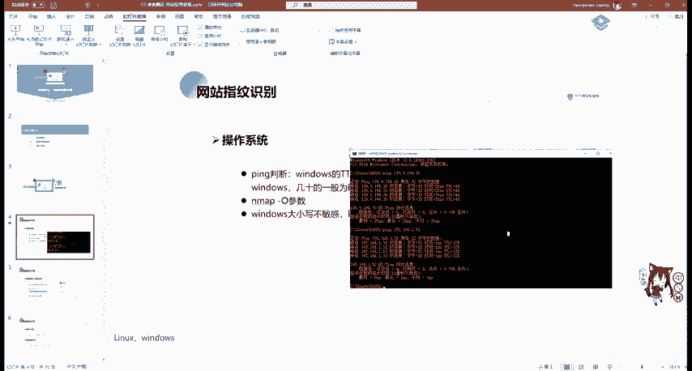

通过 Ping 目标主机，观察其返回数据包的 TTL（生存时间）值。不同操作系统的默认 TTL 值不同。

*   **Windows** 系统的 TTL 值通常为 **128**。
*   **Linux/Unix** 系统的 TTL 值通常为 **64**。

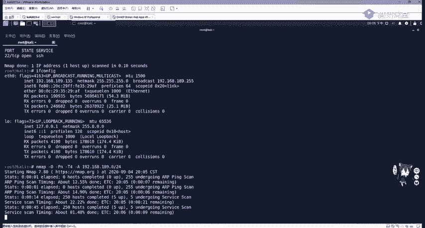

因此，一个简单的判断规则是：TTL 值 **大于100** 的一般是 Windows 服务器；**小于100** 的一般是 Linux 服务器。

**操作示例：**
在命令行中执行 `ping [目标IP]`。观察返回结果中的 `TTL=` 后面的数值。

### 方法二：使用 Nmap 的 -O 参数

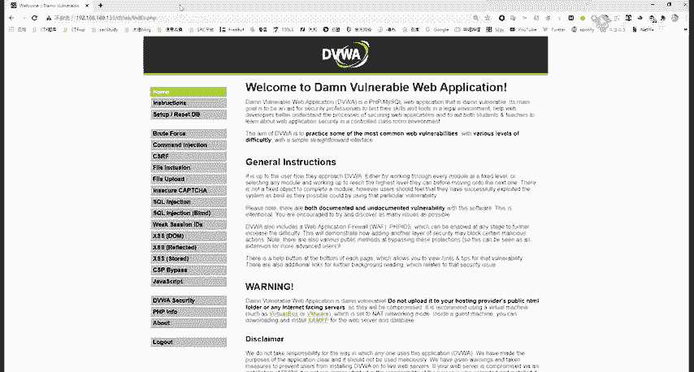

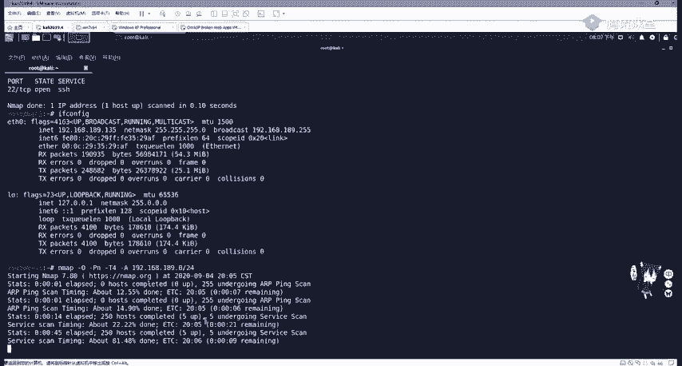

Nmap 工具可以更精确地识别操作系统。使用 `-O` 参数可以启用操作系统检测功能。

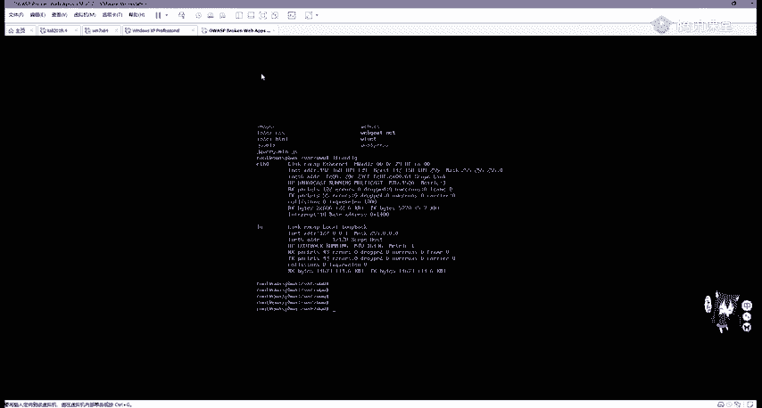

**命令示例：**
```bash
nmap -O -Pn -T4 192.168.1.0/24
```
这个命令会扫描 192.168.1.0/24 网段，并尝试识别每个在线主机的操作系统。参数 `-Pn` 表示跳过主机发现（假设所有主机都在线），`-T4` 指定扫描速度。

### 方法三：利用 URL 大小写敏感性差异

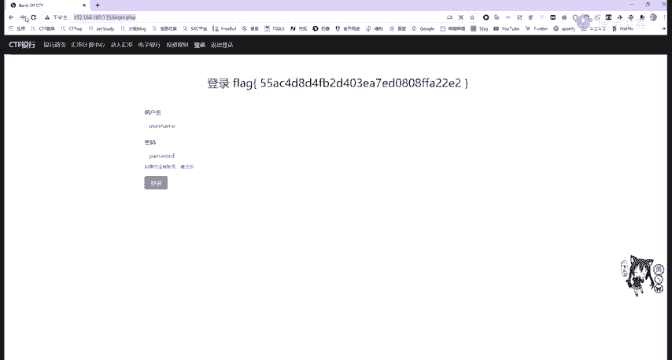

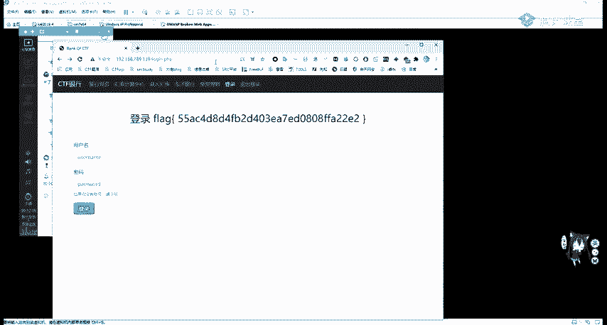

Windows 和 Linux 系统在文件路径处理上有一个关键区别：

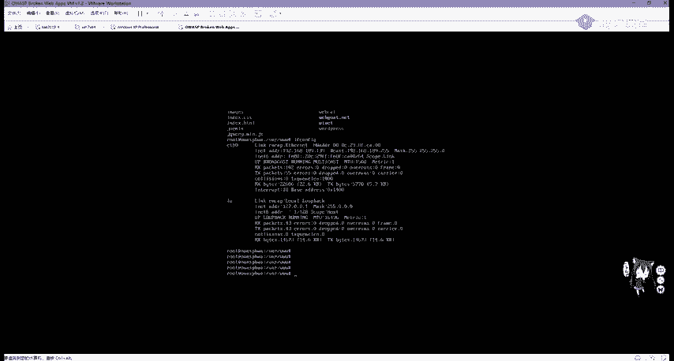

*   **Windows**：文件系统**不区分**大小写。
*   **Linux**：文件系统**区分**大小写。

**操作示例：**
访问一个已知存在的网页，例如 `http://target.com/index.php`。然后尝试访问 `http://target.com/INDEX.PHP` 或 `http://target.com/InDeX.PhP`。
*   如果依然能正常访问，则目标服务器很可能是 **Windows**。
*   如果返回 404 错误（页面不存在），则目标服务器很可能是 **Linux**。

## 如何识别中间件与脚本语言？🌐

识别网站使用的 Web 容器（中间件）和编程语言，有助于我们查找对应的版本漏洞。

### 识别中间件（Web容器）

以下是几种常用的识别方法。

**方法一：浏览器开发者工具（F12）**
1.  打开目标网站，按 `F12` 调出开发者工具。
2.  切换到 **Network（网络）** 标签页。
3.  刷新页面（按 `F5`）。
4.  在请求列表中找到并点击主域名请求（通常是第一个）。
5.  在右侧的 `Response Headers`（响应头）中查找 `Server` 字段。该字段通常会显示服务器类型和版本，例如 `Apache/2.4.41` 或 `nginx/1.18.0`。

**方法二：使用在线工具或浏览器插件**
有许多在线工具和浏览器插件可以自动化识别网站技术栈。
*   **在线工具**：如 `whatweb`、`Wappalyzer` 的在线版本等。
*   **浏览器插件**：如 **Wappalyzer**。安装后，在浏览器工具栏点击该插件图标，即可快速显示网站使用的技术，包括服务器、JavaScript 库、前端框架等。

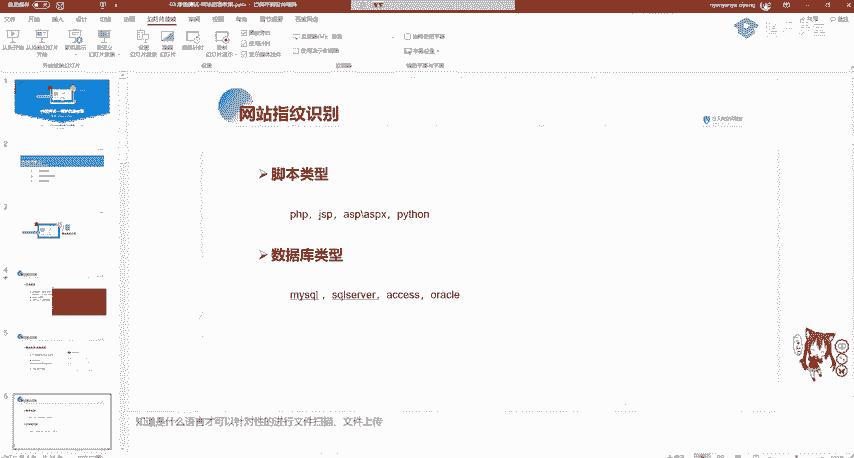

### 识别脚本语言


识别脚本语言通常可以通过观察网站 URL 的后缀名。
*   `.php` -> **PHP**
*   `.jsp` 或 `.do` 或 `.action` -> **JSP** (Java)
*   `.asp` 或 `.aspx` -> **ASP** 或 **ASP.NET**
*   无特定后缀或为 `/user/1` 等形式 -> 可能是 **Python (Django/Flask)** 或 **Ruby on Rails** 等 MVC 框架。

知道目标网站使用的语言，对于后续渗透测试（如文件上传、代码审计）有直接指导作用。例如，针对 PHP 网站，我们会上传 `.php` 后缀的 Webshell。

## 如何识别数据库与CMS？📊

### 识别数据库类型

数据库类型通常不会直接显示，但可以通过一些线索推断：
1.  **结合脚本语言**：PHP 网站常搭配 MySQL；ASP.NET 网站常搭配 SQL Server；Java 网站可能搭配 Oracle 或 MySQL。
2.  **使用扫描工具**：如 Nmap 的脚本 (`--script`)，或专门的数据库扫描工具，有时能探测出数据库 banner 信息。
3.  **报错信息**：有时网站的错误信息会暴露数据库类型（如 SQL 语句错误）。

### 识别CMS（内容管理系统）

CMS（如 WordPress、Discuz!、DedeCMS）是建站常用框架，通常有公开的漏洞库。识别 CMS 是快速寻找漏洞的捷径。

**识别方法：**
1.  **查看页面底部或元信息**：很多 CMS 会在页面底部显示 “Powered by XXX” 或 “XXX CMS” 的标识。
2.  **查看特定文件或目录**：访问 `/robots.txt`、`/admin/`、`/wp-admin/`、`/wp-content/` 等 CMS 特有的默认路径。
3.  **使用在线识别工具**：如 `whatcms.org` 等网站，输入 URL 即可识别。
4.  **查看源代码**：在 HTML 源代码中搜索 CMS 名称、特征路径或特征字符串。

**利用已知CMS漏洞：**
一旦识别出 CMS 及其版本，就可以在漏洞库（如 Exploit-DB、CNVD、CNNVD）中搜索相关漏洞和利用代码（EXP），这能极大提高渗透测试效率。

---

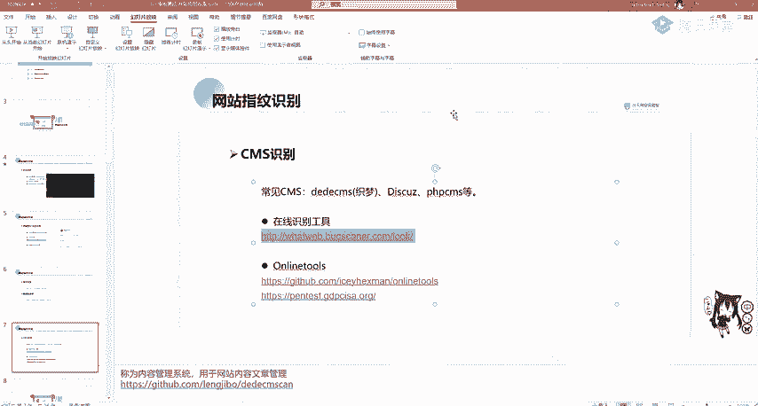

本节课中我们一起学习了网站指纹识别的基础知识。我们了解了网站的技术栈构成，并掌握了识别**操作系统**、**中间件**、**脚本语言**、**数据库**以及**CMS**的多种实用方法。这些信息是渗透测试的“地图”，能指引我们更高效、更精准地进行后续的漏洞挖掘与利用工作。下一节，我们将探讨如何探测网站的敏感文件和目录。