# 网络安全系统教学合集：P29：敏感文件及目录探测 🔍

在本节课中，我们将学习敏感文件及目录探测。这是信息收集阶段的关键步骤，旨在发现网站管理员在搭建或维护网站时可能无意中遗留的敏感文件，从而获取服务器关键信息。

## 敏感文件及目录概述

网站管理员在搭建网站时，可能会遗留部分敏感文件，例如数据库配置文件、备份文件等。探测并获取这些文件，有助于我们了解服务器配置，为进一步的渗透测试打下基础。

通常，需要关注的敏感文件和目录包括以下几种。

以下是常见的敏感文件及目录类型：
*   **.git 和 .svn**：这些是代码版本控制系统（Git 和 SVN）的目录。如果管理员未将其从生产服务器中删除，可能导致整个网站源代码泄露。
*   **.DS_Store**：这是苹果 macOS 操作系统在文件夹中自动生成的隐藏文件，用于存储文件夹的显示属性（如图标位置）。它可能泄露目录结构。
*   **WEB-INF**：这是 Java Web 应用的安全目录，如果配置不当，可能被直接访问，导致配置文件泄露。
*   **各类备份文件**：例如 `.rar`、`.zip`、`.tar.gz`、`.bak`、`.sql` 等。管理员可能将网站源码或数据库打包后遗忘在 Web 目录下，导致直接下载。

## Git 信息泄露探测

上一节我们介绍了常见的敏感文件类型，本节中我们来看看其中危害较大的一种：Git 信息泄露。

Git 是一个全球流行的代码版本管理工具。开发人员有时会将代码上传到线上仓库（如 GitHub、Gitee），并克隆到服务器进行部署。如果部署时未删除 `.git` 目录，攻击者就可以利用此目录还原出网站的完整源代码。

源代码中可能包含数据库连接信息、API 密钥、后台账号密码等敏感配置。探测 Git 泄露可以使用自动化工具 `GitHack`。

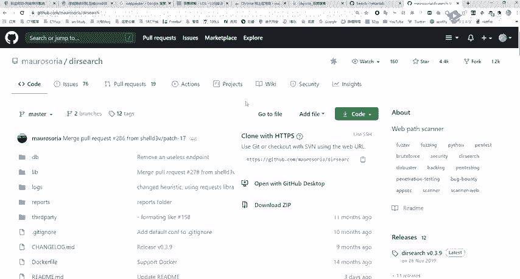

以下是使用 GitHack 的基本步骤：
1.  克隆 GitHack 工具到本地：`git clone https://github.com/lijiejie/GitHack`
2.  使用工具扫描目标：`python GitHack.py http://target.com/.git/`
3.  工具会自动解析 `.git` 目录，并将网站源代码下载到本地。

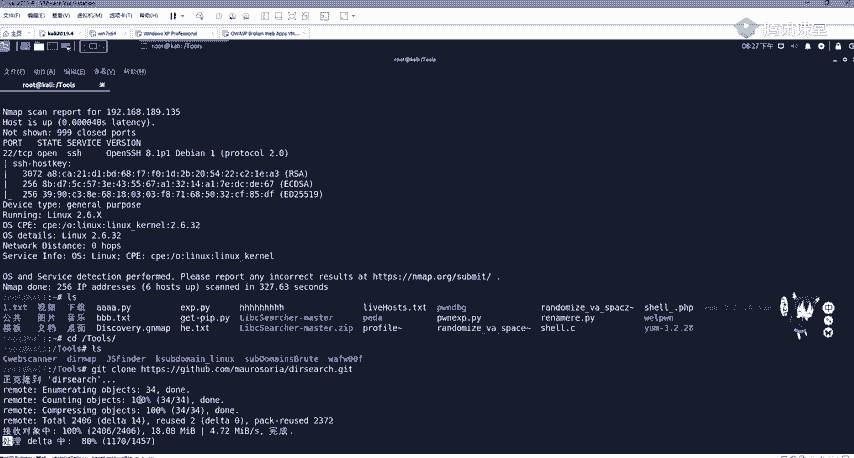

## 目录爆破工具使用

除了寻找特定的敏感文件，我们还需要主动发现网站隐藏的目录和文件，例如后台登录入口、未引用的功能页面等。这个过程称为目录爆破或目录扫描。

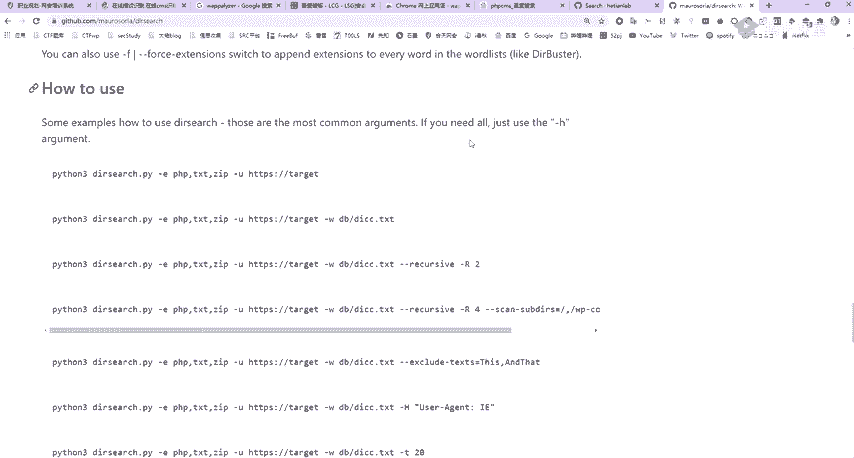

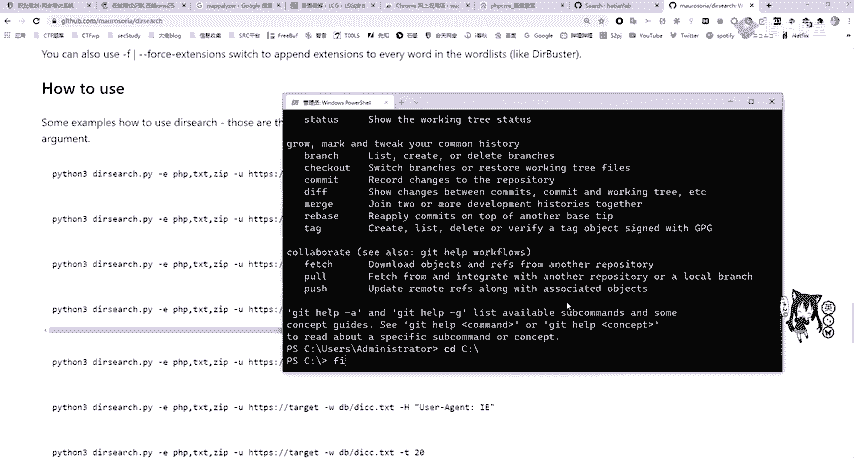

以下是三款常用的目录爆破工具：
*   **御剑**：一款经典的图形化目录扫描工具，使用简单，字典丰富。
*   **Dirsearch**：一款基于 Python 的命令行工具，速度快，可定制性强。
*   **DirMap**：另一款高效的 Python 命令行工具，支持高级并发和结果过滤。

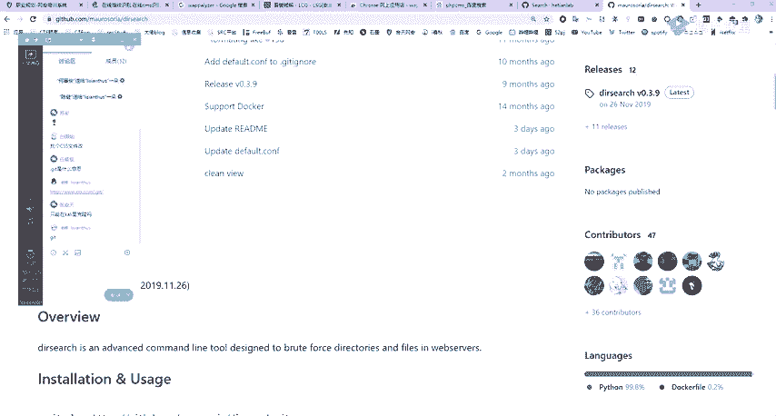

### Dirsearch 使用示例


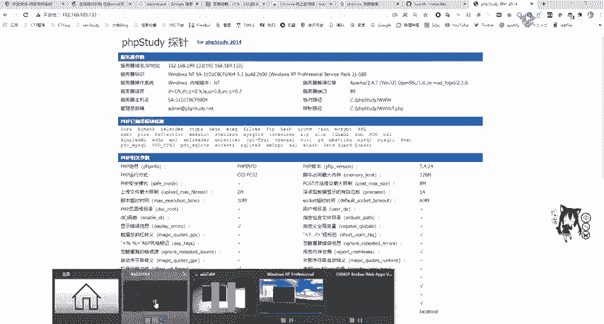

Dirsearch 工具可以通过 Git 克隆获取。其基本使用方法如下。

以下是 Dirsearch 的基本命令格式：
```bash
# 克隆工具
git clone https://github.com/maurosoria/dirsearch.git
cd dirsearch

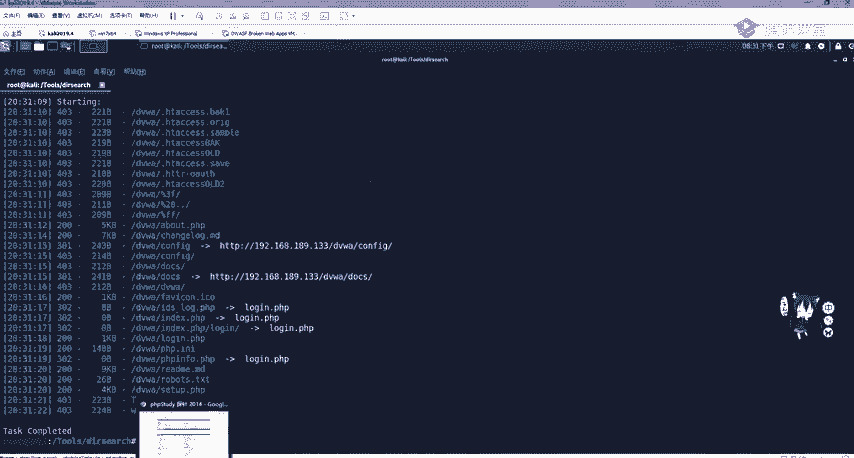

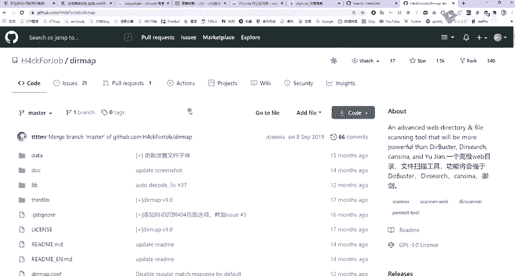

# 基础扫描命令
python3 dirsearch.py -u http://target.com -e php,html,zip
```
*   `-u` 参数指定目标 URL。
*   `-e` 参数指定要扫描的文件扩展名。

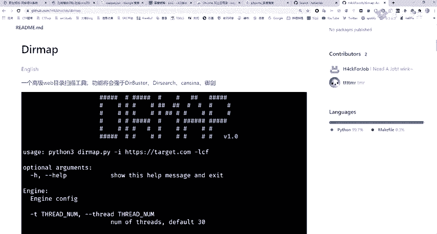

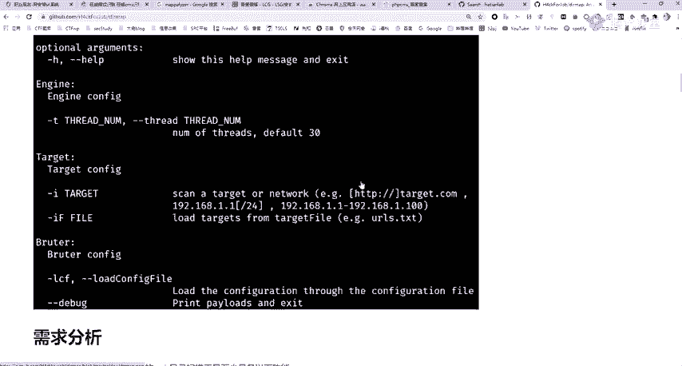

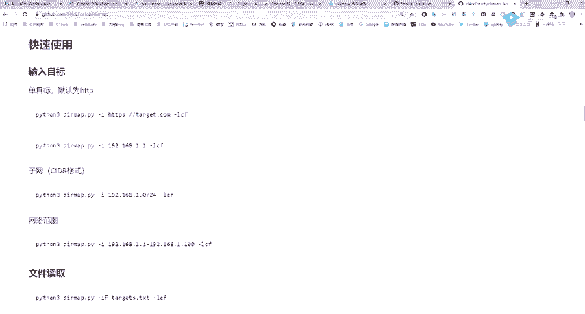

### DirMap 使用示例

DirMap 是另一款高效的扫描工具，安装和使用同样简便。

以下是 DirMap 的基本使用流程：
1.  克隆工具：`git clone https://github.com/H4ckForJob/dirmap.git`
2.  安装依赖：`pip3 install -r requirements.txt`
3.  执行扫描：`python3 dirmap.py -i http://target.com -lcf`

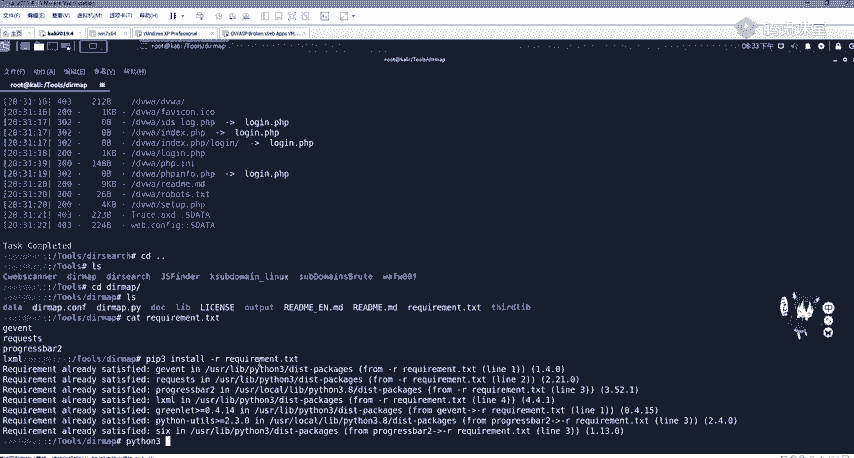

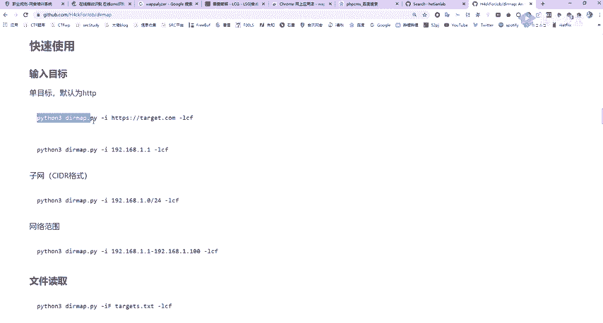

## 漏洞导致的信息泄露

某些特定的框架或应用漏洞也会导致敏感信息泄露，这需要我们具备一定的漏洞知识。例如，Spring Boot 框架曾出现 Actuator 端点未授权访问漏洞，攻击者可以通过访问 `/env` 等路径直接获取到数据库密码等环境变量信息。

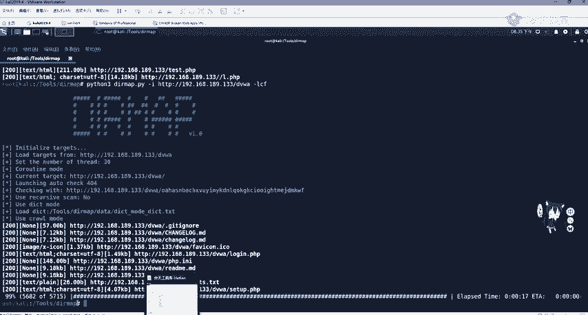

发现这类漏洞的入口，往往也需要通过目录爆破来找到特定的路径（如 `/actuator/env`）。因此，保持对安全社区（如先知社区、安全客等）的关注，及时了解新型漏洞和利用方式，至关重要。

## 总结

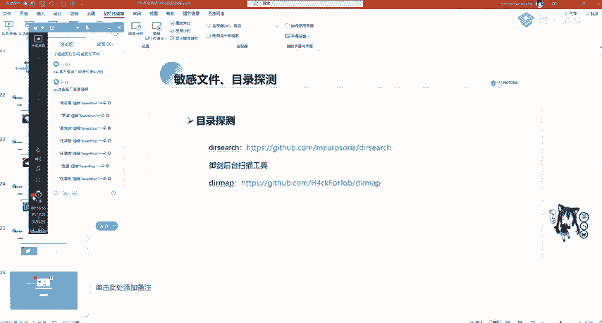

本节课中我们一起学习了敏感文件及目录探测。我们首先了解了 `.git`、备份文件等常见敏感文件的危害，然后学习了使用 `GitHack` 等工具自动化利用 Git 泄露。接着，我们重点介绍了目录爆破的概念，并演示了如何使用 `Dirsearch` 和 `DirMap` 这两款命令行工具来发现隐藏的目录和文件。最后，我们提到了一些由特定漏洞（如 Spring Boot Actuator 未授权访问）导致的信息泄露案例。掌握这些信息收集技术，是进行有效渗透测试的重要基础。