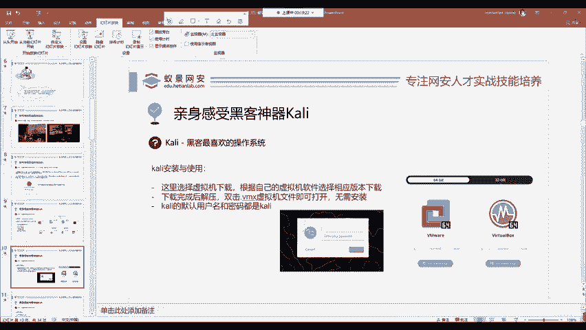
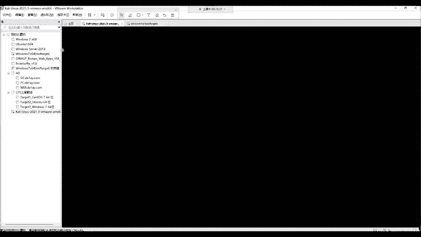
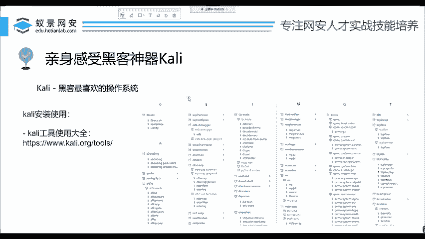

# 网络安全入门：P2：1_揭秘黑客攻击机-Kali的介绍与安装 🔍

在本节课中，我们将要学习网络安全渗透测试中至关重要的工具——Kali Linux操作系统。我们将了解它是什么、为何强大，并掌握其最便捷的安装与启动方法。

## 选择合适的攻击机


对于新手而言，学习任何技术（如开发、前端）时，搭建环境往往是最大的困难。在网络安全领域，找到一个合适的“攻击机”是第一步。


## 认识Kali Linux

在各种电影、新闻或网络安全宣传中，黑客的屏幕上常出现不同于Windows或macOS的操作界面。这通常就是Kali Linux。

Kali Linux是一款基于Debian的Linux发行版。它的核心优势在于预装了**300多个渗透测试工具**，并且配置好了常用的开发与运行环境，用户几乎无需额外配置即可直接开始渗透测试工作。此外，它是一款**永久免费**的开源操作系统。

> **重要提示**：学习Kali中的工具时，务必遵守《中华人民共和国网络安全法》及相关法律法规，仅用于合法授权的安全测试与学习。

## 获取Kali Linux

Kali Linux拥有官方网站，支持多种平台。以下是主要版本：

*   **虚拟机版本**：最适合学习和演示，性能损耗低，使用方便。
*   **Docker容器**：轻量级，适合在容器化环境中快速部署。
*   **WSL版本**：可在Windows的Linux子系统上直接运行。
*   **ARM版本**：适用于树莓派、M1芯片Mac或手机等设备。
*   **移动端版本**：可刷入特定型号手机，进行移动渗透测试。

对于教学和初学者，我们推荐使用**虚拟机版本**。

## 安装与启动Kali虚拟机

虚拟机版本的安装过程极为简单，无需逐步安装操作系统。

1.  **下载**：在Kali官网的“Get Kali”页面选择“Virtual Machines”，根据你使用的虚拟机软件（如VMware或VirtualBox）下载对应版本。
2.  **解压**：下载的文件是一个压缩包，将其解压。
3.  **启动**：在解压后的文件夹中找到后缀为 **`.vmx`** 的虚拟机配置文件，双击即可在虚拟机软件中打开Kali。

启动虚拟机后，你会看到登录界面。最新版Kali Linux（如2021.3及以后）的默认用户名和密码均为：
```
kali
```
输入后即可登录系统。






## 探索Kali Linux


成功登录后，你将看到Kali的桌面环境。请不要对虚拟机操作感到畏惧，可以随意探索。菜单中集成了从信息收集、漏洞扫描、密码攻击到无线攻击、逆向工程等各类工具。

> **学习方法**：Kali集成了大量成熟工具，初学者应优先学习使用这些工具，避免“重复造轮子”。遇到需求时，先查看是否有现成工具可用。

## Kali工具大全

Kali官网提供了所有内置工具的完整文档。访问方式是在官网地址后加上 `/docs/`。

例如，官方工具文档页面会列出所有渗透测试工具，点击任一工具即可查看其详细说明和使用方法。虽然文档是英文，但借助浏览器翻译插件即可轻松阅读。



---


**本节课总结**：我们一起学习了Kali Linux操作系统的核心价值与特性，掌握了通过虚拟机版本安装和启动Kali的最简单方法，并了解了如何探索其内置的强大工具集以及查阅官方文档。Kali是网络安全学习的强大起点，请务必在合法合规的前提下使用它。