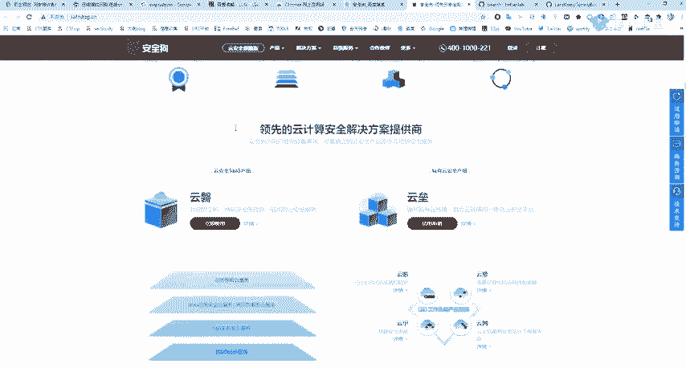
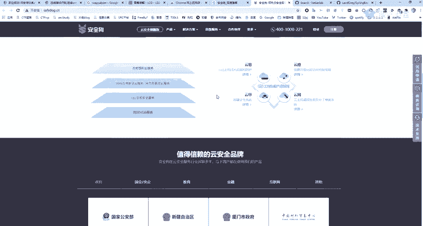
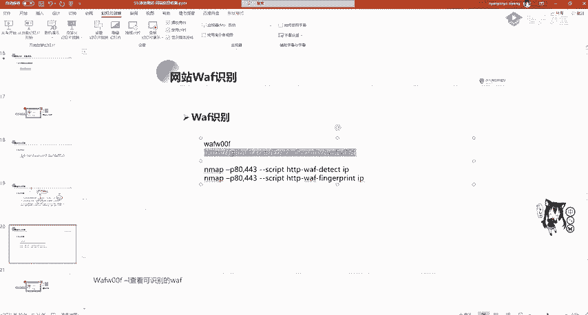
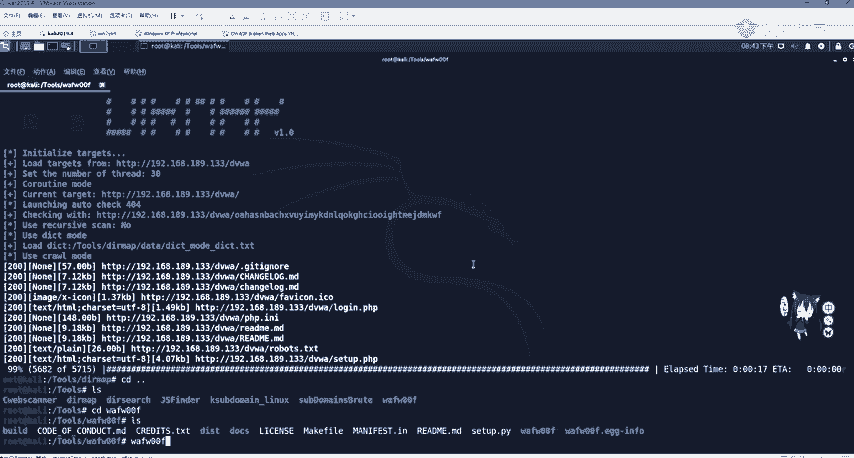
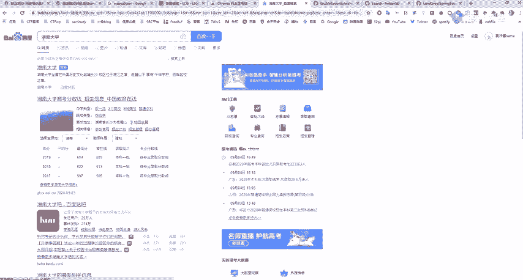
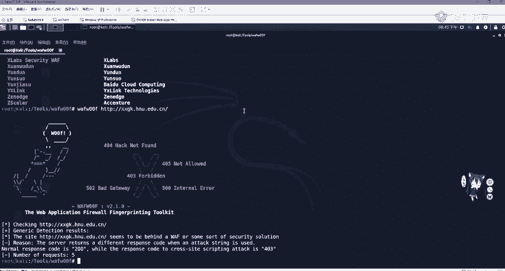
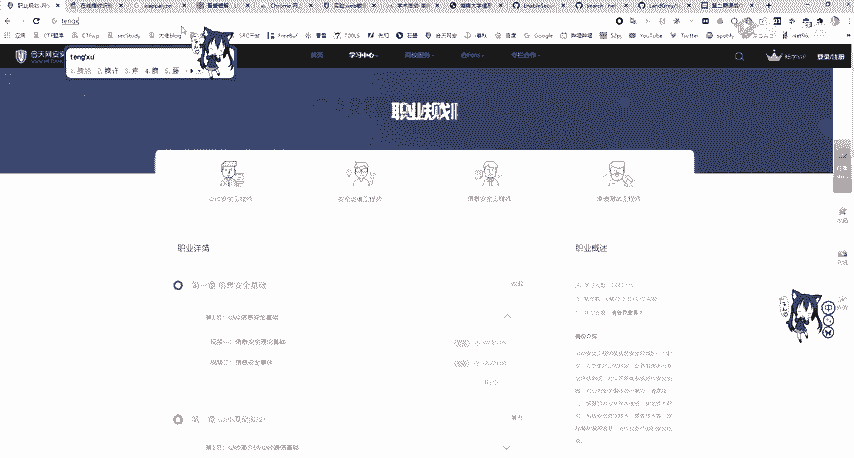
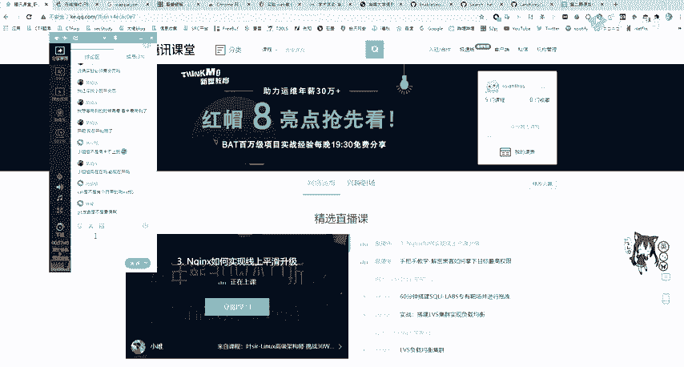
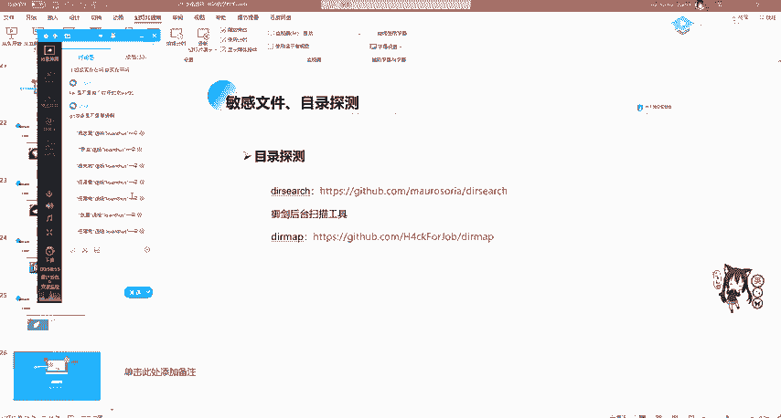

# 网络安全系统教学合集：P30：网站WAF识别 🔍

在本节课中，我们将要学习什么是Web应用防火墙（WAF），了解其作用与分类，并掌握识别目标网站是否部署了WAF的方法。这对于后续的渗透测试和漏洞挖掘至关重要。

## 什么是WAF？

许多网站管理员可能不擅长编写安全的代码，也不清楚自己的网站是否存在漏洞。为了解决这个问题，WAF应运而生。WAF是Web Application Firewall（Web应用防火墙）的缩写，主要用于保护网站免受黑客攻击。它通常可以分为两大类：**软WAF**和**硬WAF**。

*   **硬WAF**：通常指物理设备，例如机架上的“铁盒子”，它可能集成了入侵检测系统（IDS）和流量监控等功能。
*   **软WAF**：通常以软件形式存在，通过设定白名单或黑名单规则，对HTTP的请求包（Request）和响应包（Response）进行过滤。

## 常见的WAF产品





市面上存在多种WAF产品，既有免费的也有商业的。

以下是部分常见的WAF：
*   **免费产品**：例如安全狗、知道创宇的云锁。
*   **集成面板**：例如宝塔面板，也内置了WAF功能。
*   **云服务商产品**：例如阿里云盾（安骑士），它们可以防御SQL注入等基础攻击。

## 为什么需要识别WAF？

在进行渗透测试时，如果遇到WAF，盲目尝试攻击语句很可能导致IP被封锁。因此，我们需要先识别WAF的类型和版本。对于版本较老或存在已知绕过方式的WAF，我们可以搜索相应的绕过技术，例如使用特定注释、URL编码或双重编码等方式来绕过其检测规则。

识别WAF有助于我们进行精准绕过，而不是盲目尝试。

## WAF的主要防护功能



WAF作为一种安全防护系统，主要提供以下保护：

1.  **防御各类网络攻击**：主要防御OWASP Top 10中列出的攻击，包括但不限于SQL注入、跨站脚本（XSS）、跨站请求伪造（CSRF）、网站后门等。例如，WAF会拦截含有系统调用命令的请求，使某些一句话木马失效。
2.  **防止自动化攻击**：例如防御暴力破解。WAF可以配置规则，如密码错误3次后锁定1分钟，错误10次则禁止当日登录。同样适用于SSH或RDP服务的爆破防护。此外，还能防止批量注册、识别并拦截漏洞扫描器（如AWVS）的扫描行为。
3.  **阻止其他常见威胁**：包括防御恶意爬虫、零日攻击、代码分析、嗅探、数据篡改、越权访问、敏感信息泄露等。



## 如何识别WAF？



识别WAF有多种方法，我们可以手动测试，也可以使用自动化工具。

### 手动识别特征

在渗透测试过程中，你可能会遇到一些特征。例如，当你使用SQL注入语句测试时，页面可能返回“安全狗拦截”或“云锁”等提示，这表明网站部署了相应的WAF。如果继续使用`sqlmap`等工具扫描，IP地址很可能被封锁。



### 使用工具识别：WAFW00F

一个常用的WAF识别工具是`WAFW00F`。它的原理是发送特定的HTTP请求，并根据响应头、响应内容等特征来判断WAF类型。

以下是使用`WAFW00F`的基本步骤：
1.  **安装**：首先需要克隆项目并安装。
    ```bash
    git clone https://github.com/EnableSecurity/wafw00f.git
    cd wafw00f
    python setup.py install
    ```
2.  **查看支持列表**：安装后，可以查看其支持识别的WAF列表。
    ```bash
    wafw00f -l
    ```
3.  **识别目标**：使用以下命令对目标URL进行识别。
    ```bash
    wafw00f http://target-url.com
    ```

**请注意**：使用工具进行主动识别本身可能触发WAF的防护规则，导致你的IP被暂时封锁。操作时需谨慎。

### 其他识别方式

除了`WAFW00F`，`Nmap`等扫描工具也具备一定的WAF探测能力，但识别能力相对一般。

## 信息收集的后续步骤

在完成网站基本信息、CMS、中间件以及WAF的识别后，信息收集阶段就接近尾声了。接下来，我们需要基于收集到的信息寻找脆弱点。

以下是后续的行动思路：
*   如果发现CMS或中间件存在已知漏洞，则尝试利用。
*   如果识别出WAF，则研究对应的绕过方法。
*   如果找不到直接漏洞或无法绕过WAF，则需要**扩大资产搜索范围**，例如进行C段扫描、寻找旁站（同一服务器上的其他网站）等边缘资产进行渗透测试。这对于最终形成一份有价值的渗透测试报告至关重要。

## 课程总结与作业

本节课我们一起学习了Web应用防火墙（WAF）的概念、作用、分类以及识别方法。掌握WAF识别是渗透测试中规避防护、进行有效测试的关键一步。

为了巩固学习，请完成以下作业：

**作业一：工具实践**
*   完成核天实验室中关于`Nmap`网络扫描的实验。
*   完成核天实验室中关于`Git`、`SVN`等版本控制软件导致的敏感信息泄露探测实验。





**作业二：实战尝试**
*   选择一个公益SRC平台（如补天）或众测平台（如漏洞盒子）上的一个目标网站。
*   对其执行一次完整的信息收集流程，包括子域名、端口、CMS、WAF识别等。
*   记录收集过程与发现，熟悉整个工作流。

**重要提醒**：在针对任何真实目标（尤其是教育机构`.edu`域名）进行技术研究时，务必遵守“三不”原则：**不查看、不篡改、不删除**任何数据，更不要上传后门程序。一切操作应在法律允许和授权范围内进行。



---
祝大家学习顺利！如有疑问，可在课程群内交流。