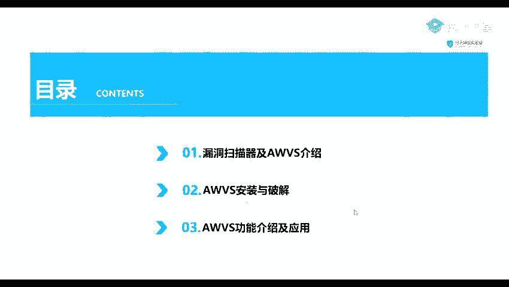
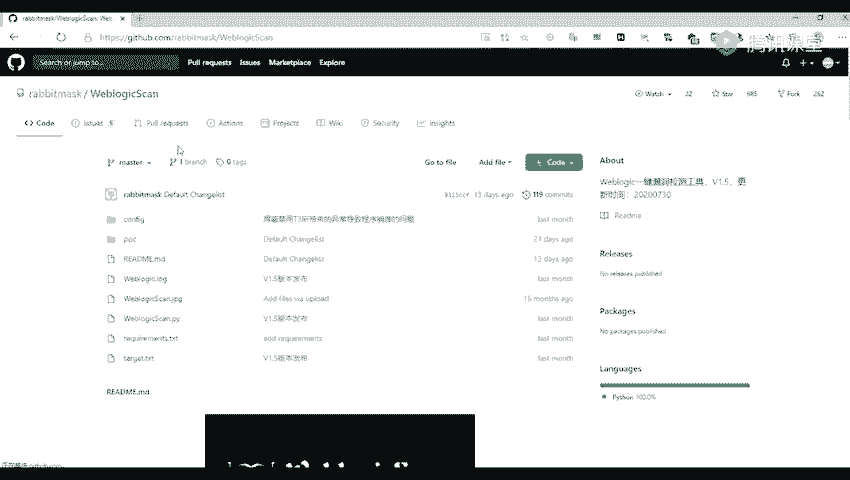
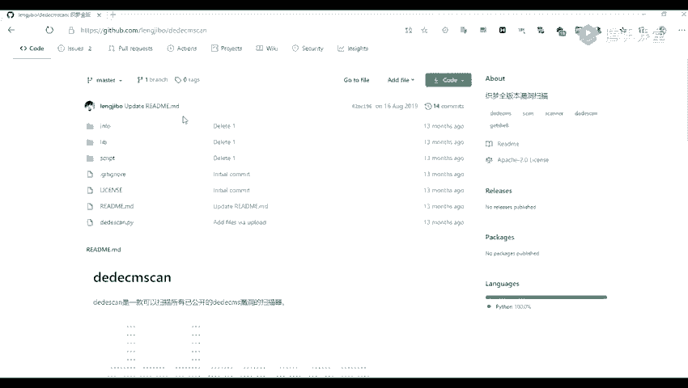
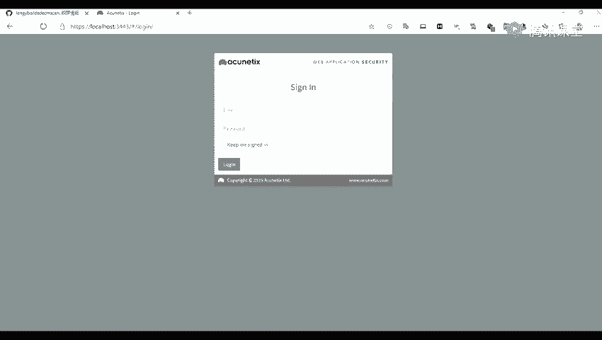
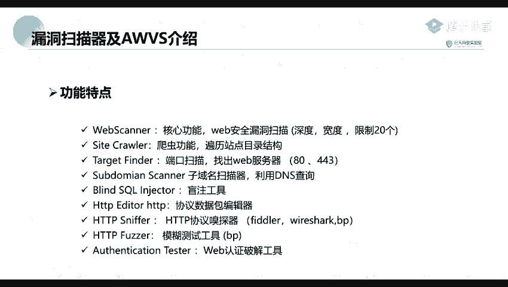

# 网络安全入门：P31：漏洞扫描器_AWVS工具介绍 🔍

在本节课中，我们将要学习一款强大的Web漏洞扫描工具——AWVS。我们将了解什么是漏洞扫描器，如何安装和配置AWVS，并初步探索它的核心功能。通过学习，你将能够使用AWVS对网站进行基本的安全漏洞检测。

上一节课程中，我们学习了信息收集技术，包括端口扫描和子域名发现。收集到目标信息后，下一步就是发现其中可能存在的安全漏洞，这正是本节课的核心内容。

## 第一部分：漏洞扫描器与AWVS介绍

首先，我们来明确什么是漏洞扫描。漏洞扫描是指基于已知的漏洞数据库，通过扫描等手段，对指定的远程或本地计算机系统的安全性进行检测。简单来说，就是利用自动化工具，检查我们上一节课收集到的子域名等目标是否存在已知的安全弱点。通过扫描发现可利用的漏洞，是进行渗透测试的关键步骤。

网络上存在许多公开或免费的漏洞扫描工具和脚本。以下是常见的几类：

以下是针对特定类型漏洞的扫描工具示例：
*   **SQL注入漏洞**：可以使用 `sqlmap` 工具进行检测。
*   **WebLogic漏洞**：可以使用 `weblogicScan` 工具，它内置了多种漏洞的检测脚本。
*   **特定CMS漏洞**：例如针对WordPress的 `WPScan`，针对DedeCMS的 `DedeCMSscan`。

以下是针对系统或应用层的扫描工具：
*   **系统层扫描**：例如 `Nessus`，这是一款功能强大的系统漏洞扫描器。
*   **框架漏洞**：例如针对Struts2框架的专用检测工具。
*   **中间件漏洞**：例如针对Shiro框架的检测脚本。

以下是针对Web服务的综合扫描工具：
*   **Burp Suite**：它不仅是一个抓包工具，其专业版也包含漏洞扫描功能。
*   **Xray**：一款由长亭科技开发、近期非常流行的被动扫描工具。
*   **AWVS**：也就是我们本节课要重点学习的工具。

那么，什么是AWVS？**AWVS** 是一款知名的网络漏洞扫描工具。它可以通过网络爬虫测试网站的安全性，检测流行的安全漏洞，如SQL注入、跨站脚本等。在11.0版本之前，AWVS是一个客户端软件。从11.0版本开始，它转变为通过浏览器访问的Web服务形式，我们安装后通过自定义的端口在浏览器中打开并使用。

AWVS拥有以下主要功能特点：
*   **Web漏洞扫描**：核心功能，用于扫描Web安全漏洞。
*   **站点爬虫**：爬取网站目录结构。
*   **端口扫描**：扫描Web服务器开放的端口。
*   **子域名扫描**：通过DNS查询发现子域名。
*   **SQL注入工具**：用于发现SQL注入漏洞。
*   **HTTP协议编辑器**：用于手动修改和重放HTTP请求。
*   **模糊测试工具**：用于进行输入模糊测试。
*   **Web认证破解工具**：用于对登录口令进行破解。

## 第二部分：AWVS的安装与破解

由于AWVS是商业软件，我们需要对其进行安装和破解才能免费使用全部功能。安装过程通常包括执行安装程序、设置访问端口和管理员密码。破解步骤一般涉及替换特定的许可文件或使用破解补丁。请确保从可信来源获取安装包和破解工具，并在测试环境中进行操作。

## 第三部分：AWVS的功能与使用

成功安装并启动AWVS后，我们可以在浏览器中通过 `https://localhost:13443`（端口号可能因安装设置而异）来访问其管理界面。首次登录需要使用安装时设置的管理员凭证。

以下是AWVS主要功能的使用简介：

**1. 创建扫描目标**
在AWVS界面中，通常通过“Targets”或“Add Target”来添加要扫描的网站URL。

**2. 配置扫描策略**
开始扫描前，可以配置扫描策略，例如选择扫描的漏洞类型、设置爬虫深度、排除特定目录或文件等。

**3. 启动与监控扫描**
配置完成后，启动扫描任务。AWVS界面会实时显示扫描进度、已发现的请求数和潜在漏洞。

**4. 分析扫描结果**
扫描结束后，AWVS会生成详细的报告。报告会列出发现的问题，按风险等级（高、中、低、信息）分类，并给出漏洞描述、受影响URL以及修复建议。

**5. 使用其他工具**
除了自动扫描，你还可以在“Tools”菜单中找到手动测试工具，如HTTP编辑器，用于对可疑请求进行手动验证和深入测试。

本节课中，我们一起学习了漏洞扫描的基本概念，重点介绍了AWVS这款工具的功能特点，并概述了其安装和基本使用流程。AWVS是一个强大的起点，能帮助我们自动化地发现Web应用中的常见漏洞。记住，工具扫描的结果需要经过手动验证，并且要始终在合法授权的范围内进行安全测试。