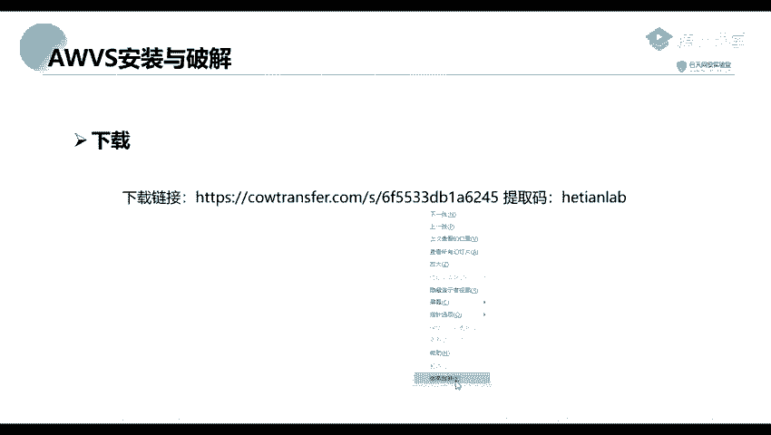
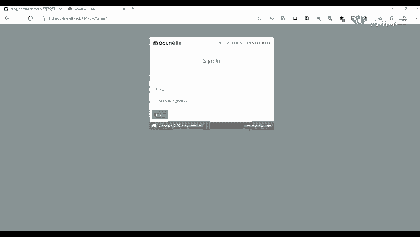
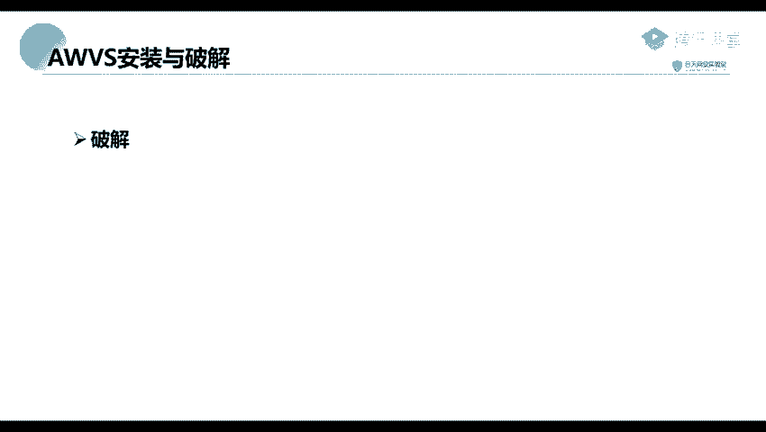

# 网络安全工具教程：P32：AWVS的安装与破解 🛠️

在本节课中，我们将学习如何安装和破解AWVS（Acunetix Web Vulnerability Scanner），这是一款广泛用于Web安全测试的漏洞扫描工具。我们将从下载开始，逐步完成安装、配置以及最终的破解激活过程。

## 下载工具包

首先，需要下载AWVS的安装包和破解工具。下载链接已包含在预习材料中。工具包内主要包含以下文件：
*   **AWVS 12 安装程序**：主安装文件。
*   **破解工具包**：包含用于激活软件的必要文件。

## 安装AWVS

安装过程与安装常规软件（如QQ或微信）类似。以下是关键步骤：

1.  **运行安装程序**：启动下载的AWVS安装包，按照向导提示进行安装。
2.  **设置账户信息**：在安装过程中，需要设置用于登录AWVS的邮箱地址和密码。
3.  **配置访问端口**：设置Web浏览器的访问端口。此端口可自定义，设置后将通过该端口访问AWVS的Web界面。
4.  **设置远程访问**：安装程序会询问是否允许远程机器访问此AWVS实例。若仅需本地使用，可选择不允许，这样AWVS将只能在安装它的计算机上被访问。

## 破解AWVS

上一节我们完成了AWVS的安装，本节中我们来看看如何破解激活它。破解需要使用下载包中提供的两个特定文件。

以下是破解步骤：

1.  **定位安装目录**：AWVS的安装路径是默认的，通常位于 `C:\Program Files (x86)\Acunetix`。
2.  **复制破解文件**：将破解工具包中的 `awvs.exe` 和 `.dll` 文件复制到上一步找到的AWVS安装目录下。
3.  **运行破解程序**：以**管理员身份**运行复制到安装目录下的破解程序（通常是 `awvs.exe`）。
4.  **填写注册信息**：程序运行后，会提示输入姓名、公司名称、电话号码等信息。这些信息可以随意填写。
5.  **完成激活**：填写信息并确认后，破解程序将完成AWVS的激活。

## 总结

本节课中我们一起学习了AWVS漏洞扫描器的完整部署流程。我们首先下载了包含安装程序和破解工具的工具包，然后逐步完成了软件的安装与账户配置，最后通过复制破解文件并运行注册机，成功激活了软件。现在，你可以启动AWVS并开始使用它进行Web安全漏洞扫描了。