# Kali渗透教程：P33：AWVS功能介绍及应用 🛡️

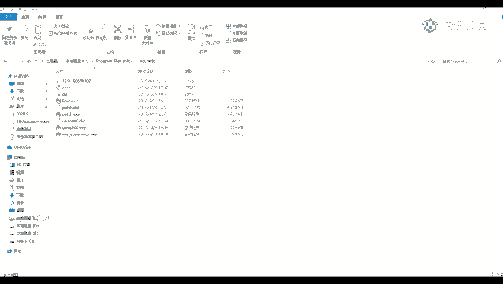

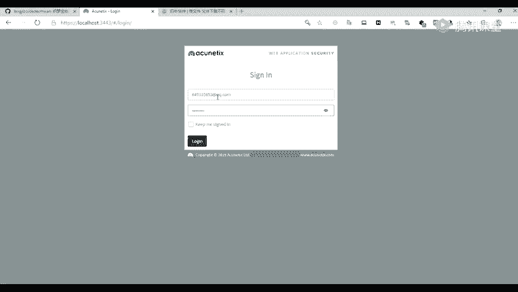

在本节课中，我们将学习AWVS（Acunetix Web Vulnerability Scanner）的核心功能及其在渗透测试中的应用。AWVS是一款强大的自动化Web应用安全扫描工具，能够帮助我们发现网站中的各种安全漏洞。

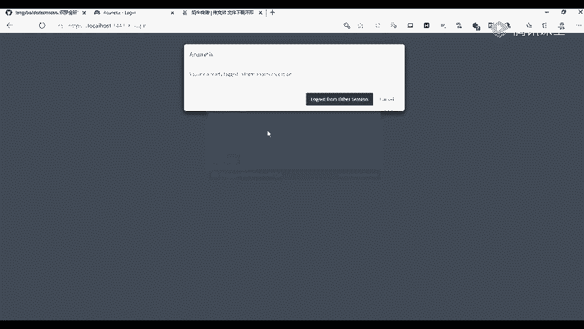

## 概述

AWVS的界面主要分为六个核心功能区，我们将逐一介绍每个区域的功能和操作方法。

## 页面布局与核心功能区

AWVS的界面布局清晰，主要包含以下六个部分：

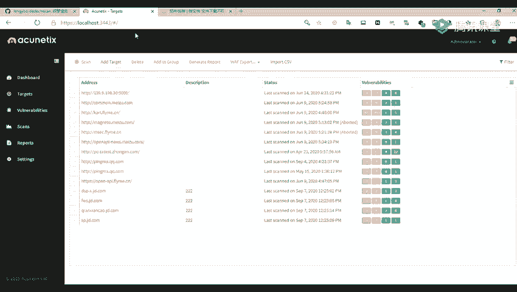

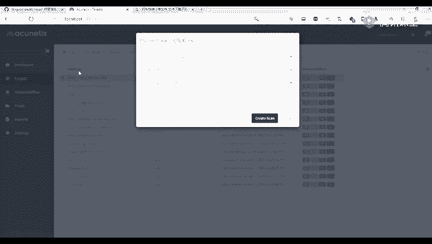

1.  **仪表盘（Dashboard）**：展示扫描概览和统计信息。
2.  **目标（Targets）**：管理待扫描的网站或IP地址。
3.  **漏洞（Vulnerabilities）**：列出扫描发现的所有安全漏洞详情。
4.  **扫描（Scans）**：管理扫描任务，包括新建、启动和停止扫描。
5.  **报告（Reports）**：生成和导出扫描结果报告。
6.  **设置（Settings）**：进行系统及扫描配置。

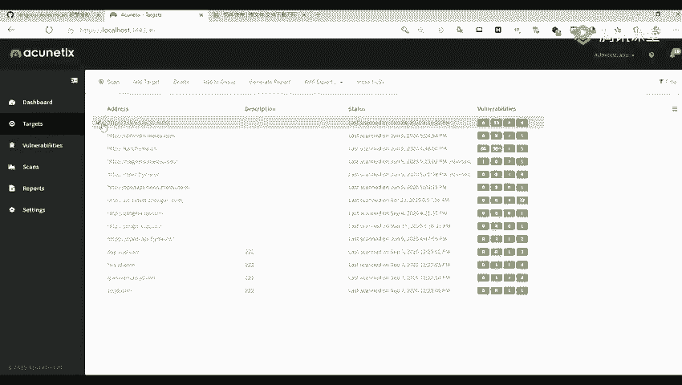

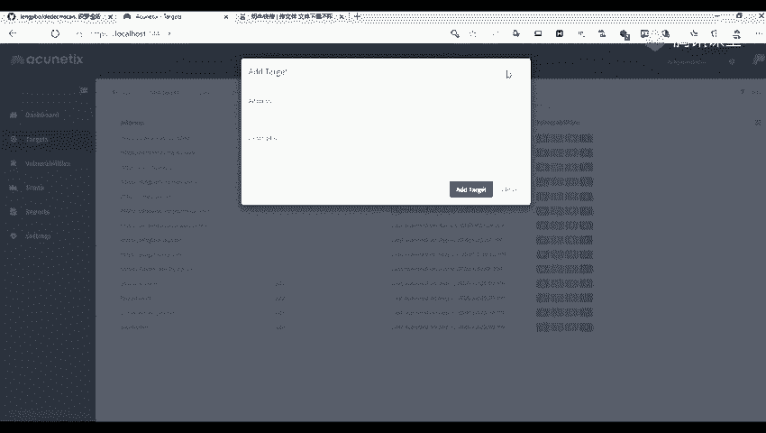

接下来，我们将详细探讨每个功能区的具体应用。

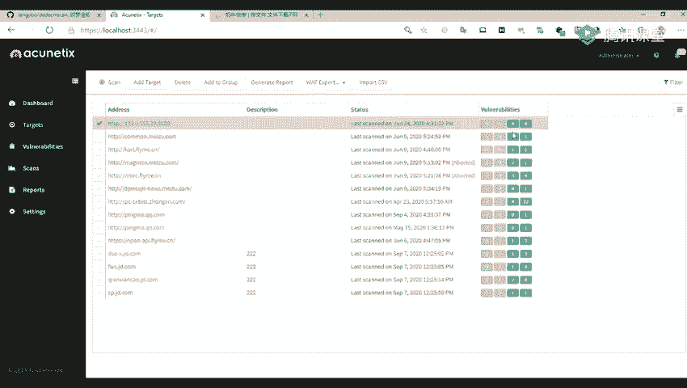

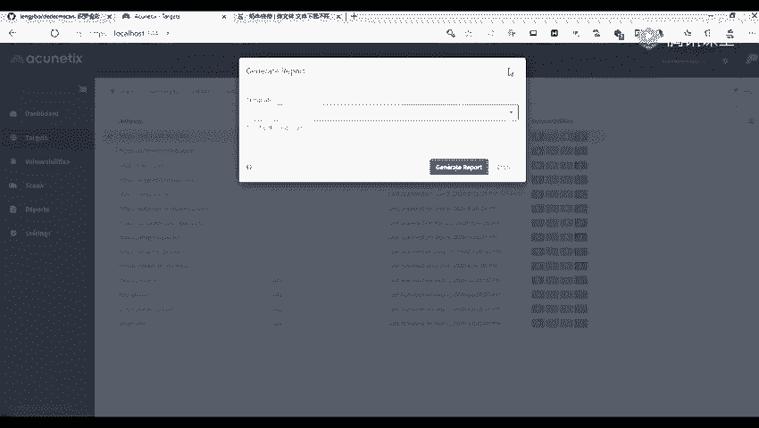

## 仪表盘功能详解

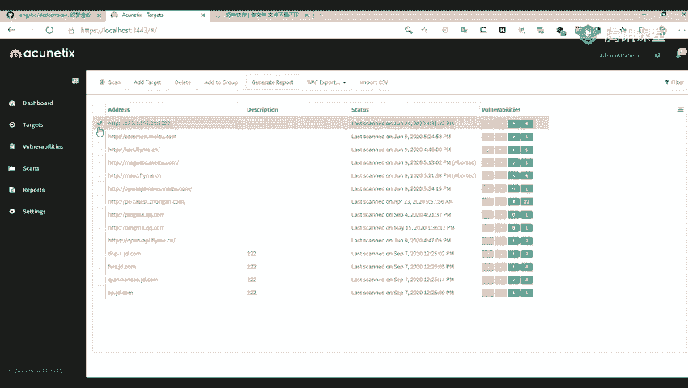

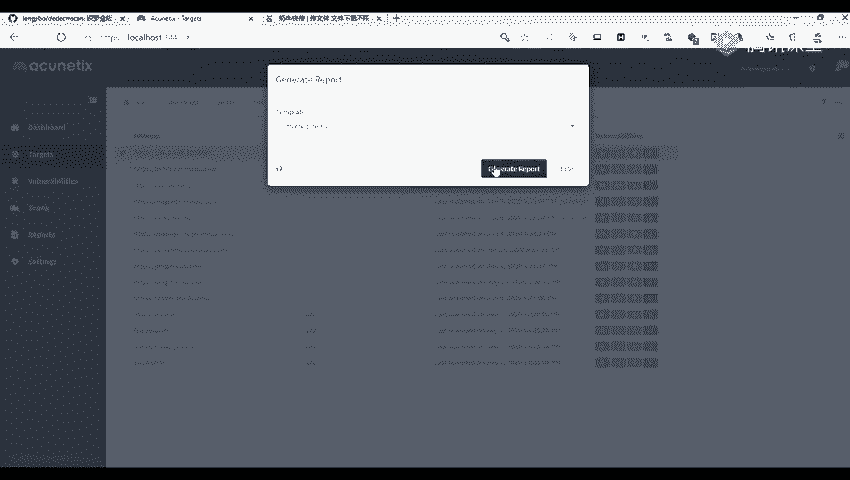

上一节我们介绍了AWVS的整体布局，本节中我们来看看仪表盘的具体信息展示。

仪表盘是登录后的主界面，它直观地展示了扫描结果的统计数据。


*   **顶部区域**：以饼图形式展示漏洞分布。不同颜色代表不同严重等级的漏洞数量。
    *   **粉红色**：代表**高危漏洞**的数量。
    *   **橘黄色**：代表**中危漏洞**的数量。
    *   **浅蓝色**：代表**低危漏洞**的数量。
*   **左下角区域**：列出发现漏洞的**目标站点**及其对应的漏洞数量。例如，`跨点FLYME` 网站扫描出88个高危漏洞和99个中危漏洞。
*   **右下角区域**：按数量降序排列**漏洞类型**。例如，“目录遍历”漏洞有89个，数量最多；“XSS”漏洞有88个，位列第二。

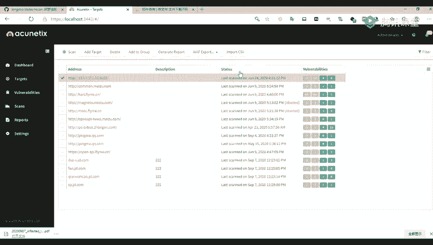

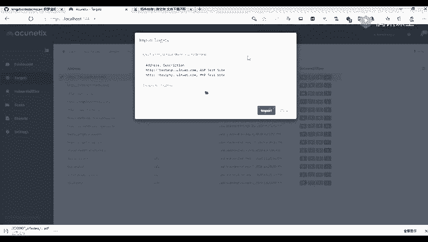

仪表盘上方还显示了扫描任务的**进度条**，方便用户跟踪当前扫描状态。

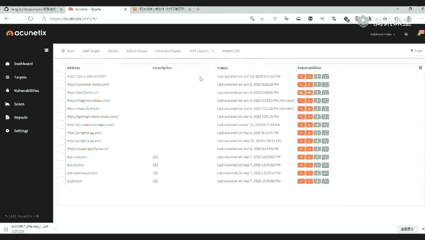

## 目标管理

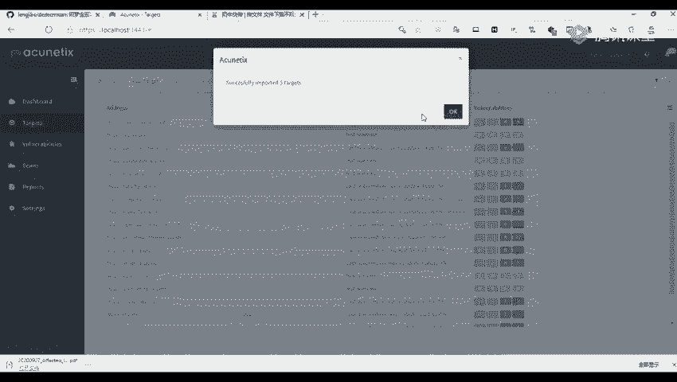

了解了仪表盘的概览功能后，本节我们将深入目标管理模块，学习如何添加和管理扫描目标。

在“Targets”页面，可以查看和管理所有已添加的扫描目标信息。

以下是目标管理的主要操作选项：

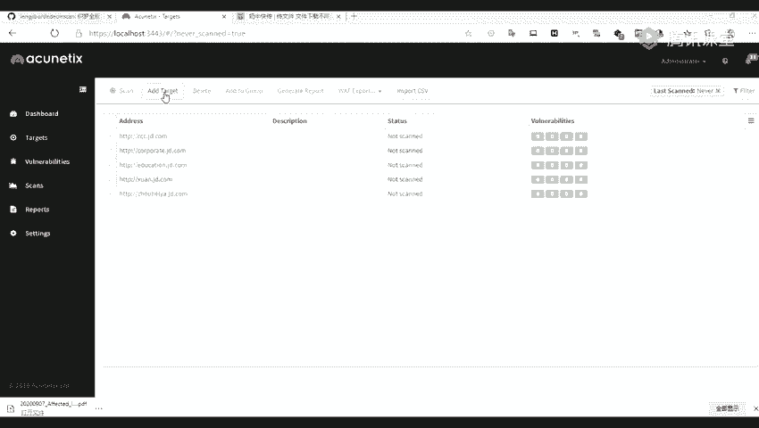

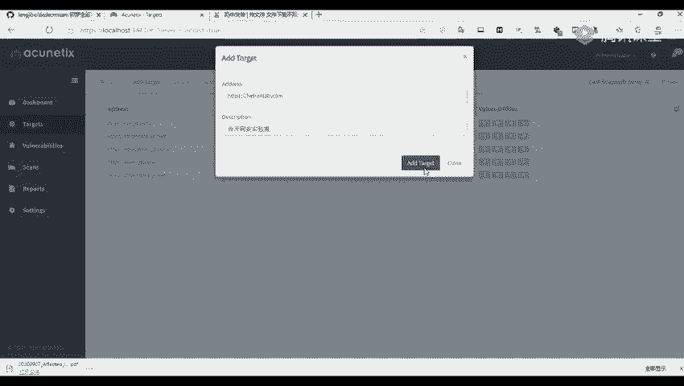

*   **添加目标（Add Target）**：输入要扫描的网站地址（URL）或IP地址。
*   **扫描（Scan）**：对选中的目标启动漏洞扫描。
*   **删除目标（Delete）**：选中一个或多个目标后将其删除。
*   **添加到组（Add to Group）**：将目标归类到自定义的组中，便于管理。例如，可以创建“meizu.com”组，将所有相关子域名归类其中。
*   **导出报告（Export）**：导出选中目标的扫描报告。


点击导出后，可以选择报告格式。报告会保存在“Reports”区域，需要手动下载。报告文件通常以“日期_扫描类型_站点_端口.pdf”的格式命名。

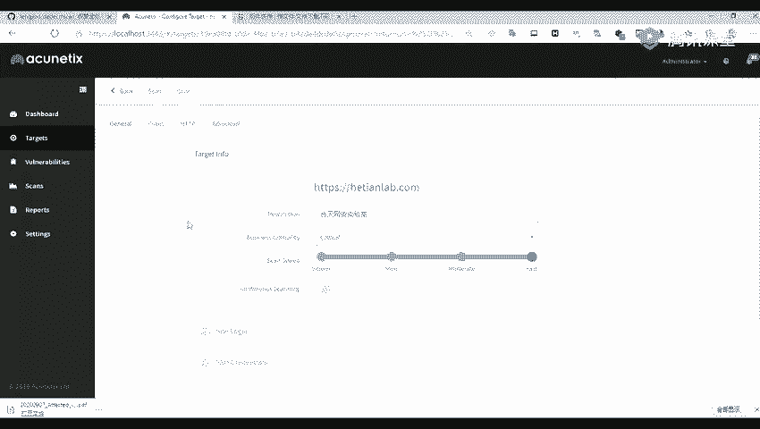


报告内容为英文，包含目标URL、主机信息、各级别漏洞数量统计以及每个漏洞的详细说明和修复建议。

*   **导入CSV（Import CSV）**：批量导入扫描目标。需要准备一个CSV文件，其基本格式为：`地址, 描述`。例如：
    ```csv
    sub1.example.com, 测试子域名1
    192.168.1.1, 内部测试服务器
    ```
    
    导入成功后，目标列表会显示新增的未扫描目标。
*   **过滤器（Filter）**：根据地址、描述、扫描状态等条件筛选目标。例如，可以筛选出“描述中包含‘测试’”的所有目标。

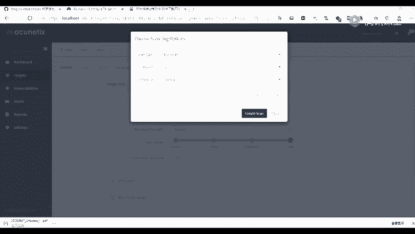

## 新建与配置扫描任务

掌握了目标管理后，下一步就是配置并启动扫描任务。

在“Targets”页面点击“Add Target”可以新建扫描任务。需要填写以下核心信息：

*   **地址（Address）**：要扫描的域名或IP，例如 `http://hetianlab.com`。
*   **描述（Description）**：对此目标的简要说明。
*   **扫描配置**：
    *   **优先级（Priority）**：设置扫描任务的优先级（低、中、高、紧急）。
    *   **扫描速度（Scan Speed）**：平衡扫描速度与深度（慢速更仔细，快速可能遗漏）。
    *   **登录认证（Login）**：如果目标网站需要登录才能访问更多页面，可以在此配置登录信息。


保存目标后，点击“Scan”按钮进入扫描设置页面：


*   **扫描类型（Scan Type）**：
    *   **全面扫描（Full Scan）**：默认选项，执行所有类型的漏洞检测。
    *   **特定漏洞扫描**：如仅扫描XSS、SQL注入等。
    *   **爬虫（Crawl Only）**：仅爬取网站结构，不进行漏洞检测。
*   **报告（Report）**：选择生成报告的类型，如标准报告、合规性报告等。
*   **扫描计划（Schedule）**：
    *   **立即扫描（Now）**。
    *   **定时扫描（Later）**：设置在未来的特定时间执行。
    *   **循环扫描（Recurring）**：按每天、每周等周期重复执行。
    设置完成后，点击“Launch Scan”即可开始扫描。

## 漏洞查看与扫描管理

扫描完成后，我们可以在“Vulnerabilities”页面查看所有发现的漏洞列表。

点击任意一个漏洞，可以查看其详细信息，包括：
*   **漏洞详情**：漏洞的英文描述和原理。
*   **HTTP请求/响应包**：触发漏洞的原始数据包，便于复现和分析。
*   **修复建议**：如何修复该漏洞的指导。

在“Scans”页面，可以管理所有扫描任务：
*   **新建扫描（New Scan）**。
*   **停止扫描（Stop Scan）**。
*   **删除扫描（Delete Scan）**。
*   **导出报告（Export Report）**。
*   **比较结果（Compare Results）**：对比同一目标两次不同时间的扫描结果，生成差异报告，用于验证漏洞修复情况。

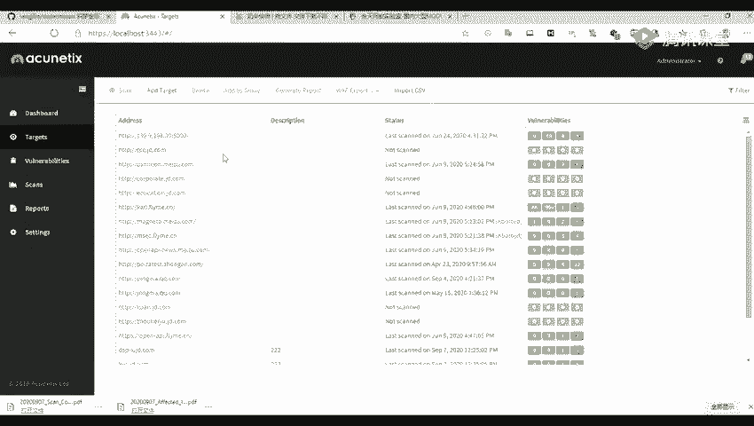

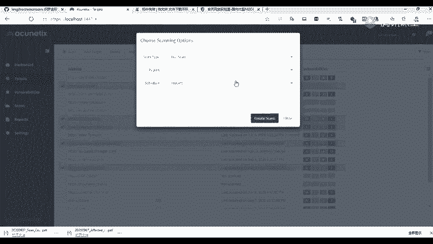

## 使用脚本进行批量扫描

在面对成百上千个子域名需要扫描时，手动操作效率低下。这时，我们可以使用Python脚本实现批量自动化扫描。

脚本的核心原理是模拟用户登录AWVS并通过其API接口批量添加扫描任务。

以下是使用脚本的关键步骤：

1.  **修改脚本配置**：主要修改两处：
    *   `username`：你的AWVS登录邮箱。
    *   `password`：你的AWVS登录密码的**SHA256哈希值**。明文密码需要先经过加密。
        *   获取哈希值的方法：
            *   **方法一（抓包）**：浏览器登录AWVS时抓取登录请求，从请求数据中提取加密后的密码值。
            *   **方法二（在线工具）**：使用在线SHA256加密工具对你的密码进行加密，然后将得到的哈希字符串填入脚本。
            ```python
            # 示例脚本片段
            username = ‘your-email@example.com‘
            password = ‘5e884898da28047151d0e56f8dc6292773603d0d6aabbdd62a11ef721d1542d8‘ # 明文‘password‘的SHA256值
            ```

2.  **准备目标列表**：将需要扫描的URL列表保存为一个文本文件（如 `targets.txt`），每行一个URL，并将其与脚本放在同一目录下。


3.  **配置Python环境**：该脚本通常需要在 **Python 2.7.9** 环境下运行。请确保已安装正确版本，并配置好系统环境变量。

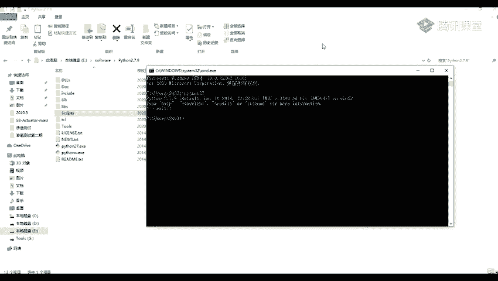

4.  **执行脚本**：
    *   打开命令行（CMD）。
    *   切换到脚本所在目录。
    *   运行命令：`python awvs_batch_scan.py`。
    *   根据提示选择操作（例如，输入`1`并回车来添加并执行扫描任务）。

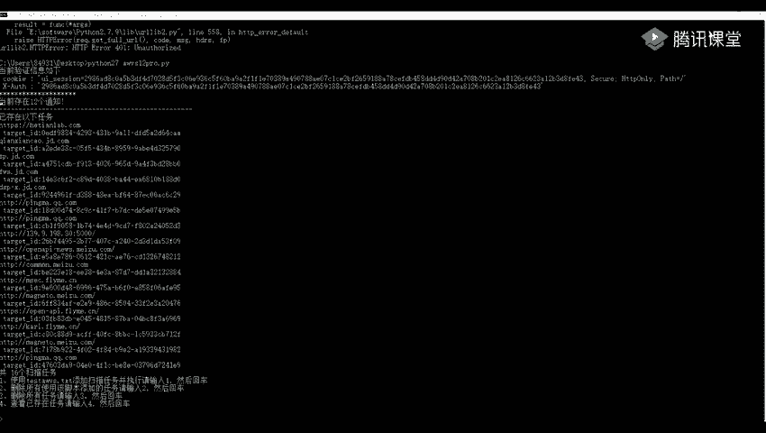

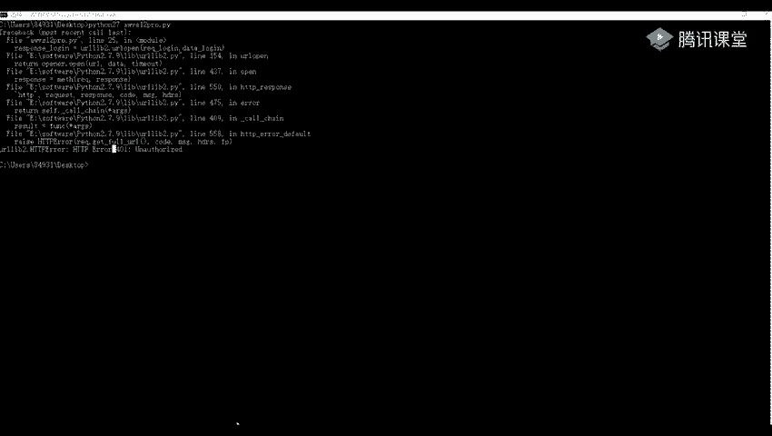

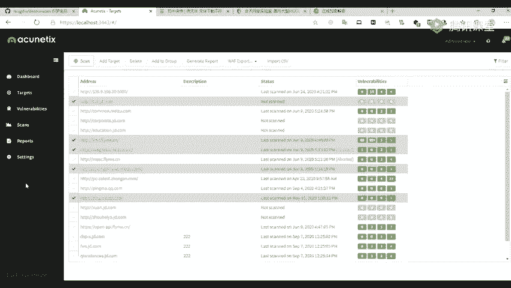

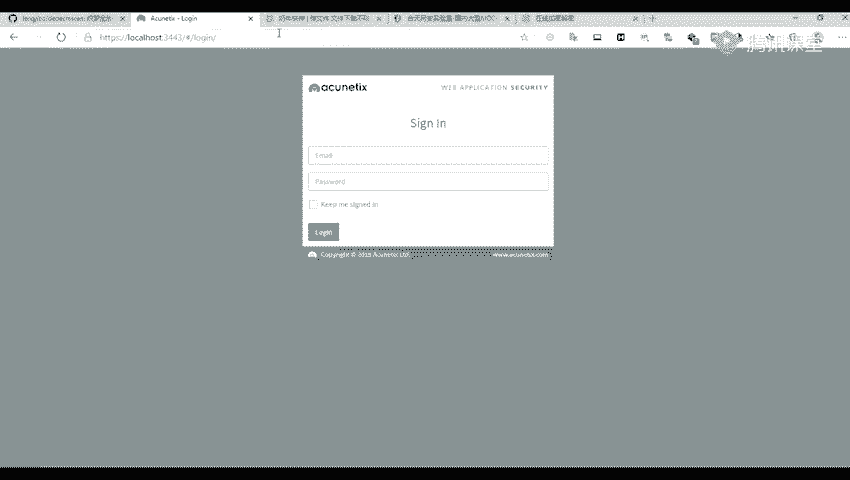

**注意**：AWVS通常只允许一个会话（Session）同时登录。如果脚本运行报错`401`（认证错误），请先退出浏览器中已登录的AWVS页面，再重新运行脚本。


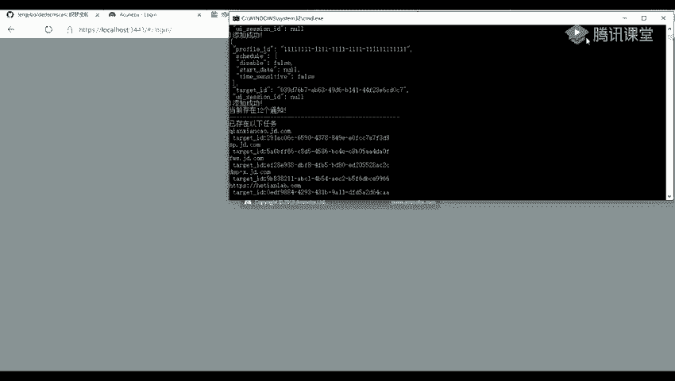

## 产品激活状态检查

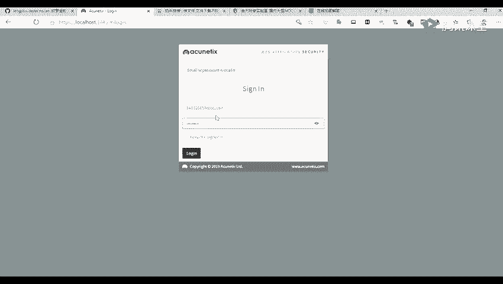

要确认AWVS是否已成功激活，可以点击界面右上角的“Admin”菜单，在“Licensing”部分查看产品许可证的到期时间。

## 总结

本节课中我们一起学习了AWVS扫描工具的核心功能与应用。我们从了解其仪表盘、目标管理、漏洞查看等界面布局开始，逐步掌握了如何添加目标、配置并执行扫描任务、查看漏洞详情以及导出报告。最后，我们还学习了使用Python脚本对大量目标进行批量扫描的自动化方法，这能极大提升在实战渗透测试中的效率。AWVS作为一款强大的自动化辅助工具，是Web安全测试人员不可或缺的利器。