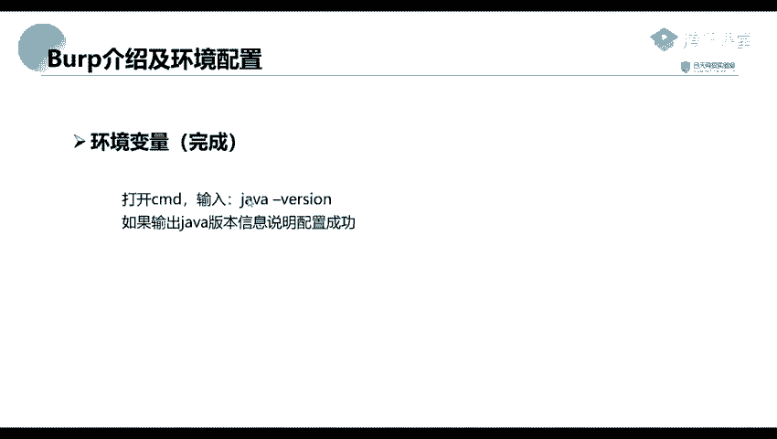

# Kali渗透测试教程：P34：Burp介绍及环境配置 🛠️

在本节课中，我们将要学习渗透测试中一个极其重要的工具——Burp Suite。我们将从它的基本介绍开始，然后详细讲解其专业版的破解方法、代理抓包配置，以及核心模块的功能。本节首先聚焦于Burp Suite的介绍以及运行它所必需的Java环境配置。

## 工具介绍与定位 🎯

上一段我们提到了Burp Suite的重要性，本节中我们来看看它具体是什么。


Burp Suite是一款集成化的渗透测试工具。它集合了多种渗透测试组件，使我们能通过自动化或手工方式更好地完成对Web应用的渗透测试和攻击。


在渗透测试过程中，Burp Suite可以使我们的测试工作变得更容易和方便。只要我们熟悉了这个工具的使用，相关工作就可以变得很轻松以及高效。

由于它是由Java语言编写的，得益于Java语言自身的跨平台性，这款软件的使用可以更加方便。例如，我们可以在Windows系统上使用，也可以在Linux系统下使用，还可以在macOS（苹果系统）上进行使用。

## Java环境配置 ⚙️

正因为Burp Suite是由Java语言编写的，所以我们需要配置Java运行环境。

首先，这个Java环境配置，你们应该在前面的课程中已经学习过了。这里我就简单地过一下。如果有不懂的地方，可以回顾PPT进行操作，或者查看相关的课程回顾。相关的安装资源我也已经放到了网上，你们可以通过提供的链接进行下载。

以下是配置系统环境变量的步骤：

1.  在Windows电脑上，右键点击“此电脑”，选择“属性”。
2.  在属性页面，找到并点击“高级系统设置”。
3.  在弹出的窗口中，点击“环境变量”按钮。
4.  在“系统变量”部分，点击“新建”。
5.  新建一个变量，变量名可以设置为 `JAVA_HOME`，变量值设置为JDK的安装路径（例如 `C:\Program Files\Java\jdk1.8.0_XXX`）。

实际上，在Java JDK 8以后的版本中，安装程序可能会自动为我们配置环境变量。安装完成后，系统可能已经在特定路径（如 `C:\Program Files\Common Files\Oracle\Java`）下自动配置好了。

为了验证环境是否配置成功，我们需要进行测试。

打开CMD命令提示符窗口，输入以下命令：
```bash
java -version
```
如果配置成功，命令行会输出当前安装的Java版本信息。




如果出现类似上图所示的版本信息，就说明我们已经配置成功了。如果没有出现该信息，那么就需要我们进行手动配置。

本节课中我们一起学习了Burp Suite工具的基本定位和重要性，并完成了运行它的先决条件——Java环境的配置与验证。下一节，我们将进入Burp Suite本身的破解与代理设置环节。