# Kali渗透教程：P35：Burp破解及代理抓包 🛠️

在本节课中，我们将学习如何破解Burp Suite专业版，并配置代理以实现对HTTP/HTTPS流量的拦截和抓包。这是进行Web安全测试和渗透测试的基础技能。

## 概述
Burp Suite是一款广泛用于Web应用程序安全测试的集成平台。本节内容分为两部分：首先讲解如何激活Burp Suite专业版，然后详细介绍如何配置代理服务器以拦截和分析网络流量。

---

## Burp Suite专业版破解激活 🔑

上一节我们介绍了Burp Suite的基本情况，本节中我们来看看如何激活其专业版功能。破解过程主要依赖于一个激活程序。

下载的Burp Suite压缩包内通常包含两个关键文件：`burploader.jar`和`burpsuite_pro.jar`。

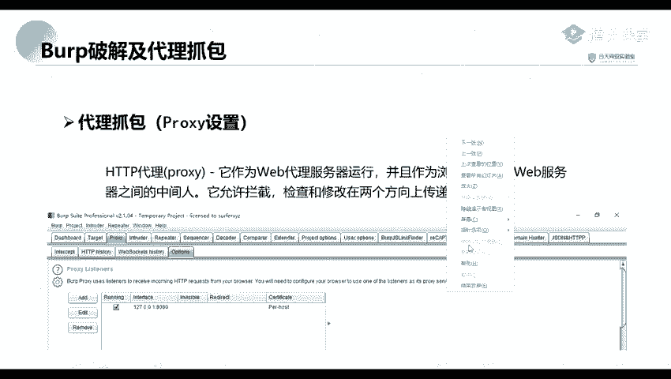

以下是详细的激活步骤：

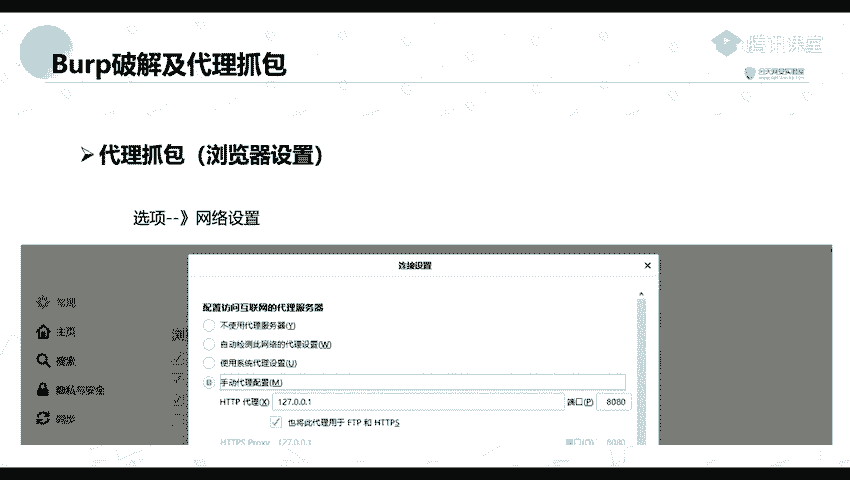

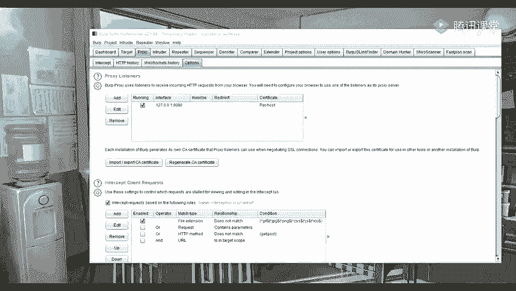

1.  **启动激活程序**：首先，双击运行`burploader.jar`文件。程序会弹出一个窗口。
2.  **运行激活向导**：在弹出的窗口中，点击“Run”按钮。随后会进入Burp Suite的许可证激活界面。
3.  **复制许可证请求**：在激活界面，将激活程序（如`keygen`）生成的`License`字符串复制到Burp Suite的“Enter license key”输入框中。
4.  **手动激活**：点击界面右侧的“Manual activation”按钮（通常是左起第三个按钮），进入手动激活流程。
5.  **复制请求码**：将Burp Suite生成的`Activation Request`代码复制出来。
6.  **生成响应码**：将上一步复制的`Activation Request`代码粘贴到激活程序的`Activation Request`输入框中。激活程序会自动生成对应的`Activation Response`代码。
7.  **完成激活**：将激活程序生成的`Activation Response`代码复制回Burp Suite的`Activation Response`输入框，然后点击“Next”按钮。如果一切正确，将提示激活成功。

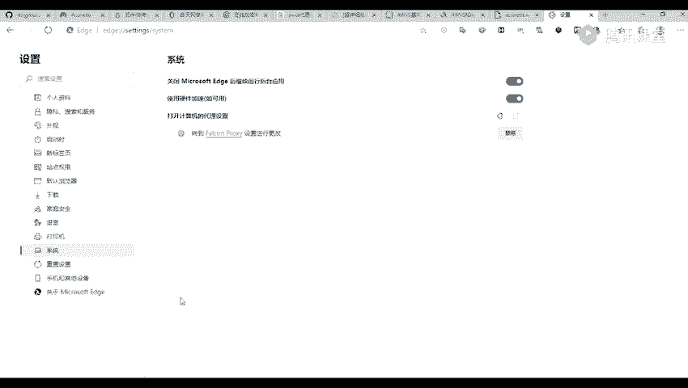

---

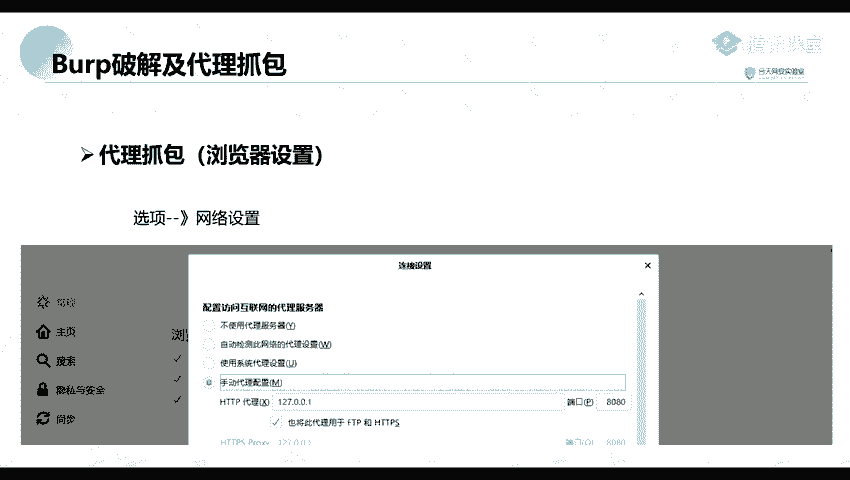

## 配置代理与抓包 🌐

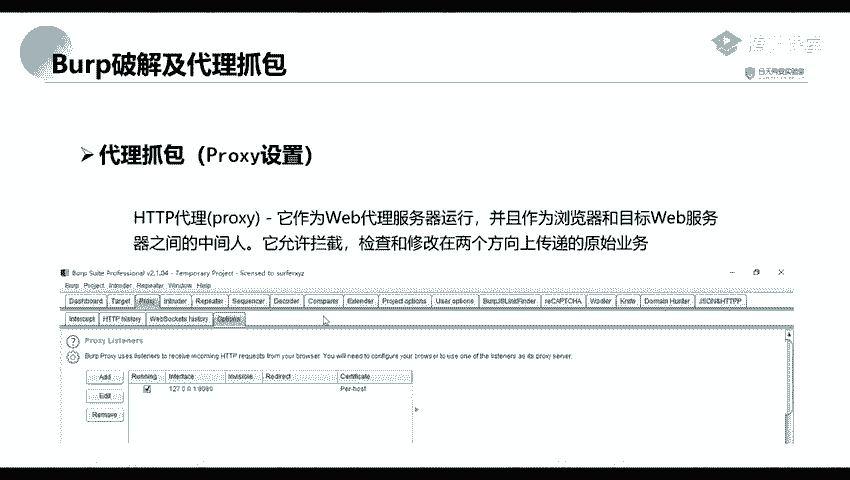

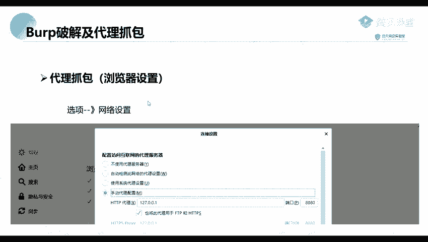

成功激活Burp Suite后，我们就可以使用其核心的代理抓包功能了。Burp Proxy作为中间人，能够拦截和修改客户端与服务器之间的HTTP/HTTPS流量。

### 代理工作原理
Burp Proxy默认在本地（`127.0.0.1`）的`8080`端口运行。要拦截浏览器的流量，必须将浏览器的网络代理设置为这个地址和端口。

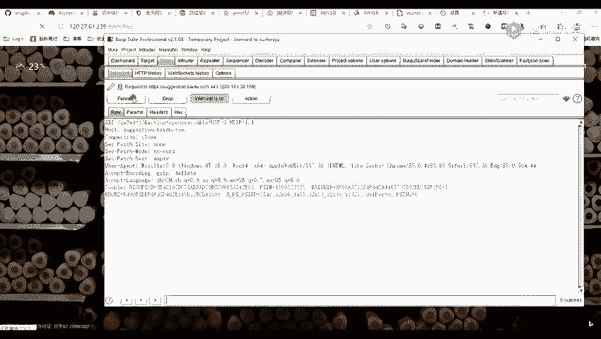

以下是配置浏览器代理的通用方法：

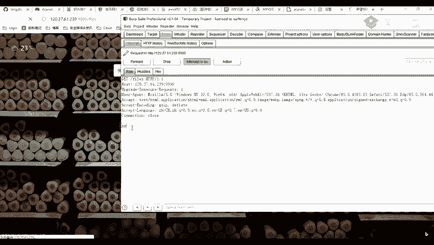

1.  **打开浏览器设置**：进入您所用浏览器（如Chrome, Firefox, Edge）的网络或连接设置。
2.  **配置手动代理**：找到代理服务器设置部分，选择“手动代理配置”。
3.  **填写代理信息**：
    *   **HTTP代理**：`127.0.0.1`
    *   **端口**：`8080`
    *   （可选）勾选“为所有协议使用相同代理”。
4.  **保存设置**：保存并应用更改。

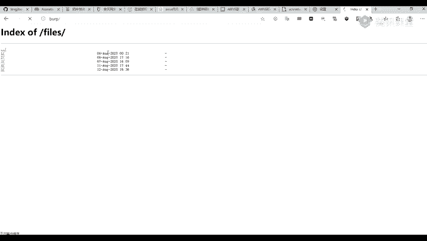

配置完成后，在Burp Suite的 **Proxy -> Intercept** 标签页中，确保 **Intercept is on** 按钮是打开状态。此时，在浏览器中访问任何HTTP网站，请求数据包都会被Burp Suite拦截并显示在界面中，您可以查看或修改它们。

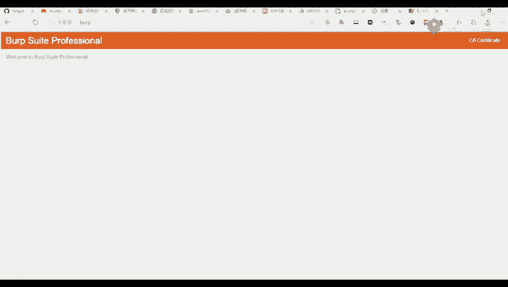

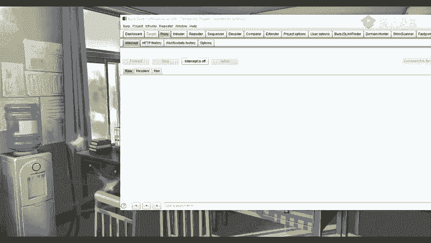

### 拦截HTTPS流量（安装CA证书）
默认情况下，Burp Proxy无法解密HTTPS流量。要拦截HTTPS请求，需要在浏览器中安装Burp Suite生成的CA证书。

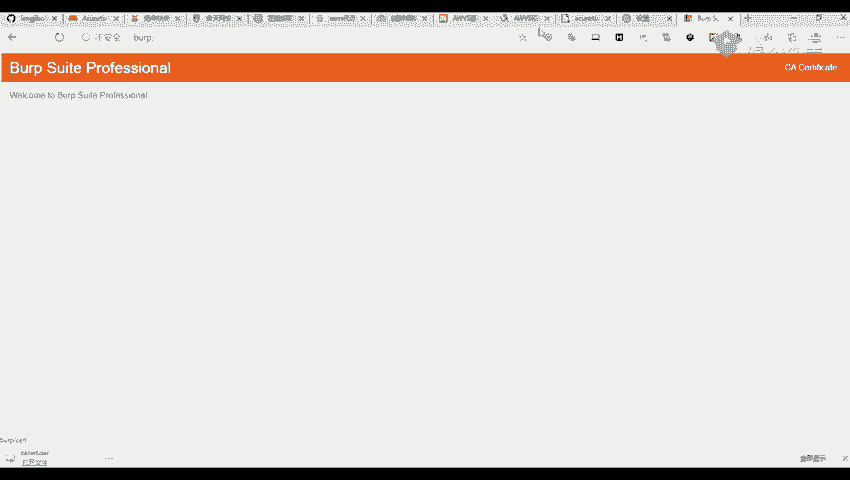

以下是安装证书的步骤：

1.  **下载证书**：确保代理已配置好。在浏览器中访问 `http://burp` 或 `http://127.0.0.1:8080`，点击页面右上角的“CA Certificate”链接，下载证书文件（通常为`cacert.der`）。
2.  **导入证书**：
    *   打开浏览器的证书管理页面（例如在Firefox的“选项”->“隐私与安全”->“证书”->“查看证书”）。
    *   选择“证书颁发机构”标签页。
    *   点击“导入”按钮，选择刚才下载的证书文件，并按照提示完成导入，信任该证书。
3.  **重启浏览器**：关闭并重新打开浏览器，使证书生效。

完成以上步骤后，即可对HTTPS站点的流量进行拦截和抓包。

### 使用浏览器插件简化代理切换
为了方便地在正常模式和代理抓包模式间切换，可以安装浏览器代理管理插件，例如“SwitchyOmega”。

以下是配置此类插件的简要步骤：

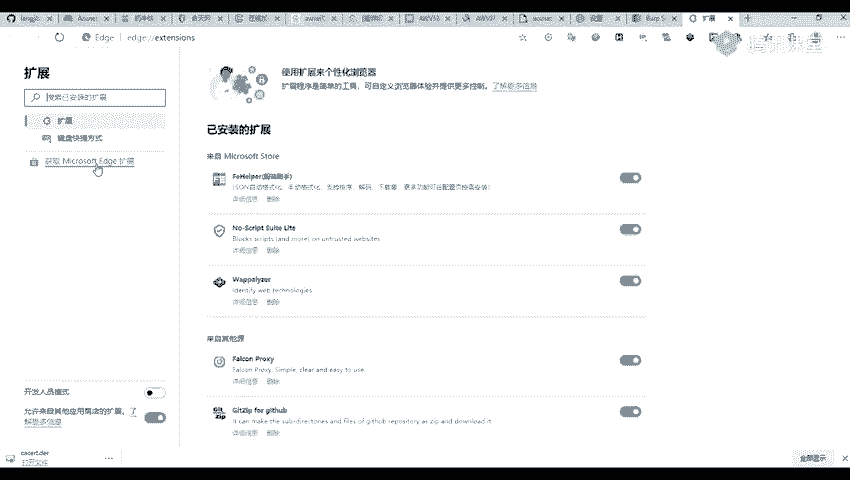

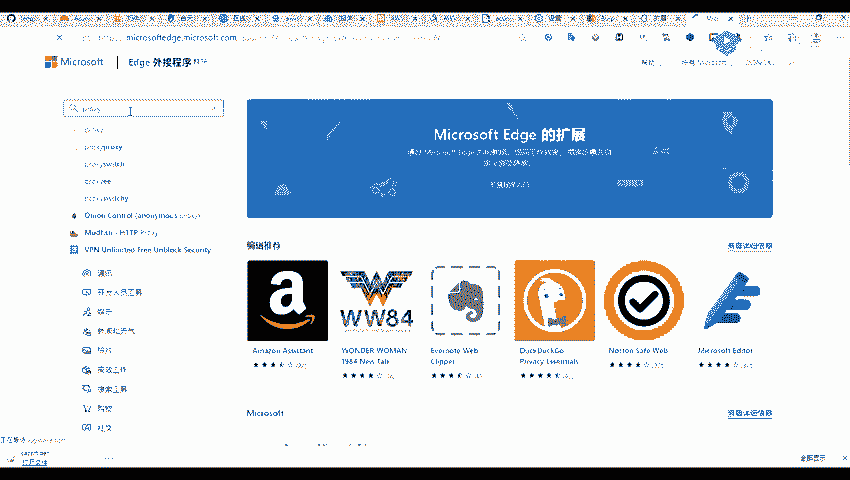

1.  **安装插件**：在浏览器的扩展商店中搜索并安装代理管理插件（如 `SwitchyOmega`）。
2.  **新建情景模式**：在插件设置中，创建一个新的代理情景模式。
3.  **配置代理服务器**：在该模式的设置中，填入代理协议（通常为HTTP）、地址（`127.0.0.1`）和端口（`8080`）。
4.  **快速切换**：配置完成后，可以通过点击浏览器工具栏上的插件图标，快速切换是否使用Burp Suite代理。

---

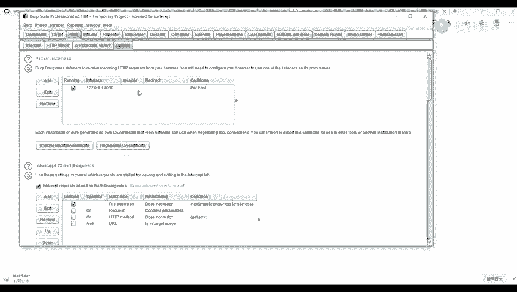

## 总结
本节课中我们一起学习了两个核心技能：首先，我们逐步完成了Burp Suite专业版的激活；其次，我们详细讲解了如何配置浏览器代理、安装CA证书以拦截HTTP/HTTPS流量，并介绍了使用插件简化代理管理的方法。掌握这些是进行后续Web漏洞测试和分析的基础。