# Kali渗透测试：P36：Burp Suite模块介绍及应用 🛠️

在本节课中，我们将学习Burp Suite的核心模块及其基本应用。Burp Suite是渗透测试中不可或缺的工具，理解其各个模块的功能是进行Web安全测试的基础。我们将重点介绍最常用的几个模块，并通过实例演示其操作。

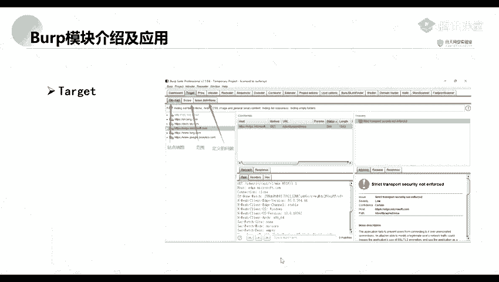

## 仪表盘模块 📊

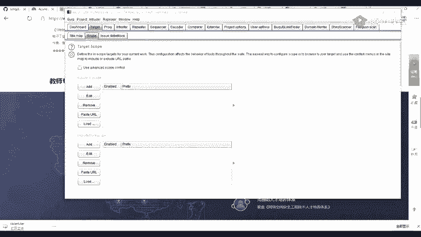

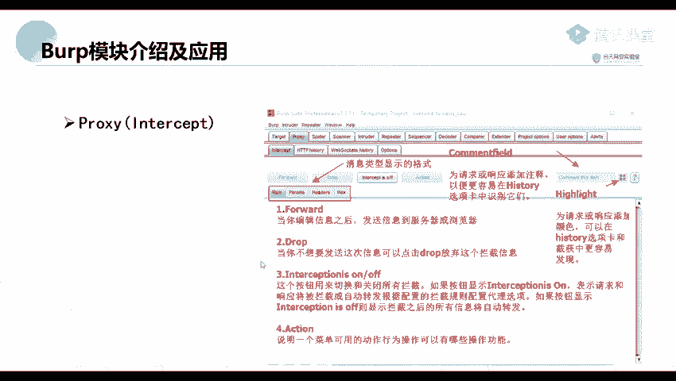

上一节我们介绍了课程概述，本节中我们来看看Burp Suite的仪表盘模块。仪表盘是Burp Suite的主界面，它集成了多个功能窗口。

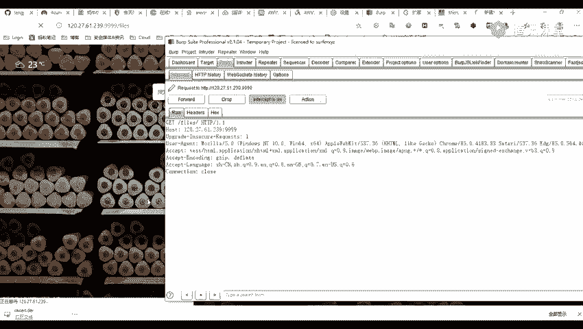

以下是仪表盘包含的主要界面：

*   **爬虫设置**：此功能会对流经Burp Suite的所有流量进行爬取，以发现目标站点的目录和文件结构。
*   **被动扫描**：此功能会对经过的流量进行自动安全审计，尝试发现潜在的安全漏洞。
*   **日志界面**：此界面显示Burp Suite启动、代理设置、站点访问等操作的日志信息。
*   **问题活动界面**：此界面可理解为漏洞展示界面，被动扫描所发现的安全问题会在此处集中显示。界面中会提供漏洞描述、相关的HTTP请求包和响应包详情。

## 目标模块 🎯

了解了仪表盘的整体布局后，我们接下来关注目标模块。目标模块主要用于定义和管理测试范围。

以下是目标模块的几个关键选项：

*   **站点地图**：此处展示通过爬虫功能获取到的目标站点目录结构。
*   **范围**：此处用于定义爬虫爬取和测试的目标范围，可以精确控制测试的域名或IP地址。
*   **已定义的问题**：此处分类列出了已发现的各种漏洞及其详细描述。

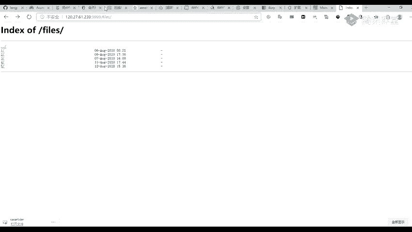

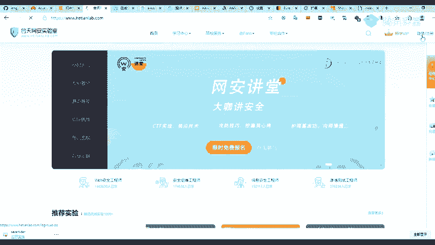

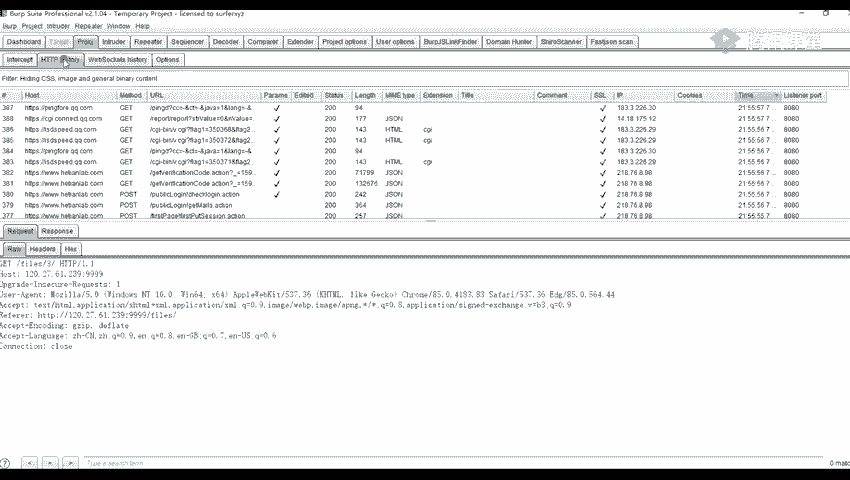

## 代理模块 🔄

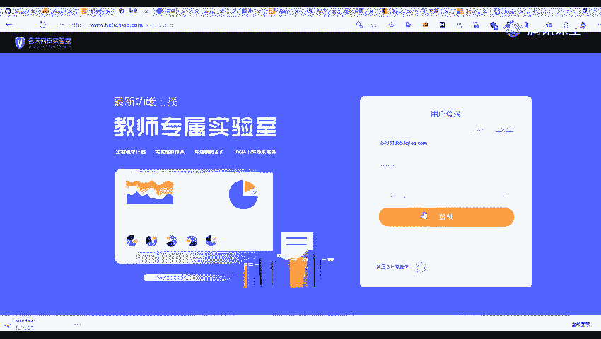

目标模块帮助我们框定了测试范围，而代理模块则是我们与目标应用交互的核心。代理模块用于拦截、查看和修改浏览器与服务器之间的HTTP/HTTPS流量。

以下是代理模块的几个核心功能：

*   **拦截开关**：此按钮用于控制是否拦截经过代理的流量。开启时，流量会被暂停以供查看和修改；关闭时，流量直接通过。
*   **拦截到数据包后的操作**：
    *   **Forward（放行）**：将当前拦截的数据包发送出去。
    *   **Drop（丢弃）**：丢弃当前拦截的数据包，客户端将收不到响应。
*   **HTTP历史记录**：即使拦截功能关闭，所有流经代理的请求和响应都会被记录在此。此面板显示请求的详细信息，例如：
    *   目标服务器和端口
    *   HTTP方法（GET/POST等）
    *   请求的URL及参数
    *   响应状态码（如200， 404）
    *   响应包长度和MIME类型（如HTML， JSON）
*   **WebSockets历史记录**：此功能专门用于记录WebSocket通信的数据包。WebSocket是HTML5提供的全双工通信协议，能有效减少不必要的网络流量和延迟。

## 入侵者模块 ⚔️

代理模块帮助我们捕获了数据包，入侵者模块则能对这些数据包进行自动化攻击测试。该模块主要用于对Web应用程序进行自定义的攻击，例如暴力破解用户名密码、模糊测试等。

我们可以将代理模块中捕获到的数据包，通过右键菜单发送到入侵者模块。

**攻击类型设置**：
入侵者模块的核心是配置攻击类型和载荷。在`Attack type`中，有以下四种模式：

1.  **Sniper（狙击手模式）**：对**单个变量**依次使用载荷字典进行测试。如果有多个标记变量，则**依次**对每个变量进行测试。
2.  **Battering ram（攻城锤模式）**：对**所有标记变量**同时使用**同一个**载荷字典进行测试。
3.  **Pitchfork（叉子模式）**：为**每个标记变量**配置一个独立的载荷字典，然后**并行**进行测试，取各字典的**对应项**进行组合。测试次数取决于**最短**的字典长度。
    *   公式：`请求次数 = min(字典1长度， 字典2长度， ...)`
4.  **Cluster bomb（集束炸弹模式）**：为**每个标记变量**配置一个独立的载荷字典，然后进行**笛卡尔积**组合测试，尝试所有可能的组合。
    *   公式：`请求次数 = 字典1长度 × 字典2长度 × ...`

**载荷设置**：
在`Payloads`选项卡中，可以添加、编辑用于测试的字典列表。例如，在暴力破解时，此处添加用户名或密码的字典。

## 重放器模块 ↩️

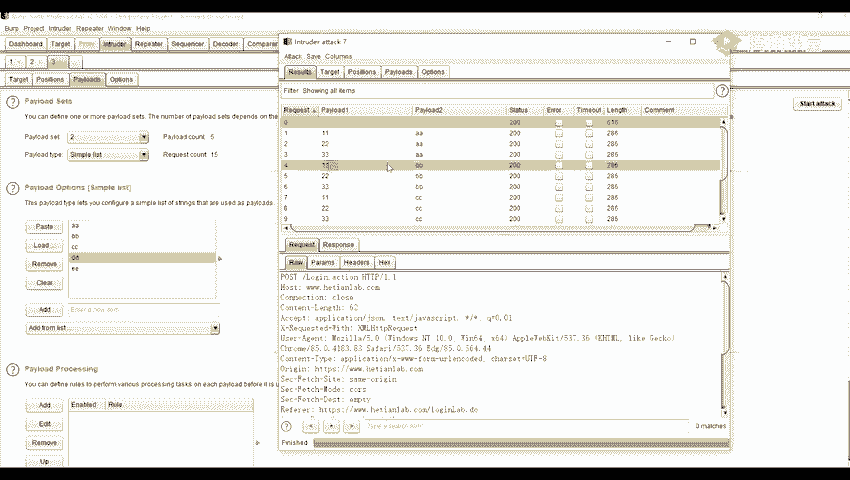

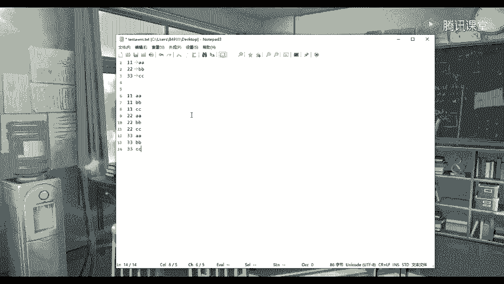

入侵者模块用于自动化测试，而重放器模块则用于手动测试和调试。该模块允许我们手动修改单个HTTP请求，并观察服务器的响应。

我们可以从代理历史、目标站点地图或其他模块，通过右键菜单或快捷键`Ctrl+R`将请求包发送到重放器。

在重放器界面中：
*   左侧是请求编辑区，可以修改任何参数（如将`username=admin`改为`username=test`）。
*   右侧是响应显示区，展示服务器返回的结果。
*   点击`Send`按钮发送修改后的请求。
*   使用箭头按钮可以在多次修改的历史记录间切换。

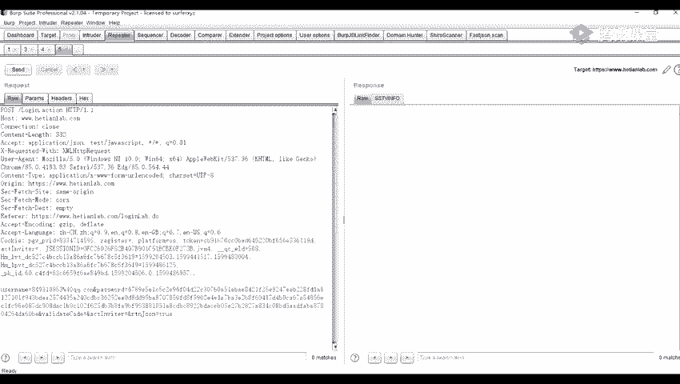

本节课中我们一起学习了Burp Suite的五大核心模块：仪表盘、目标、代理、入侵者和重放器。掌握这些模块是进行Web渗透测试的第一步，后续的复杂测试都建立在这些基础操作之上。