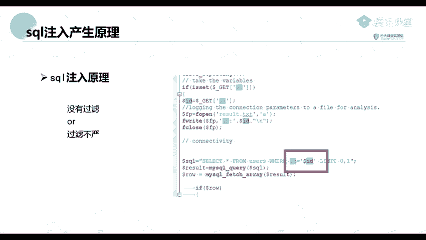
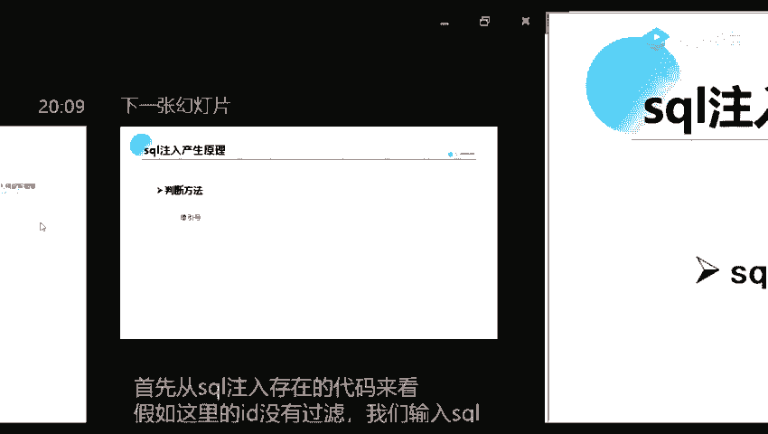
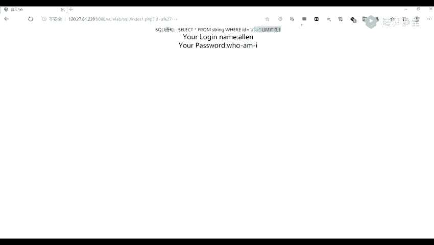

# Kali渗透教程：P37：SQL注入产生原理

在本节课中，我们将要学习SQL注入漏洞的基本原理。这是理解后续渗透测试工具使用的基础。我们将从概念入手，结合简单的代码示例，解释SQL注入是如何产生的，以及如何初步判断一个网站是否存在此类漏洞。

## SQL注入漏洞简介

SQL注入漏洞是一种历史悠久且至今仍广泛存在的Web安全漏洞。它首次引起广泛关注是在1998年圣诞节期间的一场大规模网络攻击中。其核心原理是攻击者能够将恶意的SQL代码“注入”到应用程序原本用于查询数据库的语句中。





具体来说，当Web应用程序将用户输入的数据（如表单提交、URL参数）未经充分验证或过滤，就直接拼接到SQL查询语句中并发送给数据库服务器执行时，就可能产生SQL注入漏洞。这意味着，攻击者可以通过精心构造的输入，让数据库执行非预期的操作，例如绕过登录验证、窃取、篡改或删除数据。

## 从代码层面理解注入原理

上一节我们介绍了SQL注入的基本概念，本节中我们来看看它在代码层面是如何发生的。漏洞产生的根本原因是程序对用户输入**没有过滤**或**过滤不严**，导致用户输入被直接当作SQL代码的一部分执行。

以下是一个存在漏洞的PHP代码示例：

```php
$id = $_GET['id'];
$sql = "SELECT * FROM users WHERE id = $id";
```

从这段代码中可以看到，程序通过 `$_GET['id']` 直接获取URL中的 `id` 参数值，并将其拼接到SQL查询语句中。这里对 `$id` 变量**没有进行任何安全检查或过滤**。因此，如果用户传入的 `id` 参数不是简单的数字，而是一段SQL代码，它就会被数据库执行。

## 如何判断SQL注入漏洞

理解了原理后，我们来看看如何初步判断一个网站是否存在SQL注入点。最常用和简单的方法是使用**单引号（`'`）**进行测试。

其原理在于，单引号在SQL语句中用于表示字符串的开始和结束。通过插入单引号，我们可以尝试“破坏”原有的SQL语句结构，观察应用程序的响应是否出现异常（如报错、页面内容变化），从而判断是否存在注入点。

以下是判断步骤的示例：

1.  **正常访问**：假设访问一个用户详情页的URL为 `http://example.com/user.php?id=1`。页面正常显示ID为1的用户信息。对应的SQL语句可能为：
    ```sql
    SELECT * FROM users WHERE id = 1
    ```

2.  **插入单引号测试**：将URL修改为 `http://example.com/user.php?id=1'`。此时，拼接出的SQL语句变为：
    ```sql
    SELECT * FROM users WHERE id = 1'
    ```
    由于多了一个未闭合的单引号，SQL语法错误，数据库可能会执行失败，导致页面报错、返回空白页或与正常页面不同的内容。

3.  **尝试闭合与注释**：如果上一步发现异常，可以进一步测试。例如，访问 `http://example.com/user.php?id=1' -- `（`--` 是SQL中的注释符，会注释掉它之后的所有内容）。此时SQL语句为：
    ```sql
    SELECT * FROM users WHERE id = 1' -- 
    ```
    单引号被我们输入的单引号闭合，后面的内容（无论是原SQL语句中可能存在的其他单引号还是条件）都被注释掉。如果页面恢复正常，这强烈暗示存在SQL注入漏洞。

**数字型与字符型注入的区别**：
*   **数字型注入**：参数值直接被当作数字使用，SQL语句中**没有单引号**包裹。例如 `WHERE id = $input`。
*   **字符型注入**：参数值被当作字符串，SQL语句中**有单引号**包裹。例如 `WHERE username = '$input'`。
    测试字符型注入时，我们需要闭合前面的单引号，并处理后面的单引号（通常用注释符`--`或`#`注释掉）。

## 总结



本节课中我们一起学习了SQL注入漏洞的核心知识。我们首先了解了SQL注入是一种由于程序将用户输入直接拼接至SQL语句中执行而导致的漏洞。然后，我们通过简单的代码示例，直观地看到了漏洞产生的代码层面的原因。最后，我们掌握了最基础的漏洞判断方法——使用单引号进行测试，并理解了数字型与字符型注入在测试时的细微差别。这是后续学习利用SQL注入漏洞进行渗透测试的重要基础。