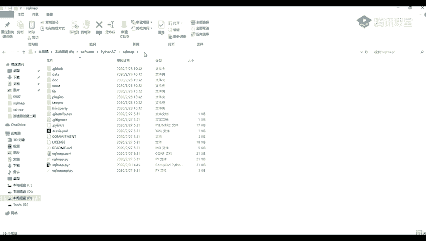
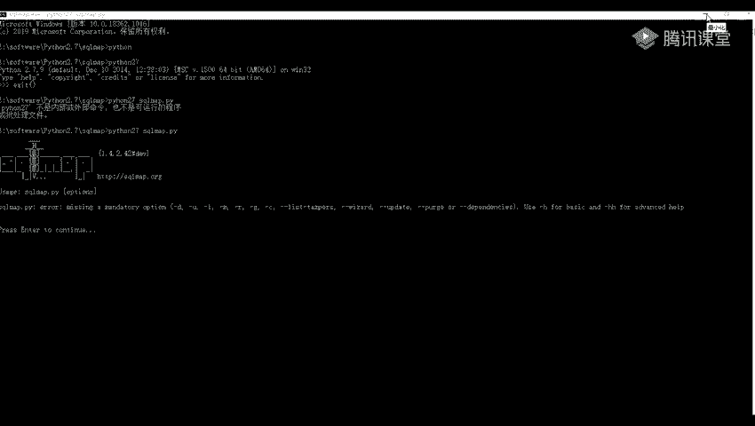
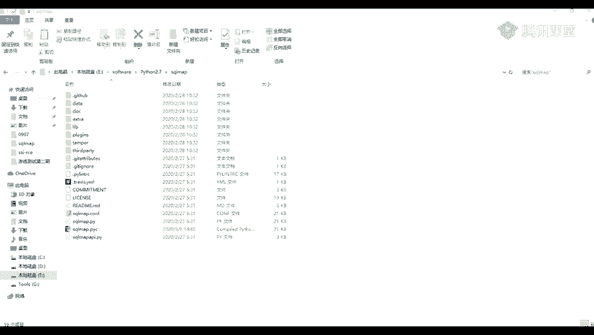
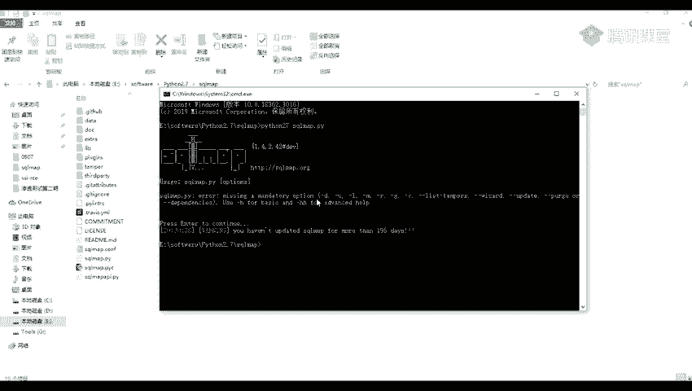
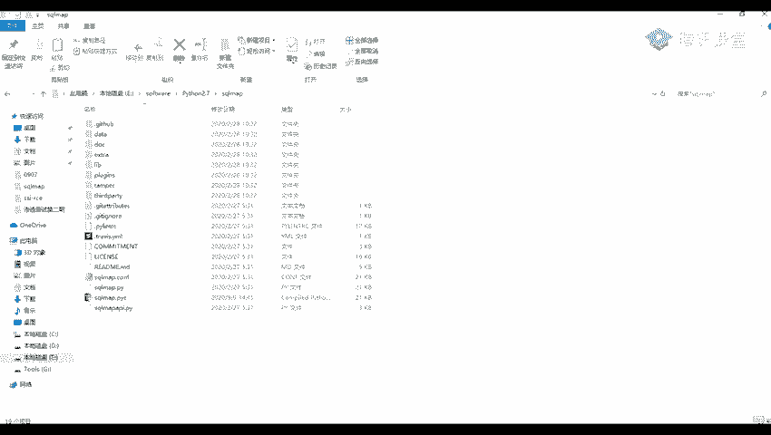

# 网络安全系统教学合集：P38：sqlmap介绍与安装 🔧

在本节课中，我们将要学习一个强大的渗透测试工具——sqlmap。我们将了解它的定义、功能，并学习如何在你的系统上安装和配置它，以便后续进行SQL注入漏洞的检测。

## 什么是sqlmap？

上一节我们介绍了SQL注入的基本概念，本节中我们来看看自动化检测这类漏洞的利器。sqlmap是一个开源的渗透测试工具，它可以用来进行自动化的检测，利用SQL注入漏洞获取数据库服务器的权限。也就是说，通过我们之前演示的SQL注入漏洞，来获取数据库服务器的权限。

## 环境与安装准备

sqlmap是使用Python语言编写的，所以如果要使用它，我们需要安装一个Python环境。Python环境在前面的课程中已经安装，这里就不做演示了。

以下是获取sqlmap的两种主要方式：

1.  **官方网站**：这是它的一个官方网站。我之前在预习内容里也给大家写了这个，你们可以将这个下载，下载这个压缩包，然后进行解压就可以进行使用了。并不用说像其他的那些要激活或者什么。
2.  **GitHub仓库**：另外一个就是它的一个GitHub仓库。这里也有一些它的安装方法，以及它的使用方法。还有在这里也标注了它运行所需的版本。

我也在我的网盘里面给大家放了一个链接，你们也可以在我这里下载。下载了之后，解压出来是这样的一个文件夹。解压了之后是它的一个sqlmap目录。后面我们可以看到它这里带的一个运行的脚本，实际上是使用这个 `sqlmap.py` 文件，我们就运行这个文件。

## 创建快捷方式

但是，我们要是说每一次都需要进入到文件目录里面来的话，是不是有一点点麻烦？那么我们就可以为它创建一个快捷方式。



以下是创建桌面快捷方式的步骤：

1.  在桌面空白处点击右键，选择“新建”，然后选择“快捷方式”。
2.  创建快捷方式时，需要我们去填写一个对象的位置。我们这里是为我们的一个CMD窗口创建一个快捷方式。
3.  所以，我们就是右键创建一个快捷方式，然后为这个填入一个`cmd.exe`的路径（例如 `C:\Windows\System32\cmd.exe`）。
4.  点击“下一步”，你可以随便命名，比如“sqlmap”。
5.  点击“完成”后，我们在桌面上右键点击这个新建的快捷方式，选择“属性”。
6.  在属性窗口的“起始位置”一栏，将我们的sqlmap文件夹的路径填写上去。
7.  点击“应用”就可以了。

应用之后，我们可以在桌面双击它来使用。双击它，这里会直接进入到我们设置的sqlmap路径。然后我们输入`python`命令来运行它。

**注意**：输入`python`还是`python3`（或`python2`），要看你的系统环境。比如我这里是一个多版本共存的，所以我将我的命令改为`python2`。这里输入`python2`，在这里就会出现我的Python版本信息。

## 运行sqlmap



现在，我们去执行`python2`，然后再执行我们的`sqlmap.py`这个文件。命令如下：
```bash
python2 sqlmap.py --version
```
运行后，我们就可以看到它给我们显示的版本信息。这说明sqlmap已经成功运行。

关于环境变量，如果配置好了Python的环境变量，你也可以在任何目录直接运行`python sqlmap.py`。我们也可以直接进入到它的目录里面，打开一个CMD，然后去运行它。





## 总结



本节课中，我们一起学习了渗透测试工具sqlmap。我们了解了它是一个用于自动化检测和利用SQL注入漏洞的Python工具。接着，我们学习了如何从其官网或GitHub获取它，并通过解压完成安装。最后，为了使用方便，我们讲解了如何为sqlmap创建一个桌面快捷方式，并验证了其基本运行。现在，你的sqlmap已经准备就绪，在接下来的课程中我们将学习如何使用它进行实战测试。