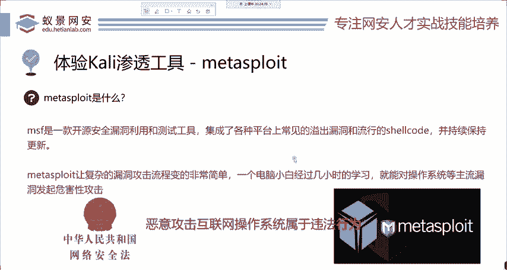
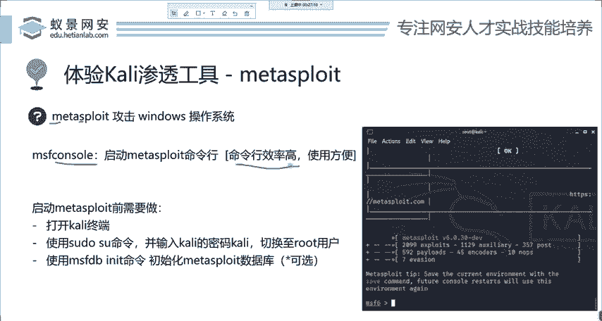
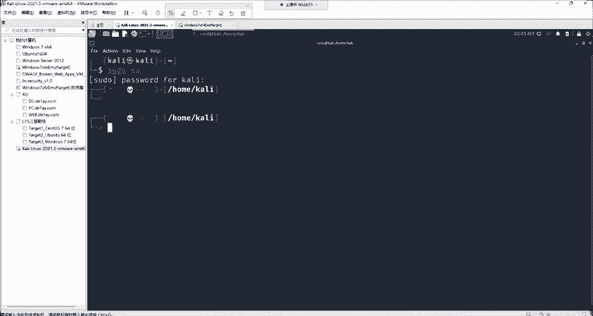
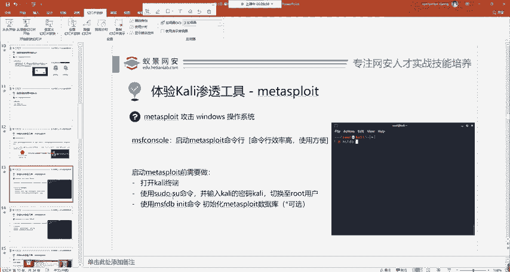
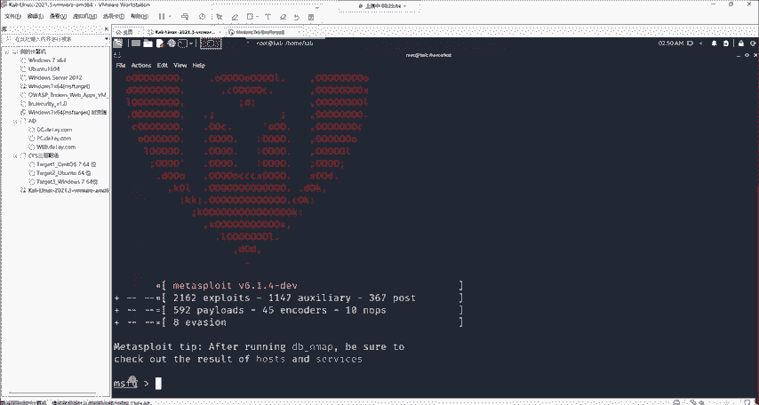
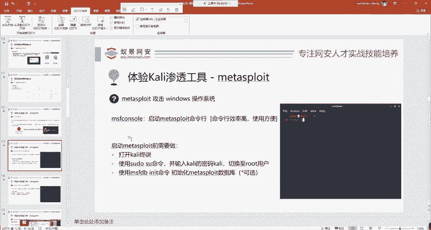
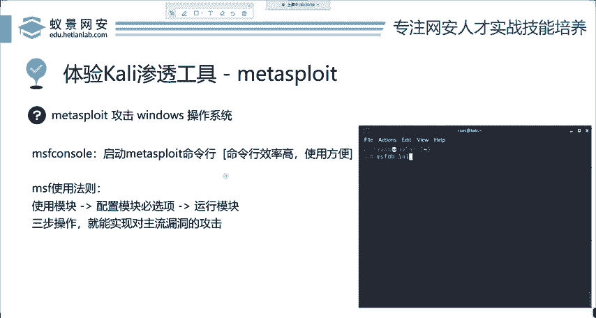

# Kali渗透教程：P3：Metasploit渗透工具的基本使用 🛠️

在本节课中，我们将要学习网络安全领域中最为强大和常用的渗透测试工具之一——Metasploit。我们将从了解其重要性开始，逐步学习如何启动它，并掌握其核心的使用法则。通过本教程，即使是初学者也能理解并开始使用这个工具进行基础的漏洞利用实践。

## 概述：什么是Metasploit？

Metasploit是在渗透测试和实际安全工作中最为常用的工具之一。它被国外媒体评为世界前三的黑客工具。Metasploit之所以强大，是因为它集成了针对各种主流操作系统（如Windows、Linux、macOS、Android）的常见漏洞攻击脚本。它的存在让复杂的漏洞攻击过程变得简单化，使得经过短期学习的人员也能对主流系统进行测试性攻击。



> **核心概念**：Metasploit Framework (MSF) 是一个开源的渗透测试框架，它提供了一系列工具和库，用于开发、测试和执行漏洞利用代码。

## 启动Metasploit

上一节我们介绍了Metasploit的基本概念，本节中我们来看看如何启动它。Metasploit没有图形化界面，完全依赖于命令行操作，因为命令行的效率更高。

以下是启动Metasploit的三个步骤：

1.  **打开终端**：在Kali Linux中，点击菜单栏的终端图标（通常是一个命令行窗口的符号）来打开命令行界面。如果界面文字太小，可以按住 `Ctrl` + `Shift` + `+` 键来放大字体。
2.  **切换为root用户**：在终端中输入命令 `sudo su`，然后输入Kali的默认密码（通常是 `kali`）来切换到具有最高权限的root用户。切换成功后，命令提示符会从 `$` 变为 `#`。
3.  **初始化数据库并启动MSF**：首次使用时，建议为Metasploit初始化数据库。输入命令 `msfdb init` 来完成。然后，输入命令 `msfconsole` 来启动Metasploit框架的控制台。成功启动后，命令提示符会变为 `msf6 >`。



> **代码示例**：启动流程的命令行操作。
> ```
> sudo su
> [输入密码：kali]
> msfdb init
> msfconsole
> ```

## Metasploit的核心使用法则

成功启动Metasploit后，我们就可以开始使用了。无论攻击目标多么复杂，Metasploit的基本使用流程都遵循一个简单的三步法则。

以下是使用Metasploit进行渗透测试的三个核心步骤：



1.  **选择模块**：使用 `use` 命令加载一个特定的攻击或辅助模块。例如：`use exploit/windows/smb/ms17_010_eternalblue`。
2.  **配置模块选项**：使用 `set` 命令来配置所选模块所需的参数，如目标IP地址 (`RHOSTS`)、本地IP地址 (`LHOST`) 或攻击载荷 (`PAYLOAD`)。
3.  **运行模块**：所有选项配置完毕后，使用 `exploit` 或 `run` 命令来执行攻击。



> **公式**：Metasploit攻击流程 = **选择模块(use)** -> **配置选项(set)** -> **执行攻击(exploit/run)**





## 总结与重要提醒

本节课中我们一起学习了渗透测试利器Metasploit的基本知识。我们了解了它的强大功能与地位，掌握了在Kali Linux中启动它的步骤，并学习了其最核心的“选择-配置-执行”三步使用法则。



**最后，必须强调**：利用Metasploit等工具对未经授权的互联网系统（尤其是政府、事业单位的系统）进行攻击是**违法行为**。所有学习和技术实践都应在**合法、授权**的环境中进行，例如在自己的虚拟机、实验室网络或获得明确授权的测试目标上操作。请务必遵守法律法规，将技术用于正途。