# 网络安全系统教学合集：P40：ThinkPHP5框架入门与识别

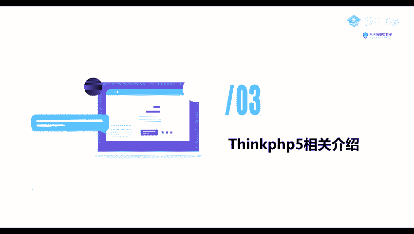

在本节课中，我们将要学习ThinkPHP5框架的基础知识，包括其核心概念、如何识别一个网站是否使用了该框架，以及了解其安全影响。

## 概述

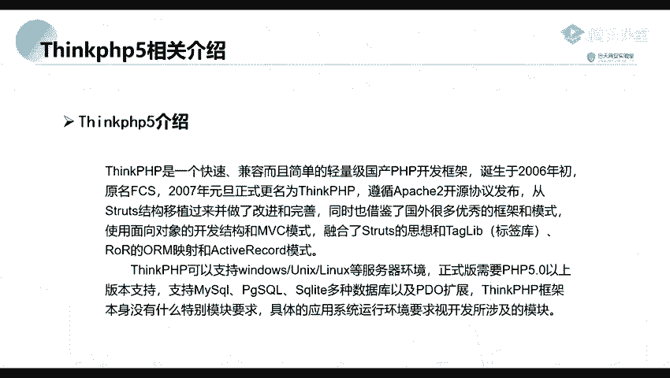

ThinkPHP5是一个快速、兼容、轻量级且精炼的国产PHP开发框架。它因其简洁高效的特点，被广泛应用于各类Web项目的开发中。

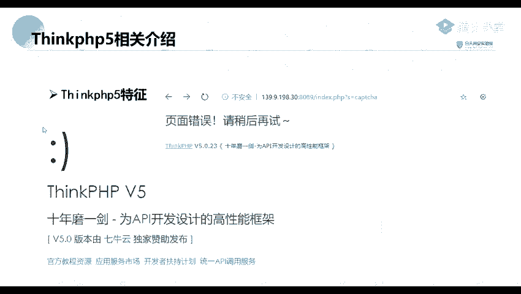

## ThinkPHP5框架的特征

识别一个网站是否使用了ThinkPHP5框架，可以通过以下几种方法。

以下是几种常见的识别方法：

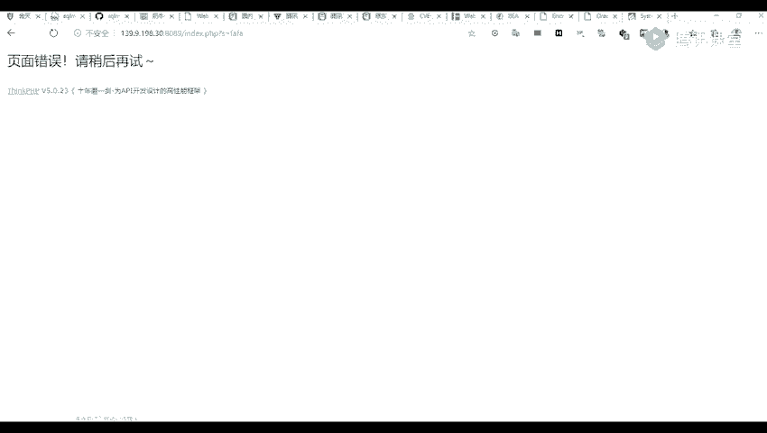

1.  **页面特征**：访问网站时，其页面可能包含ThinkPHP特有的样式或结构，有经验的开发者可以直观地识别出来。
2.  **URL路径**：尝试访问一个不存在的路径或带有特定参数的URL，例如 `index.php?s=/index/\think\app/invokefunction`。如果网站基于ThinkPHP5，可能会返回特定的错误信息。
3.  **错误信息**：当网站开启调试模式或遇到特定错误时，返回的错误页面会明确显示“ThinkPHP”字样及其版本信息，这是最直接的识别方式。

## ThinkPHP5的应用与影响

上一节我们介绍了如何识别ThinkPHP5，本节中我们来看看它的应用范围及其安全重要性。

ThinkPHP5作为一个基础框架，许多内容管理系统（CMS）和Web应用都是基于它进行二次开发的。

以下是部分基于ThinkPHP5二次开发的知名CMS：

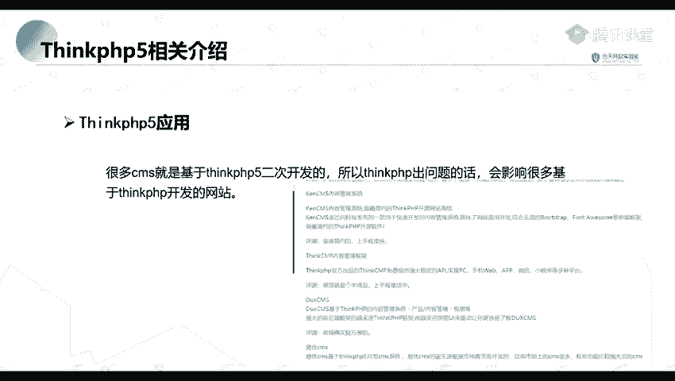

*   **KENCMS**：一个内容管理系统。
*   **Z-Blog**：一款博客系统。
*   **BU叉CMS/EUCMS**：等其它内容管理系统。

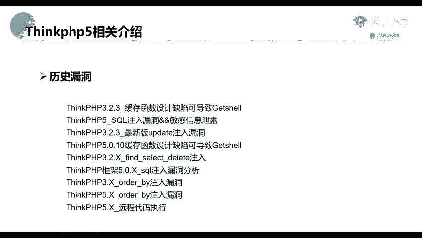

可以这样理解：ThinkPHP5是“主应用”，而上述CMS是构建在其上的“子应用”。因此，如果ThinkPHP5框架本身被发现存在安全漏洞，那么所有基于此框架开发的“子应用”都可能受到影响，导致大规模的安全风险。

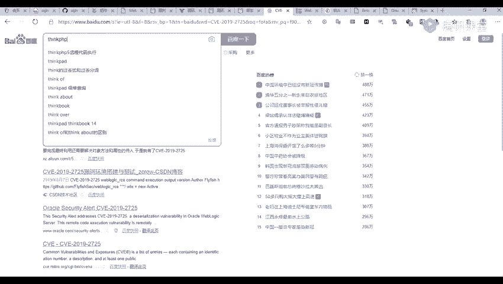

## ThinkPHP5的历史漏洞

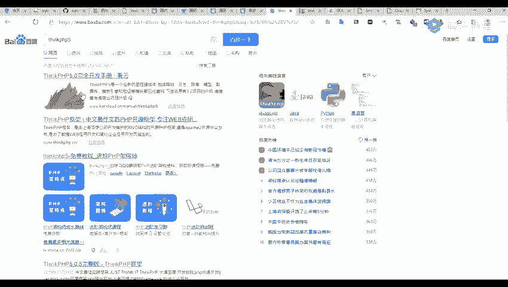

与我们之前课程中讲到的Weblogic一样，ThinkPHP5框架在历史上也曝出过多个安全漏洞。

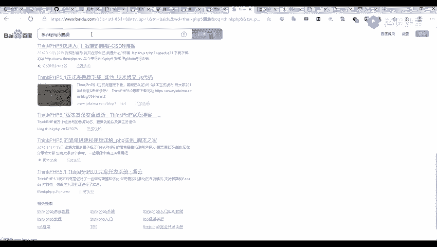

其中一个著名的例子是**ThinkPHP5 远程代码执行漏洞**。该漏洞允许攻击者在目标服务器上执行任意代码，危害极大。在网络上可以搜索到大量关于此漏洞的分析文章、利用脚本和修复方案。

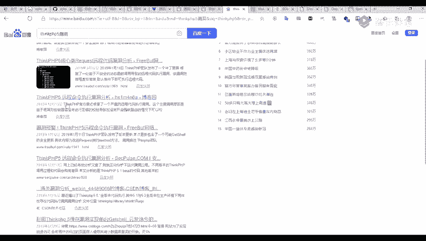

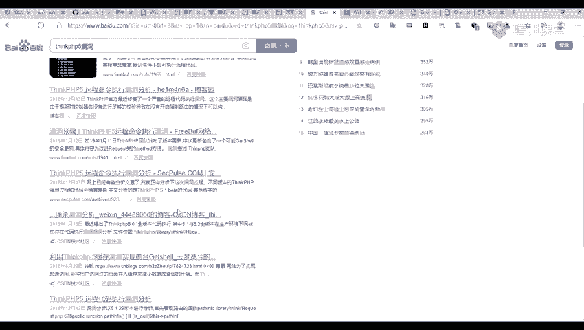

## 总结

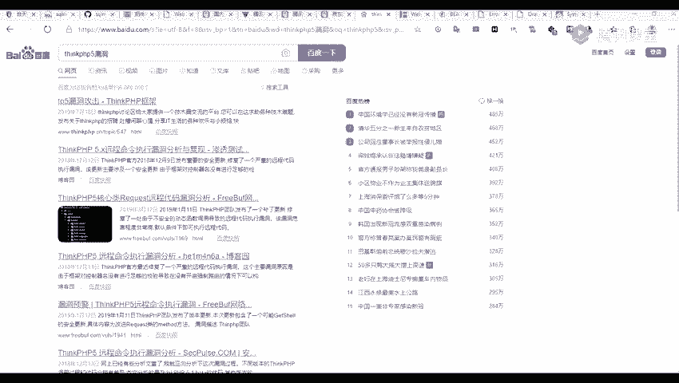

本节课中我们一起学习了ThinkPHP5框架的基础知识。我们了解了它是一个轻量级的国产PHP开发框架，掌握了通过页面特征、URL测试和错误信息来识别网站是否使用了该框架的方法。更重要的是，我们认识到由于其作为底层框架被广泛二次开发，一旦出现漏洞，影响范围会非常广泛，因此在渗透测试和安全审计中，识别目标框架类型是至关重要的一步。