# 网络安全系统教学合集：P43：4_Weblogic历史漏洞及利用 🔍

在本节课中，我们将学习如何发现并利用Weblogic中间件的历史漏洞。主要内容包括：如何通过搜索引擎和工具发现Weblogic资产，以及如何使用自动化脚本扫描和验证漏洞，最终实现命令执行。

## 资产发现与信息收集

上一节我们介绍了Weblogic的基本概念，本节中我们来看看如何找到互联网上使用Weblogic的服务器。

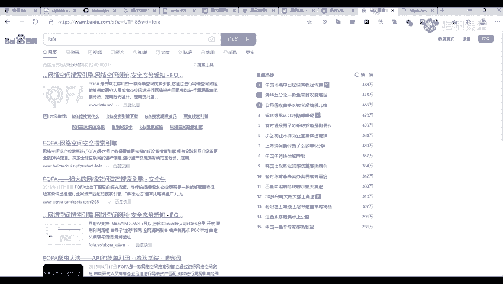

### 使用网络空间搜索引擎

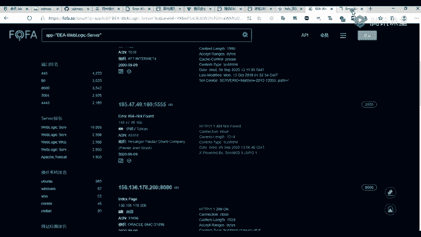

以下是发现Weblogic资产的几种主要方法：

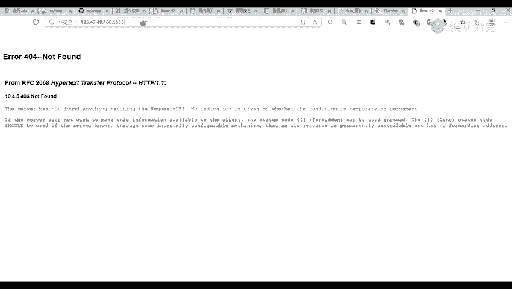

*   **主流搜索引擎**：可以使用如Fofa、Shodan、ZoomEye等网络空间搜索引擎。
*   **搜索技巧**：建议挖掘相对小众的漏洞（CVE），因为大众化的漏洞竞争激烈，较难发现。
*   **后续处理**：可以将收集到的子域名导入AWVS等漏洞扫描器进行深度扫描。但需注意控制扫描频率，避免对目标网站造成过大负荷。

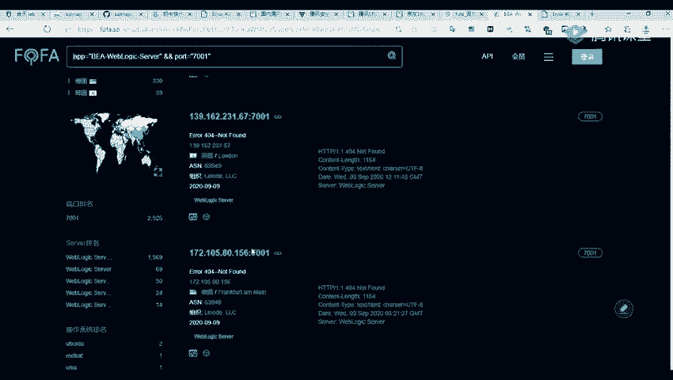

例如，在Fofa中，我们可以直接搜索关键词 `weblogic`。


点击查询后，会列出相关的IP地址。由于非会员权限有限，显示结果数量会受限。我们可以随机选择一个目标进行访问。


访问目标可能返回404页面，并且端口可能不是默认的7001，例如本例中开放在5555端口。

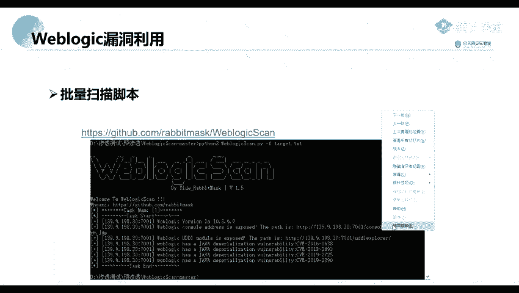


我们也可以直接搜索默认的 `7001` 端口，以发现更多目标。


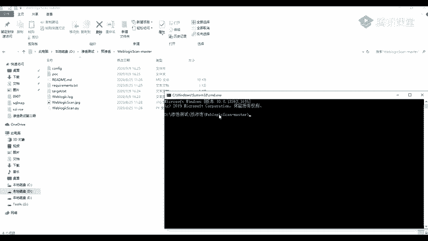


### 使用搜索引擎语法（Google Hacking）

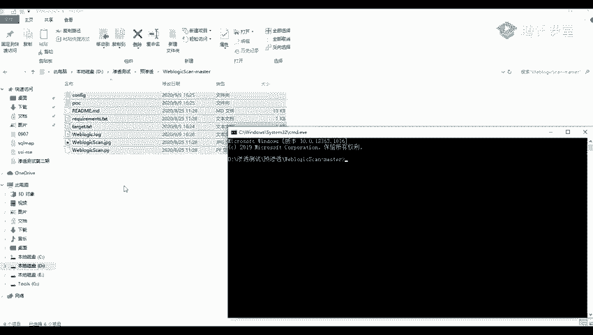

除了专用引擎，还可以利用通用搜索引擎的语法来定位目标。


以下是两种常用的语法：

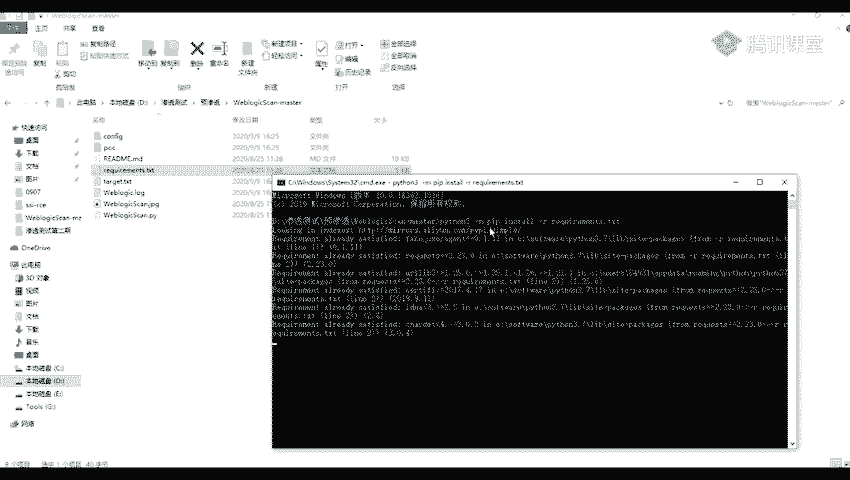

*   **`inurl`语法**：用于搜索URL中包含特定路径的网站。例如，如果某个漏洞的触发路径是 `/example/vuln`，可以这样搜索：
    ```bash
    inurl:/example/vuln
    ```
    这可以帮助我们找到存在特定路径的IP地址。
*   **`intitle`语法**：用于搜索网页标题中包含特定关键词的网站。例如，搜索标题中含有“weblogic”的页面：
    ```bash
    intitle:weblogic
    ```

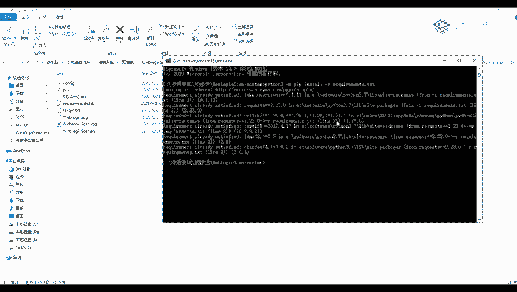


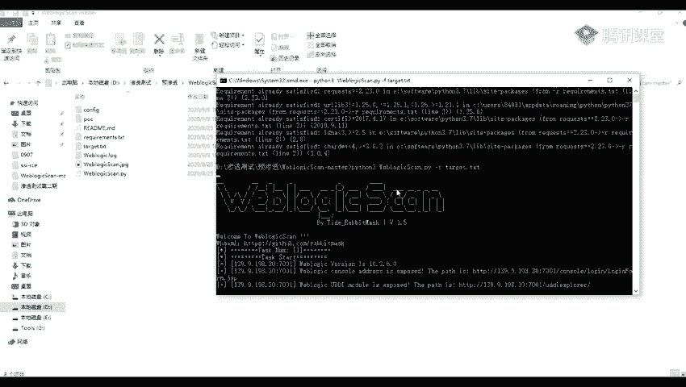

## 漏洞扫描与利用

前面我们主要讲解了如何寻找Weblogic目标，现在我们来探讨具体的漏洞利用方法。

### 使用自动化扫描脚本

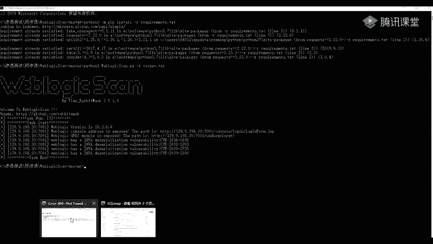

这里有一个集成了多个Weblogic漏洞验证代码（POC）的脚本，可以用于批量扫描。


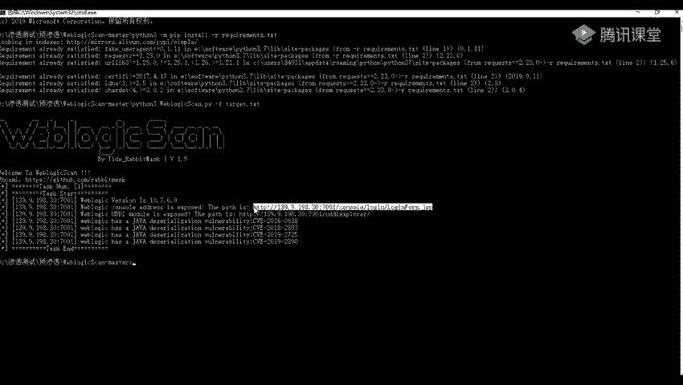

以下是该脚本的使用步骤：

1.  **下载脚本**：首先获取该扫描脚本。
2.  **安装依赖**：脚本通常需要特定的Python库才能运行。根据提供的 `requirements.txt` 文件安装依赖。
    ```bash
    python3 -m pip install -r requirements.txt
    ```
    
3.  **执行扫描**：运行脚本，并使用 `-f` 参数指定一个包含目标URL的文本文件。
    ```bash
    python3 weblogic_scanner.py -f target_urls.txt
    ```
    

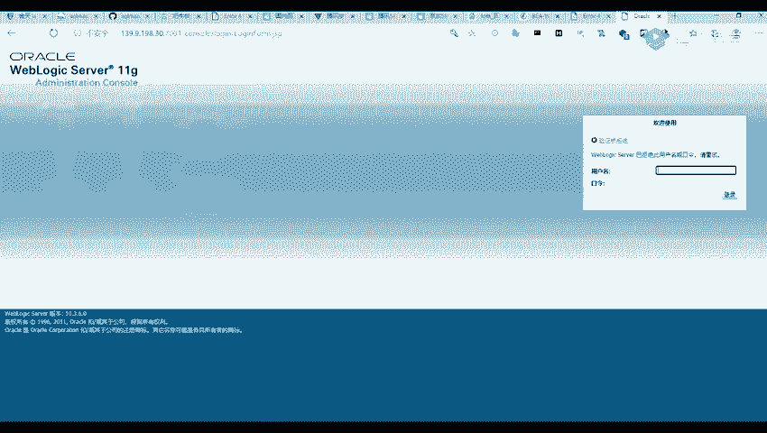

脚本开始运行后，会对目标进行扫描。

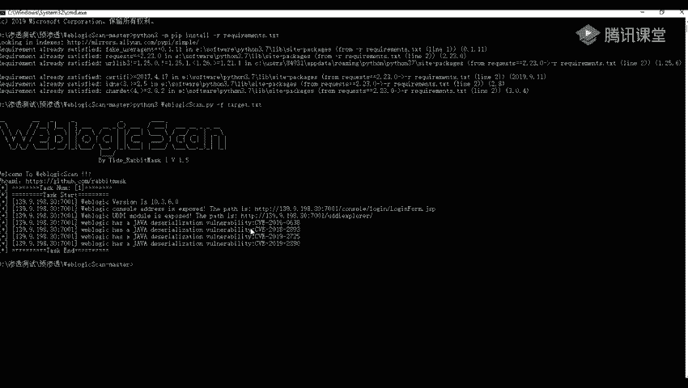

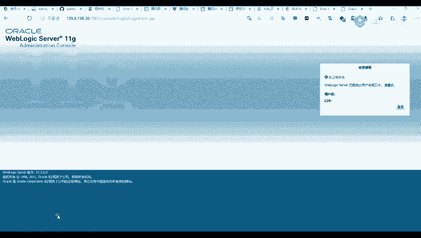


扫描结果会列出发现的漏洞信息。Weblogic的一个版本（如10.3.6）往往存在多个历史漏洞。


例如，扫描结果可能显示目标存在Weblogic控制台（管理登录界面），其访问地址通常为 `/console`。我们可以尝试使用默认口令（如 `weblogic/Oracle@123`）进行登录，但管理员通常已修改密码。

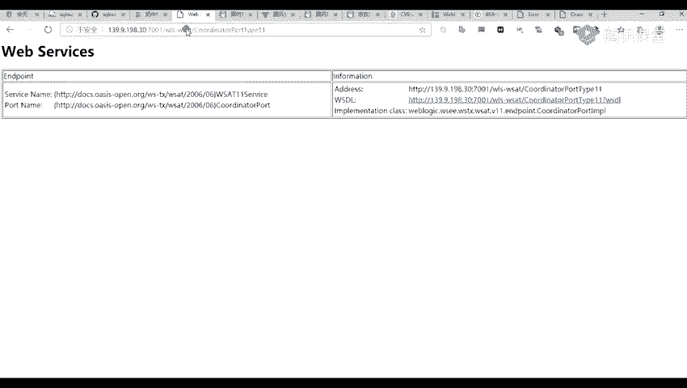


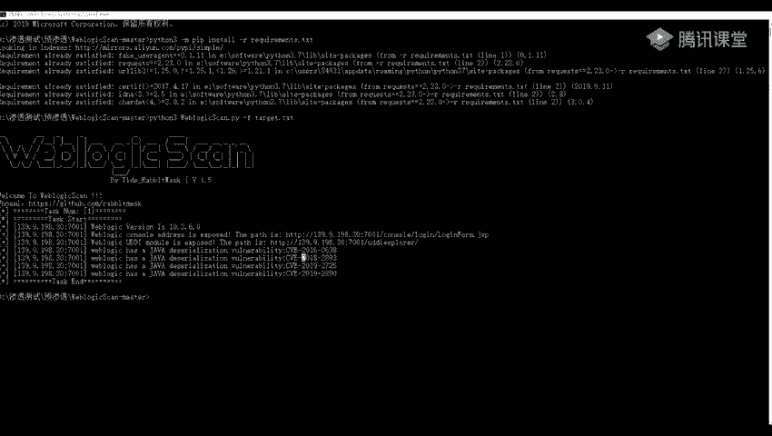

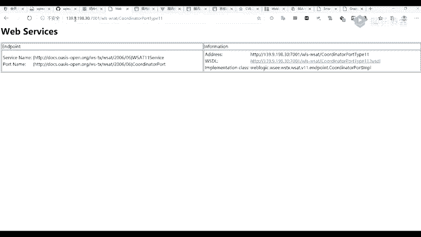

### 漏洞利用实战

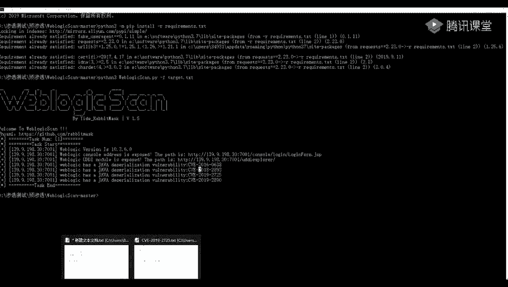

当我们通过脚本扫描到具体漏洞编号（如CVE-2023-2725）后，下一步就是寻找利用方法。

以下是漏洞利用的一般流程：

1.  **搜索利用资料**：通过百度或谷歌搜索漏洞编号（如 `CVE-2023-2725 exploit`），查找相关的技术文章和利用脚本（EXP）。
    
2.  **获取利用载荷**：找到可用的EXP脚本。EXP（Exploit）或Payload是用来执行命令或上传文件的代码。
3.  **构造攻击请求**：通常漏洞利用需要向特定路径发送构造好的HTTP请求。例如，某个漏洞的触发路径可能是：
    ```
    /bea_wls_deployment_internal/DeploymentService
    ```
4.  **执行命令**：将找到的EXP代码复制到Burp Suite等抓包工具中，替换目标地址和要执行的命令。例如，执行查看 `/etc/passwd` 文件的命令：
    ```http
    POST /vulnerable_path HTTP/1.1
    Host: target_ip:7001
    ... [其他EXP载荷，包含命令执行代码] ...
    cmd=cat /etc/passwd
    ```
    
5.  **验证结果**：发送请求后，查看响应内容，确认命令是否执行成功。成功后，便可尝试执行其他系统命令，如 `ifconfig` 查看网络信息。
    

## 总结


本节课中我们一起学习了Weblogic历史漏洞的完整利用流程。首先，我们介绍了如何使用网络空间搜索引擎和Google语法来发现Weblogic资产。接着，我们讲解了如何利用自动化扫描脚本批量检测目标存在的漏洞。最后，我们通过一个实例演示了在发现具体漏洞后，如何搜索利用方法、构造攻击请求并最终实现远程命令执行。掌握这些方法，是进行Weblogic漏洞挖掘和渗透测试的基础。