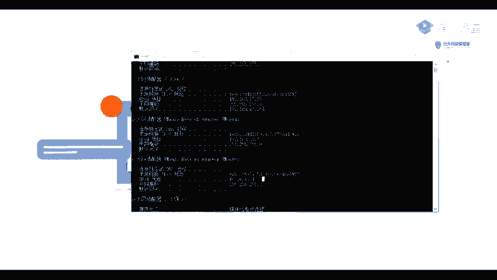
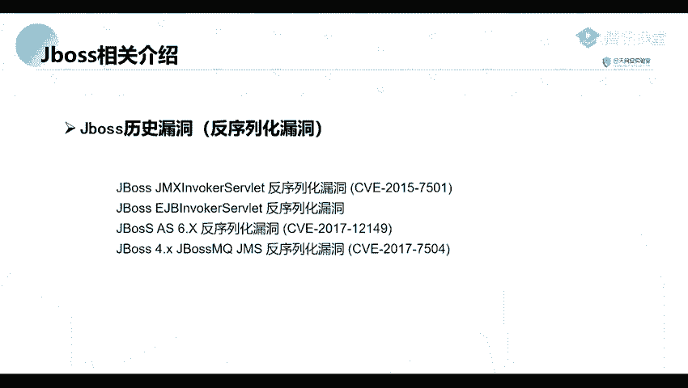

# Kali渗透与网络安全：P45：Jboss历史漏洞及利用

## 概述
在本节课中，我们将学习Jboss应用服务器的基本概念及其历史上出现过的多个安全漏洞。了解这些漏洞的原理和背景，是进行渗透测试和漏洞挖掘的基础。

## Jboss简介
上一节我们介绍了课程的整体框架，本节中我们来看看Jboss。Jboss是一个基于J2EE的开放源代码应用服务器。它是用来管理EJB（Enterprise JavaBeans）的容器和服务器。但是，它的核心服务并不包括支持Servlet/JSP的Web容器，通常它与Tomcat或Jetty绑定使用。

## Jboss历史漏洞
这个应用服务器在历史上出现过许多安全漏洞。以下是几个典型的例子：

### 1. 权限控制不严导致的漏洞
首先是一些由于权限控制不严导致的漏洞。例如，JMX控制台的未授权访问漏洞。以及，它的一个控制台安全验证绕过漏洞。这些都是比较早期的漏洞。

### 2. 默认口令漏洞
此外，还有一个重要的漏洞是默认口令漏洞。即运维管理人员或开发人员为网站设置了默认口令。攻击者可以通过这些默认口令进入网站后台，从而进行攻击。

### 3. 反序列化漏洞
另一个类型是反序列化漏洞。例如，2017年出现的Jboss AS 6.x反序列化漏洞。它的一个CVE编号是CVE-2017-12149。以及另外一个编号为CVE-2017-7504的漏洞。

## 总结
本节课中，我们一起学习了Jboss应用服务器的基本定义，并梳理了其历史上出现过的几类主要安全漏洞，包括权限控制漏洞、默认口令漏洞和反序列化漏洞。理解这些漏洞是后续进行实际漏洞利用和渗透测试的关键前提。