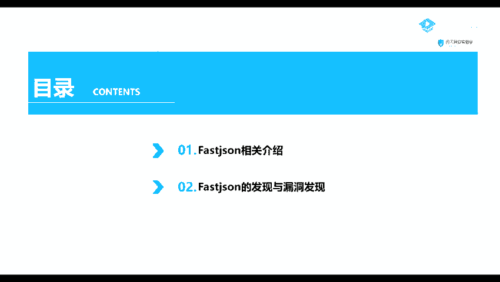
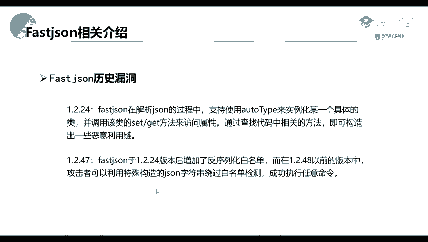
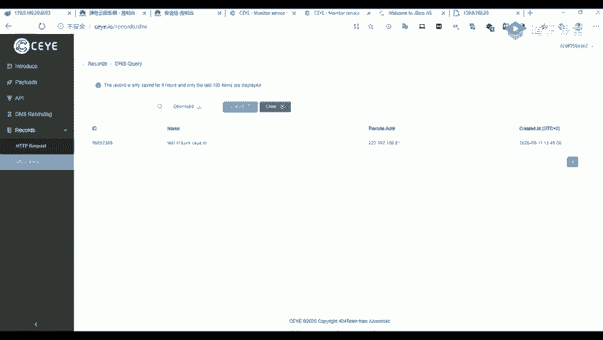

# 网络安全系统教学合集：P48：Fastjson反序列化漏洞基础

在本节课中，我们将要学习Fastjson反序列化漏洞的基础知识。Fastjson是近年来非常活跃且影响广泛的一个安全漏洞，理解其原理对于网络安全学习至关重要。由于内容较多，我们将分为两节课讲解，本节课主要介绍Fastjson的基本概念、漏洞背景及核心原理。

## Fastjson简介

上一节我们概述了本节课的内容，本节中我们来看看什么是Fastjson。



Fastjson是阿里巴巴公司开源的一款高性能的JSON解析器。


近年来，与Fastjson相关的漏洞非常流行。最早的漏洞可以追溯到2017年。目前最广为人知的两个存在漏洞的版本是 **1.2.24** 和 **1.2.47**。

## 漏洞核心原理

了解了Fastjson是什么之后，本节我们来深入探讨其漏洞产生的核心原因。

漏洞的根本原因在于，Fastjson在解析JSON字符串的过程中，支持使用特定的“@type”属性来指定并实例化一个具体的类，并自动调用该类的setter或getter方法来访问或设置属性。

攻击者通过精心构造恶意的JSON字符串，可以触发目标类中某些危险方法的执行。以下是其核心机制的简化表示：

```json
{
  "@type": "com.example.VulnerableClass",
  "property": "恶意参数"
}
```

在1.2.24版本之后，Fastjson引入了反序列化的安全白名单机制以进行防护。

然而，在1.2.48之前的版本（不包括1.2.48）中，攻击者可以利用特殊构造的JSON字符串绕过白名单检测，从而成功执行任意系统命令。



## 本节课总结



本节课中，我们一起学习了Fastjson反序列化漏洞的基础知识。我们了解了Fastjson是阿里巴巴开源的JSON解析库，并探讨了其漏洞产生的核心原理：即通过`@type`属性指定类并自动调用方法，以及早期版本中白名单机制可以被绕过的问题。下一节课，我们将聚焦于这些漏洞的具体利用方式与实践。