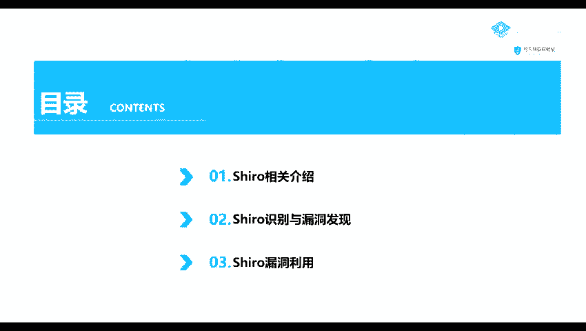
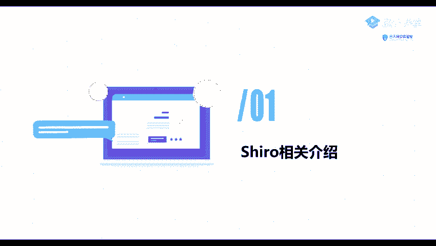
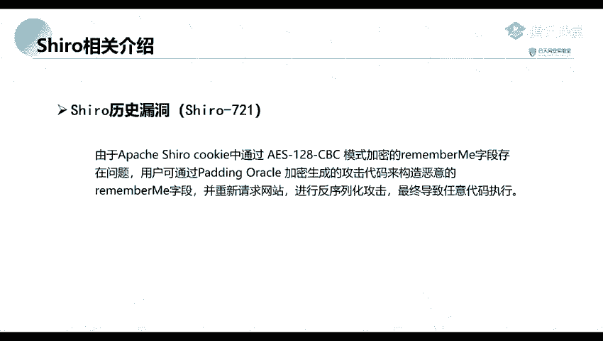

# Kali渗透教程：P50：Shiro反序列化

在本节课中，我们将要学习Apache Shiro框架相关的安全知识。课程内容主要分为三个部分：首先介绍Shiro框架是什么，然后讲解如何识别使用了Shiro组件的系统，最后探讨如何发现并利用Shiro的反序列化漏洞。

## 第一部分：Shiro框架介绍 🔍

上一节我们概述了课程内容，本节中我们来看看什么是Apache Shiro。

Apache Shiro是一个功能强大且应用广泛的Java安全框架。它提供了身份验证、授权、加密和会话管理等核心安全功能。该框架设计直观，易于使用，同时能够为应用程序提供健壮的安全性。



## 第二部分：Shiro漏洞历史 📜



了解了Shiro的基本概念后，本节我们回顾一下该框架历史上发生过的著名漏洞。

以下是两个关键的Shiro反序列化漏洞：

1.  **Shiro-550**
    该漏洞源于Shiro框架提供的“记住我”（Remember Me）功能。用户登录成功后，服务端会生成一个经过加密和编码的Cookie字符串。在服务端，程序会对`rememberMe`这个Cookie值先进行Base64解码，然后使用AES解密，最后进行反序列化操作。这个反序列化过程存在缺陷，导致了远程代码执行漏洞。

2.  **Shiro-721**
    此漏洞是2019年出现的一个高危漏洞。问题出在Shiro对Cookie中`rememberMe`字段的加密方式上。攻击者可以利用Padding Oracle攻击手段，构造恶意的`rememberMe`字段并重新发送给网站，从而绕过加密，最终导致任意代码执行。

## 第三部分：漏洞识别与利用 ⚙️

在了解了漏洞原理后，本节我们探讨如何在实际环境中识别Shiro并利用其漏洞。

漏洞利用通常遵循以下步骤：

1.  **识别Shiro组件**：通过检测HTTP响应头中的`Set-Cookie`字段是否包含`rememberMe=deleteMe`等特征，来判断目标系统是否使用了Shiro框架。
2.  **检测漏洞存在**：使用公开的漏洞检测工具或Payload，验证目标是否存在特定的Shiro反序列化漏洞（如550或721）。
3.  **构造利用载荷**：根据漏洞类型，利用相应的工具生成恶意的序列化数据，并将其编码为可发送的`rememberMe` Cookie值。
4.  **发送攻击请求**：将构造好的恶意Cookie附加到HTTP请求中，发送给目标服务器。
5.  **执行命令与回连**：如果漏洞存在且利用成功，攻击载荷将在服务器上执行，可能实现命令执行或建立反向Shell连接。

**核心概念示例**：
检测Shiro的简单特征可以观察Cookie：
```http
Set-Cookie: rememberMe=deleteMe; Path=/; HttpOnly
```



本节课中我们一起学习了Apache Shiro框架的安全风险，重点分析了其反序列化漏洞（Shiro-550和Shiro-721）的成因与历史，并概述了漏洞识别与利用的基本流程。理解这些原理是进行安全测试和防御的基础。