# Kali渗透教程：P51：Shiro反序列化漏洞发现和识别 🔍

在本节课中，我们将要学习如何发现和识别网站是否使用了Apache Shiro框架，并检测其是否存在反序列化漏洞。Shiro是一个广泛使用的Java安全框架，其“记住我”功能曾存在严重的安全漏洞。

## 如何发现Shiro框架

上一节我们介绍了Shiro框架的基本概念，本节中我们来看看如何识别一个网站是否使用了Shiro。

识别Shiro框架主要有两种方法：一是通过网站的“记住密码”功能进行推断；二是通过分析HTTP请求与响应的数据包来确认。

以下是两种具体的识别方法：

1.  **观察登录表单功能**：如果目标网站的登录页面提供了“记住密码”或“记住我”的选项，则该网站很可能使用了Shiro框架来实现此功能。这是初步判断的一个线索。

2.  **分析HTTP数据包**：这是更准确的识别方式。通过抓取登录过程的网络数据包，并观察服务器返回的响应。如果响应头中的`Set-Cookie`字段包含`rememberMe=deleteMe`，则可以确定该网站使用了Shiro组件。

为了更直观地理解，我们可以进行抓包演示。开启代理工具抓取登录请求，并将请求发送到重放模块。发送请求后，在响应包的`Set-Cookie`部分寻找关键字段。

有时，服务器可能不会主动返回`rememberMe`字段。此时，可以尝试在请求包的`Cookie`中主动添加`rememberMe=1`等任意值。如果服务器在响应中也返回了`rememberMe=deleteMe`，同样可以证明Shiro框架的存在。

## Shiro漏洞检测方法

在我们发现了网站使用Shiro框架之后，就需要对其进行漏洞检测。由于Shiro反序列化漏洞通常没有直接的回显（即执行结果不会显示在返回页面上），我们需要借助外部平台来验证漏洞是否存在。

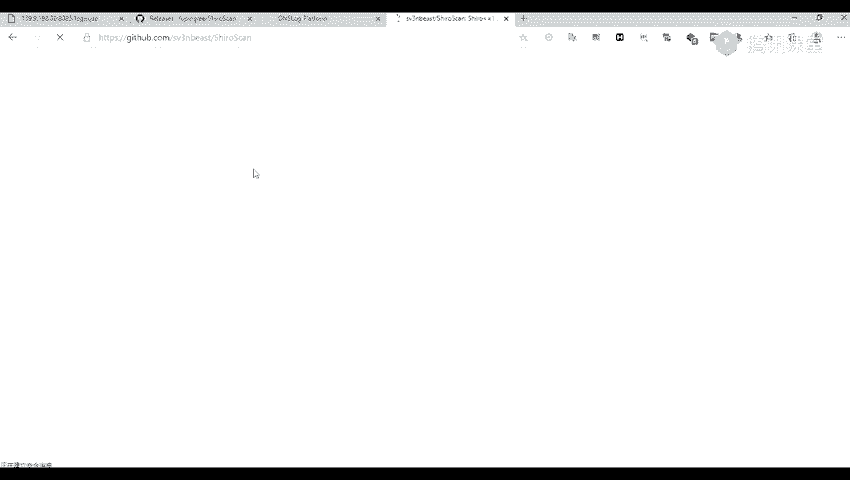

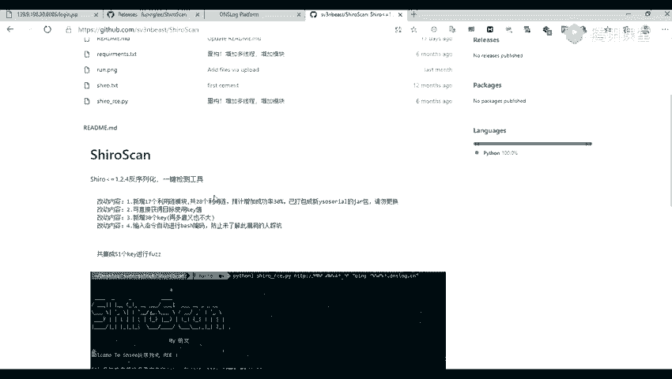

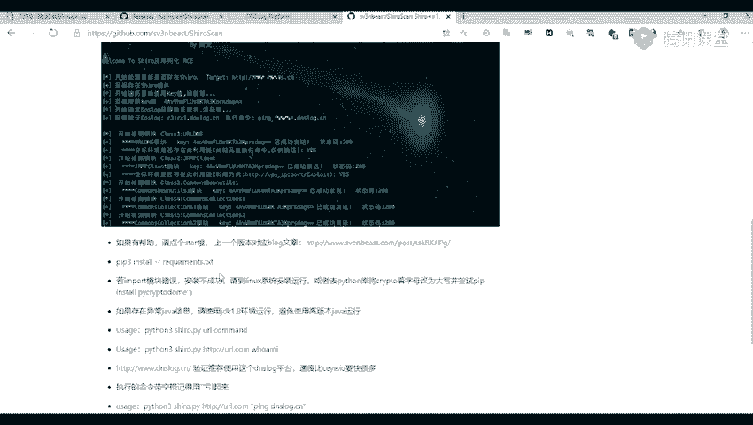

检测的核心思路是，利用漏洞让目标服务器向一个我们可控的域名发起DNS请求，通过观察是否有请求记录来判断漏洞是否可利用。

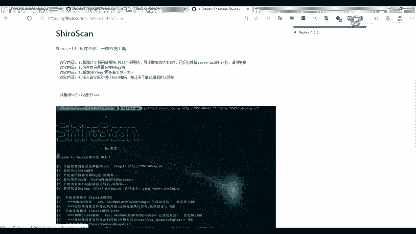

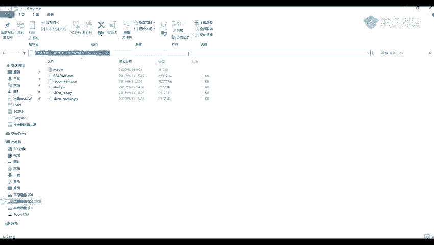

以下是进行漏洞检测的步骤和工具：

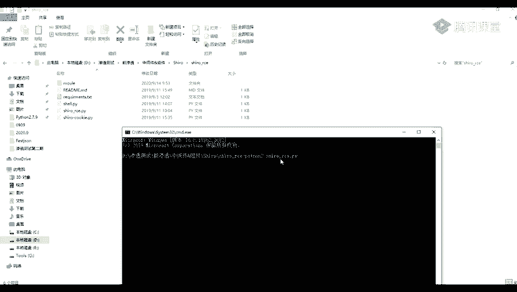

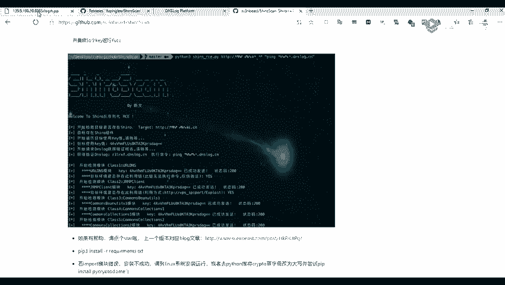

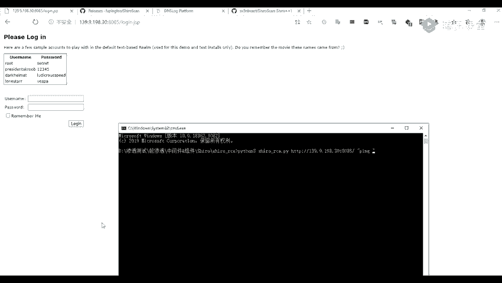

*   **使用图形化工具检测**：推荐使用GitHub上的图形化检测工具（如ShiroScan）。打开工具后，在URL处输入目标地址，并在DNSlog URL处填入从DNSlog平台获取的子域名。点击检测，如果工具提示成功且DNSlog平台收到请求记录，则说明目标很可能存在漏洞。工具检测可能存在误报，需要结合其他方法验证。
    ```bash
    # 示例：从DNSlog平台获取的域名
    # 你的子域名.dnslog.cn
    ```

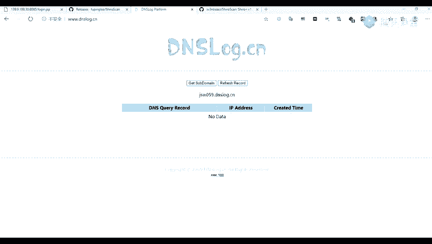

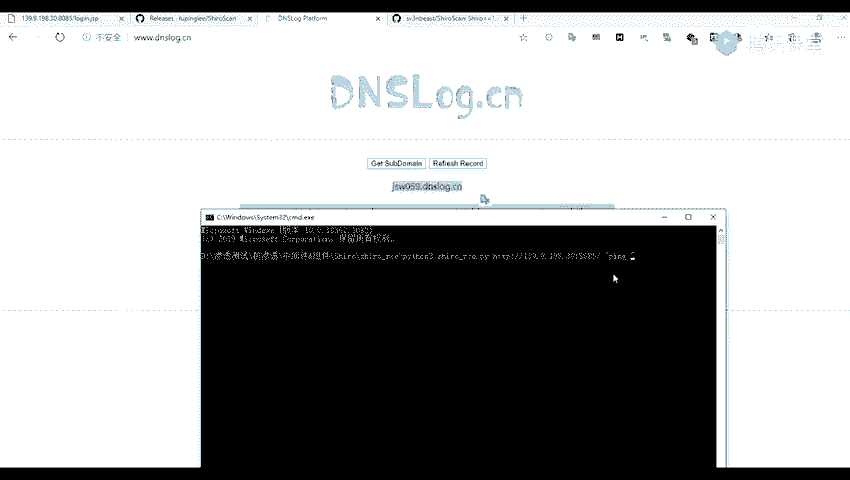

*   **使用Python脚本检测**：除了图形化工具，也可以使用Python脚本进行检测。脚本通常通过命令行运行，需要指定目标URL和要执行的命令（通常是让目标服务器ping一个DNSlog域名）。
    ```bash
    # 示例命令格式
    python3 shiro_exploit.py http://target.com:8080 "ping your-subdomain.dnslog.cn"
    ```
    执行后，观察DNSlog平台是否有来自目标服务器的解析请求，以此判断漏洞。

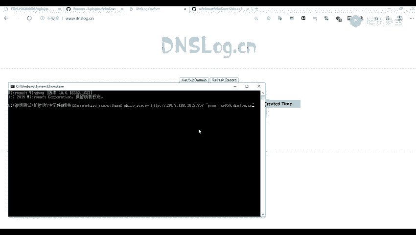

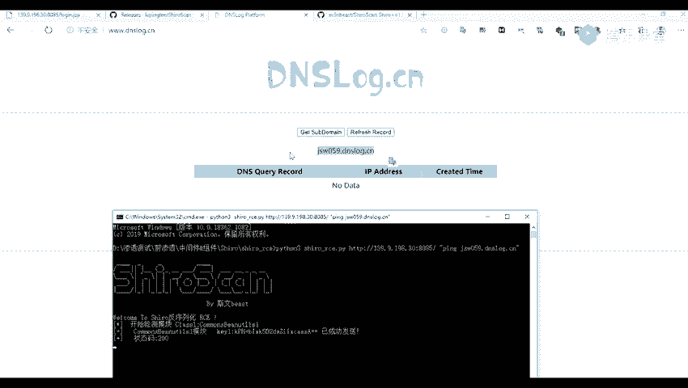

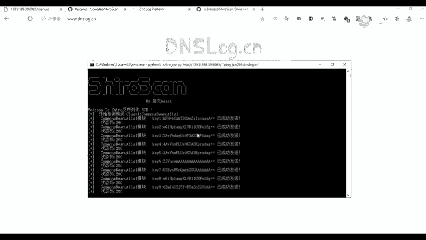

*   **可用的DNSlog平台**：网上有许多提供DNSlog服务的平台，例如`dnslog.cn`或`ceye.io`。在这些平台上注册后，可以获取一个专属的子域名，用于接收目标服务器的请求，从而验证漏洞。

## 课程总结

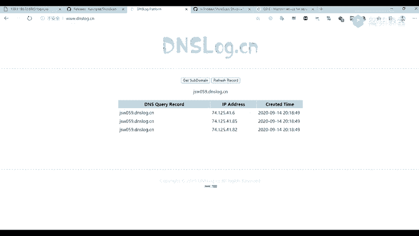

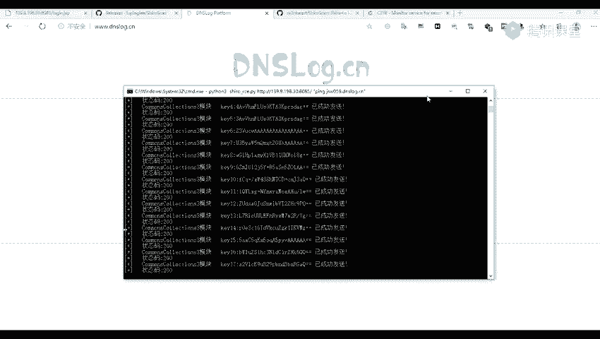

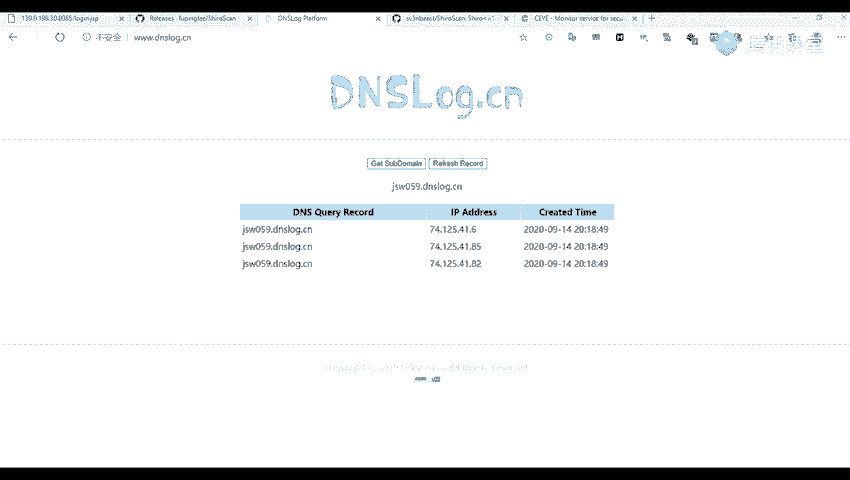

本节课中我们一起学习了Shiro反序列化漏洞的发现与识别。首先，我们掌握了通过“记住我”功能和抓包分析`rememberMe`字段来识别Shiro框架的方法。接着，我们学习了如何利用DNSlog平台和无回显漏洞检测原理，借助图形化工具或Python脚本来验证Shiro反序列化漏洞是否存在。理解这些步骤是进行后续漏洞利用的基础。