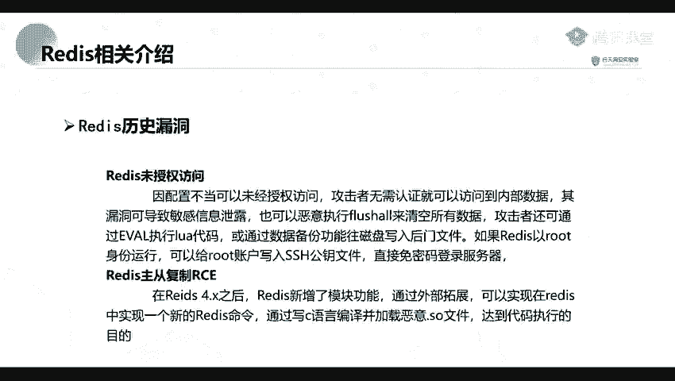
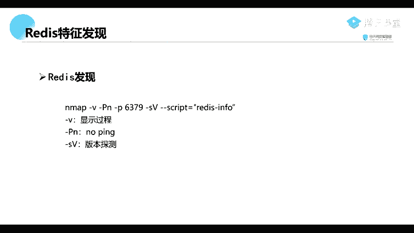
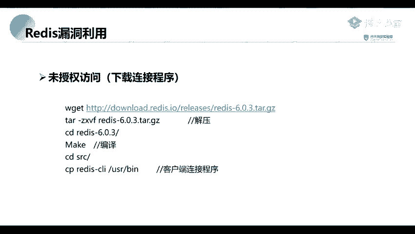

# 网络安全系统教学合集：P54：Redis未授权访问漏洞特征与发现 🔍



在本节课中，我们将学习Redis未授权访问漏洞的核心特征以及如何利用工具发现存在此漏洞的目标。这是渗透测试中信息收集阶段的关键一步。


## 漏洞特征

上一节我们介绍了Redis未授权访问漏洞的基本概念，本节中我们来看看这个漏洞具体有哪些特征。

Redis服务默认绑定在**6379**端口。在进行信息收集和端口扫描时，这个端口是需要重点关注的目标，因为它经常存在Redis未授权访问漏洞。

该端口服务并不使用常见的HTTP协议，这意味着我们无法通过常规的Web浏览器进行访问。要连接Redis服务，必须使用其专用的客户端工具。

## 漏洞发现方法

了解了漏洞特征后，我们来看看如何主动发现网络中是否存在存在此漏洞的Redis服务。核心方法是使用Nmap工具进行端口扫描和脚本检测。

以下是使用Nmap扫描Redis服务的命令及参数解释：

```bash
nmap -v -Pn -p 6379 --script redis-info <目标IP>
```

*   **-v**：显示详细的扫描过程。
*   **-Pn**：不进行主机存活探测（Ping扫描）。直接扫描指定IP，无论目标是否在线。
*   **-p 6379**：指定扫描6379端口。
*   **--script redis-info**：使用Nmap内置的`redis-info`脚本进行检测，该脚本可以识别Redis服务并获取其信息。



执行上述扫描后，如果目标主机开放了6379端口并运行着Redis服务，我们通常就能获得相关信息。由于这是一个未授权访问漏洞，在发现服务后，我们可以直接尝试使用Redis客户端进行连接，而无需提供任何认证凭证。



本节课中我们一起学习了Redis未授权访问漏洞的两个关键特征：默认的**6379**端口和非HTTP协议，并掌握了使用**Nmap**命令结合特定脚本进行漏洞发现的方法。这是后续利用该漏洞的前提步骤。