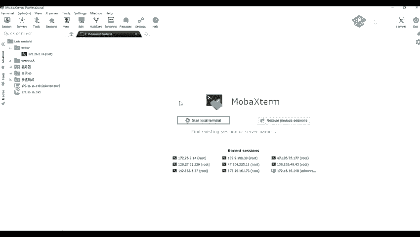
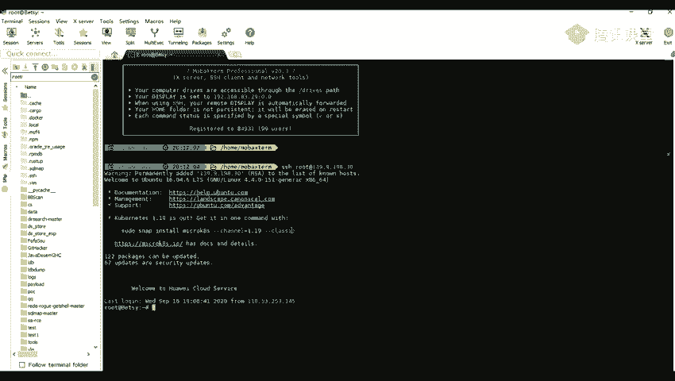

# 网络安全系统教学合集：P56：1_弱口令介绍及应用场景 🔓

在本节课中，我们将要学习网络安全中一个基础且常见的攻击手段——弱口令破解。我们将了解什么是弱口令，暴力破解的基本原理，以及它在实际渗透测试中的应用场景。

## 暴力破解介绍及应用场景

上一节我们概述了课程内容，本节中我们来看看暴力破解的具体定义和它的应用范围。

暴力破解指的是用枚举的方式来爆破用户的信息。具体流程是使用事先收集好的字典，对目标不断进行枚举尝试，直到成功为止。

### 什么是弱口令？

弱口令是指仅包含简单数字或字母的口令。例如 `123456`、`password`、`root` 等。这类口令极易被猜测或破解，就像将家门钥匙放在门口的垫子下，会严重威胁账户、计算机或网站的安全。

### 常用字典与工具

以下是进行暴力破解时常用的资源和方法：

*   **字典来源**：可以在网上搜索“弱口令字典”获取，例如包含了2011年至2019年最常见密码（Top 100/1000）的汇总字典，也包括针对后台、数据库等的专项字典。
*   **生成工具**：可以使用脚本根据关键词快速生成相关的弱口令字典。
*   **破解工具**：
    *   **Burp Suite**：其 `Intruder` 模块是强大的爆破工具。
    *   **Nmap**：集成了多种应用的密码破解脚本。
    *   **Metasploit**：包含丰富的爆破模块（Payload）。
    *   **专用脚本**：网上可以找到针对 WiFi、RDP、VNC、压缩包等特定目标的密码破解脚本。

> 破解的成功率很大程度上取决于字典是否足够强大。理论上，只要字典中包含正确的密码，就一定能够破解成功。

### 暴力破解的应用场景

了解了基本概念后，我们来看看暴力破解通常适用于哪些具体场景：

1.  **可爆破的验证码**：如果网站登录时的验证码没有失效时间限制，理论上可以对其进行枚举爆破。
2.  **无验证码的后台管理系统**：许多网站后台的管理员登录页面可能不设置验证码。
3.  **各种应用程序**：例如 `phpMyAdmin`（Web数据库管理工具）、`Tomcat`（中间件）、`MySQL`（数据库）等的管理入口。
4.  **网络协议**：对 `FTP`、`HTTP/HTTPS`（网页登录）、`SSH`、`RDP` 等协议进行身份验证爆破。例如，使用 `ssh root@[IP地址]` 命令连接服务器时，就需要输入密码。

---

本节课中我们一起学习了弱口令与暴力破解的核心概念。我们明确了弱口令的定义与危害，介绍了暴力破解的原理、常用字典和工具，并列举了其主要的应用场景。理解这些是进行安全测试和加强自身防御的基础。下一节，我们将进行实战，学习如何使用暴力破解工具攻击一个具体的靶场环境。