# Kali渗透测试：P57：破解Tomcat后台弱口令与部署Webshell 🎯

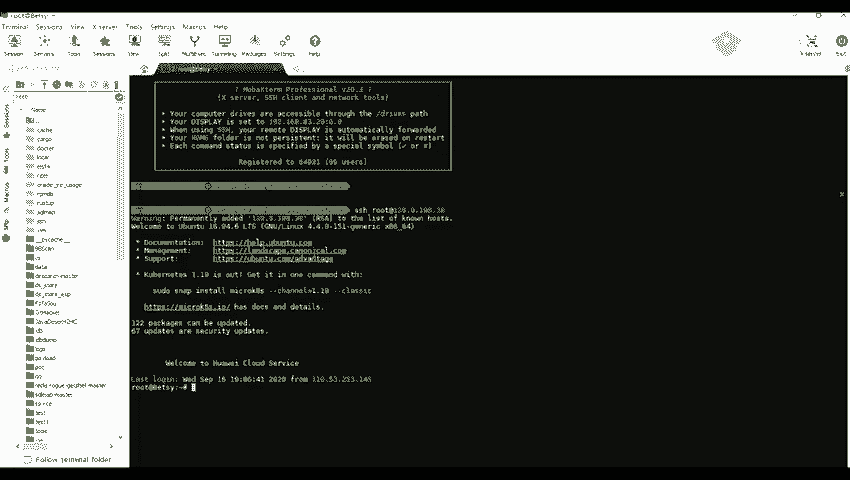

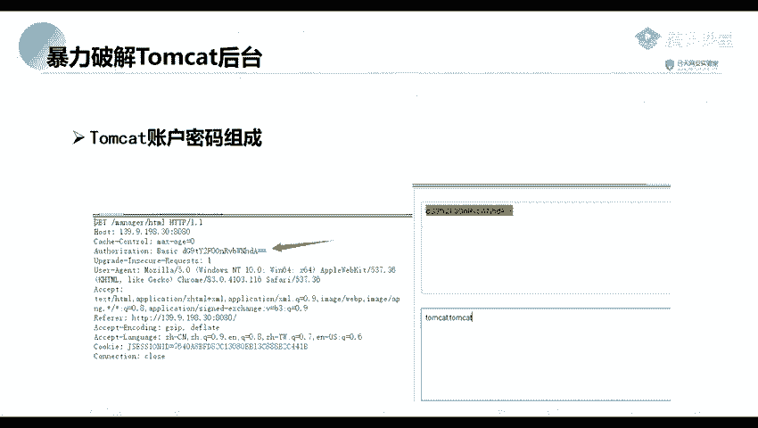

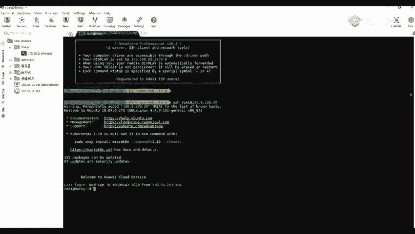

在本节课中，我们将学习如何利用Burp Suite工具对Tomcat管理后台进行弱口令爆破，并在成功登录后，通过部署WAR包的方式获取Webshell，从而实现对目标服务器的控制。

---

## 环境准备与目标识别

上一节我们介绍了SSH服务，本节中我们来看看如何针对Web应用服务进行渗透。首先，我们需要一个目标。这里我们搭建了一个Tomcat环境作为演示目标。

访问Tomcat默认页面后，我们可以尝试寻找其管理后台。通常，Tomcat的管理后台路径为 `/manager/html`。

当我们访问此路径时，会看到一个需要输入用户名和密码的登录框。如果我们没有正确的凭证，就需要尝试破解。


---

## 分析认证机制与加密方式

在进行爆破之前，我们必须了解Tomcat认证数据的传输格式。Tomcat管理后台的认证信息采用HTTP Basic认证方式。

以下是分析步骤：
1.  在登录框随意输入用户名和密码（例如，用户 `test`，密码 `test`）并提交。
2.  使用Burp Suite拦截该请求。
3.  观察请求头，会发现一个 `Authorization` 字段，其值以 `Basic` 开头。

该字段的值是 `用户名:密码` 字符串经过Base64编码后的结果。用公式表示即：

**`Authorization: Basic base64(“用户名:密码”)`**

我们可以使用Burp Suite的 **Decoder** 模块对截获的字符串进行解码验证。

例如，截获的字符串为 `dGVzdDp0ZXN0`，解码后正是 `test:test`。


---

## 使用Burp Suite进行爆破

了解了加密方式后，我们就可以使用Burp Suite的 **Intruder** 模块进行爆破。

以下是配置爆破的具体步骤：

**第一步：发送请求到Intruder并设置攻击点**
1.  将拦截到的登录请求包发送到 **Intruder**。
2.  在 **Positions** 标签页，清除所有自动标记，只选中 `Authorization` 字段中Base64编码后的部分（即 `dGVzdDp0ZXN0` 这部分），点击 **Add §** 将其设置为攻击载荷位置。

**第二步：配置攻击载荷（Payload）**
1.  切换到 **Payloads** 标签页。
2.  因为我们需要同时爆破用户名和密码，并组合成 `user:pass` 的格式，所以选择 **Payload set** 类型为 **Custom iterator（自定义迭代器）**。
3.  **Payload set** 设置为 `3`，分别对应：`用户名`、`:`、`密码`。
    *   **Position 1 (用户名列表)**：可以手动添加或导入常见用户名，如 `admin`, `tomcat`, `manager` 等。
    *   **Position 2 (分隔符)**：添加一个冒号 `:`。
    *   **Position 3 (密码列表)**：可以手动添加或导入常见密码，如 `tomcat`, `admin`, `123456`, `password` 等。

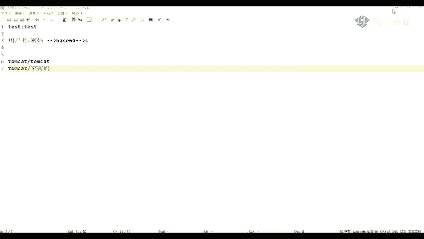

**第三步：配置载荷处理（Payload Processing）**
如果直接爆破，Burp不会对组合后的字符串进行Base64编码。我们需要添加编码规则。
1.  在 **Payloads** 标签页底部，找到 **Payload Processing** 区域。
2.  点击 **Add**，选择 **Encode** -> **Base64-encode**。
3.  同时，为了避免Burp对冒号等特殊字符进行URL编码，需要取消勾选 **Payload Encoding** 选项。

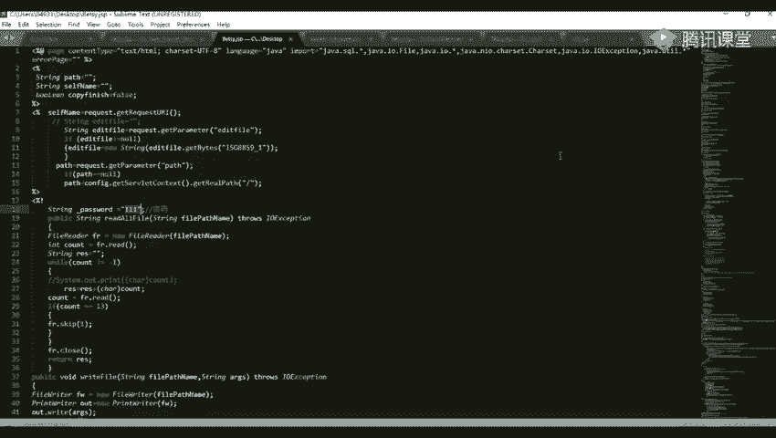

**第四步：开始攻击并分析结果**
1.  点击右上角的 **Start attack** 开始爆破。
2.  攻击完成后，我们需要从结果中筛选出正确的凭证。通常根据 **状态码（Status）** 和 **响应长度（Length）** 来区分。
    *   登录失败通常返回 `401` 状态码。
    *   登录成功通常返回 `200` 状态码或一个不同的响应长度。
3.  找到状态码为200或响应长度与众不同的请求，其对应的Payload即为正确的Base64编码串。
4.  将此编码串放入 **Decoder** 模块解码，即可得到正确的 `用户名:密码` 组合，例如 `tomcat:tomcat`。


---

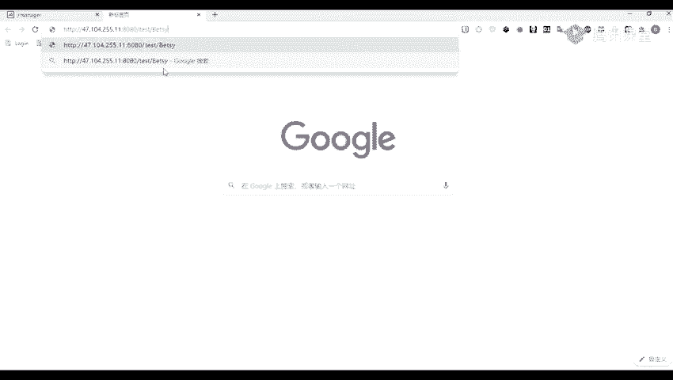

## 获取Webshell：部署WAR包

成功登录Tomcat管理后台后，我们可以通过部署WAR包来获取Webshell。WAR包是Java Web应用程序的打包格式，Tomcat可以自动解压并运行它。

以下是部署WAR包的步骤：

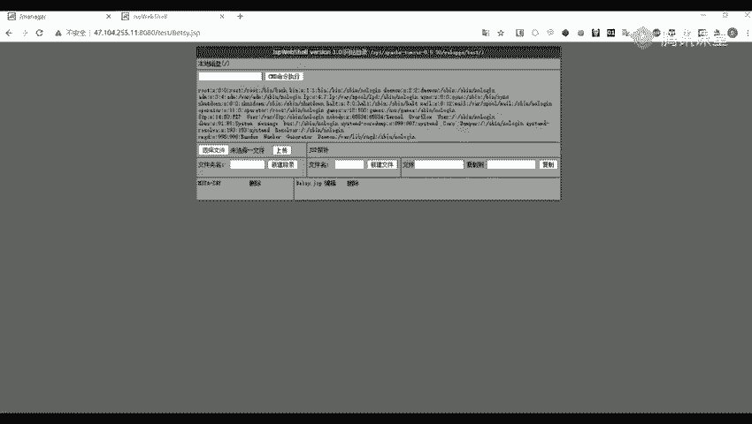

**第一步：制作包含Webshell的WAR包**
1.  准备一个JSP格式的Webshell文件（例如 `cmd.jsp`，内容包含可执行系统命令的代码）。
2.  使用 `jar` 命令将其打包成WAR文件。在命令行中执行：
    ```bash
    jar -cvf shell.war cmd.jsp
    ```
    这会将 `cmd.jsp` 打包成名为 `shell.war` 的文件。


**第二步：在管理后台上传并部署**
1.  在Tomcat管理后台页面，找到 **WAR file to deploy** 区域。
2.  点击 **选择文件**，上传刚生成的 `shell.war` 包，然后点击 **Deploy**。
3.  部署成功后，应用程序会出现在应用列表中。

**第三步：访问Webshell**
1.  访问路径为：`http://目标IP:端口/部署的WAR包名/Webshell文件名`。
    例如：`http://192.168.1.10:8080/shell/cmd.jsp`
2.  在Webshell页面中，即可执行系统命令（如 `ls`, `whoami`, `cat /etc/passwd` 等），实现对服务器的控制。


---

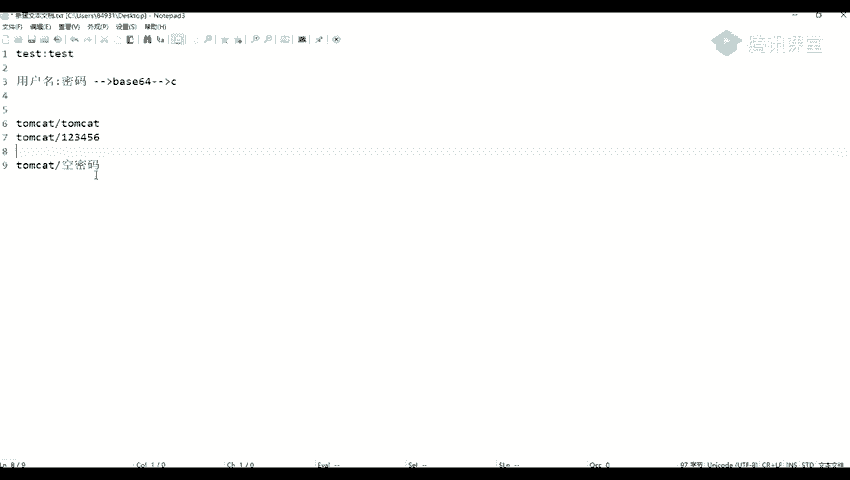

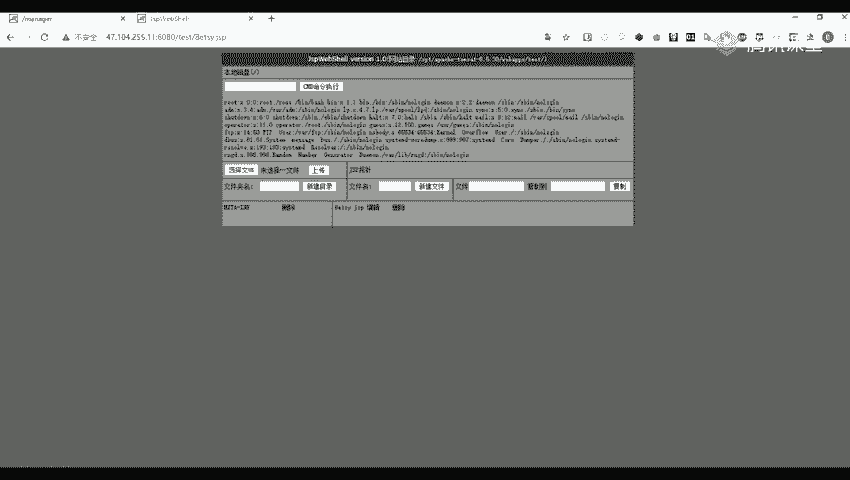

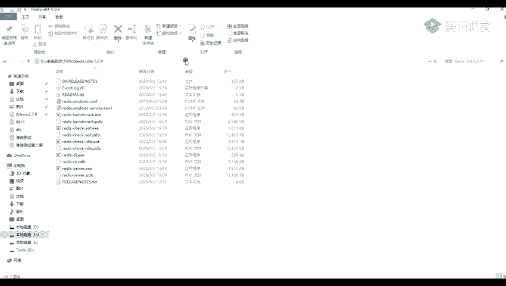

## 补充工具：Ncrack快速破解

除了Burp Suite，还有一些专用工具可以快速进行服务弱口令检测。例如 **Ncrack**。

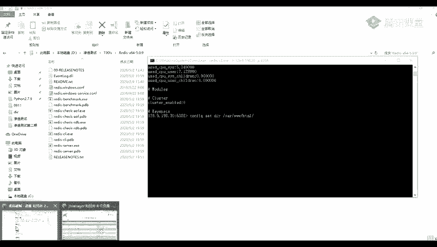

Ncrack支持多种协议（如SSH, RDP, MySQL, FTP, Telnet等）的高速爆破。
1.  打开Ncrack，选择目标协议（如 `mysql`）。
2.  输入目标地址。
3.  加载用户名和密码字典。
4.  开始破解，工具会快速尝试并显示成功的结果。


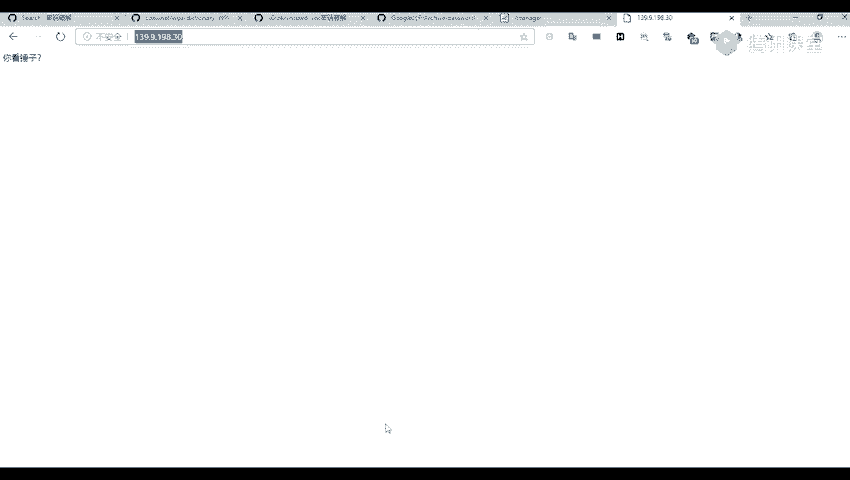

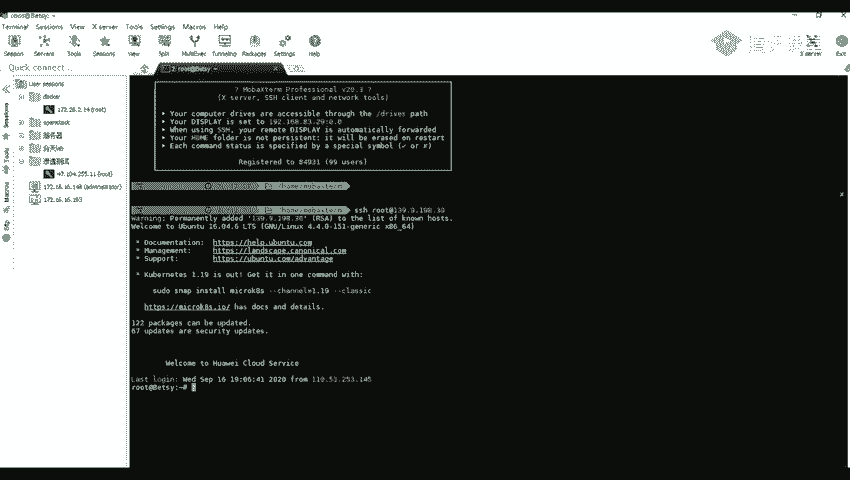


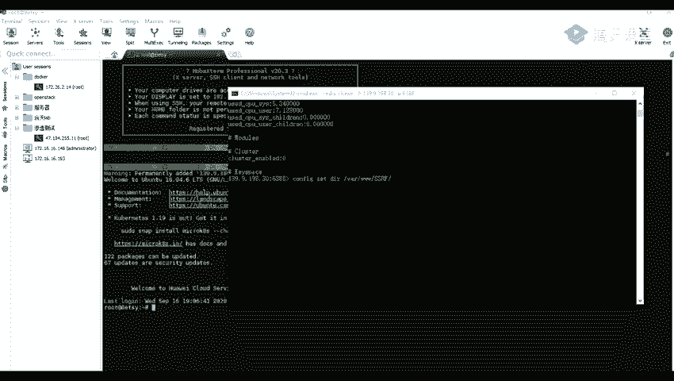

---

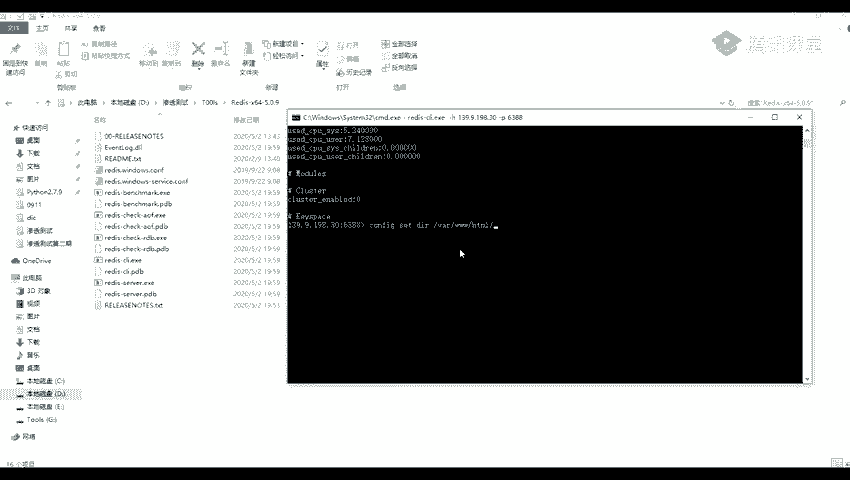

## 注意事项与防御建议

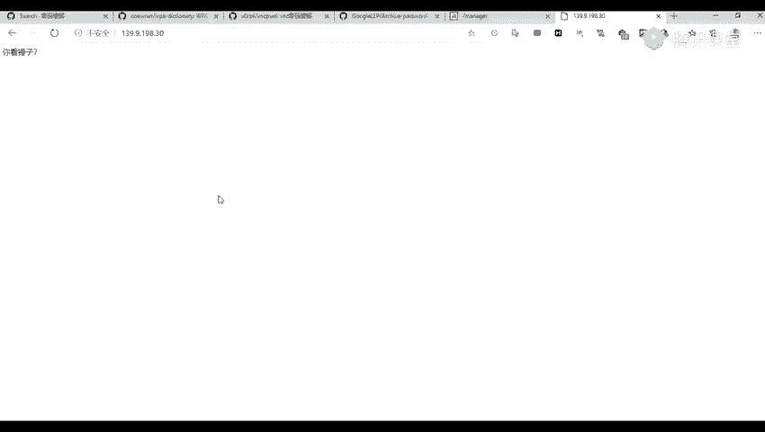

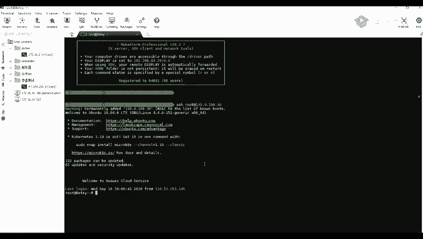

*   **高版本Tomcat**：Tomcat 8.5+ 版本在多次登录失败后可能会锁定账户或IP，增加爆破难度。此时可优先尝试常见默认口令。
*   **路径问题**：通过Webshell管理文件时，注意网站根目录路径，可能与常用路径（如 `/var/www/html`）不同，需要使用 `dir` 或 `find` 命令查找。
*   **防御措施**：
    *   修改Tomcat管理后台的默认用户名和密码，使用强口令。
    *   将管理后台的访问路径改为不易猜测的名称。
    *   限制访问管理后台的源IP地址。
    *   定期更新Tomcat到最新版本。

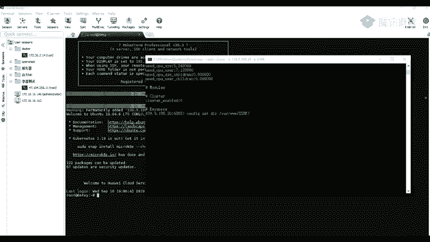

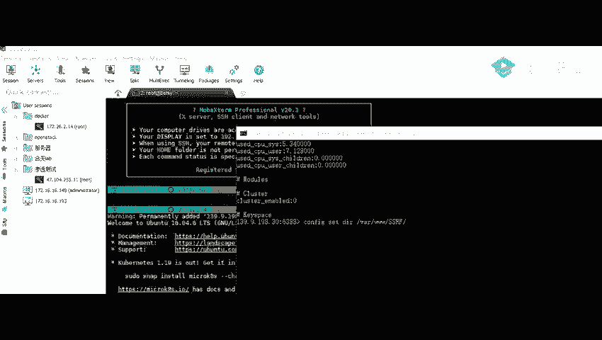

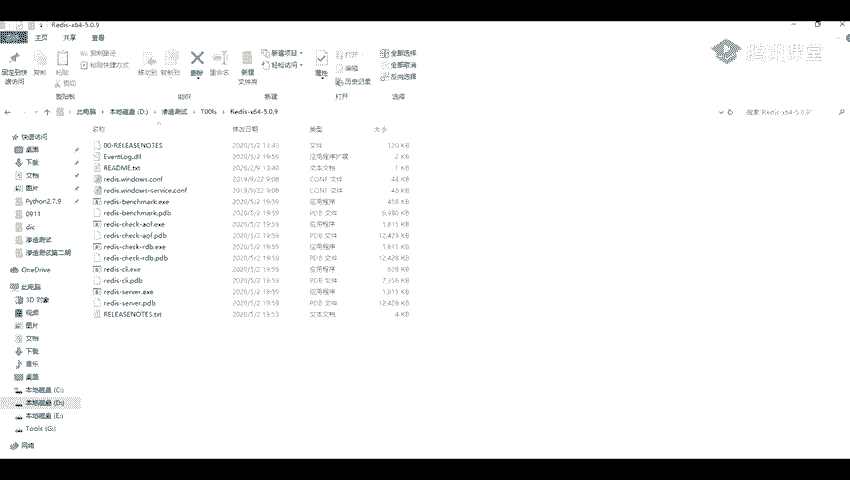

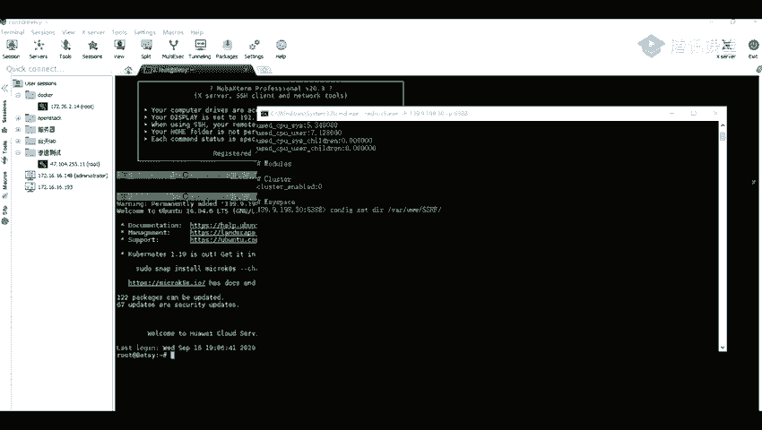

---

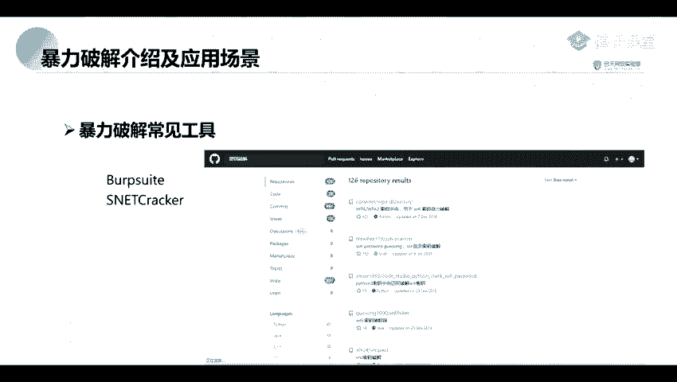

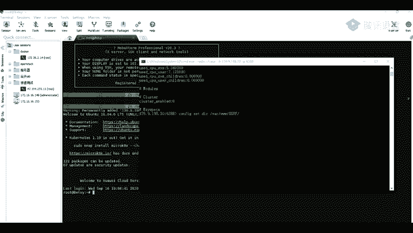

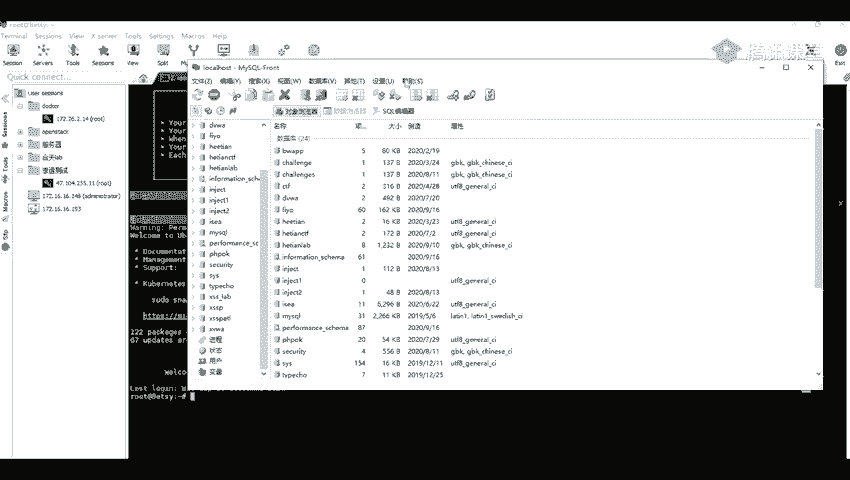

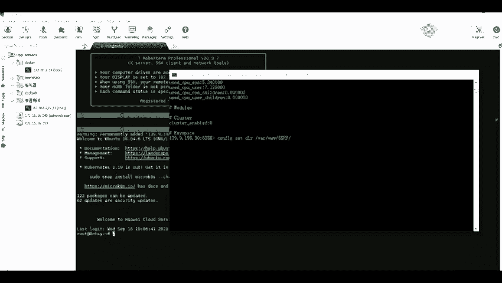

本节课中我们一起学习了如何分析Tomcat的认证机制、使用Burp Suite进行弱口令爆破、以及通过部署WAR包获取Webshell的完整流程。理解这些步骤有助于我们认识此类漏洞的危害，并采取有效措施进行防护。