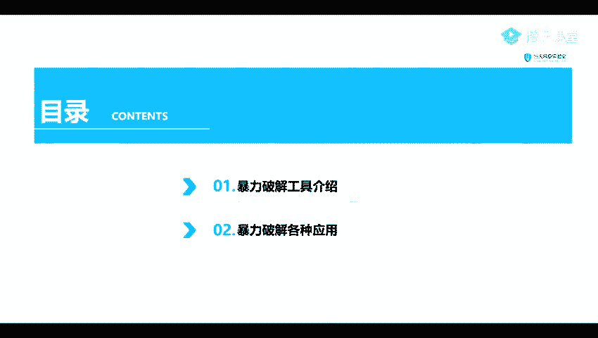
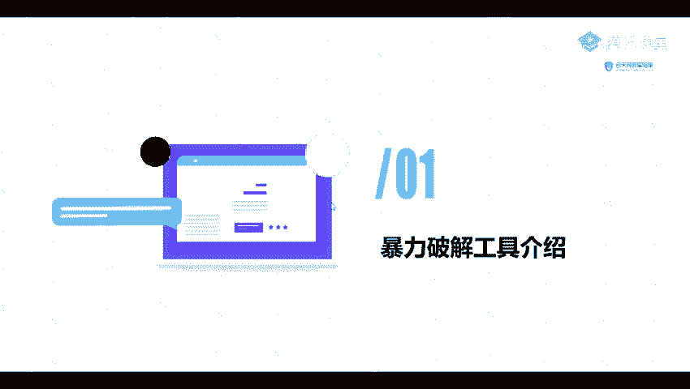
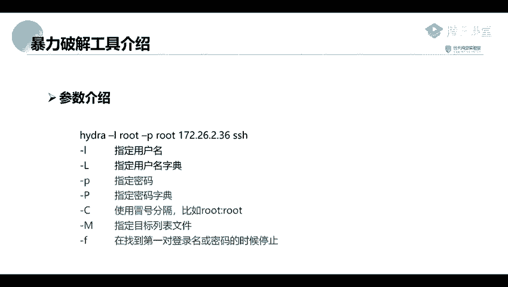

# 网络安全系统教学合集：P58：3_密码破解工具：九头蛇Hydra 🔐

在本节课中，我们将要学习另一款强大的密码破解工具——Hydra（九头蛇）。我们将介绍其基本概念、常用参数，并通过实例演示如何对常见服务进行暴力破解。

---

上一节我们介绍了其他密码破解工具，本节中我们来看看Hydra这款工具。

## 暴力破解工具介绍 🛠️

Hydra是一款开源的暴力破解工具，它支持对FTP、MySQL、SSH等多种协议和服务进行密码破解。该工具已内置在Kali Linux系统中，可以直接使用。

## Hydra工具参数详解 ⚙️

要使用Hydra，首先需要了解其常用参数。以下是几个核心参数及其含义：

*   **`-l` 与 `-L`**：`-l` 用于指定单个用户名，`-L` 用于指定一个包含多个用户名的字典文件。
*   **`-p` 与 `-P`**：`-p` 用于指定单个密码，`-P` 用于指定一个包含多个密码的字典文件。
*   **`-C`**：使用冒号分隔的用户名密码组合文件，格式如 `root:123456`。
*   **`-M`**：指定目标主机列表文件，用于批量攻击。
*   **`-f`**：在找到第一对正确的用户名和密码后停止攻击。

## 其他相关工具：Metasploit 🎯

除了Hydra，我们还可以使用Metasploit框架中的内置模块进行密码破解。Metasploit是一款功能强大的渗透测试框架，在后续课程中会详细讲解。它同样内置在Kali Linux中，其 `auxiliary/scanner` 模块专门用于扫描，例如可以对MySQL、SSH等服务的用户名和密码进行扫描。

---

本节课中我们一起学习了Hydra（九头蛇）这款密码破解工具的基本用法和核心参数，并了解了Metasploit框架在密码扫描方面的应用。掌握这些工具是进行有效渗透测试的重要基础。