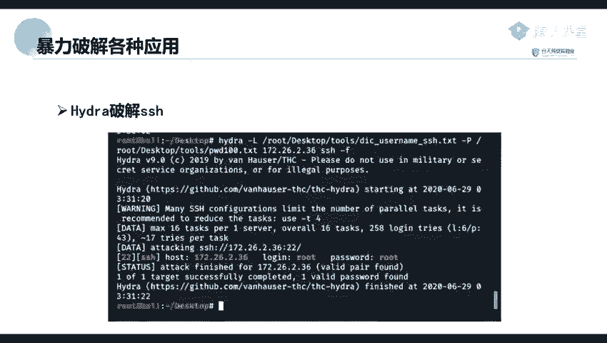
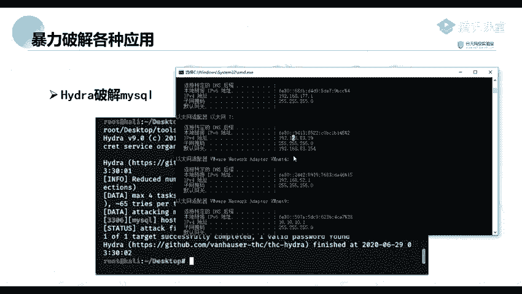
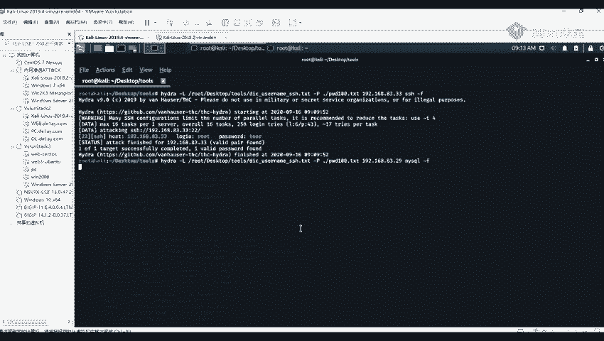
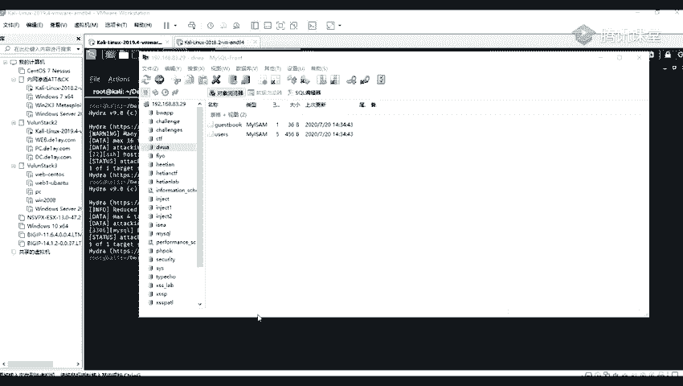

# Kali渗透测试教程：P59：4_Hydra破解SSH与MySQL 🔐



## 概述
在本节课中，我们将学习如何使用Hydra工具对SSH服务和MySQL数据库进行密码破解。我们将通过具体的操作步骤，演示如何利用Hydra发现弱密码，从而获得对目标系统的访问权限。

---

## 使用Hydra破解MySQL数据库 🗄️

上一节我们介绍了使用图形化工具进行密码破解。本节中，我们来看看如何使用命令行工具Hydra来破解MySQL服务。



首先，我们需要确定目标。这里以本地的一个MySQL服务为例。我的目标IP地址是 `192.168.83.29`，并且该主机上运行着MySQL服务。


在实际渗透测试中，我们可能在信息收集阶段发现目标开放了3306端口（MySQL默认端口）。接下来，我们就可以使用Hydra对这个端口进行密码爆破。

以下是使用Hydra进行MySQL爆破的基本命令格式：
```bash
hydra -l <用户名> -P <密码字典> <目标IP> mysql
```
或者，如果我们不确定用户名，可以使用 `-L` 指定用户名字典。



在本例中，我们使用以下命令对目标进行爆破：
```bash
hydra -L user.txt -P pass.txt 192.168.83.29 mysql
```


爆破过程通常很快。如图所示，Hydra成功爆破出了用户名 `test` 和密码 `root`。

为了验证凭证的有效性，我们可以使用MySQL客户端工具进行连接测试。使用以下命令或图形化工具（如MySQL Workbench）进行连接：
```bash
mysql -h 192.168.83.29 -u test -p
```
输入密码 `root`。


连接成功后，我们便进入了目标数据库，可以执行查看数据库、增删改查等操作，例如：
```sql
SHOW DATABASES;
```

---



## 总结
本节课中，我们一起学习了使用Hydra工具破解SSH和MySQL服务密码的完整流程。从确定目标、执行爆破到验证凭证并连接目标系统，我们掌握了利用弱密码漏洞获取初始访问权限的基本方法。这再次强调了设置强密码在网络安全中的重要性。


此外，我们还提到了Metasploit框架中也包含相关的扫描与爆破模块，这为渗透测试人员提供了更多样化的工具选择。在后续课程中，我们将继续探索其他服务与漏洞的利用方式。