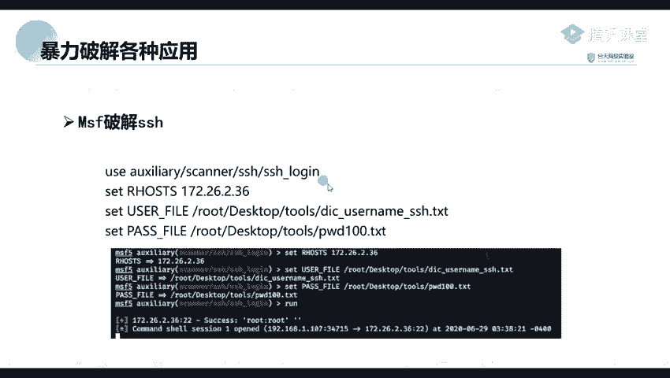
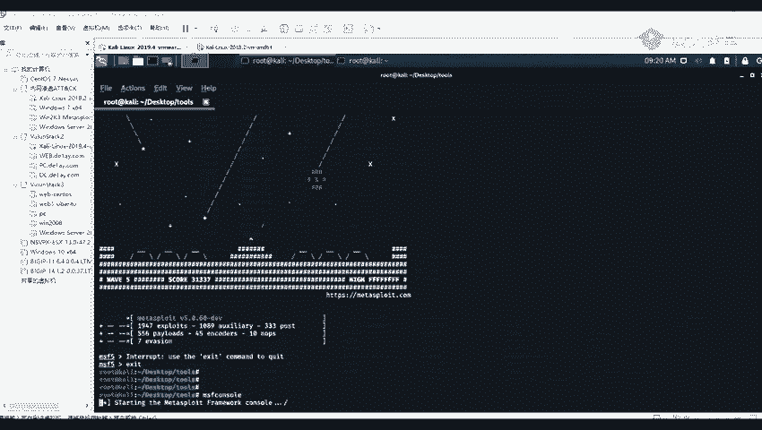
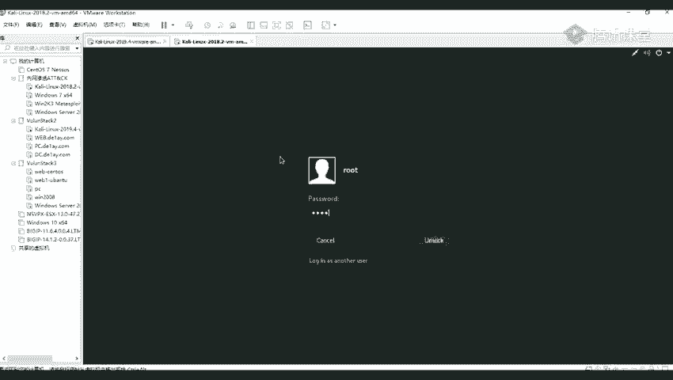
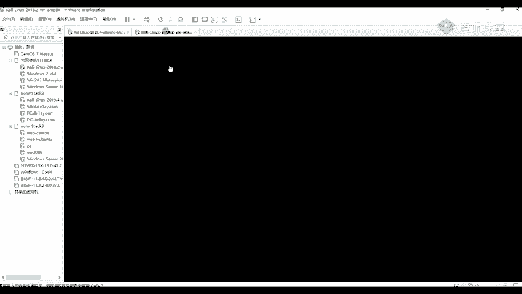

# Kali渗透教程：P60：Hydra破解MySQL

## 概述
在本节课中，我们将学习如何使用Hydra工具对MySQL服务进行密码破解。我们将从启动Metasploit框架开始，逐步讲解如何搜索、加载并使用SSH登录模块，通过设置目标地址、用户名和密码字典来实施破解。课程内容旨在让初学者理解基本的密码爆破流程。



---

## 启动Metasploit框架
上一节我们介绍了密码破解的基本概念，本节中我们来看看如何实际操作。首先，我们需要启动Metasploit框架。



使用以下命令启动Metasploit：
```bash
msfconsole
```
执行该命令后，系统会进入Metasploit框架界面。启动过程可能需要一些时间。

如果遇到数据库连接错误，可能是因为PostgreSQL数据库服务未启动。需要先初始化并启动数据库服务。

使用以下命令初始化数据库：
```bash
msfdb init
```
初始化完成后，重新执行 `msfconsole` 命令即可正常进入框架。

---



## 搜索并加载SSH登录模块
成功进入Metasploit框架后，下一步是搜索并加载我们需要的攻击模块。

以下是搜索包含“login”关键词模块的命令：
```bash
search login
```
执行该命令后，会列出所有名称中包含“login”的模块。我们需要从中找到SSH登录模块。

找到模块后，使用以下命令加载该模块：
```bash
use auxiliary/scanner/ssh/ssh_login
```
此命令将设置当前使用的模块为SSH登录爆破模块。

---

## 配置目标参数
加载模块后，需要配置必要的参数才能发起攻击。这些参数包括目标地址、用户名列表和密码字典。

以下是需要设置的参数列表：
*   **RHOSTS**: 目标主机的IP地址。
*   **USER_FILE**: 存储用户名的字典文件路径。
*   **PASS_FILE**: 存储密码的字典文件路径。

使用 `set` 命令进行配置。例如，设置目标IP地址：
```bash
set RHOSTS 192.168.83.33
```
设置用户名字典文件路径：
```bash
set USER_FILE /root/user.txt
```
设置密码字典文件路径：
```bash
set PASS_FILE /root/pass.txt
```
配置完成后，可以使用 `options` 命令检查所有参数是否已正确设置。其中，`Required` 列为 `yes` 的选项是必须配置的。

---

## 执行破解并获取Shell
所有参数配置妥当后，即可执行破解任务。

使用以下命令开始攻击：
```bash
run
```
命令执行后，工具会自动尝试字典中的用户名和密码组合进行爆破。如果成功破解，系统会返回一个SSH会话。

攻击成功后，可以使用 `sessions` 命令查看当前获取的所有会话。然后使用以下命令与指定的会话进行交互，从而获得一个Meterpreter Shell：
```bash
sessions -i [会话ID]
```
例如，如果会话ID是2，则命令为：
```bash
sessions -i 2
```
成功进入Meterpreter Shell后，就可以对目标进行更深层次的渗透测试和利用了。

---



## 总结
本节课我们一起学习了使用Hydra和Metasploit框架对MySQL服务进行密码破解的完整流程。我们从启动Metasploit框架开始，逐步完成了搜索模块、加载模块、配置目标参数以及执行破解并获取Shell的步骤。掌握这些基础操作是进行后续Web安全测试和漏洞挖掘的重要前提。