# Kali渗透测试教程：P61：6_MSF破解SSH


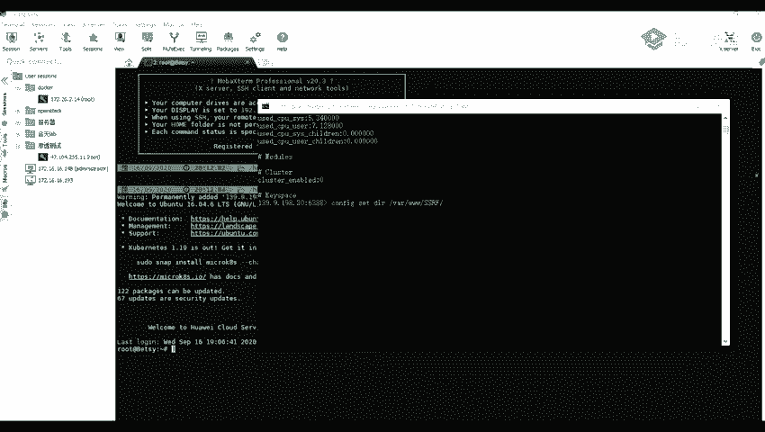

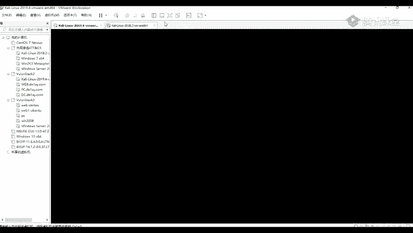

## 概述
在本节课中，我们将学习如何使用Hydra（九头蛇）工具来破解SSH服务的用户名和密码。这是一种常见的渗透测试方法，用于评估目标系统SSH服务的安全性。

---

## 使用Hydra破解SSH密码

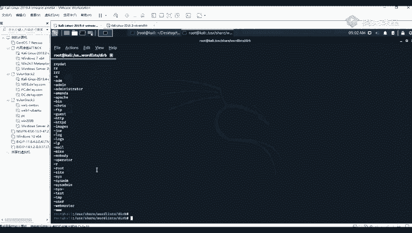

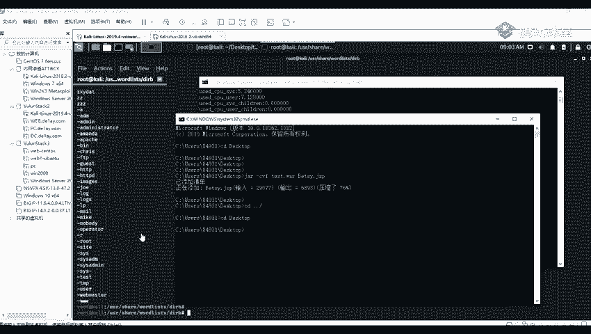

上一节我们介绍了信息收集和端口扫描，本节中我们来看看如何利用发现的SSH服务进行密码破解。

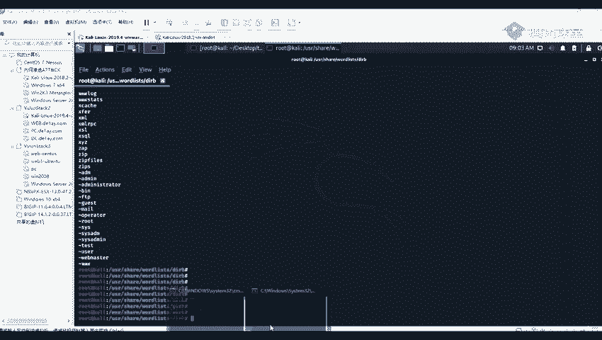

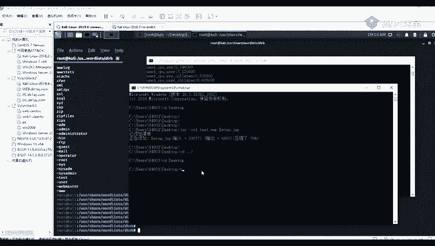

### Hydra工具简介
Hydra是一款强大的网络登录破解工具，支持多种协议。其基本命令格式如下：
```
hydra -L <用户名字典> -P <密码字典> <目标IP> <协议>
```

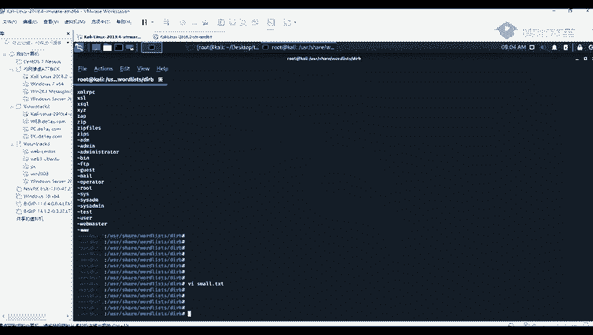

### Kali Linux中的字典文件
Kali Linux系统内置了许多用于破解的字典文件。以下是查找和使用这些字典的方法。

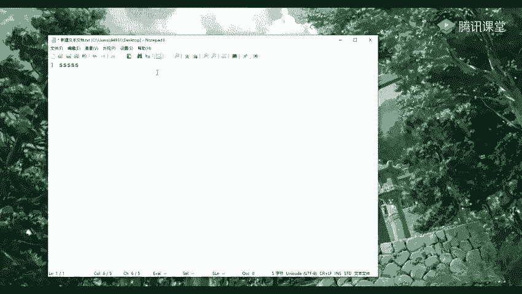

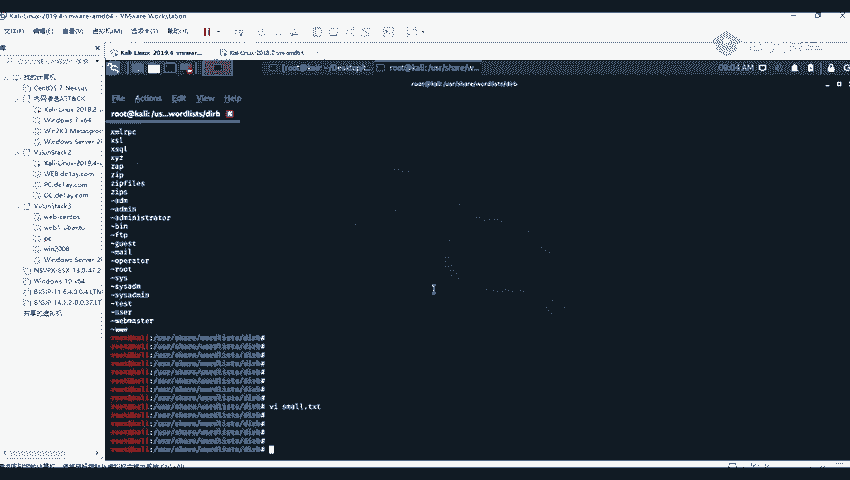

字典文件通常存放在 `/usr/share/wordlists/` 目录下。该目录包含多种字典，例如Metasploit框架、Nmap工具自带的字典，以及一些通用的路径或用户名列表。

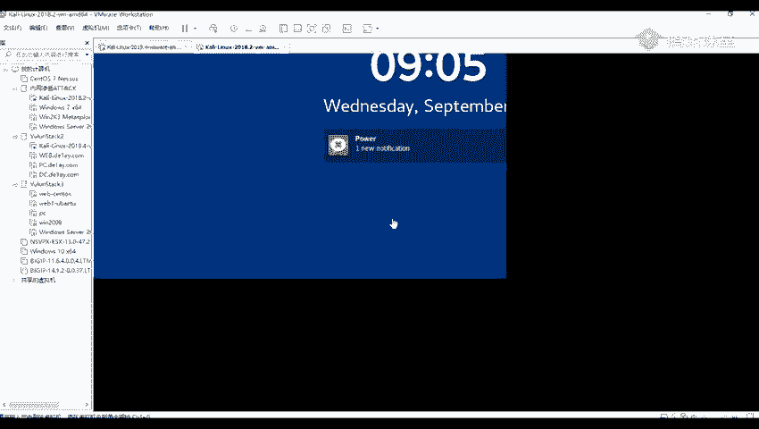

我们可以使用 `cd` 命令切换目录，使用 `ls` 命令查看文件列表，使用 `cat` 或 `more` 命令查看文件内容。`vi` 命令则用于编辑文件。

### 实战：破解SSH密码
假设通过信息收集，我们发现目标IP `192.168.83.33` 开放了22端口（SSH服务默认端口）。接下来，我们将使用Hydra对其进行密码爆破。

以下是具体的操作步骤：

1.  **准备字典**：确保你拥有用户名和密码字典。本例中，字典文件位于当前目录下的 `username.txt` 和 `password.txt`。
2.  **执行破解命令**：使用以下命令结构发起攻击。
    ```
    hydra -L ./username.txt -P ./password.txt 192.168.83.33 ssh
    ```
    *   `-L`：指定用户名字典路径。
    *   `-P`：指定密码字典路径。
    *   `192.168.83.33`：目标主机的IP地址。
    *   `ssh`：指定要破解的协议为SSH。
    *   （可选）添加 `-f` 参数，可以在成功破解一对凭证后立即停止。

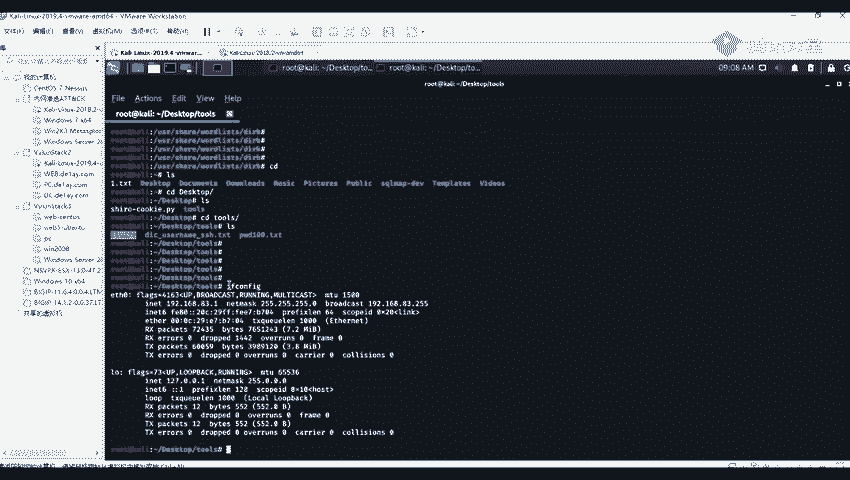

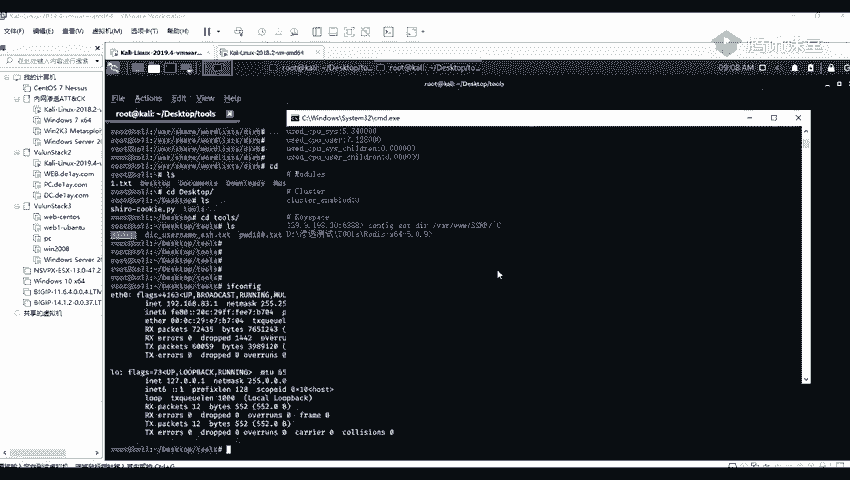

3.  **获取结果**：命令执行后，Hydra会开始尝试爆破。如果成功，它将输出破解到的用户名和密码。
    *   例如，可能输出：`[22][ssh] host: 192.168.83.33 login: root password: toor`

4.  **验证登录**：使用破解到的凭证尝试登录目标SSH服务。
    ```
    ssh root@192.168.83.33
    ```
    输入密码后，如果成功登录，则证明破解有效。可以使用 `ifconfig` 命令确认当前登录的机器IP。

---

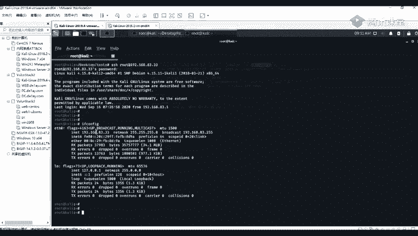

## 总结
本节课中我们一起学习了使用Hydra工具进行SSH密码破解的完整流程。关键步骤包括：定位和使用字典文件、构造Hydra命令、执行爆破以及验证破解结果。掌握这种方法有助于理解弱密码带来的安全风险，并在授权测试中评估系统的防御能力。