# Kali渗透教程：P62：1_Metasploit渗透流程 🛠️

在本节课中，我们将要学习渗透测试框架Metasploit。Metasploit是一个功能强大的安全工具，它能自动化执行攻击服务端口、生成后门木马、权限提升和权限维持等复杂任务。使用它，我们无需对特定漏洞进行深入研究或自行编写漏洞利用脚本，这极大地简化了渗透测试的入门过程。

## 概述与简介

Metasploit（简称MSF）是一款开源的安全漏洞利用和测试工具。它集成了大量常见的系统服务漏洞利用脚本和攻击载荷，并持续更新。目前MSF已更新至6.6版本。该框架涵盖了渗透测试的全过程，允许用户利用现有的模块进行测试，而无需过度关注漏洞底层原理。当然，深入调试漏洞（如MS17-010）能学到更多知识，但作为入门，我们可以先利用框架简化操作。

Metasploit在Kali Linux中默认安装。其安装路径通常位于 `/usr/share/metasploit-framework/`。我们可以通过终端进入该目录查看框架文件。

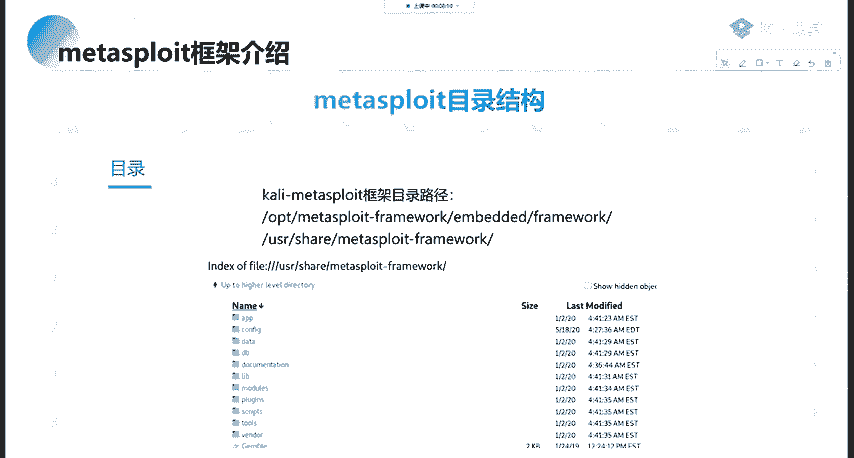

## 目录结构与模块

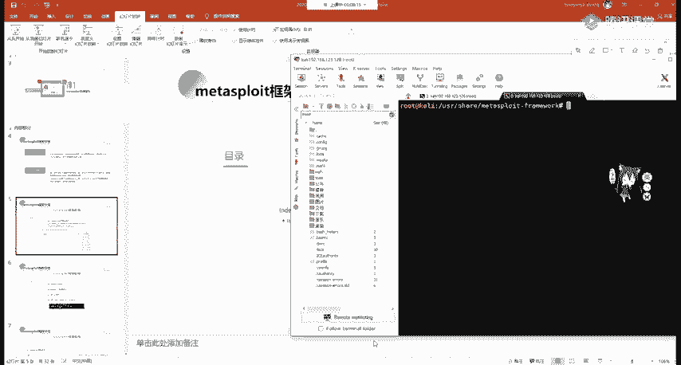

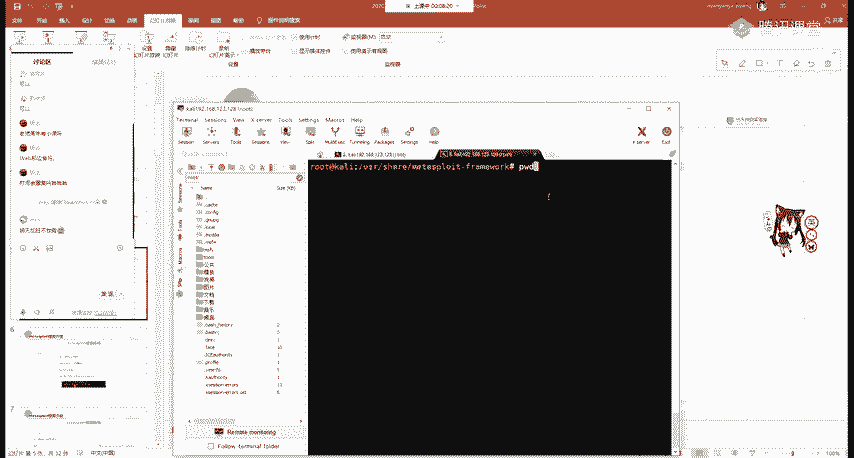

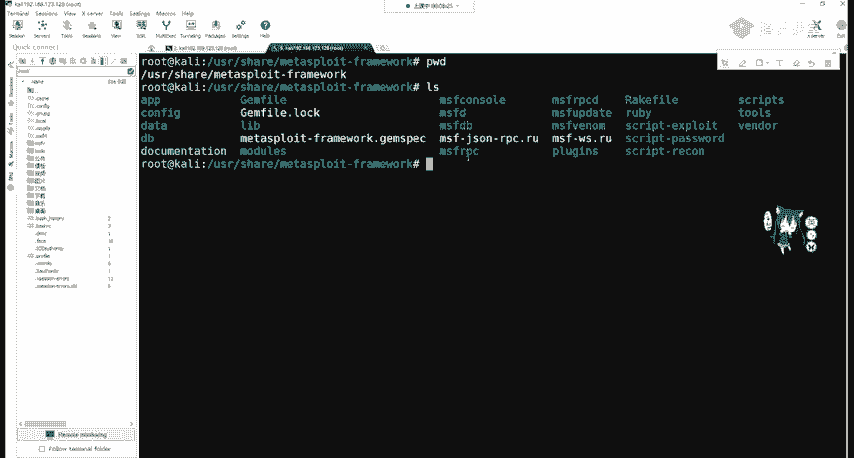

Metasploit是高度模块化的框架，由多个模块组成。了解其目录结构是有效使用它的第一步。

以下是核心目录及其作用：

*   **data/**： 存储Metasploit使用的某些漏洞所需的二进制文件、可执行文件等数据。
*   **documentation/**： 包含框架的相关文档。
*   **lib/**： 库文件夹，包含框架运行所需的核心库文件。
*   **plugins/**： 插件文件夹，用于扩展框架功能。
*   **scripts/**： 脚本文件夹，包含一些辅助脚本。
*   **tools/**： 工具文件夹，包含一些独立的命令行工具。
*   **modules/**： **最重要的目录**，包含了Metasploit的所有功能模块。我们对渗透测试的自动化利用，主要就是调用此目录下的模块。

上一节我们介绍了整体目录，本节中我们来看看核心的 `modules/` 目录下具体有哪些内容。进入该目录，可以看到7个子目录，分别代表不同类型的模块：

以下是各模块类型的简要说明：

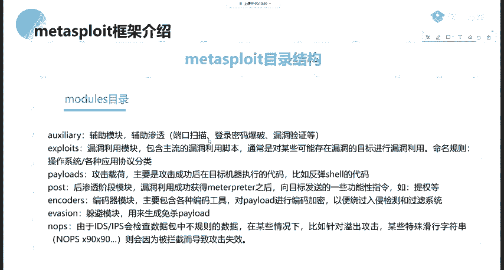

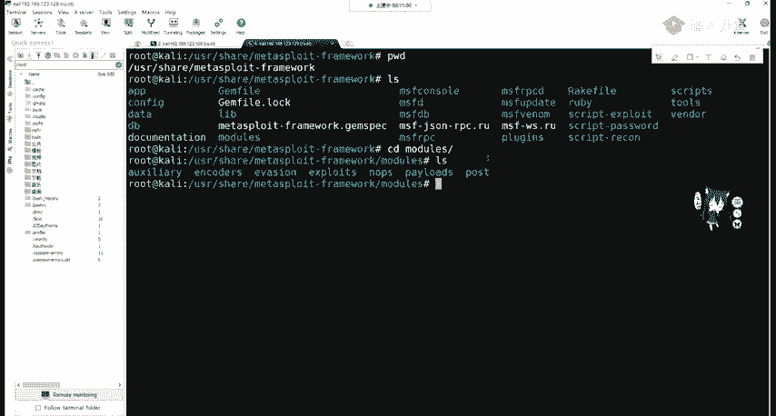

1.  **auxiliary（辅助模块）**： 用于辅助渗透，包括前期信息收集、漏洞扫描与探测（如端口扫描、弱密码爆破、漏洞验证等）。
2.  **exploits（漏洞利用模块）**： 包含针对主流漏洞的利用脚本（Exploit），是发起攻击的核心。
3.  **payloads（攻击载荷）**： 包含攻击成功后，在目标机器上执行的代码，用于反弹Shell（如 `getshell`），获取命令执行界面。
4.  **post（后渗透模块）**： 在成功获取目标Shell（建立Meterpreter会话）后使用，用于进行权限提升、内网代理、信息搜集等后续操作。
5.  **encoders（编码器）**： 对攻击载荷（Payload）进行编码或加密，以绕过入侵检测系统（IDS）或杀毒软件（AV）的检测。
6.  **nops（空指令模块）**： 生成空指令（NOP sled）。在某些攻击中，加入空指令（如汇编指令 `nop`，机器码 `0x90`）有助于提高漏洞利用的稳定性，或绕过一些对不规则数据包的检查。

## 体系结构与启动

Metasploit的体系结构基于核心库文件。用户通过接口（如 `msfconsole`）调用这些库，进而使用基于 `modules/` 的各种功能。

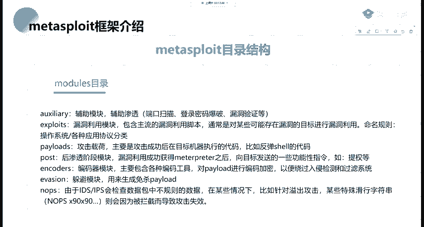

首先，我们需要启动Metasploit的控制台。虽然非必需，但初始化数据库可以更好地保存扫描结果和工作进度。

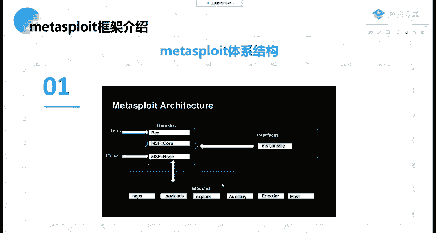

启动步骤如下：

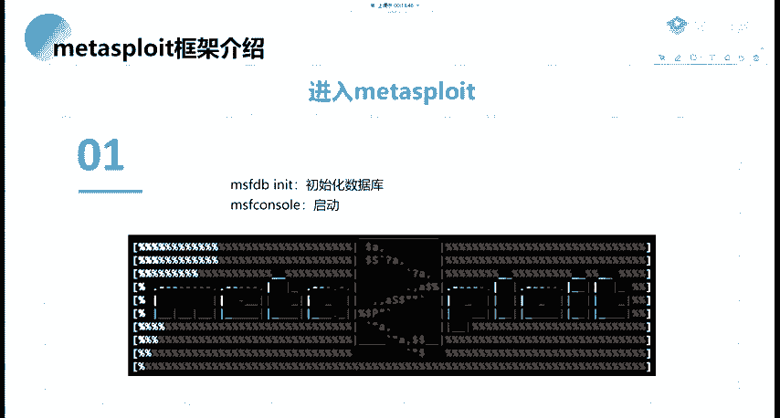

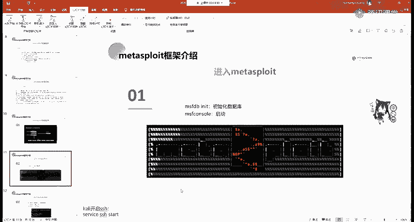

1.  初始化数据库（可选）：`msfdb init`
2.  启动MSF控制台：`msfconsole`

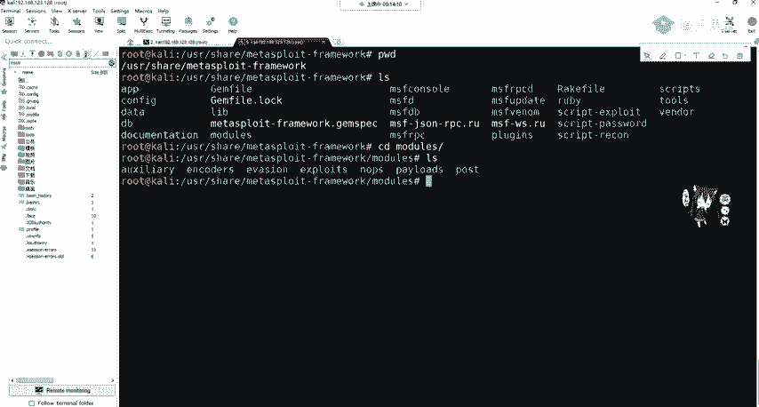

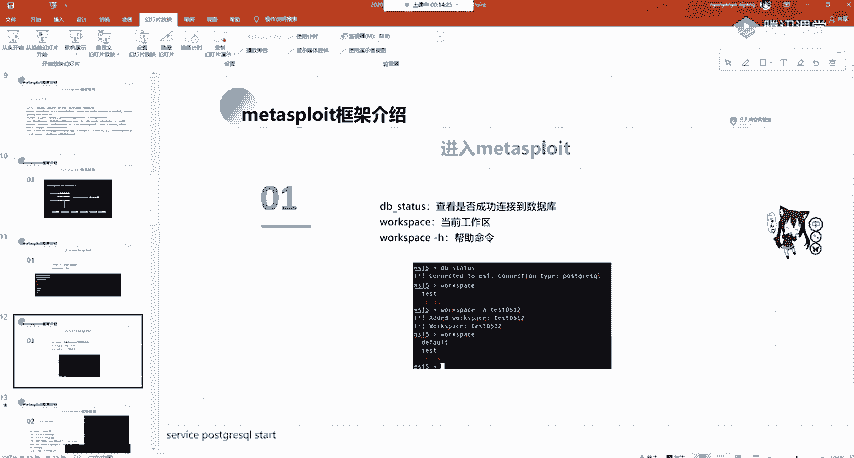

启动后，终端提示符会变为 `msf6 >`，表示已进入Metasploit命令行环境。

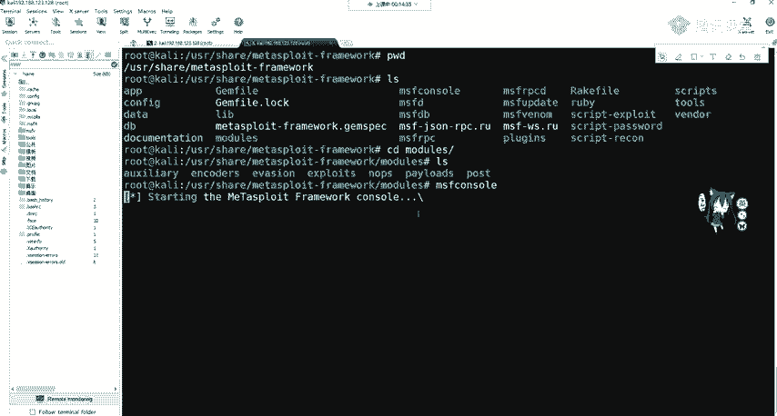

在控制台中，可以输入 `db_status` 检查是否成功连接到数据库（默认为PostgreSQL）。使用 `workspace` 命令可以查看当前工作区（默认为 `default`），也可以使用 `workspace -a [名称]` 创建并切换到新的工作区。这些操作对后续渗透测试本身影响不大，但有助于项目管理。

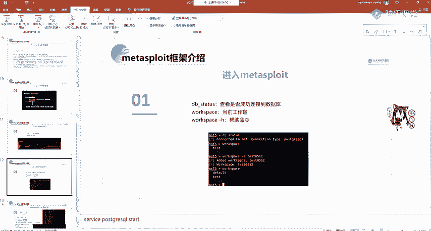

## 信息收集实战

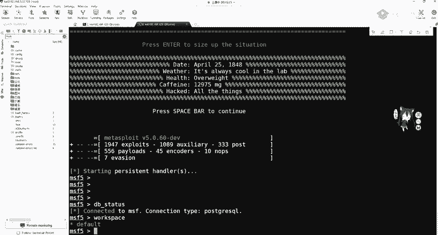

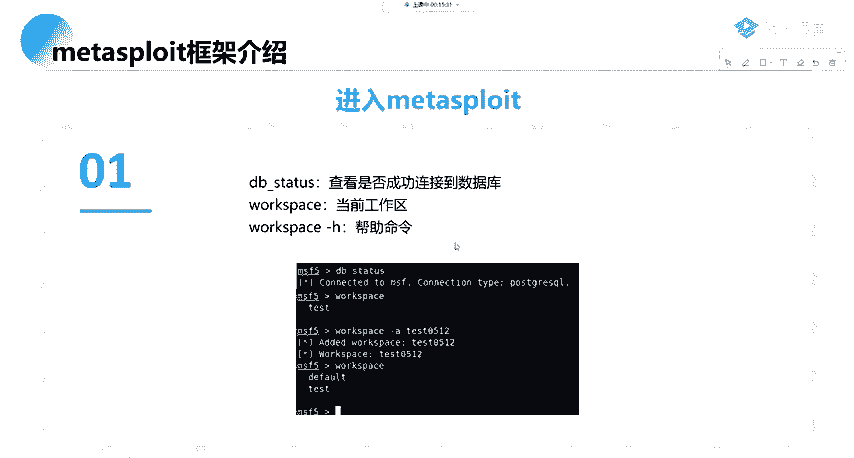

信息收集是渗透测试的第一步。Metasploit作为一个全能框架，自然也集成了信息收集功能。

### 使用DB_Nmap进行扫描

最直接的方式是使用内置的 `db_nmap` 命令。其使用方法与独立的Nmap工具完全一致，区别在于扫描结果会自动保存到Metasploit的数据库中。

例如，执行 `db_nmap -h` 可以查看帮助，其参数与Nmap相同。你可以进行SYN半开扫描、TCP全连接扫描、服务和版本探测等。之前课程中讲解的Nmap所有功能，这里都支持。

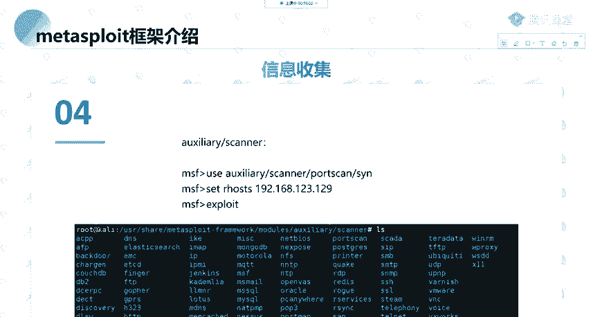

### 利用辅助模块进行扫描

除了调用外部工具，我们更应学习直接使用Metasploit的模块。信息收集主要使用 **auxiliary（辅助模块）**。

例如，进行端口扫描：

1.  使用 `search portscan` 搜索端口扫描相关模块。
2.  选择使用TCP SYN半开扫描模块：`use auxiliary/scanner/portscan/syn`
3.  查看需要设置的参数：`show options`
4.  设置目标IP地址（RHOSTS）和端口范围（PORTS）：`set RHOSTS 192.168.1.129`， `set PORTS 1-1000`
5.  可以设置线程数以加快扫描：`set THREADS 20`
6.  执行扫描：`run` 或 `exploit`

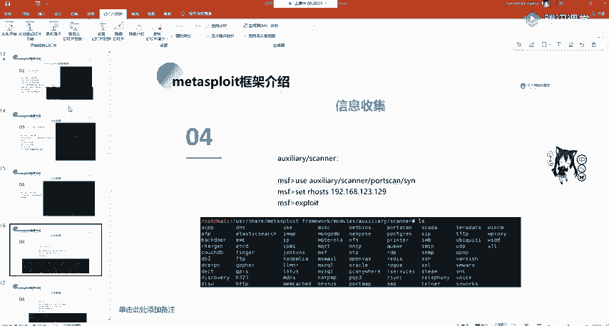

再例如，进行内网C段主机发现：

1.  搜索发现模块：`search discovery`
2.  使用ARP扫描模块：`use auxiliary/scanner/discovery/arp_sweep`
3.  查看并设置参数（主要是RHOSTS，可以设置为一个网段，如 `192.168.1.0/24`）：`show options`， `set RHOSTS 192.168.1.0/24`
4.  执行扫描：`run`

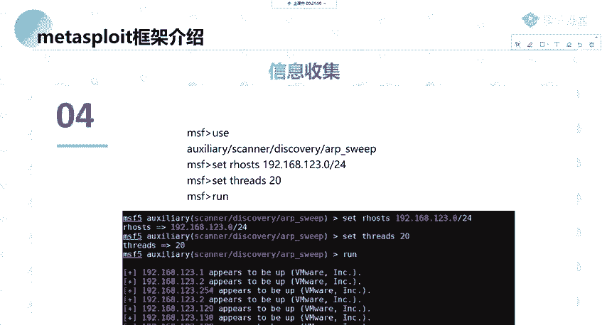

通过以上流程，我们就能利用Metasploit完成初步的信息收集工作。

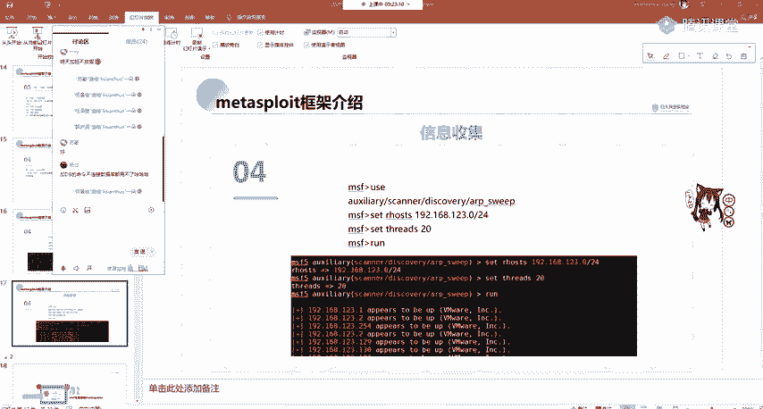

## 总结

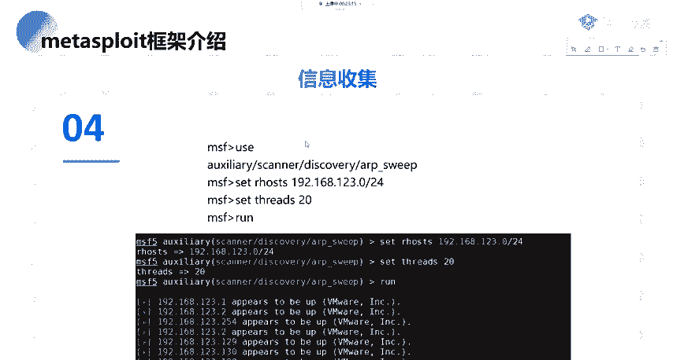

本节课中我们一起学习了渗透测试框架Metasploit的基础知识。我们了解了它的目录结构，特别是核心的 `modules/` 目录下的六大模块类型：**auxiliary**（辅助）、**exploits**（利用）、**payloads**（载荷）、**post**（后渗透）、**encoders**（编码器）和**nops**（空指令）。我们掌握了如何启动 `msfconsole` 控制台，并初步实践了利用辅助模块进行信息收集（端口扫描和主机发现）的标准流程。记住，使用模块的基本步骤是：**搜索（search） -> 使用（use） -> 查看选项（show options） -> 设置参数（set） -> 执行（run）**。这是操作Metasploit的核心模式。