# Kali渗透测试教程：P64：3_Meterpreter指令操控电脑权限

## 📖 概述
在本节课中，我们将学习Meterpreter后渗透工具的核心用法。Meterpreter是Metasploit框架中的一个强大载荷，它允许我们在成功渗透目标系统后，进行深入的交互与控制。本节将重点介绍如何利用Meterpreter指令来操控目标电脑的权限，包括文件操作、系统信息收集、摄像头与屏幕控制等。

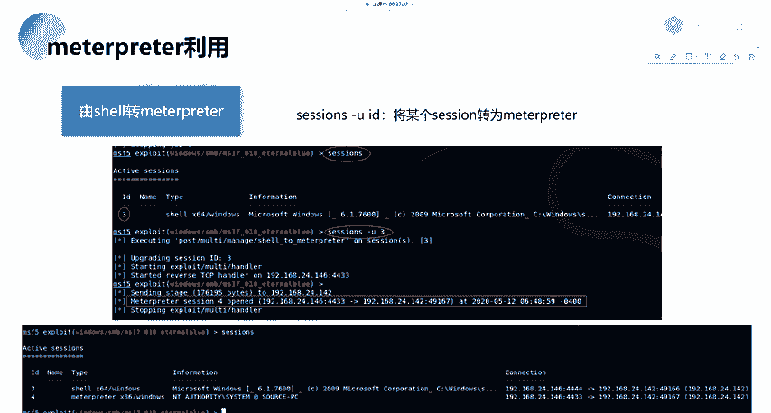

---

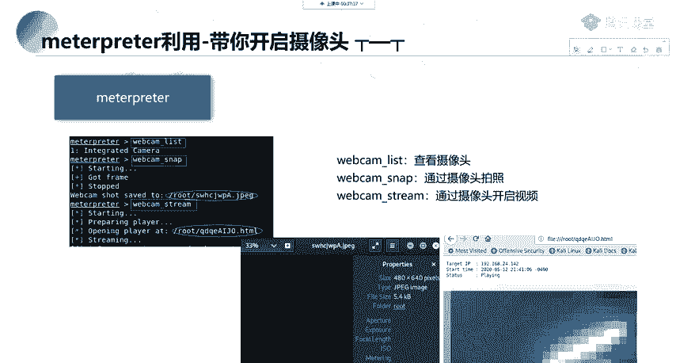

## 🔄 会话升级与基础操作
上一节我们介绍了如何获取一个初始的Shell会话。本节中我们来看看如何操作一个Meterpreter会话。

如果获取到的只是一个基础的Shell或功能不完整的Meterpreter会话，可以使用 `sessions -u` 命令加上会话ID，尝试将其升级为功能完整的Meterpreter会话。这个转换过程有时可能会失败。

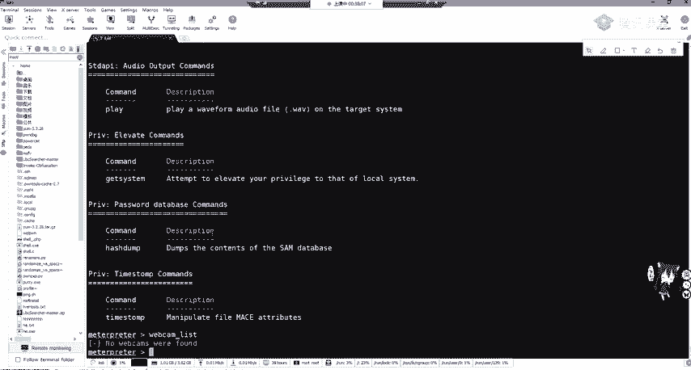

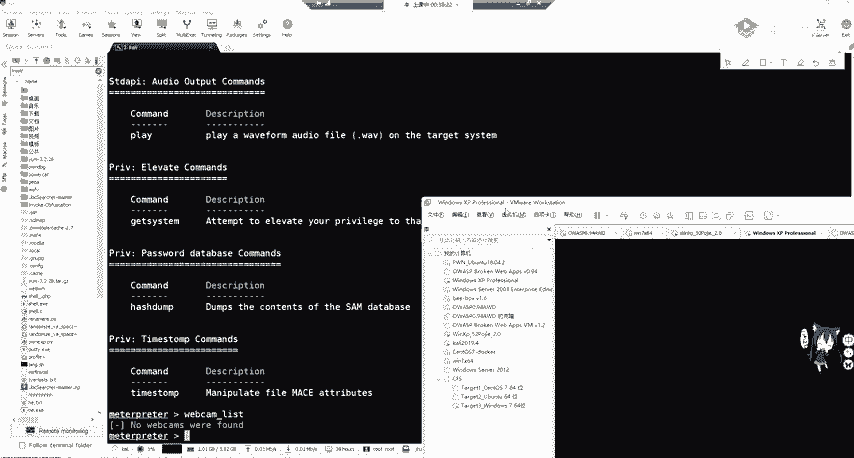

进入Meterpreter会话后，输入 `?` 或 `help` 命令可以查看所有可用的指令。

---

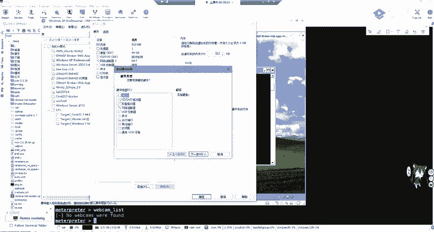

## 🎥 多媒体设备控制
除了渗透目的，Meterpreter也可以用于执行一些有趣的操作，例如控制目标的多媒体设备。

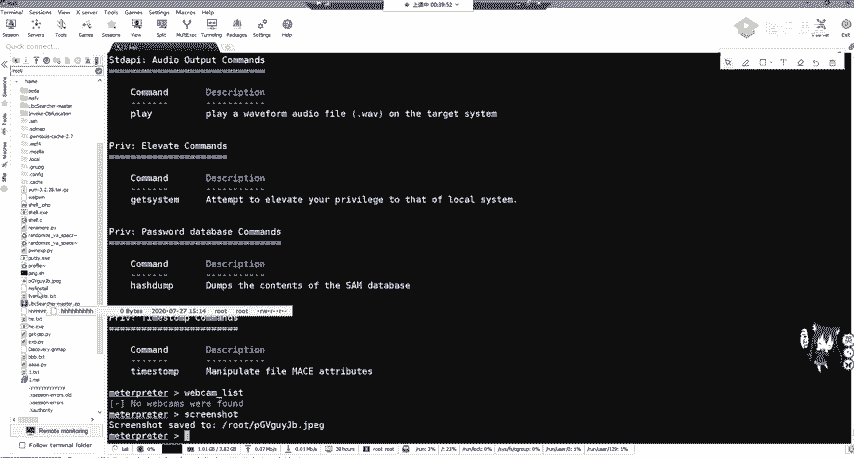

以下是控制摄像头和屏幕的相关命令：

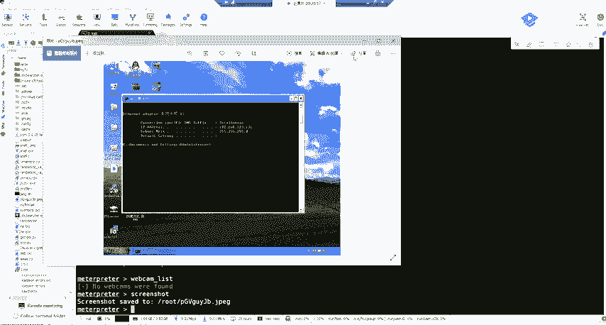

*   **`webcam_list`**：列出目标系统上可用的摄像头设备。如果虚拟机未连接摄像头，此命令可能无法列出设备。连接摄像头通常需要在虚拟机软件（如VMware）的设置中手动添加USB设备。
*   **`screenshot`**：对目标系统的屏幕进行截图。截图文件会保存在攻击者的机器上。
*   **`webcam_stream`**：开启目标摄像头的实时视频流。视频流会通过一个Web接口提供，攻击者可以访问该链接进行实时查看。
*   **`screenshare`**：实时查看并共享目标的屏幕。这揭示了外部摄像头和公司内部设备可能存在的安全风险。

---

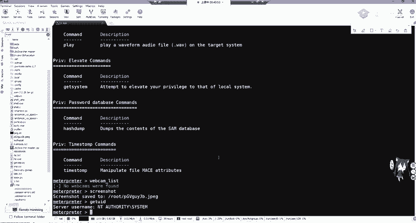

## 💻 系统信息与命令执行
掌握目标系统的状态是后渗透的关键步骤。

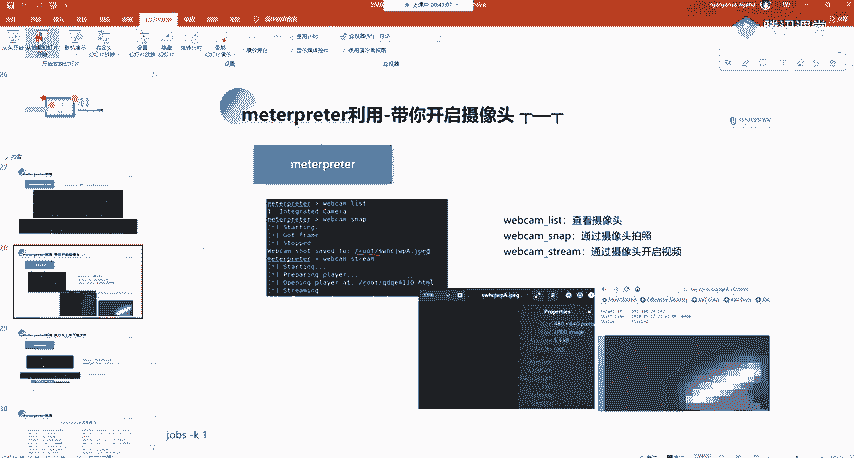

以下是获取系统信息和执行命令的常用指令：

*   **`getuid`**：查看当前Meterpreter会话所使用的用户身份（UID）。这有助于判断权限级别（例如是否是 `SYSTEM` 或管理员用户）。
*   **`sysinfo`**：查看目标系统的平台信息，如操作系统版本、计算机名等。
*   **`ps`**：列出目标系统上正在运行的所有进程。
*   **`shell`**：在目标系统上打开一个命令行shell（如Windows的cmd或Linux的bash），从而直接执行系统命令。其原理类似于执行 `cmd.exe`。
*   **`execute`**：用于在目标上执行指定的可执行文件或命令。

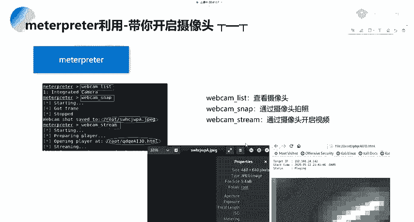

获取到Shell后，攻击者可以执行创建用户、删除文件等操作。

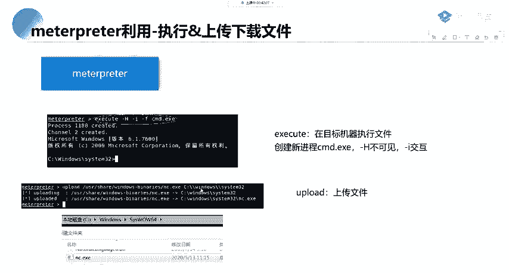

---

## 📁 文件传输操作
在目标系统上传和下载文件是渗透测试中的常见需求。

Meterpreter提供了便捷的文件传输命令：

*   **`upload`**：将攻击者本地机器上的文件上传到目标系统的指定路径。
    *   命令格式：`upload <本地文件路径> <目标路径>`
    *   示例：`upload /root/exploit.py C:\\exploit.py`
*   **`download`**：将目标系统上的文件下载到攻击者的本地机器。
    *   命令格式：`download <目标文件路径> <本地保存路径>`

通过文件上传，攻击者可以将木马、脚本或其他工具传送到目标机器上。

---

## 📋 常用命令回顾与高级功能
我们来回顾一下Meterpreter中最常用的一些命令，并了解一些高级功能。

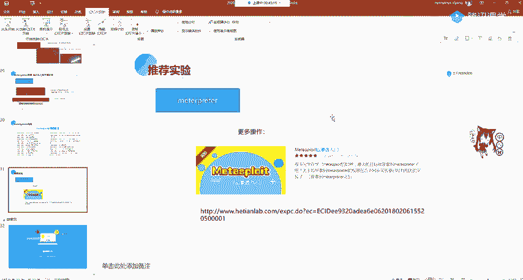

以下是核心命令列表：

*   **`background`**：将当前Meterpreter会话放到后台运行，以便在MSF控制台进行其他操作。
*   **`sessions`**：列出所有活跃的会话。
*   **`help`**：显示帮助信息。
*   **`getuid`**：查看当前用户权限。
*   **`sysinfo`**：查看系统信息。
*   **`ps`**：查看进程列表。
*   **`shell`**：获取系统命令行。
*   **`upload`/`download`**：文件传输。

此外，Meterpreter还支持端口转发、创建用户等功能。一个常被提及但实际效果有限的功能是 `run killav`，它试图关闭目标系统的杀毒软件，但对于现代杀软（如Windows Defender）通常无效。

---

## 🚀 获取Meterpreter的其他途径与学习建议
Meterpreter的获取方式多种多样，不仅限于我们演示的MS17-010漏洞。

可以通过寻找Web应用接口漏洞、其他服务漏洞（如Tomcat, WebLogic）或利用各种CVE漏洞进行攻击。之前章节介绍的Web漏洞（如SQL注入、文件上传）同样可能帮助我们最终获取Meterpreter会话。

**学习建议**：
1.  **动手实践**：课程内容为基础流程，必须通过实际操作来巩固。可以下载漏洞靶机（如Win7）进行练习，或利用在线实验平台（如合天网安实验室）的“Meterpreter后渗透入门”实验。
2.  **流程总结**：渗透测试是一个完整流程，包括信息收集、寻找突破点、漏洞利用和后渗透。后续课程会系统讲解。
3.  **知识管理**：养成总结的习惯，将操作步骤、命令和心得记录成文档或博客。这在长时间不操作后快速恢复记忆至关重要。
4.  **持续学习**：Meterpreter功能极其丰富，包含大量模块、脚本和扩展，仅靠两节课无法精通，需要持续学习和探索。

---

## ✅ 总结
本节课中我们一起学习了Meterpreter后渗透工具的核心操作。我们掌握了如何升级会话、控制系统多媒体设备、收集系统信息、执行命令、传输文件，并回顾了常用指令。记住，熟练使用Meterpreter是渗透测试工程师的重要技能，但更重要的是理解整个攻击链条和防御思路。务必通过实践来加深理解。